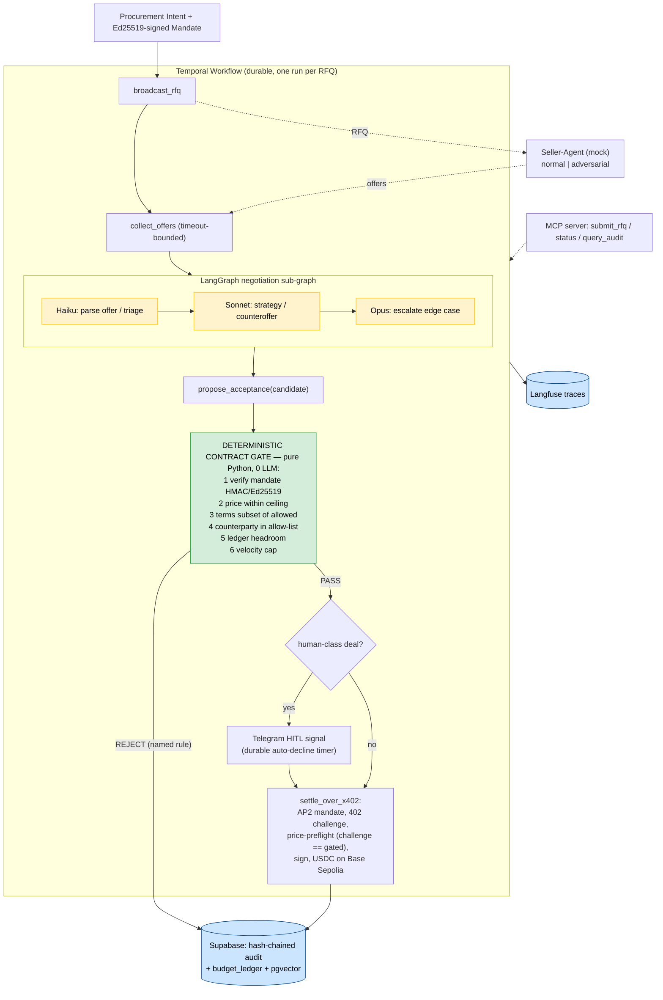

# Broker
> An autonomous A2A procurement broker where buyer-agent and seller-agents negotiate and settle over x402 — and every accepted deal must clear a deterministic contract gate or it is structurally un-signable.

**Bucket:** enterprise · **Effort:** L · **Reuses:** agent-core tiering, procurement-agent's HMAC/Ed25519 mandate envelope + spend-authority gate + velocity ledger + risk-tiered autonomy + prompt-injection red-team, jim-agent's x402 buy/sell paths + price-preflight + mock-vendor pattern, Temporal durable approval signals + HITL timers, Supabase Postgres + pgvector, MCP server, Langfuse, testnet-offline mode

---

## TL;DR

Broker is an autonomous B2B procurement agent that runs multi-round price-and-terms negotiations directly against another company's selling agent over a structured protocol, then settles the winning deal in USDC over x402 — end-to-end in seconds, not days. The wow: a manipulated or hallucinating model can only fail to buy; it can never overcommit, because the commitment is a pure function of a cryptographically signed mandate envelope, not the model's confidence. The enterprise value is closing the 12–18-month gap between where agentic commerce is today (sell-side x402, 165M transactions) and where procurement actually needs it: the buyer's control plane, auditable to the cent, approvable by the CFO.

---

## The Problem

RFQ-to-PO is a multi-day, largely manual workflow — supplier outreach, term negotiation, legal review, finance approval, PO issuance — across email, ERP, and PDF attachments. The autonomous version exists on paper but is blocked on a single question every CPO and CFO asks: *how do we stop the agent from agreeing to a bad deal?*

The sell side of agentic commerce is already live. x402 reports on the order of tens of millions in cumulative volume, ~69,000–500,000 active agent wallets, card networks shipping cryptographic-mandate schemes (Visa Trusted Agent Protocol, Mastercard Agent Pay, Google AP2, OpenAI ACP), and a 22-member x402 Foundation including Stripe, Visa, Mastercard, AWS, Circle, and Shopify. The buy side has no equivalent: raw x402 and ACP give you the rail but trust the agent's judgment on commitment; Pactum-class autonomous supplier negotiation keeps a human in the loop; nobody has shipped a buyer-side agent that is both fully autonomous AND structurally bounded by code the CFO can read and audit.

The EU AI Act sharpens this. Article 12 mandates automatic, traceable, append-only, hash-chained logging (SHA-256-class, 6-month minimum) for high-risk systems, and Article 14 mandates human oversight with a clear override path — obligations that go live **August 2, 2026**. Any enterprise autonomous procurement play shipped after that date needs a real audit trail and a documented HITL gate, not a retro-fit. Broker is designed to those constraints from day one.

---

## What It Does

**Core capabilities:**

- Receives a structured procurement intent (item, quantity, max price, allowed counterparties, allowed terms, mandate TTL) signed as an HMAC/Ed25519 mandate envelope by an authorized human approver.
- Broadcasts an RFQ to registered seller-agents over MCP; receives structured offers in return.
- Runs a configurable number of negotiation rounds using a Temporal-durable workflow: Haiku parses and classifies offers, Sonnet reasons about counteroffers, Opus handles edge cases and escalation paths.
- On each candidate acceptance, a pure-Python contract gate evaluates the deal against the mandate envelope — price ceiling, allowed term set, counterparty allow-list, velocity cap on the budget ledger. No LLM, no network I/O, no clock on this path.
- If the gate passes, the buyer signs an AP2-style Intent → Cart → Payment mandate and settles with the seller's x402 endpoint in USDC. A second deterministic check confirms the 402-challenge quoted amount equals the gate-approved amount before signing.
- Every round, every proposal, every gate decision, and every settlement is written to a hash-chained audit log in Supabase Postgres (SHA-256, append-only, 6-month retention) satisfying EU AI Act Article 12.
- Human-class deals (above a configured threshold) pause on a Temporal signal and deliver a Telegram inline-button approval with a durable auto-decline timer; the workflow survives process restarts.

**Walked-through example:**

```
User (procurement ops):
  POST /broker/rfq
  {
    "item": "industrial O-rings, 10k units",
    "max_unit_price_usd": 0.42,
    "allowed_sellers": ["acme-supply.agent", "globex-parts.agent"],
    "mandate_ttl_minutes": 30,
    "mandate_sig": "Ed25519:<sig-over-canonical-mandate>"
  }

Broker (round 1):
  Broadcasts RFQ → acme-supply.agent quotes $0.46, globex-parts.agent quotes $0.44
  Sonnet: "Both over ceiling. Counteroffer at $0.40 to both."
  Gate check on $0.40 counteroffer: PASS (within envelope, both sellers allowed)

Broker (round 2):
  acme drops to $0.41, globex holds at $0.44
  Sonnet: "acme within ceiling by $0.01. Propose acceptance."
  Gate check: price $0.41 <= $0.42 ✓ | terms: net-30 ∈ allowed-set ✓ | acme-supply.agent ∈ allow-list ✓ | ledger headroom $4,100 ✓ → ACCEPT

Settlement:
  Buyer signs AP2 mandate → hits acme-supply.agent x402 endpoint
  402-challenge: $4,100.00 USDC | gate confirms amount == $0.41 * 10,000 ✓
  Signs → USDC transfer on Base Sepolia testnet
  Audit log: round 1 RFQ, round 1 offers, round 1 counteroffer, round 2 offers, gate PASS (4 rules named), settlement txhash — all hash-chained.

Elapsed: ~8 seconds.
```

---

## Who It's For / Enterprise Translation

**Personas:**

| Persona | Pain | What Broker solves |
|---|---|---|
| CPO / Head of Procurement | RFQ-to-PO cycle time is 2–5 days; supplier negotiation is bottlenecked on analyst bandwidth | Fully autonomous negotiation + settlement in seconds, with a mandate signed by a human approver upfront |
| CFO / Finance Ops | "The agent agreed to what?" — no audit trail, no hard spend controls | Every committed cent traces to a named, signed mandate; deterministic gate is unit-testable Python |
| Platform / Infra team (agent marketplace operator) | Need a trust layer for agent-to-agent transactions before opening to third-party sellers | Broker's gate + AP2 mandate scheme is the trust primitive; MCP server is the integration point |
| Enterprise AI / Governance | EU AI Act Article 12/14 compliance on autonomous spend | Hash-chained audit, HITL approval signals, every gate decision attributed to a named rule |

**Startup framing:** a SaaS platform where procurement teams connect their ERP, define policy bundles, and let agents negotiate with any registered seller-agent on the network. Revenue on transaction volume or SaaS seat. Comparable adjacency: Pactum AI ($50M+ ARR, human-in-the-loop) — Broker removes the loop while adding harder safety guarantees.

**F500 framing:** the autonomous procurement control plane — the CFO-auditable "research → decision → action → audit" closed loop for high-volume, low-complexity supplier categories (MRO, raw materials, logistics spot buys). Not replacing strategic procurement; automating the 60–70% of POs that are repeat, commodity, or time-sensitive.

**Value metric:** reduction in RFQ-to-PO cycle time (days → seconds for in-mandate deals) + analyst hours freed per 1,000 POs + percentage of committed spend with full deterministic audit trail.

---

## Architecture

### Overview

The Broker separates into four planes: the **Orchestration plane** (Temporal), the **Reasoning plane** (multi-model agent, LangGraph sub-graph for negotiation rounds), the **Trust plane** (deterministic contract gate, mandate store, budget ledger), and the **Settlement plane** (x402 client + AP2 mandate signing). The gate is the hard boundary between reasoning and irreversible action.



**Detailed call path (text view):**

```
                  ┌───────────────────────────────────────────────────┐
                  │                Temporal Workflow                   │
                  │  (durable; survives restarts; one run per RFQ)    │
                  │                                                    │
  Procurement  ──►│  Activity: broadcast_rfq                         │
  Intent +        │  Activity: collect_offers (timeout-bounded)       │
  Mandate Sig     │  ── LangGraph negotiation sub-graph ──            │
                  │  │  Haiku: parse_offer / triage_counterparty      │
                  │  │  Sonnet: negotiate_strategy / gen_counteroffer │
                  │  │  Opus: escalate_edge_case (gated)              │
                  │  └──────────────────────────────────────────────  │
                  │  Activity: propose_acceptance(candidate_deal)     │
                  │          │                                         │
                  │          ▼                                         │
                  │  ┌─────────────────────────────────────┐          │
                  │  │     DETERMINISTIC CONTRACT GATE      │          │
                  │  │     (pure Python, zero LLM)          │          │
                  │  │  1. Verify mandate HMAC / Ed25519    │          │
                  │  │  2. price <= mandate.max_price       │          │
                  │  │  3. terms ⊆ policy_bundle.allowed   │          │
                  │  │  4. counterparty ∈ allow_list        │          │
                  │  │  5. ledger.headroom >= deal_total    │          │
                  │  │  6. velocity_cap not breached        │          │
                  │  └─────────────┬───────────────────────┘          │
                  │         PASS   │   REJECT → named rule + log      │
                  │                ▼                                   │
                  │  [human-class?] ──Yes──► Telegram HITL signal     │
                  │        │                  (durable auto-decline)   │
                  │        No                                          │
                  │        ▼                                           │
                  │  Activity: settle_over_x402                        │
                  │   └─ build AP2 Intent/Cart/Payment mandate        │
                  │   └─ hit seller x402 endpoint → 402 challenge     │
                  │   └─ price-preflight: challenge_amount == gated ✓ │
                  │   └─ sign → USDC transfer (Base Sepolia testnet)  │
                  │   └─ write settlement + txhash to audit log       │
                  └───────────────────────────────────────────────────┘
                                       │
           ┌───────────────────────────┼────────────────────────────┐
           ▼                           ▼                            ▼
  Supabase Postgres               Langfuse                   MCP Server
  - mandates table              (trace every              (exposes broker
  - budget_ledger               round, gate               as tool surface
  - hash-chained audit          decision, model           for callers and
  - pgvector: seller            call, cost)               for seller-agent
    reputation embeddings                                 registration)
           │
           ▼
  Mock Seller-Agent (jim pattern)
  - Normal mode: cooperates
  - Adversarial mode: inflates qty mid-deal,
    injects forbidden term, quotes $X / demands $X+1
```

### Tech Stack

| Layer | Technology | Notes |
|---|---|---|
| Orchestration | Temporal (Python SDK) | Durable negotiation rounds, HITL signal, auto-decline timer |
| Negotiation reasoning | LangGraph (sub-graph) | Fixed topology: parse → strategize → generate counteroffer |
| LLM tiering | Claude Haiku / Sonnet / Opus via agent-core | Haiku: parsing; Sonnet: strategy; Opus: edge escalation |
| Contract gate | Pure Python module | Zero LLM, zero network, pure function of mandate + deal |
| Mandate signing | Ed25519 (PyNaCl) + HMAC-SHA256 TTL | Matches AP2 canonical-deal signing pattern |
| Settlement rail | x402 Python client | Buy-side; AP2-style Intent/Cart/Payment mandate |
| Testnet | Base Sepolia + USDC faucet | Full offline/CI mode with deterministic fallbacks |
| State + audit | Supabase Postgres | mandates, ledger, hash-chained audit (SHA-256, append-only) |
| Vector store | pgvector (same Supabase instance) | Seller reputation, historical deal embeddings |
| Observability | Langfuse | Trace IDs per round, model cost per negotiation |
| HITL | Telegram Bot API (inline buttons) | Matches procurement-agent + grocery-buddy pattern |
| Integration surface | MCP server (FastMCP) | Tool: submit_rfq, get_mandate_status, query_audit_log |
| Mock seller | FastAPI service | Switchable normal/adversarial mode via env flag |

---

## The "Model Proposes, Code Disposes" Boundary

This is the architectural spine of Broker. The boundary is explicit, tested, and visible in the code:

**LLM is allowed to propose:**
- A counteroffer price (a float in USD, unconstrained by the model)
- A set of term preferences to include in the counteroffer
- A ranking of seller-agents to prefer when prices converge
- An escalation recommendation ("this deal is unusual, route to Opus / HITL")
- A natural-language rationale for the audit log (informational only, not decision-relevant)

**Deterministic code verifies and executes — no LLM on any of these paths:**
- Mandate signature verification (HMAC-SHA256 + Ed25519 over the canonical mandate payload)
- Mandate TTL check (wall-clock, not model-estimated)
- Price ceiling check: `proposed_price <= mandate.max_unit_price` — a Python `<=` comparison, not a model judgment
- Term allowlist check: `frozenset(proposed_terms) <= policy_bundle.allowed_terms` — a Python set containment test
- Counterparty allow-list check: `seller_id in mandate.allowed_sellers` — a Python `in` test on a signed list
- Budget ledger headroom check: `ledger.available >= deal_total` — a Postgres row-level check with a transaction lock
- Velocity cap enforcement: counts committed spend in the rolling window, compared to a config value
- x402 price-preflight: `challenge_amount == gate_approved_amount` — exact equality, signed before transmission
- Audit log writes: hash-chained, append-only, never modified by model output

**The safety property this gives you:** a manipulated, jailbroken, or simply wrong model can only fail to buy — it cannot overcommit. The worst outcome is a missed purchase, not a rogue spend. This is the claim the CFO and CPO can actually audit: show them the gate module, its unit tests, and the mandate schema. The model's output is never a precondition for money moving.

---

## Why It's Impressive (Resume + Demo Signal)

**Seniority signals:**

1. **Provable safety under adversarial conditions.** Most agents bolt safety on as a system prompt. Broker makes overcommit *structurally impossible* by separating proposal from execution at the code level. This is the pattern senior engineers recognize as correct and junior engineers don't think to reach for.

2. **Real agentic-commerce frontier.** x402 + AP2 mandate signing on the buy side is genuinely new territory as of mid-2026. The resume bullet isn't "I used an LLM" — it's "I implemented the buyer-side control plane for machine-to-machine procurement settlement."

3. **Durable workflow design.** Multi-round negotiation as a Temporal workflow with signal-based HITL and auto-decline timers shows understanding of the difference between a chatbot interaction and a production-grade distributed workflow.

4. **Adversarial-counterparty defense.** The demo shows a seller-agent actively trying to break the buyer's guarantees — and the gate refusing every time with a named rule. This is the "tested-guardrail" signal that 2026 enterprise buyers actually care about (Gartner's 40% project-cancellation warning is about exactly this failure mode).

5. **EU AI Act readiness.** Hash-chained audit log, Article 12/14 compliance by design — shows awareness of the regulatory context that is shaping enterprise AI procurement right now.

**The specific "aha":** the moment in the demo when the seller inflates the price by one cent on the x402 hot path — after a fully negotiated deal — and the gate refuses to sign because `challenge_amount != gate_approved_amount`. The model didn't catch it. The gate did. That's the point.

---

## 3-Minute Demo Script

**Setup (30 seconds):**
Open two terminal panes: left runs the Broker worker + Temporal; right runs the mock seller-agent. Show the mandate config in the editor: `max_unit_price: 0.42`, `allowed_sellers: ["acme-supply.agent"]`, `allowed_terms: ["net-30", "net-45"]`. Note it is Ed25519-signed. Say: "RFQ-to-PO takes my procurement team three days. Nobody will let an agent do it because it might agree to a bad deal. Here's what bounded autonomy looks like."

**The action — happy path (45 seconds):**
`POST /broker/rfq` with the mandate. Watch the Temporal Web UI: workflow starts, round 1 activity fires, Langfuse shows Haiku parsing the offer, Sonnet generating a counteroffer strategy. Round 2 converges; the gate check fires (show the Python function in the editor, 40 lines). Gate PASS. x402 settlement logs a USDC transfer on Base Sepolia. Show the audit log in Supabase: every round, every gate decision, the settlement txhash — hash-chained. Total elapsed: ~8 seconds.

**The wow moment — adversarial flex (60 seconds):**
`export SELLER_MODE=adversarial`. Restart the seller. Run the same RFQ.
- Round 1: seller inflates quantity in the offer payload — gate rejects with `RULE_VIOLATION: quantity_not_in_mandate`. Show the named rule in the audit log.
- Round 2: seller injects a `no-liability` term not in the allowed set — gate rejects with `RULE_VIOLATION: term_not_in_policy_bundle`.
- Round 3: seller quotes $0.41 in negotiation but demands $0.43 on the x402 challenge — gate rejects with `PREFLIGHT_FAIL: challenge_amount(0.43) != gated_amount(0.41)`. Say: "The model didn't catch that. The gate did. The model's output is never a precondition for money moving."

**The failure-handling flex (30 seconds):**
Kill the Broker process mid-negotiation with `Ctrl-C`. Restart. Temporal replays: the workflow resumes exactly where it left off, all prior rounds intact. Say: "Durable workflow. The negotiation survives restarts."

**Close — the metric (15 seconds):**
Show the Supabase dashboard: every committed cent traces to a signed mandate row. Pull up a Langfuse trace: cost per negotiation run, model tier breakdown. Say: "Every dollar auditable, every decision attributable to a named rule."

---

## Build Plan (Phased)

### Phase 0 — Repo Scaffold and Gate Module (Days 1–3)
- Fork agent-core; initialize `broker/` alongside `procurement-agent/`.
- Define the mandate schema (Pydantic): `max_unit_price`, `allowed_sellers`, `allowed_terms`, `ttl`, `velocity_cap`, `human_class_threshold`. Implement HMAC-SHA256 + Ed25519 signing utilities (reuse procurement-agent's mandate signing module verbatim).
- Write the contract gate as a pure Python module with zero external I/O. Write 100% unit-test coverage for gate logic: price ceiling, term set, allow-list, ledger headroom, velocity cap, TTL expiry.
- Implement the budget ledger in Supabase Postgres (mandates table, ledger table, hash-chained audit table with SHA-256 chaining). Write the append-only audit writer.
- **Exit check:** `pytest tests/gate/` passes; gate is a pure function with no imports outside stdlib + PyNaCl.

### Phase 1 — Mock Seller-Agent and x402 Settlement (Days 4–7)
- Implement the mock seller-agent as a FastAPI service (reuse jim-agent's mock-vendor pattern): `POST /offer` returns a structured offer; env flag `SELLER_MODE=adversarial` enables injection of price inflation, forbidden terms, and x402 challenge manipulation.
- Implement the x402 buy-side client (reuse jim-agent's x402 payment path): build AP2 Intent/Cart/Payment mandate, hit seller x402 endpoint, receive 402 challenge, run price-preflight check, sign and submit.
- Wire to Base Sepolia testnet USDC. Add deterministic fallback mode (no network) for CI.
- **Exit check:** `pytest tests/settlement/` passes including the price-preflight adversarial case; mock seller runs cleanly in both modes.

### Phase 2 — Negotiation Sub-Graph and Temporal Workflow (Days 8–14)
- Implement the LangGraph negotiation sub-graph: Haiku node (parse offer, classify counterparty response), Sonnet node (negotiation strategy, generate counteroffer), Opus escalation node (edge cases flagged by Sonnet). Wire to agent-core budget tracking.
- Implement the Temporal workflow: `broadcast_rfq` activity, `collect_offers` activity (timeout-bounded), negotiation sub-graph as a Temporal activity, `propose_acceptance` activity (calls gate), `settle_over_x402` activity, `notify_human` activity (Telegram HITL with durable auto-decline timer). Add Langfuse trace wrapping to every activity.
- **Exit check:** end-to-end happy-path test passes (RFQ → negotiation → gate pass → settlement); Temporal Web UI shows full round history; Langfuse shows per-round traces.

### Phase 3 — Adversarial Demo Harness and Audit Completeness (Days 15–19)
- Implement the adversarial seller-agent injection scenarios: quantity inflation, forbidden term injection, x402 price mismatch.
- Verify every rejection writes a named-rule audit entry; verify audit chain integrity (validate SHA-256 chain in a pytest fixture).
- Implement pgvector seller reputation store: embed historical deal outcomes; use cosine similarity to surface preferred sellers in Sonnet's strategy prompt.
- Add `Ctrl-C` replay test: kill the worker mid-negotiation, restart, assert workflow resumes at correct round.
- **Exit check:** all three adversarial rejection types fire and are audited; chain integrity test passes; replay test passes.

### Phase 4 — MCP Server, Observability, and Polish (Days 20–24)
- Expose Broker as an MCP server (FastMCP): tools `submit_rfq`, `get_mandate_status`, `get_deal_history`, `query_audit_log`. Add seller-agent registration tool.
- Add Langfuse dashboard views: cost per negotiation, model tier distribution, gate pass/reject ratio, mean rounds to settlement.
- Write ARCHITECTURE.md, ADR-001 (gate placement), ADR-002 (x402 vs. card rail), SYSTEM_MAP, BUILD_PLAN retrospective.
- Record the 3-minute demo video against Base Sepolia testnet; add offline CI fallback with recorded mock responses.
- **Exit check:** demo runs end-to-end including adversarial scenarios with no mainnet money; all docs present; `make demo` script works from a cold clone.

---

## Differentiation

**Vs. raw x402 / ACP / AgentKit:**
These give you the settlement rail but trust the agent's judgment to commit. There is no mandate envelope, no policy bundle, no gate. A manipulated model can agree to anything. Broker adds the buyer-side control plane that makes those rails safe to use for real enterprise spend.

**Vs. Pactum / autonomous supplier negotiation:**
Pactum and comparable tools keep a human in the negotiation loop; the agent assists, the human commits. Broker is fully autonomous within the mandate envelope, with HITL only for human-class deals above a threshold. The safety guarantee comes from the gate, not the human reviewer.

**Vs. procurement-agent (George's existing agent):**
procurement-agent buys from an internal catalog under the buyer's own authority — the counterparty is a known system. Broker negotiates and settles against an external counterparty's autonomous selling agent, adding: network-verifiable mandate credentials, adversarial-counterparty defense (a live agent trying to break your guarantees), multi-round durable negotiation, and x402/AP2 machine-to-machine settlement. The gate and mandate patterns are directly reused from procurement-agent — Broker is the external-facing, A2A extension of the same safety kernel.

**Vs. jim-agent (George's existing agent):**
jim sells research and pays for upstream data — it is the sell side and the data-buy side. Broker is the buy-and-commit side of A2A commerce: it negotiates goods/services against a counterparty's agent and settles a binding PO-equivalent. Different surface, different trust challenge (external adversarial counterparty vs. known data APIs), directly complementary in a portfolio.

**The differentiation in one sentence:** Broker is the first place in George's portfolio where an external agent is actively adversarial and the safety property is proven under attack, not just asserted.

---

## Resume Bullets

- Designed and shipped an autonomous A2A procurement broker on x402/AP2 where a pure-Python deterministic contract gate (HMAC/Ed25519 mandate verification, policy-bundle term check, velocity-capped budget ledger) makes overcommitment structurally impossible — demonstrated live against an adversarial seller-agent attempting price inflation and forbidden-term injection, with every gate rejection attributed to a named rule in a hash-chained EU-AI-Act-compliant audit log.

- Implemented multi-round B2B negotiation as a Temporal durable workflow (Haiku/Sonnet/Opus tiered via agent-core, LangGraph sub-graph) settling in USDC over x402 on Base Sepolia testnet in under 10 seconds per RFQ, reducing a manual 2–5 day cycle; workflow survives mid-run process kills and replays with full round context.

- Closed the "buyer-side gap" in autonomous agentic commerce by fusing procurement-agent's mandate/gate pattern with jim-agent's x402 settlement path into the first open-source buyer control plane for machine-to-machine procurement, exposing a full MCP server and demonstrating adversarial-counterparty defense with provable-safety-under-attack at Gartner's Level 3 tested-guardrail benchmark.

---

## Risks and Open Questions

**Technical risks:**

- **x402 / AP2 protocol churn.** The AP2 mandate scheme is being finalized by Google and card networks in 2026; the canonical payload format may shift before Broker ships. Mitigation: abstract the mandate-signing layer behind a versioned interface; pin to a testnet-stable spec.
- **Temporal + LangGraph interaction.** Running a LangGraph sub-graph as a Temporal activity introduces serialization constraints (all LangGraph state must be JSON-serializable for Temporal's event history). This is solvable but requires care in the state schema design.
- **Ed25519 key management in CI/demo.** The Ed25519 private key used to sign mandates must not appear in the repo. Needs a secrets management strategy for the demo environment (1Password CLI or env-injected).
- **USDC testnet faucet reliability.** Base Sepolia faucets have variable uptime. The offline fallback mode (deterministic mock x402 responses) must be complete enough to run the full demo without testnet access.

**Open questions:**

- Should the mandate envelope be issued per-RFQ (current design) or per-category/time-window with a reusable credential? Per-RFQ is safer but adds latency if the human approver is in the loop for each issuance. An HSM-signed standing mandate with a velocity cap is the enterprise direction.
- How does Broker handle multi-currency offers? The gate currently assumes USD; USDC settlement on x402 introduces FX risk for non-USD counterparties. Deferred to a later phase.
- What is the right pgvector similarity strategy for seller reputation? Cosine similarity on historical deal outcome embeddings is a starting point; a more principled approach might use a small fine-tuned classifier over structured deal features.
- Adversarial seller registration: how does a marketplace operator vet sellers before they appear on the allow-list? The current design assumes an out-of-band vetting process; an on-chain registry (ENS or a simple registry contract on Base) is worth exploring.
- HITL threshold calibration: what dollar value triggers the human-class escalation? This is a policy decision, not a technical one, but the architecture needs to surface it clearly to the CFO/approver — not bury it in config.
