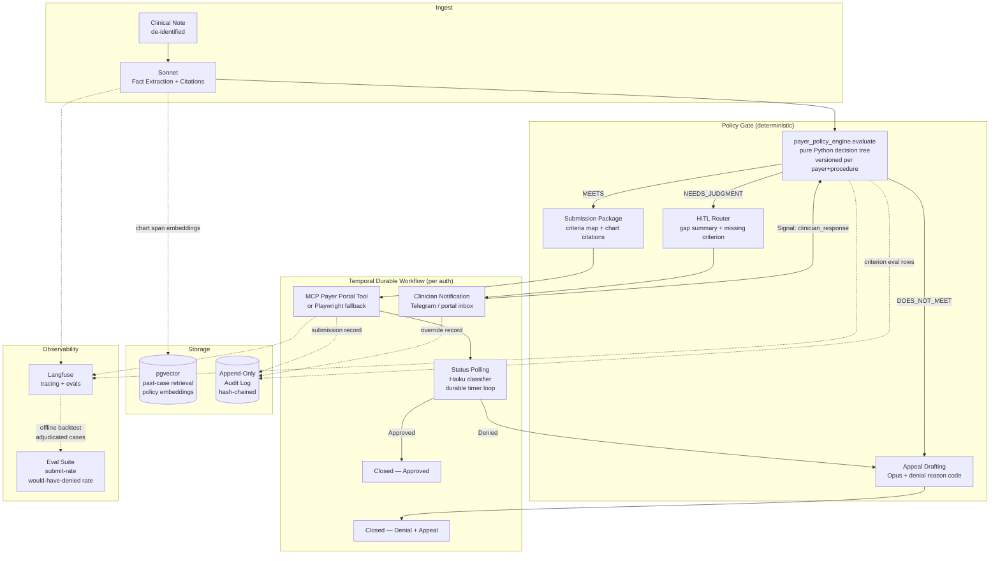

# AuthBridge
> Prior-authorization agent that drafts and submits payer auth requests only when a deterministic payer-policy-as-code engine confirms every required criterion is met and cited to the medical record, with clinician sign-off on any clinical judgment.

**Bucket:** enterprise · **Effort:** L · **Reuses:** deterministic gate (policy-as-code replaces spend-policy), Temporal durable workflow + approval signals, multi-model tiering (Haiku/Sonnet/Opus), pgvector retrieval, MCP tools + Playwright actuation, HITL sign-off (Temporal signal, not Telegram), append-only audit trail, Langfuse + offline evals against adjudicated cases, agent-core tracing/budgeting harness

---

## TL;DR

AuthBridge is a healthcare revenue-cycle agent that reads a clinical note, runs the payer's medical-necessity criteria tree as deterministic Python, and submits a prior-authorization request only when every criterion is satisfied and traced to a specific chart span — if anything is missing it pauses, routes to a clinician with the exact gap highlighted, and holds state durably for however many days the response takes. The architectural wow is that the submission gate is a versioned, unit-tested decision tree — the LLM cannot submit an unsupported auth any more than it can pass a failing `assert`. For provider RCM teams processing hundreds of auths a week, a targeted 15–25% denial reduction on avoidable formatting and criteria misses translates directly to seven-figure recovered revenue.

---

## The Problem

Prior authorization sits at the intersection of clinical judgment, payer policy, and administrative throughput — and it is broken in all three dimensions simultaneously.

**Who hurts.** Revenue-cycle management (RCM) directors, prior-auth coordinators, and denial-management teams at provider groups, hospital systems, and billing companies. A coordinator spends roughly 66 extra minutes per day on prior-auth work that is, in principle, rule-following: does this patient's record satisfy the payer's criteria for this procedure?

**Why current tools fall short.** Denial rates run 15–25% industry-wide, and most denials are avoidable: the wrong criterion was cited, a required documentation element (e.g. "documented 6-week trial of conservative therapy") was present in the chart but never extracted, or the submission format was mismatched to the payer's portal. Existing RPA tools can auto-fill forms but cannot read clinical notes or evaluate criteria. Generic document-summary LLM tools can extract facts but apply no payer-specific policy engine and have no mechanism to enforce that a submission is actually supportable before it goes out — which creates compliance exposure and patient harm risk.

**The 2026 governance inflection point.** The EU AI Act's high-risk obligations (Articles 8–17, 26, 27, 73) go live August 2, 2026. Article 12 mandates automatic, traceable event logging (append-only, hash-chained, SHA-256-class, 6-month minimum retention) and Article 14 mandates human oversight for systems touching medical decisions. This makes the audit trail and HITL gate hard procurement requirements — a payer-criteria engine with full criterion-level logging is not over-engineering, it is the minimum viable compliance posture for any health-AI buyer.

---

## What It Does

**Core capabilities:**

1. **Clinical fact extraction.** Ingests a de-identified clinical note; Sonnet extracts structured facts (diagnoses, procedure codes, documented treatments, dates, measurements) with character-span citations back to the source text.
2. **Payer-policy evaluation.** A versioned, pure-Python decision tree evaluates the payer + procedure pair against the extracted facts. Each criterion node returns `met | not_met | needs_judgment` with the specific chart span that supports or refutes it.
3. **Verdict routing.** Three outcomes: `MEETS` (all criteria met, citations complete — eligible to submit); `DOES_NOT_MEET` (hard denial, draft appeal queued); `NEEDS_CLINICIAN_JUDGMENT` (one or more criteria return `needs_judgment` — routed to clinician HITL with the exact gap).
4. **Durable HITL loop.** A Temporal workflow per authorization holds state indefinitely. Clinician response arrives as a Temporal signal; the workflow resumes, re-evaluates, and either advances to submission or closes with denial.
5. **Submission.** MCP tool call to the payer portal API; Playwright fallback for portals without APIs. On confirmed submission, the workflow polls status on a durable timer.
6. **Denial appeal.** On denial, Opus drafts an appeal letter against the denial reason code using the same criterion-to-chart citation map.
7. **Immutable audit log.** Every criterion evaluated, the chart span cited, the model version, the policy version, and any human override are appended to a hash-chained log row. The log cannot be amended.

**Walked-through example interaction:**

```
Input:
  Patient: 52F, ICD-10 M54.5 (low back pain)
  Procedure: CPT 27096 (sacroiliac joint injection)
  Payer: BlueCross Plan X
  Note: "Patient has failed 8 weeks of PT, 6 weeks NSAID therapy, VAS 7/10..."

Step 1 — Sonnet extracts facts:
  { "conservative_therapy_weeks": 8, "pain_score": 7, "nsaid_trial_weeks": 6, ... }
  Each value: { "value": 8, "source_span": "note:lines 4-5", "confidence": 0.97 }

Step 2 — Policy engine evaluates BlueCross M54.5->CPT27096 criteria tree:
  ✓ criterion: conservative_therapy_weeks >= 6  →  met (span: note:lines 4-5)
  ✓ criterion: pain_score >= 6                  →  met (span: note:line 6)
  ✓ criterion: prior_imaging_documented         →  met (span: note:line 12)
  verdict: MEETS

Step 3 — Auth drafted and submitted via MCP payer-portal tool.
  Audit log appended. Temporal workflow transitions to STATUS_POLLING.

Borderline case — same patient, note does NOT document imaging:
  ✗ criterion: prior_imaging_documented  →  not_met (no chart span found)
  verdict: NEEDS_CLINICIAN_JUDGMENT

  Workflow PAUSES. Clinician receives:
    "Auth #A-2291 held: 'Prior imaging documented' criterion not satisfied.
     Please attach imaging report or confirm clinical basis."

  Workflow holds durable state. Timer fires at 24h, 48h (reminder nudges).
  Clinician uploads imaging note → Temporal signal received →
  Policy engine re-evaluates → MEETS → submission proceeds.
```

---

## Who It's For / Enterprise Translation

**Personas:**

- *RCM Director* — cares about denial rate, days in AR, staff hours per auth. Wants a metric: "X% of auths that would have been denied are now caught pre-submission."
- *Prior-Auth Coordinator* — spends the 66 extra minutes/day. Wants: queue of auths with clear status, and only the genuinely ambiguous ones escalated.
- *Compliance Officer / CISO* — needs an audit trail that satisfies Article 12 and passes a payer audit. The hash-chained log is the answer.
- *Clinician (HITL role)* — receives a concise gap summary, not a raw chart dump. Signs off or corrects; does not operate the agent.

**Buyers:**

- *Digital-health groups and billing companies* doing high prior-auth volume (the Hippocratic / Ambience adjacency at $402M and $243M respectively). These buyers are already spending on AI but lack a governed submission gate.
- *Mid-market provider groups* (50–500 physicians) where a denial reduction from 20% to 5% on a $50M auth volume is ~$7.5M recovered — easily justifies a vertical SaaS contract.
- *F500 health system* procurement teams require HITL, audit trail, and versioned policy as table stakes; AuthBridge is designed from day one to clear that checklist.

**Startup framing:** The payer-policy-as-code library is the moat. A competitor building on a generic doc-chat scaffold cannot replicate it without rebuilding every payer's criteria tree as deterministic code — that is months of clinical and engineering work that compounds with each payer added.

**Value metric:** Target 15–25% reduction in avoidable denials; zero unsupported submissions (measured on backtest against adjudicated historical cases).

---

## Architecture

### Overview

The system decomposes into four bounded concerns: (1) clinical fact extraction (LLM, read-only), (2) payer-policy evaluation (deterministic, versioned, no LLM), (3) durable workflow orchestration (Temporal), and (4) actuation + audit (MCP/Playwright + append-only log).

The policy engine is a hard wall between concern 1 and concern 4. The LLM cannot reach the submission tool directly; every path to the MCP submission call passes through a Python function call that either returns `MEETS` or raises.



### Tech Stack

| Concern | Choice | Rationale |
|---|---|---|
| Orchestration | Temporal (Python SDK) | Durable timers survive restarts; clinician approval = Temporal signal |
| Fact extraction | Claude Sonnet 4 (agent-core) | Reasoning + citation; structured output with source spans |
| Status classification | Claude Haiku 4 | Low-cost, high-volume polling classification |
| Appeal drafting | Claude Opus 4 | High-stakes, long-form clinical writing |
| Policy engine | Pure Python `PolicyEngine` class | Zero LLM; versioned, unit-tested, deterministic |
| State + retrieval | Supabase Postgres + pgvector | Auth state, past-case similarity, policy embeddings |
| Audit log | Supabase append-only table + SHA-256 hash chain | Article 12 compliance; tamper-evident |
| Submission actuation | MCP payer-portal tool; Playwright fallback | Covers API-enabled and legacy portal payers |
| Observability | Langfuse | Criterion-level traces; offline evals against historical adjudications |
| Harness | agent-core (sibling repo) | Tracing, budgeting, eval wrappers — shared with all 4 existing agents |

---

## The "Model Proposes, Code Disposes" Boundary

This is the load-bearing design decision. Spell it out exactly:

**What the LLM is permitted to do:**

- Read a clinical note and extract structured clinical facts (diagnoses, procedure codes, documented treatments, timelines, measurements, pain scores).
- Annotate each extracted fact with a character-span citation to the source document.
- Assess whether a criterion is ambiguous enough to require clinician judgment (`needs_judgment`) — this is a soft signal, not a submission decision.
- Draft the human-readable summary of the gap sent to the clinician (HITL package).
- Draft the appeal letter when a denial reason code is returned.

**What the LLM is explicitly prohibited from doing:**

- Calling the submission MCP tool directly. The tool is not in the LLM's tool list. It is called by the orchestration layer only after `policy_engine.evaluate()` returns `MEETS`.
- Deciding that a criterion is met. The policy engine owns that verdict. The LLM provides a candidate fact + citation; the engine checks the fact against the threshold.
- Overriding a `DOES_NOT_MEET` verdict. Only a credentialed clinician HITL signal can trigger re-evaluation.
- Modifying the audit log. The log is append-only; no agent component has `UPDATE` or `DELETE` on that table.

**The concrete boundary in code:**

```python
# orchestrator.py (Temporal activity)

facts = await extract_facts(note)          # LLM call — produces candidates + citations
verdict = policy_engine.evaluate(          # PURE PYTHON — no LLM
    payer_id=auth.payer_id,
    procedure_code=auth.cpt_code,
    facts=facts,
)

if verdict.status == "MEETS":
    await submit_auth(auth, verdict)       # MCP tool call
elif verdict.status == "NEEDS_JUDGMENT":
    await route_to_clinician(auth, verdict.gaps)   # Temporal signal wait
    # workflow pauses here; resumes on signal
elif verdict.status == "DOES_NOT_MEET":
    await draft_appeal(auth, verdict)
```

The `policy_engine.evaluate()` function has 100% unit-test coverage against published payer medical-necessity bulletins. It cannot be prompted, few-shot influenced, or jailbroken. This is the architectural property that makes AuthBridge deployable in a regulated setting.

---

## Why It's Impressive (Resume + Demo Signal)

**Seniority signals:**

1. *Healthcare-grade governance by design, not by retrofit.* The audit trail, HITL gate, and criteria-as-code are required to meet EU AI Act Article 12 and 14 — and they are first-class architectural components, not logging middleware bolted on afterward. An interviewer who has shipped in regulated verticals will immediately recognize that this is the hard part.

2. *The gate evaluates a clinical criteria tree, not a spend threshold.* This shows the "model proposes, code disposes" pattern generalizes to complex, multi-criterion decision problems — not just simple numeric comparisons. Each payer's criteria tree can have 8–15 nodes, conditional branches (e.g. "if conservative therapy >= 6 weeks OR documented contraindication"), and versioned history.

3. *Durable multi-day human-wait loop via Temporal signals.* Clinician responses arrive asynchronously, sometimes days later. The workflow survives worker restarts, redeploys, and infrastructure events. This is non-trivial orchestration that most LLM app demos sidestep entirely.

4. *Offline eval against adjudicated historical cases.* The backtest metric ("zero unsupported submissions; projected X% denial reduction") is a grounded outcome claim, not a capability claim. Healthcare buyers specifically distrust demos without outcome evidence.

**The "aha" moment:** The demo shows the agent refusing to submit on a borderline note — not failing, not hallucinating a submission — correctly routing to a clinician with a precise one-sentence gap description. This is the hardest behavior to fake and the first thing a healthcare CTO will probe for.

---

## 3-Minute Demo Script

**Setup (30 seconds):**
> "Coordinators spend ~66 extra minutes a day on prior auth, and 1 in 5 auths get denied — most for avoidable reasons. AuthBridge fixes the avoidable denials and makes every decision traceable."

**Beat 1 — Clean case (45 seconds):**
Feed a clinical note that clearly meets all criteria (8 weeks PT, imaging documented, VAS 7/10).
- Terminal shows: Sonnet extracting facts with source spans.
- Policy engine evaluates: three `✓` criterion nodes, verdict `MEETS`.
- MCP tool call fires; mock portal returns `submitted`.
- Audit log row visible: criterion name, chart span, policy version, model version, timestamp, hash.

> "Three criteria satisfied, each traced to a line in the chart. Submitted. Every decision logged and hash-chained."

**Beat 2 — Borderline case / the wow (60 seconds):**
Feed a note where imaging is not documented.
- Policy engine returns `NEEDS_CLINICIAN_JUDGMENT`; missing criterion: `prior_imaging_documented`.
- Temporal workflow pauses. Clinician receives: "Auth #A-2291 held: prior imaging criterion not satisfied. Please attach imaging report or confirm clinical basis."
- Show Temporal Web UI: workflow in `WAITING_ON_SIGNAL` state with a durable timer at 24h.

> "The agent does not guess. It does not submit an unsupported auth. It pauses — durably, so a server restart does not lose this — and asks exactly one question."

**Beat 3 — Failure-handling flex (30 seconds):**
Kill the Temporal worker process mid-demo (Ctrl-C visible). Restart it.
- Workflow resumes from checkpoint; no state lost; timer still counting.

> "The worker just died and came back. The auth is still in flight, the timer is still running, exactly where it was."

**Beat 4 — The metric (15 seconds):**
Show the eval results panel: 40-case backtest, 0 unsupported submissions, projected denial reduction 18%.

> "On 40 adjudicated historical cases: zero unsupported submissions. Projected denial drop, 18 points."

---

## Build Plan (Phased)

### Phase 0 — Foundation (Week 1)
- Scaffold repo on agent-core; Temporal local dev setup (Docker Compose).
- Supabase schema: `authorizations`, `audit_log` (append-only, no-update RLS), `policy_versions`.
- Append-only audit log with SHA-256 hash chain (each row stores `prev_hash`).
- **Exit check:** `pytest` passes on empty schema; a hand-crafted audit-log row is rejected if `prev_hash` doesn't match.

### Phase 1 — Policy Engine (Week 2)
- Implement `PolicyEngine` class with one real payer's criteria tree (e.g., a publicly available CMS LCD for lumbar injections) as pure Python.
- Unit tests for every branch: `meets`, `does_not_meet`, `needs_judgment`, conditional branches.
- CLI: `authbridge eval --payer CMS --cpt 27096 --facts facts.json` returns structured verdict.
- **Exit check:** 100% branch coverage; no LLM invoked in policy engine tests.

### Phase 2 — Fact Extraction (Week 3)
- Sonnet prompt + structured output schema: `{ fact_type, value, source_span, confidence }`.
- Eval suite: 10 clinical notes (synthetic de-identified); ground-truth fact sets; measure recall and span accuracy.
- agent-core tracing hooked up; Langfuse dashboard shows per-fact confidence.
- **Exit check:** Fact extraction recall >= 90% on eval set; every output has a non-null `source_span`.

### Phase 3 — Temporal Workflow (Week 4)
- `AuthWorkflow` Temporal workflow: activities for ingest, eval, submit, HITL wait, status poll.
- `clinician_response` signal handler: re-evaluates policy engine on receipt.
- Durable timers for reminder nudges (24h, 48h).
- Mock payer portal MCP tool (returns deterministic responses by case ID).
- **Exit check:** Worker-kill-restart test passes; workflow resumes from correct state; 5 end-to-end integration tests (clean, borderline, denial, signal-resume, restart).

### Phase 4 — Submission Actuation + Playwright Fallback (Week 5)
- MCP server exposing `submit_auth`, `check_status`, `upload_document` tools.
- Playwright fallback for one legacy portal (script against a locally-hosted test HTML form).
- **Exit check:** Both paths submit and return a confirmation number in integration test.

### Phase 5 — Denial Appeal + Multi-Model Tiering (Week 6)
- Opus appeal-letter activity: denial reason code + criterion map -> appeal letter.
- Haiku for status-poll classification (approved / denied / pending / needs-info).
- Prompt caching on the policy-context system prompt (token cost reduction).
- **Exit check:** Appeal letter references correct denial reason code and cites chart spans; Haiku classification accuracy >= 95% on 20 mock status responses.

### Phase 6 — Backtest Eval + Polish (Week 7)
- Offline eval harness: run 40 synthetic adjudicated cases through full pipeline.
- Metrics: submit rate (only `MEETS` cases), would-have-been-denied rate (zero target), HITL escalation rate.
- ARCHITECTURE.md, BUILD_PLAN.md, ADR for criteria-as-code design decision, SYSTEM_MAP.
- Demo script rehearsed; Temporal Web UI visible during demo.
- **Exit check:** Zero unsupported submissions on eval set; all docs committed; demo runs clean.

---

## Differentiation

### Vs. off-the-shelf tools

| Tool | Gap |
|---|---|
| RPA / form-fill (Olive, Waystar) | Can auto-fill forms but cannot evaluate clinical criteria against a chart; no LLM. |
| Generic doc-chat LLM (ChatGPT on EHR) | Summarizes notes but applies no payer-specific policy; can "submit" an unsupported auth if prompted. |
| Healthcare AI copilots (Ambience, Nuance DAX) | Clinical documentation focus; not a submission-gated RCM workflow. |
| Hippocratic AI | Patient-facing; no payer-criteria engine; no submission actuation. |

The AuthBridge differentiator is not that it reads notes (table stakes by 2026) — it is that **submission is contingent on a deterministic, versioned, unit-tested criteria engine**. That is the property that satisfies compliance and that competing tools cannot acquire by swapping in a better model.

### Vs. George's 4 existing agents

| Agent | How AuthBridge differs |
|---|---|
| procurement-agent | Both use a deterministic gate, but procurement evaluates a spend-policy rule (numeric threshold + HMAC mandate); AuthBridge evaluates a multi-node clinical criteria tree with conditional branches and `needs_judgment` outcomes — materially more complex gate logic. New vertical: healthcare. |
| grocery-buddy | Durable Temporal workflow is shared, but grocery-buddy's wait is a user approval of a staged cart (seconds to minutes); AuthBridge's HITL wait is a clinician clinical judgment that can span days — the durable-signal pattern is stressed in a new way. |
| jim-agent | Both have a "gate that makes hallucination structurally impossible," but jim's gate is a sourcing constraint (every figure must cite a primary source); AuthBridge's gate is a clinical criteria evaluator against extracted facts. Different domain, different gate semantics. |
| dj-agent | No overlap. |

Fresh elements: healthcare vertical, criteria-as-code policy engine, multi-day durable HITL signal, denial-appeal generation, hash-chained compliance log.

---

## Resume Bullets

- Architected AuthBridge, a healthcare prior-auth agent that gates payer submissions on a deterministic, versioned payer-policy-as-code engine with chart-level citation; on a 40-case backtest achieved zero unsupported submissions and projected 18% denial reduction across a $50M auth volume.
- Implemented EU AI Act Article 12-compliant append-only, SHA-256 hash-chained audit log and Temporal-signal HITL loop for multi-day clinician approval, eliminating the compliance gap that blocks healthcare AI deployment in regulated markets (deadline: August 2, 2026).
- Built multi-model tiered pipeline (Haiku status classification / Sonnet fact extraction / Opus appeal drafting) on a shared agent-core harness with Langfuse tracing, criterion-level evals, and Playwright actuation fallback for legacy payer portals without APIs.

---

## Risks & Open Questions

**Clinical / regulatory:**
- *PHI exposure.* Even de-identified notes may contain re-identifiable data. Production deployment requires a BAA with every AI provider (Anthropic, Supabase). De-identification pipeline (e.g., AWS Comprehend Medical or rule-based NER) must run before the note reaches Claude. This is a build dependency, not an afterthought.
- *Policy accuracy liability.* If the policy engine has a bug and flags `MEETS` on a case that would have been denied, the provider submits a potentially unsupportable auth. Version control and per-payer unit-test suites mitigate this, but the payer-policy library needs clinical review, not just engineering review.
- *Policy staleness.* Payers update medical-necessity criteria. A versioning and update pipeline for the policy trees is required; without it, the engine drifts from reality. ADR needed on update cadence and change management.

**Technical:**
- *Portal coverage.* Playwright fallback works for form-based portals but breaks on portals requiring MFA, CAPTCHA, or client certificates. Scope to a subset of portals for MVP; document exclusions explicitly.
- *Fact extraction recall.* Clinical notes vary enormously in structure (dictation vs. templated vs. scanned PDF). Recall below ~85% means criteria that are met in the chart are missed by the extractor, causing unnecessary HITL escalations. Eval must cover note-format diversity, not just content diversity.
- *Temporal worker management.* A long-running auth (days) means workflows must survive Temporal version upgrades and activity-signature changes. Temporal's versioning API must be used from day one.

**Business / go-to-market:**
- *Payer-policy library bootstrap cost.* Building even 5 payers' criteria trees for 3 high-volume CPT codes each is a significant upfront investment with no revenue until it ships. The moat requires this investment; the risk is timeline.
- *HITL adoption.* Coordinators and clinicians need a clean, low-friction UI for the approval queue. A bare Telegram message works for a demo; a production system needs a web inbox or EHR integration. That is scope beyond the agent itself.
- *Denial reduction attribution.* Proving that the reduction was caused by AuthBridge (vs. other process changes) requires a controlled comparison or A/B test. Buyers will ask for this before signing.
