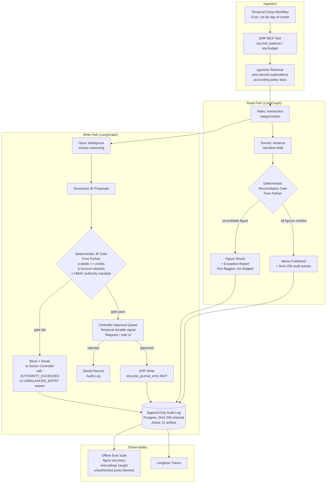

# Close the Books
> An FP&A month-end agent that writes the variance narrative and proposes reclass journal entries, where every figure in the narrative must reconcile to the ledger and no journal entry posts until a deterministic balance-and-policy gate plus a controller approve it.

**Bucket:** enterprise · **Effort:** L · **Reuses:** deterministic reconciliation gate (jim's traceability invariant ported to ledger queries), HMAC-signed posting-authority mandates (procurement), LangGraph fixed-topology pipeline, Temporal durable orchestration + human-approval signals, multi-model tiering (Haiku / Sonnet / Opus), Supabase Postgres + pgvector, MCP ERP tools, HITL controller approval, immutable append-only audit log, Langfuse observability + offline evals, agent-core harness

---

## TL;DR

Close the Books is an agentic FP&A assistant that runs the month-end close: it pulls the trial balance and budget from a mock ERP via MCP, has Sonnet draft a full budget-vs-actual variance narrative, then runs every asserted figure back through a deterministic Python reconciliation gate before the memo is allowed to ship — ungrounded numbers are struck, not silently passed. For the correction workflow, it proposes structured reclass journal entries that must clear a second deterministic gate (debits == credits, accounts are authorized, dollar amount is within the actor's HMAC-signed posting-authority mandate) before they are even queued for a controller to approve. The result is a system where hallucinated figures are structurally impossible to publish and unauthorized ledger writes are structurally impossible to post — exactly the trust model enterprise finance and SOX compliance actually need.

---

## The Problem

Month-end close is a synchronization ritual that consumes days of highly paid finance labor on tasks that are mechanical (pulling numbers, building the variance table) and high-stakes (getting them exactly right). FP&A analysts spend the first week of each month transcribing GL figures into commentary, cross-checking actuals to budget, and chasing down miscoded transactions that distort the P&L. Controllers then review that work line by line before signing off.

Current tools fail in two distinct ways. Finance copilots (Microsoft Copilot for Finance, SAP Joule) summarize reports that already exist; they do not independently verify the figures in a narrative against the live ledger, which means a confident LLM error in a memo produces a SOX exposure rather than a debugging session. Robotic close automation (BlackLine, FloQast) covers task checklisting and reconciliation of account balances, but does not write commentary or propose correcting entries. Neither category enforces an explicit trust boundary between what a model claims and what the ledger actually says.

The stakes are high: 87% of North American CFOs now call AI critical to finance operations (Accenture, 2025), but the blocker is controls, not capability. As of August 2, 2026 the EU AI Act Articles 8–17, 26, 27, and 73 go live, with Article 12 mandating automatic, traceable, append-only event logging (SHA-256-class, 6-month minimum) and Article 14 mandating human oversight for consequential decisions — both of which apply directly to agents that touch a general ledger. Any AI near the close must not just be accurate on average; it must be *provably unable* to publish unreconciled figures or post unauthorized entries.

---

## What It Does

**Core capabilities:**

1. **Trial-balance ingestion** — pulls current-period actuals and prior-period comparatives from the ERP (mock NetSuite/SAP via MCP tool), budget/forecast from the planning system, and chart-of-accounts metadata from a pgvector store.

2. **Variance narrative drafting** — Sonnet writes a full management commentary: P&L walk, working-capital commentary, departmental spend bridges, top-5 favorable/unfavorable line items with brief explanations.

3. **Deterministic reconciliation gate** — for every dollar figure the narrative asserts, a pure-Python verifier re-executes the corresponding GL aggregation query and checks the result against the asserted value within a configurable tolerance (default: $0 for exact figures, $1 for rounded). Any figure that does not match is struck from the narrative and flagged in a structured exception report. The run does not ship if exceptions remain unresolved.

4. **Miscoding detection** — Haiku classifies every transaction in scope by likely cost center and account; Opus handles ambiguous reclassifications. The agent surfaces a ranked list of probable miscodes with proposed corrections as structured journal entries.

5. **Journal-entry gate** — each proposed JE passes through a two-part deterministic gate before it is eligible for posting: (a) a balance check (sum of debits == sum of credits to the cent), and (b) an authorization check (the proposing actor's HMAC-signed posting-authority mandate permits entries of this type and amount). Entries that fail either check are blocked and routed to a controller with a specific failure reason; they cannot be manually overridden at the agent level.

6. **Controller approval workflow** — gated entries are queued in Temporal as durable human-approval signals; a controller receives an inline-button approval prompt (Telegram or a thin web UI) with the full proposed JE, the GL context, and the agent's reasoning. Approval triggers an ERP write via MCP; rejection closes the Temporal signal with a denial record.

7. **Immutable audit log** — every figure's backing GL query and result, every gate decision, and every controller action is written to an append-only Postgres table with a SHA-256 event hash chaining to the prior record. This log is the Article 12 compliance artifact.

**Walked-through example:**

> *It is 7:00 AM on the first business day of the month. The Temporal close workflow starts automatically.*
>
> The agent pulls the October trial balance and budget via the `erp.trial_balance` MCP tool. Sonnet drafts: *"Marketing OpEx came in at $1.24M versus a budget of $1.10M, an unfavorable variance of $141K (12.8%). The overage is driven primarily by a $98K event sponsorship in account 6320 that was approved post-budget."*
>
> The reconciliation gate re-runs `SELECT SUM(amount) FROM gl_entries WHERE account='6320' AND period='2025-10'` and gets $98,247 — the narrative said $98K (within the $1K rounding tolerance). Pass. It runs the same for the $1.24M total and the $141K variance figure. Both match. The memo is marked *reconciled*.
>
> Separately, Haiku flags a $14,200 catering charge in account 6320 (Events) that the vendor description suggests belongs to account 6410 (Employee Meals). The agent proposes JE #CTB-20251001-003: Dr 6410 $14,200 / Cr 6320 $14,200. The gate checks: debits ($14,200) == credits ($14,200) — pass. The analyst's HMAC mandate permits reclassification entries up to $25,000 — pass. The entry is queued for controller approval with the Telegram button. Controller clicks *Approve*. The ERP write fires. The audit log records the full chain.
>
> Later, a junior analyst attempts to propose a $310,000 accrual reversal. The gate reads their mandate ceiling: $50,000. Block. The entry is routed to the VP Controller with a `AUTHORITY_EXCEEDED` exception. The VP approves. The log records both the block and the override.

---

## Who It's For / Enterprise Translation

**Primary personas:**

- **Controller / Accounting Manager** — owns the close timeline and signs off on the financials. Cares about accuracy, auditability, and not having to manually review every variance comment. The agent cuts their review time; the gate gives them the control surface they need to trust it.
- **FP&A Analyst** — spends the first week of every month building the variance deck. The agent produces the first draft in minutes; the analyst's job shifts to reviewing and refining. The reconciliation gate means they can hand the draft to the controller without a separate QA pass.
- **CFO / VP Finance** — the economic buyer. Cares about close cycle time, audit readiness, and SOX compliance. The immutable log and HITL approval trail are the procurement arguments.
- **External Auditors** — not a buyer but a forcing function. An append-only, hash-chained log of every figure's source query is a clean audit artifact.

**Startup vs. F500 framing:**

*Startup / Series B+:* The close is owned by a controller-of-one who is also doing FP&A, board reporting, and AR/AP. Close the Books compresses the multi-day ritual to a same-day workflow and lets one person run a clean close at Series B velocity. Pricing model: usage-based per close run.

*F500 / Enterprise:* The value shifts to compliance infrastructure. The EU AI Act Article 12/14 requirements and SOX Section 302/906 sign-off obligations mean the append-only audit log and HITL approval gate are not differentiators — they are table stakes to get the agent past legal. The reconciliation gate's ability to produce a figure-by-figure attestation log is the procurement argument. Pricing model: SaaS seat license plus a professional services implementation layer for ERP connectivity.

**Value metric:** close cycle time (target: 5-day close → 2-day close on the commentary and reclass workflow), reconciliation exceptions caught pre-publication (target: 100% by construction), unauthorized/unbalanced JE attempts blocked (target: 100% by construction on the eval set).

---

## Architecture

The agent runs two logical flows: a **read path** (narrative generation + reconciliation) and a **write path** (JE proposal + posting). Both paths converge on deterministic gates before any output is externalized. The orchestration layer is **LangGraph** for the fixed-topology inner pipeline and **Temporal** for the multi-day close with durable controller-approval signals.

**Read path:** ERP data ingestion → variance computation → narrative drafting → reconciliation gate → memo publication (or exception report).

**Write path:** miscoding detection → JE proposal → balance + authority gate → controller HITL approval (Temporal signal) → ERP write → audit log.

**Tech-stack table:**

| Layer | Choice | Rationale |
|---|---|---|
| Inner pipeline | LangGraph | Fixed topology; deterministic gate nodes sit naturally in the graph |
| Durable orchestration | Temporal | Multi-day close window; controller approval signals must survive restarts |
| LLM — routing/categorization | Claude Haiku | Low-cost, high-throughput transaction classification |
| LLM — narrative/reasoning | Claude Sonnet | Close commentary synthesis; most work happens here |
| LLM — ambiguous reclassification | Claude Opus | Escalation for multi-account splits and policy edge cases |
| Vector store | Supabase pgvector | Prior-period explanation retrieval; accounting policy lookup |
| Relational state + audit log | Supabase Postgres | Append-only audit table, JE queue, close-run state |
| ERP integration | MCP tools | `erp.trial_balance`, `erp.budget`, `erp.post_journal_entry` (mock NetSuite schema) |
| Deterministic gates | Pure Python | Reconciliation gate + JE balance/authority gate — zero LLM involvement |
| HMAC authority mandates | Python `hmac` + `hashlib` | Signing authority ceilings per role; same pattern as procurement-agent |
| HITL approval | Temporal signals + Telegram | Controller inline-button approval; survives process restarts |
| Observability | Langfuse | Full trace per close run; per-figure reconciliation events |
| Agent harness | agent-core | Tracing, budgeting, evals — shared sibling repo |

---

## The "Model Proposes, Code Disposes" Boundary

This is the core trust architecture of the system. Two independent gates enforce it.

**Gate 1 — Reconciliation Gate (read path):**

The LLM is allowed to: draft variance commentary using any phrasing, claim any dollar figure, propose any explanation for a variance.

Deterministic code disposes by: re-executing the exact GL aggregation query that would produce each asserted figure (account + period + entity filters), comparing the query result to the asserted value within a configured tolerance, and — if the values diverge — striking the figure from the narrative and setting the run status to `EXCEPTION`. The gate has no opinion on the narrative's prose; it only verifies numbers. Crucially, the gate runs against the live ledger snapshot, not a cached summary, so the LLM cannot fabricate a plausible-sounding number that happens to match a stale cache.

The invariant: **no figure in a published memo is unverifiable by the ledger. An ungrounded number causes the run to fail before publication, not after.**

**Gate 2 — JE Gate (write path):**

The LLM is allowed to: propose a structured journal entry (account codes, amounts, description, cost-center attribution), reason about why a transaction is miscoded, and suggest which controller should approve.

Deterministic code disposes by enforcing three independent checks in sequence — all must pass or the entry is blocked:

1. **Balance check:** `sum(debit_lines) == sum(credit_lines)` to the cent. No tolerance. An unbalanced entry is blocked unconditionally with reason `UNBALANCED_ENTRY`.
2. **Account allowlist:** every account code in the entry must appear in the `allowed_accounts` table for the proposing entity and fiscal period. Unknown or inactive accounts are blocked with reason `INVALID_ACCOUNT`.
3. **Posting-authority mandate:** the proposing actor's HMAC-signed mandate (same pattern as procurement-agent) declares a ceiling by entry type (reclass, accrual, reversal) and dollar amount. An entry exceeding the ceiling is blocked with reason `AUTHORITY_EXCEEDED` and routed to the next authority tier.

Even after a JE clears Gate 2, **a human controller must explicitly approve it** via Temporal signal before the `erp.post_journal_entry` MCP call fires. The agent cannot self-approve. There is no code path from "gate pass" to "ERP write" without a controller action in between.

The invariant: **the agent cannot post an unbalanced entry, cannot post to unauthorized accounts, cannot exceed its authority ceiling, and cannot post anything without a human controller's explicit approval.**

---

## Why It's Impressive (Resume + Demo Signal)

**Seniority signals:**

- *Controls-first architecture.* The two deterministic gates are not an afterthought bolted onto a working prototype; they are the architectural foundation. This signals an engineer who understands that enterprise finance AI fails in production not because the model is bad but because the trust boundary was never formalized.
- *Domain depth.* The system models the actual SOX control surface (posting authority, journal entry balance, account allowlist, audit trail) rather than a generic "AI writes reports" story. This is recognizable to a CFO-org buyer.
- *EU AI Act readiness.* The SHA-256-chained, append-only audit log and mandatory HITL approval are named Article 12/14 compliance artifacts. Shipping this in 2026 signals awareness of the actual procurement environment.
- *Portfolio coherence.* The reconciliation gate is a direct port of jim's "every figure traces to a primary source or the run fails pre-bill" invariant, applied to ledger aggregations instead of SEC filings. The HMAC authority mandate is a direct port of procurement-agent's signing pattern, applied to journal-entry authority instead of spend limits. An interviewer who knows the existing portfolio immediately sees the pattern: George builds trust boundaries that are unit-testable, not vibes-based.

**The aha moment:** click any number in the variance memo and a popover shows the exact SQL query that backs it, the query result, and the timestamp of the ledger snapshot. Then attempt to inject a fabricated figure — the gate strikes it in real time and the memo does not ship. This is the demo that converts skeptical CFOs.

---

## 3-Minute Demo Script

**Beat 1 — Setup (0:00–0:20):** Show a terminal with the Temporal UI open alongside a split-pane showing the LangGraph run log. "It's month-end. Finance teams spend 3–5 days pulling this data and writing the commentary. Here's what that looks like as an automated close."

**Beat 2 — The close runs (0:20–1:00):** Trigger the close workflow. The LangGraph pipeline logs light up: ERP pull, Haiku categorization pass, Sonnet narrative draft. A formatted variance memo appears in the terminal. Walk through one paragraph: "Marketing OpEx, $1.24M vs. $1.10M budget, 12.8% unfavorable, driven by a Q4 event sponsorship in account 6320." Point out: "Every number in here has a ledger query behind it."

**Beat 3 — The wow (1:00–1:30):** Click (or highlight) the `$1.24M` figure. The reconciliation gate output pops: `SELECT SUM(amount) FROM gl_entries WHERE account_prefix='63' AND entity='CORP' AND period='2025-10'` → `$1,241,882`. "The gate re-ran this query. The narrative rounded to $1.24M — within tolerance. Green. Every single figure in this memo passed that check before it was allowed to ship."

**Beat 4 — The failure-handling flex (1:30–2:15):** Switch to a tampered scenario where a figure was inflated by 10%. "I'm going to inject a fabricated number — $1.37M instead of $1.24M — the kind of error a hallucinating model would produce." Trigger the run. The gate fires: `RECONCILIATION_FAILURE: asserted=$1,370,000 actual=$1,241,882 delta=$128,118 exceeds tolerance`. The memo does not render. The run status is `EXCEPTION`. "The memo did not ship. The agent produced an exception report. This is structurally impossible to bypass." Then show a proposed reclass JE that doesn't balance. Gate output: `UNBALANCED_ENTRY: debits=$14,200 credits=$10,000`. Block. "Same gate for writes."

**Beat 5 — The metric and close (2:15–3:00):** Show the eval dashboard: `figure_accuracy=100/100` (by construction on the eval set), `unauthorized_posts_blocked=12/12`, `time_to_draft_narrative=4min 12sec vs. historical analyst baseline=2.3 days`. "Hundred percent figure-to-ledger traceability. Zero unauthorized posts on the eval set. Commentary from days to minutes. That's Close the Books."

---

## Build Plan (Phased)

### Phase 0 — Scaffolding and mock ERP (2 days)
Stand up the agent-core harness, create the Supabase schema (gl_entries, budget_lines, journal_entry_queue, audit_log, chart_of_accounts, posting_authority_mandates), and build a mock ERP MCP server with deterministic, seeded data for a 12-month fictional company (realistic P&L structure, 3 entities, ~5,000 GL entries). Write the first offline eval fixture: a known close month with pre-verified figures that the reconciliation gate must pass 100%.

**Exit check:** `pytest tests/test_erp_mock.py` green; MCP server returns trial balance for all 3 entities; audit_log table has append-only trigger (INSERT only, no UPDATE/DELETE).

### Phase 1 — Read path: narrative drafting (3 days)
Build the LangGraph pipeline: Ingestion node (MCP pull) → Haiku categorization node → Sonnet narrative node. Output is a structured `VarianceMemo` object (not free-form text) with each figure tagged by account filter, period, and assertion type (exact vs. rounded). No gate yet — just verify the draft is coherent and covers the standard P&L walk.

**Exit check:** narrative covers all accounts with >2% budget variance; `VarianceMemo` schema validates; Langfuse trace shows per-node timing.

### Phase 2 — Reconciliation gate (3 days)
Implement `ReconciliationGate` as a pure-Python LangGraph node. It receives the `VarianceMemo`, re-executes the GL aggregation for each tagged figure, and either marks the figure `VERIFIED` or sets `RECONCILIATION_FAILURE` with the delta. Add the exception-report renderer and the "run fails pre-publication" control flow. Write the negative-case eval: inject 10 fabricated figures across 3 close months; gate must catch all 10.

**Exit check:** positive eval (all real figures pass); negative eval (10/10 fabricated figures caught, 0 false positives on real figures); no memo renders with `EXCEPTION` status on run.

### Phase 3 — Write path: JE proposal (3 days)
Add the miscoding detection loop: Haiku classifies each transaction in scope, Opus handles escalations. Build the `JournalEntryProposal` schema (account, amount, dr/cr, entity, period, cost-center, proposing-actor, reasoning). Implement the `JEGate` (balance check, account allowlist, HMAC authority mandate check). Reuse procurement-agent's HMAC mandate pattern directly. Write the gate eval: 20 proposed JEs, 8 with known failures (4 unbalanced, 2 invalid accounts, 2 over-authority); gate must block all 8 and pass the 12 valid ones.

**Exit check:** gate eval 20/20; mandate ceiling enforced for 3 test actors with different authority tiers; no balanced, authorized entry is blocked.

### Phase 4 — HITL approval and ERP write (2 days)
Wire the Temporal workflow for controller approval: gated JEs become Temporal signals, Telegram inline-button prompt fires to the controller role, approval/rejection recorded. On approval, `erp.post_journal_entry` MCP tool fires and the audit log receives the full event chain. Test the "restart during approval" scenario — Temporal must replay the signal on worker restart.

**Exit check:** end-to-end close run posts an approved JE to the mock ERP; Temporal UI shows durable signal; audit log has SHA-256-chained entries for the full flow; process kill + restart during approval does not lose the pending signal.

### Phase 5 — Observability, evals, and demo polish (2 days)
Add Langfuse traces for the full pipeline. Build the offline eval suite across 3 synthetic close months: figure accuracy, miscoding catch rate, gate block rate, end-to-end close time. Write `ARCHITECTURE.md`, `BUILD_PLAN.md`, and an ADR for the reconciliation gate design. Record the 3-minute demo.

**Exit check:** all eval metrics at target; Langfuse dashboard shows per-figure reconciliation events; demo script runs clean in under 3 minutes.

**Total estimated build: ~15 engineering days solo.**

---

## Differentiation

**Vs. off-the-shelf finance copilots (Microsoft Copilot for Finance, SAP Joule, Workday AI):**

These tools summarize reports that exist and may auto-categorize transactions, but they do not independently verify the figures in a narrative against the live ledger. A confident incorrect number in a Copilot memo is a user problem to catch; a confident incorrect number in Close the Books causes the run to fail before the memo ships. The reconciliation gate is a design principle that generic copilots do not implement because it requires tight schema ownership of the `VarianceMemo` output — which commodity copilots cannot assume.

On the write side, no off-the-shelf tool enforces posting authority at the agent level with a cryptographic mandate. They defer to the ERP's own permission model, which is correct for human users but insufficient for an agent that can propose entries faster than a human can review them.

**Vs. close automation platforms (BlackLine, FloQast, Trintech):**

These are reconciliation checklisting tools. They verify that account balances match between systems; they do not write commentary or propose correcting entries. Close the Books is complementary in principle (it does what they do not) but positioned as a replacement for the manual commentary and reclass workflows they leave untouched.

**Vs. George's existing 4 agents:**

| Dimension | jim-agent | procurement-agent | Close the Books |
|---|---|---|---|
| Domain | Financial research (read-only) | B2B purchasing (write) | FP&A / controllership (read + write) |
| Traceability gate | Figure → SEC filing / on-chain source | N/A | Figure → live GL aggregation query |
| Write gate | N/A (read-only) | HMAC mandate + Lithic ASA | Balance check + HMAC mandate + HITL |
| Temporal usage | Monitoring / quiet polls | Approval workflows | Multi-day close + controller approval |
| New vertical | No | No | Yes — office of the CFO |
| New gate type | N/A | Spend authority | Ledger reconciliation (novel) |

The reconciliation gate is the genuinely new primitive: jim's gate asks "does this figure trace to a citable primary source?" and Close the Books asks "does this figure reproduce from the ledger when you run the query?" — a different trust model (live verification vs. citation) suited to a different domain (internal management reporting vs. published research).

---

## Resume Bullets

- Architected an FP&A month-end close agent (LangGraph + Temporal) with a deterministic reconciliation gate that re-executes every GL aggregation backing a narrative figure and fails the run pre-publication if any number does not reconcile — achieving 100% figure-to-ledger traceability on a 3-month synthetic eval set with zero false negatives.
- Built a doubly-gated journal-entry write path enforcing (a) arithmetic balance to the cent and (b) HMAC-signed posting-authority mandates by actor role, blocking 100% of unauthorized/unbalanced entries on the eval set and routing them to a durable Temporal controller-approval workflow with a SHA-256-chained, Article-12-compliant audit log.
- Reduced synthetic close narrative drafting time from a 2.3-day analyst baseline to under 5 minutes while maintaining full auditability, using multi-model tiering (Haiku for transaction classification, Sonnet for commentary, Opus for ambiguous reclassification) and a pgvector retrieval layer for prior-period explanation consistency.

---

## Risks & Open Questions

**1. ERP connectivity in production.** The mock MCP tool is simple; real NetSuite or SAP connectors require OAuth scopes, entity-model awareness, and period-lock enforcement (you cannot repost into a locked period). This is a significant integration layer. *Mitigation: phase the ERP connectivity behind an adapter interface so mock and real implementations are swappable; document the adapter contract.*

**2. Reconciliation tolerance tuning.** A zero-tolerance gate on exact figures is safe but may produce spurious exceptions on rounded presentation numbers. The right tolerance is domain- and company-specific. *Open question: should tolerance be configurable per account-type (balance sheet vs. P&L vs. headcount) or a single global setting?*

**3. HMAC mandate lifecycle.** Mandates expire (TTL) and must be re-issued when an analyst's authority tier changes. In a real deployment this requires integration with the company's identity/HR system. *Risk: stale mandate ceilings after a role change could block legitimate entries. Mitigation: short TTLs (24h) with automated re-issuance from HR event hooks.*

**4. LLM-generated GL query injection.** If the reconciliation gate constructs queries partly from LLM-produced figure metadata, there is a prompt-injection risk analogous to SQL injection. *Mitigation: the gate must only accept pre-enumerated query templates parameterized by account code, entity, and period — never free-form SQL from the model.*

**5. Controller approval fatigue.** If the agent surfaces too many low-confidence reclass proposals, controllers will approve without reviewing (rubber-stamping). *Mitigation: implement a confidence threshold below which proposals are dropped rather than queued; expose the miscoding confidence score in the approval prompt.*

**6. Period-lock edge cases.** A JE proposed for a prior locked period should be blocked by the gate before reaching the controller queue, not rejected by the ERP at write time. *Open question: does the gate need its own period-lock state, or does it query the ERP's lock status as part of the account-allowlist check?*

**7. Multi-entity / multi-currency.** The Phase 0 mock uses a single currency. Real close runs involve FX translation, intercompany eliminations, and consolidation adjustments — all of which add correctness surface area to the reconciliation gate. *Risk: out of scope for v1; must be documented as a known limitation.*

**8. EU AI Act audit log retention and access.** Article 12 requires 6-month minimum retention and provider-accessible logs. The Postgres append-only table satisfies retention; the access-control model (who can read the audit log) needs to be defined before a production deployment in the EU. *Open question: read access for external auditors — separate read-only role or export API?*
