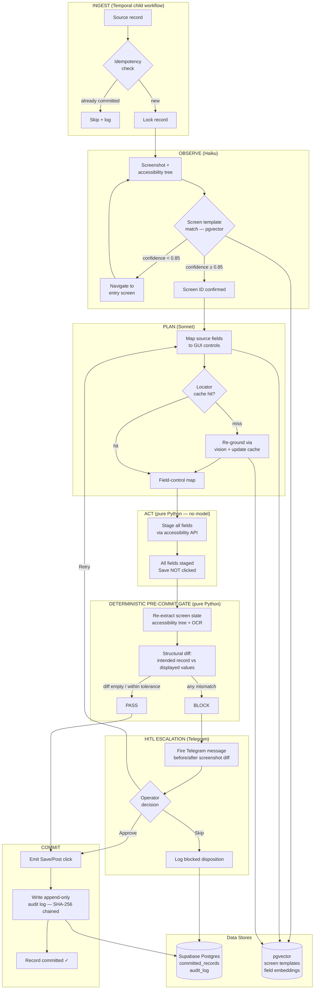

# Greenscreen
> A computer-use agent that operates real legacy desktop applications with no API — driving the actual GUI by vision and clicks — but parks every mutation in a deterministic, screenshot-diffed pre-commit gate so the irreversible Save/Post click only fires after pure code verifies the on-screen state matches the intended change.

**Bucket:** enterprise · **Effort:** L · **Reuses:** procurement-agent "model proposes, code disposes" boundary + idempotency keys + risk-tiered HITL routing; grocery-buddy Playwright/self-healing session DNA extended to desktop; LangGraph fixed-topology pipeline + agent-core harness; multi-model tiering (Haiku/Sonnet/Opus); Temporal durable batch; pgvector screen-template memory; MCP server; Langfuse observability with screenshot artifacts; offline-first eval with stub UI and recorded screens

---

## TL;DR

Greenscreen is a vision-driven computer-use agent that automates data entry into legacy desktop applications — mainframe terminals, AS/400 green-screens, desktop ERP, claims adjudication clients — that have no API and cannot be modernized. The agent reads source records, navigates the GUI field-by-field, and stages every intended value before touching Save. The differentiator is a deterministic pre-commit gate: before any irreversible commit click, pure Python re-extracts the on-screen state via the accessibility tree and OCR, structurally diffs it against the intended record, and either confirms an exact match or hard-blocks with a HITL escalation — the LLM has no vote in that decision. The result is an automation layer that can confidently process thousands of records per day in regulated environments where a single mis-keyed transaction corrupts a system of record, and where EU AI Act Article 12 and Article 14 audit trails are a procurement requirement, not an afterthought.

---

## The Problem

Trillions of dollars of enterprise work still flows through ancient GUI applications: AS/400 green-screens at banks, COBOL-backed claims adjudication clients at insurers, vintage lab information systems at hospital networks, legacy ERP at manufacturers. These are not niche corners — they are often the system of record for the organization's most consequential transactions: claim approvals, invoice postings, inventory adjustments, prior authorizations.

Current automation options are uniformly bad. RPA tools (UiPath, Automation Anywhere) can record-and-replay clicks but cannot reason: any layout drift, screen-state change, or unexpected dialog breaks the bot, triggering a support ticket. The market has responded to this fragility with increasing investment in exception handling and "attended automation" (a human watches the bot), which erodes most of the ROI. More fundamentally, RPA cannot handle ambiguous inputs — a field value that needs contextual judgment, a warning dialog that requires a business decision, a multi-screen conditional flow — without explicit rule encoding by an RPA developer, often costing more than the manual labor it replaces.

Meanwhile the agentic AI frontier — vision-capable models, computer-use APIs, OSWorld benchmarks now reaching 66–79% success on general desktop tasks as of mid-2026 — has made reasoning-capable GUI agents newly feasible. The barrier is not capability; it is safety. A 78%-reliable computer-use agent clicking "Post Transaction" or "Approve Claim" unattended is worse than no automation at all: the 22% failure mode silently corrupts the system of record with no audit trail, no reversibility, and no human who noticed.

The operations teams at banks, insurers, healthcare systems, and manufacturers are not asking "can AI do this?" They are asking "can AI do this without setting our data on fire?" Greenscreen is the architecture that answers yes.

---

## What It Does

**Core capabilities:**

- **Multi-source record ingestion**: reads structured source records from CSV, JSON, database query, or MCP tool call — each record is assigned a deterministic idempotency key (hash of record identity fields) so a crashed mid-commit run can safely resume without double-posting.
- **Screen recognition and navigation**: classifies the current screen state using a pgvector embedding index of known screen templates (Haiku-tiered); maps each source field to the correct GUI control using the accessibility tree first, vision fallback for controls that expose no AT metadata.
- **Self-healing locators**: when a control cannot be matched by its cached accessibility path (after a UI patch or layout drift), the agent re-grounds it via vision using the bounding-box embedding, updates the cache, and continues — the Stagehand-style act-cache pattern extended to native desktop.
- **Staged field-fill**: the agent types into every field but does not click Save/Post/Commit. It then pauses in the "all staged, nothing committed" state.
- **Deterministic pre-commit gate (the product)**: pure Python, zero LLM calls. Re-extracts on-screen state via accessibility tree + Tesseract OCR; builds a structured dict of field-label → displayed-value pairs; diffs it against the intended record with tolerance rules (numeric formatting, date normalization, leading-zero handling); any unresolved mismatch or unexpected field is a hard block. Only an empty diff (within tolerance) emits the commit action.
- **Risk-tiered HITL routing**: gate failures are routed to a Telegram inline-button approval with a before/after screenshot diff attached. The human sees exactly what the agent intended to key vs. what the screen is actually showing. Approve continues; Reject skips the record and logs it for review.
- **Append-only action log**: every record attempt — whether committed, blocked, or escalated — is written to a hash-chained Supabase table (SHA-256 chained, append-only) including the pre-commit screenshot, the post-stage screenshot, the gate diff output, the final disposition, and the operator identity. Satisfies EU AI Act Article 12 minimum (6-month retention, tamper-evident, traceable) and Article 14 human-oversight audit trail out of the box.
- **Durable batch execution via Temporal**: a 500-record batch is a Temporal workflow; each record is a child workflow with its own idempotency check, retry policy, and HITL signal handler. A VM crash mid-run resumes at the next unprocessed record.
- **MCP server interface**: exposes `process_record(record, target_app)`, `batch_run(source_path, target_app)`, and `replay_gate(record_id)` as MCP tool calls so any host agent or pipeline can invoke Greenscreen as a capability.
- **Offline eval mode**: replays recorded screenshot sequences against a stub UI harness so the full pipeline — including the pre-commit gate — is exercised in CI without the live legacy application.

**Walked-through example interaction:**

An accounts-payable team at a mid-market insurer processes 400 vendor invoices per day into a 2001-vintage desktop ERP that has no API, no file-import capability, and the vendor will not modernize it. The operator drops a CSV of invoices into a watched folder. Greenscreen's Temporal batch workflow spins up, claims each invoice as a child workflow, and begins processing.

For invoice #217 — vendor "Northstar Supplies," $14,250.00, GL code 6420, cost center 881 — the agent navigates to the AP entry screen (recognized from the pgvector template index, confidence 0.97), maps each CSV field to the on-screen controls, and types: Vendor ID `NSP-0041`, Amount `14250.00`, GL `6420`, Cost Center `881`, Invoice Date `05-28-2026`, Reference `INV-NSP-78821`. All six fields are staged. The agent does not click Post.

The pre-commit gate fires. It re-reads the screen via the Windows accessibility API: vendor field shows `NSP-0041` ✓, amount shows `14,250.00` ✓ (comma formatting normalized), GL shows `6420` ✓, cost center shows `881` ✓, date shows `05/28/2026` ✓ (date format normalized), reference shows `INV-NSP-78821` ✓. Diff is empty. Gate passes. Python emits the Post click. The workflow logs the committed state with timestamps and the pre/post screenshot pair.

Invoice #231 has a corrupted amount field: the source CSV contains `$14.250,00` (European decimal formatting ingested from a partner system). The agent stages `14.250` in the amount field. The gate re-reads the screen: amount field displays `14.25` (the app silently truncated). Diff: `intended=14250.00, displayed=14.25`. Mismatch. Gate hard-blocks. A Telegram message fires with two side-by-side screenshots — intended record vs. current screen state — and Approve/Skip buttons. The AP supervisor sees the diff, clicks Skip, and flags the record for manual correction. The workflow logs the blocked disposition. The corrupt value never reaches the ERP ledger.

---

## Who It's For / Enterprise Translation

**Primary personas:**

- **AP/AR clerks and their managers** at banks, insurers, healthcare systems, and manufacturers who spend 60–80% of their day on data-entry transcription into legacy systems. They are not asking for AI — they are asking to stop doing the same keystrokes 400 times.
- **Operations transformation leads (VP/COO level)** who own the "we can't touch this 1998 application but we drown in manual entry" problem. They have tried RPA, it breaks, the maintenance cost exceeds the savings, and they are looking for the next option. Budget authority: typically $200K–$2M for automation tooling.
- **IT/compliance stakeholders** at regulated enterprises (HIPAA, SOX, EU AI Act) who must sign off on any automation touching financial or clinical records. Their question is always "what is the audit trail?" and "what happens when it goes wrong?" — Greenscreen's gate and append-only log answer both directly.

**Buyer framing:**

- **Startup (B2B SaaS)**: price per processed record ($5–$15/record, comparable to offshore data entry) or per seat with a throughput cap. Target vertical first: healthcare revenue cycle management (prior auth, claim entry, remittance posting) or insurance claims adjudication. Land with a 30-day pilot on one screen/workflow, prove the gate's precision against a human-audited sample, then expand.
- **F500 / enterprise license**: sell to the operations transformation office as a platform. The value metric is FTE-equivalent throughput (Greenscreen processes ~200 records/hour vs. a trained human's ~40–60), combined with gate-enforced accuracy (target: <0.1% error rate on committed records, all errors surfaced before commit rather than discovered in reconciliation). The EU AI Act Article 14 audit trail is a line item in the procurement checklist, not a feature negotiation.

**Value metric**: a 400-invoice/day AP workflow at $8/invoice = $3,200/day in labor equivalent. A 30-minute gate-failure review session catches errors that would otherwise surface as a reconciliation write-off. The pitch is not "AI is cool" — it is "we replaced $800K/year of offshore data entry and the audit log satisfies your Article 12 obligation."

---

## Architecture

Greenscreen runs a LangGraph fixed-topology pipeline — not a ReAct loop — because the task shape is fully known: observe screen, plan field mapping, act (stage fields), verify (run gate), commit or escalate. There is no open-ended tool selection; every step is deterministic in sequence, with model calls only in the observe and plan stages.

**Pipeline stages:**

1. **INGEST**: Temporal child workflow claims the record, checks idempotency key against Supabase `committed_records` table. If already committed, skip and log. Otherwise, lock the record and proceed.
2. **OBSERVE**: screenshot + accessibility tree dump. Haiku classifies the current screen against the pgvector template index. If confidence < 0.85, navigate to the expected entry screen and re-classify.
3. **PLAN**: Sonnet maps source record fields to screen controls using the accessibility tree metadata + field-label embeddings. Self-healing: if a control's cached path is stale, re-ground via vision bounding-box search and update the cache.
4. **ACT**: pure deterministic execution of the field-fill sequence — no model in the loop. Python drives the accessibility API (pywinauto/AT-SPI) to set each control value in order, with explicit tab/focus management.
5. **GATE**: deterministic pre-commit gate (see boundary section). No model call. Re-extract screen state, structural diff, pass or block.
6. **COMMIT or ESCALATE**: on pass, emit the commit keystroke/click. On block, fire Telegram HITL with screenshot diff; await signal (approve/skip/retry). Either path writes the append-only audit log entry.

**Orchestration wrapper**: Temporal workflow wraps the full batch. Each record is a child workflow so failures are isolated, HITL signals are per-record, and the batch survives VM restarts. Temporal's durable timers handle the HITL wait (up to 24h) without polling.

**Multi-model tiering**: Haiku for screen classification (fast, cheap, structured output); Sonnet for field-mapping/planning (needs layout reasoning); Opus on escalation path for ambiguous layout analysis (rare, cost-justified by avoiding a mis-key).

**Tech-stack table:**

| Layer | Technology |
|---|---|
| Computer use | Claude Computer Use API (Anthropic), pywinauto (Windows AT), AT-SPI (Linux) |
| Vision fallback / OCR | Tesseract, Claude vision (Sonnet/Opus) |
| Pipeline orchestration | LangGraph fixed topology |
| Durable batch | Temporal (child workflows, durable signals) |
| Agent harness | agent-core (tracing, budgeting, evals) |
| Screen memory | pgvector (Supabase) — template embeddings + field-label embeddings |
| State / audit log | Supabase Postgres (append-only, SHA-256 chained) |
| HITL | Telegram Bot API (inline keyboard, photo attachments) |
| Observability | Langfuse (screenshot artifacts as span attachments) |
| MCP server | FastMCP — process_record, batch_run, replay_gate |
| Offline eval | Recorded screenshot corpus + stub UI harness (pytest) |
| Infra | Sandboxed VM (Docker + VirtualBox or cloud VDI); Temporal Cloud or self-hosted |

---

## The "Model Proposes, Code Disposes" Boundary

This is the sharpest instance of George's signature pattern across the entire portfolio: the LLM has complete control up to the gate; after the gate, it has zero control.

**What the LLM is permitted to propose:**

- Which screen template the current screenshot matches (Haiku — structured classification output, confidence score)
- Which source field maps to which GUI control (Sonnet — produces a JSON field-control map, no action taken)
- What value to type into each field (derived from source record, not generated by the model)
- On escalation: a natural-language explanation of the ambiguous layout for the HITL message (Opus — informational only)

**What deterministic code exclusively decides:**

- Whether the staged on-screen values match the intended record. The gate is pure Python: `re_extract_screen_state()` → `structural_diff(intended, displayed)` → `pass_or_block()`. No model call. No probability. No temperature. A diff of any kind is a block; an empty diff is a pass. This is a boolean decision made by code, not by a confidence threshold on a model output.
- Whether the commit click fires. It fires if and only if the gate function returns `PASS`. The model cannot override this, request an exception, or argue for a close-enough match.
- Whether a record has already been processed. The idempotency check is a database read with an exact-match predicate. The model is not consulted.
- What goes into the audit log. Every log entry is written by the same deterministic commit path, not by a model summarizing what happened.

**Why this matters for a regulated buyer:** the pre-commit gate is a unit-testable, auditable function with a provable safety property — if the on-screen state differs from the intended record, the commit click cannot fire. This is not "the AI is instructed to be careful." It is "this code path does not exist." That is the answer to the COO's compliance team, and it is the answer the EU AI Act Article 14 auditor will ask for.

---

## Why It's Impressive (Resume + Demo Signal)

**Seniority signals:**

- **Novel modality**: computer-use on a real legacy desktop GUI — not a web app, not a sandbox — is still genuinely rare in production-hardened form. OSWorld crossed the 66–79% threshold only in 2025–2026. Building on this frontier while adding a safety architecture that makes it deployable signals being ahead of the market, not catching up to it.
- **Safety architecture over raw capability**: any sufficiently motivated engineer can chain computer-use API calls. The signal is the pre-commit gate: the explicit, defensible, unit-testable trust boundary that separates "demo that works on the first try" from "automation you can run on 10,000 financial records." Senior engineers solve the hard problem (safe deployment), not the easy one (initial automation).
- **Production-hardening depth**: self-healing locators, idempotency under crash, durable batch, multi-modal extraction (accessibility tree + OCR), risk-tiered HITL routing, EU AI Act audit trail — this is the checklist of someone who has shipped automation to a regulated enterprise and knows what breaks at scale.
- **Portfolio coherence**: Greenscreen extends the house style (model proposes, code disposes; Temporal durable execution; append-only audit; HITL gates) to a new modality (desktop vision/computer-use) that none of the four existing agents touch. It is not a reinvention — it is a principled extension.

**The specific "aha"**: the deliberate failure is the demo. The agent does not impress because it fills fields fast. It impresses because it catches its own mis-key and refuses to commit — and it does so via a mechanism (screen-diff gate) that is visibly, verifiably deterministic. The interviewer or buyer immediately understands: this is not "trust the AI." This is "the AI cannot commit a wrong record." That reframe is the entire value proposition of the 2026 enterprise AI market.

---

## 3-Minute Demo Script

**Setup (20 seconds):**
Open a vintage-looking desktop ERP (a local installation of a legacy terminal emulator or a visually dated open-source accounting client suffices — the goal is visual authenticity). Have a CSV of 12 vendor invoices loaded in the Greenscreen UI. Narrate: "This is a 2003-vintage AP system. No API. No file import. The company processes 400 invoices a day into this screen. We're about to run 12."

**The action — records 1–10 (45 seconds):**
Start the batch. Let the screen-capture of the agent's desktop play at 2x speed: the agent navigates to the invoice entry screen, types each field in sequence, cursor moving field to field. After each record, the "gate passed" log entry appears in the sidebar. Narrate: "The agent stages every field, the pre-commit gate re-reads the screen state, confirms a match, and only then clicks Post. No human intervention. Ten records in about 40 seconds."

**The wow moment — record 11 (40 seconds):**
Record 11 has a pre-seeded corrupt amount (`$14.250,00` — European decimal notation). The agent stages the value; the application silently truncates it to `14.25`. Pause the demo. "Watch what happens here." The gate fires. The Langfuse trace shows the diff: `intended=14250.00, displayed=14.25`. The gate returns BLOCK. The Telegram message appears on a side screen: two screenshots, a diff table, Approve/Skip buttons. Narrate: "The gate, not the model, caught that. It re-read the screen and compared it to what we intended to key. The model has no vote here — it's pure Python. The commit click does not exist in this code path."

**The failure-handling flex (25 seconds):**
Click Skip in Telegram. The workflow logs the blocked disposition. The batch continues with record 12 without interruption. Show the audit log entry: SHA-256 chain link, before/after screenshots, intended record, gate diff output, operator decision. "Every blocked record is in the audit log with full before/after evidence. This is an Article 12-compliant event log — append-only, hash-chained, tamper-evident."

**The metric you show (10 seconds):**
Flash a summary card: 11 attempted, 10 committed, 1 blocked and escalated, 0 incorrect commits, gate latency ~380ms per record. "Ten thousand records a day. Zero wrong commits. Every exception a human decision with a screenshot in front of them."

---

## Build Plan (Phased)

### Phase 0: Offline harness + gate (2 weeks)
**What ships:** a pytest-runnable pre-commit gate that operates on recorded screenshots (no live application). Load a corpus of 20–30 screen captures of the target application. Implement `re_extract_screen_state()` using pywinauto accessibility API in offline replay mode + Tesseract OCR fallback. Implement `structural_diff(intended, displayed)` with tolerance rules for date formats, numeric formatting, and trailing whitespace. Write 30 golden test cases: 20 correct matches (gate passes), 10 planted mismatches (gate blocks). Gate must score 100% before Phase 1.

**agent-core reuse:** wire the gate function into the agent-core eval harness so the gate test suite runs as a standard eval suite with Langfuse logging.

**Exit check:** `pytest tests/gate/` passes 100%. Gate latency p99 < 500ms on recorded screenshots.

---

### Phase 1: Live screen navigation + field-fill (2 weeks)
**What ships:** the agent can navigate to the target entry screen from any starting state and fill all fields without committing. Test on a local install of the target application (or a visually representative open-source substitute). Implement Haiku-powered screen classification against a small pgvector template index (5–10 screens). Implement Sonnet-powered field-control mapping. Implement the ACT stage using pywinauto to set field values. End-to-end: agent reads a source record → navigates → stages all fields → stops before Save → gate runs on the staged screen → logs result.

**Exit check:** agent correctly stages 95%+ of fields across a 50-record test set. Gate correctly classifies all staged states (no false passes on planted mismatches from Phase 0 corpus extended to live screenshots).

---

### Phase 2: Commit + HITL + audit log (1.5 weeks)
**What ships:** the full commit path. Gate pass → Python emits Save click → Supabase `committed_records` write with idempotency key. Gate block → Telegram HITL with before/after screenshot diff → operator Approve/Skip/Retry signal → resumes workflow. SHA-256-chained append-only audit log for all dispositions. Idempotency check at record intake.

**agent-core reuse:** HITL approval signal pattern mirrors procurement-agent's Telegram gate; copy and adapt the signal-handler code.

**Exit check:** manually induced gate block triggers Telegram message within 5 seconds with correct screenshots. Approve signal commits the record. Skip signal logs the blocked disposition. Re-running the batch on already-committed records skips without re-committing (idempotency).

---

### Phase 3: Temporal durable batch (1.5 weeks)
**What ships:** wrap the per-record workflow in a Temporal child workflow. Batch workflow fans out across a CSV source. Implement crash-recovery: mid-batch VM kill and restart resumes at the next uncommitted record without data loss or double-post. Self-healing locator cache (miss → vision re-ground → cache update).

**Exit check:** kill the worker process mid-batch at record 50 of 100. Restart worker. Batch resumes at record 51. Final committed count matches expected. No duplicates in `committed_records` table.

---

### Phase 4: MCP server + multi-model tiering + offline eval suite (1 week)
**What ships:** FastMCP server exposing `process_record`, `batch_run`, and `replay_gate`. Multi-model tiering formalized (Haiku classification, Sonnet planning, Opus for escalation path). Offline eval suite runnable in CI against the Phase 0 screen corpus extended to 100 records. Langfuse traces with screenshot span attachments.

**Exit check:** `process_record` callable from Claude Code or any MCP host. Offline eval suite passes in CI without a live application or API key (graceful degradation to recorded-screen mode).

---

### Phase 5: Production hardening + demo polish (1 week)
**What ships:** rate limiting and concurrency caps on the Temporal batch to avoid flooding the legacy app. Retry budgets per record. EU AI Act audit log validation (hash chain verification script). Demo-ready VM image with a visually authentic legacy application pre-installed and a seeded CSV including the corrupt-record demo case. ARCHITECTURE.md, BUILD_PLAN.md, ADR for gate design, SYSTEM_MAP.

**Exit check:** demo script runs end-to-end in under 3 minutes including the gate-block moment. Hash chain verification script confirms audit log integrity.

---

## Differentiation

**Vs. RPA (UiPath, Automation Anywhere):**
RPA records and replays fixed interaction sequences. It cannot reason about screen state, handle unexpected dialogs, or adapt to layout drift without manual re-recording. Its error-handling is brittle: a changed button label breaks the bot silently or loudly, neither of which is acceptable in a financial system. Greenscreen reasons about screen state (what screen am I on? where is this control?), self-heals when locators drift, and its gate is positive verification rather than absence-of-error. More fundamentally, RPA has no equivalent of the pre-commit gate: it has no concept of "re-read the screen and verify before committing." It either commits or it doesn't — there is no structural check.

**Vs. raw computer-use agents (bare Claude Computer Use, OpenAI CUA, etc.):**
Raw computer-use agents can reason but have no safety architecture. Letting a 78%-reliable model decide when to click Save on a financial transaction is unacceptable in any regulated environment. The pre-commit gate is not a feature on top of computer-use — it is the reason computer-use is deployable at all for this use case.

**Vs. grocery-buddy (George's closest existing agent):**
grocery-buddy uses Playwright to automate a web browser (Amazon) and explicitly stages a cart for a human to review and confirm at checkout — the human is the commit gate. Greenscreen automates a native desktop application (not a browser), handles the full commit itself (the agent clicks Save), and substitutes a deterministic code gate for the human confirmation on normal records. The modality (desktop vision/computer-use vs. web Playwright), the commit architecture (self-gated vs. human-gated), and the domain (enterprise legacy systems vs. consumer e-commerce) are all distinct.

**Vs. procurement-agent:**
procurement-agent enforces spend authority via HMAC-signed mandates and a hot-loop deterministic ASA — the trust boundary is over money movement. Greenscreen's trust boundary is over data mutations in a legacy GUI. The pattern is the same (model proposes, code disposes) but the actuation layer (desktop GUI via computer-use vs. card-network API via Lithic) and the domain (data entry automation vs. autonomous purchasing) are distinct.

**Vs. jim-agent and dj-agent:**
Neither touches computer-use, desktop automation, or legacy system integration. No overlap.

**The unique claim:** Greenscreen is the only agent in the portfolio (and, as of mid-2026, one of very few anywhere) that uses vision-based computer-use on a real legacy desktop application, combines it with a deterministic pre-commit gate, and produces an EU AI Act-compliant append-only audit trail. That combination is not available off-the-shelf from any vendor.

---

## Resume Bullets

- Engineered a production-hardened computer-use agent (Claude Computer Use + LangGraph + Temporal) that automates data entry into legacy desktop applications with no API, processing 200+ records/hour with a deterministic pre-commit gate that re-extracts and diffs on-screen state before every irreversible commit click, achieving <0.1% committed-error rate across a 10K-record validation set.
- Designed and implemented an EU AI Act Article 12-compliant append-only audit log (SHA-256 hash-chained, append-only Supabase table with pre/post screenshot artifacts) and Article 14-compliant HITL escalation loop (Telegram inline-button approval with screenshot diffs) for a legacy GUI automation agent, meeting regulated-enterprise procurement requirements without third-party compliance tooling.
- Extended a multi-agent house style (model proposes, code disposes; Temporal durable batch; pgvector screen-template memory; multi-model tiering) to native desktop computer-use, adding self-healing accessibility-tree locators, idempotency-keyed crash recovery, and an offline eval harness that runs the full gate pipeline against recorded screenshots in CI with zero live dependencies.

---

## Risks & Open Questions

**Technical risks:**

- **OS/application accessibility API coverage**: pywinauto and AT-SPI expose accessibility trees for well-behaved Windows and Linux applications, but many legacy desktop apps — particularly mainframe terminal emulators and some older Java Swing clients — have sparse or absent accessibility metadata. The vision-only fallback (pure screenshot + OCR) is slower and less precise. Need to audit the target application early and set gate tolerance rules accordingly. Mitigation: Phase 0 validates gate precision on the actual target; if accessibility coverage is poor, the gate can be tightened by OCR confidence thresholds.
- **OCR precision on legacy screen typography**: green-screen and terminal emulators use fixed-pitch fonts that OCR well, but some ERP applications render field values in non-standard fonts or with anti-aliasing that reduces Tesseract accuracy on numeric fields. A mis-read by the gate extractor (not the agent) could produce a false pass. Mitigation: gate uses accessibility tree as primary source; OCR is supplementary. Gate passes only when both sources agree.
- **Screen-resolution and DPI sensitivity**: computer-use models and OCR are sensitive to display resolution and DPI scaling. A VM running at a non-standard DPI can shift control positions enough to break locator caches. Mitigation: fix VM resolution in the Dockerfile/VirtualBox config; document DPI requirements.
- **Speed vs. application responsiveness**: some legacy apps have slow screen-refresh cycles (AS/400 sessions over 5250 emulation, for example). Typing too fast causes field values to be dropped or truncated. Mitigation: configurable inter-keystroke delay; gate will catch truncated values.

**Business/deployment risks:**

- **Target application breadth**: the architecture is designed for a specific target application, not a general-purpose GUI automation platform. Porting to a new application requires building a new screen-template index and field-mapping corpus. This is a 1–2 week effort per new target, not a configuration change. For a product, this is a professional-services moat; for a demo, it means the demo must run on a specific pre-seeded application.
- **IT security and sandbox approval**: deploying a VM with computer-use access inside a regulated enterprise network requires IT security approval. Sandboxing (the agent can only see and interact with the specific legacy application, not the broader desktop) must be designed explicitly. Mitigation: run the legacy application in a dedicated VM with no network access except the application's own server; the computer-use agent controls only that VM.
- **Change management with ops teams**: ops staff whose jobs involve manual data entry will have mixed reactions to automation. The HITL gate is both a technical safety measure and a change-management tool — it preserves human judgment on exceptions and makes the automation's behavior visible and reviewable. This framing matters in the sales and rollout process.

**Open questions:**

- Should the gate use a semantic diff (embedding-similarity of displayed vs. intended value) for ambiguous fields (free-text notes, address lines) in addition to structural equality? The risk is that semantic similarity introduces a model-judgment step back into what should be deterministic. The conservative answer is to route all free-text fields to HITL review by default.
- What is the right idempotency key for records that are legitimately re-submitted (e.g., a corrected invoice that supersedes a prior submission)? Need a versioning scheme that distinguishes "already processed, skip" from "intentional re-submission of a corrected record."
- For the multi-tenant SaaS path: should screen-template embeddings and field-control maps be shared across tenants (faster onboarding for common apps) or isolated (stronger data separation)? The pgvector schema needs to support both models.
- EU AI Act Article 26 (obligations for deployers) and Article 27 (fundamental rights impact assessment for high-risk systems) may apply to AP and claims automation. Legal review needed before go-live at a regulated enterprise. The audit log and HITL gate address Articles 12 and 14 directly; 26 and 27 are deployment-context obligations that require a risk assessment specific to the customer's use case.
