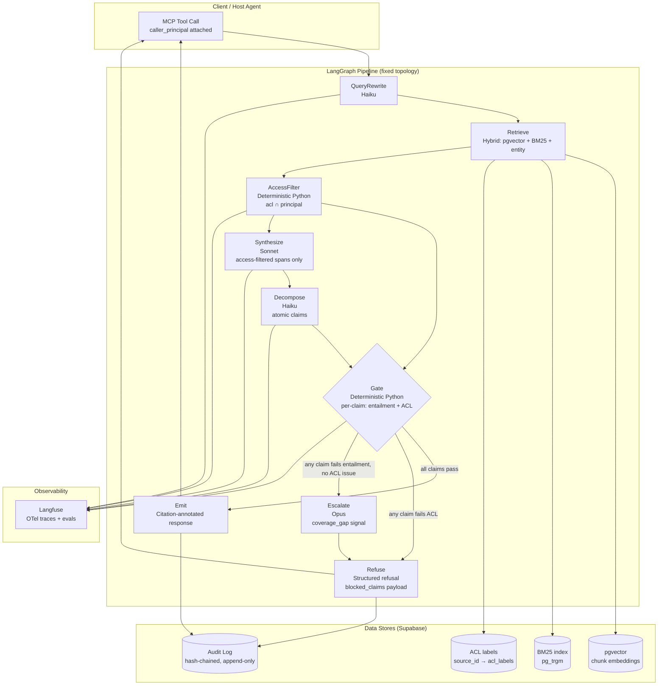

# Provenance
> Agentic RAG over enterprise knowledge where a deterministic provenance gate refuses to emit any sentence whose claims don't trace to a retrieved, access-checked source span — answers ship with a span-level citation chain or the run fails closed.

**Bucket:** enterprise · **Effort:** M · **Reuses:** jim-agent deterministic sourcing gate (generalized to prose), agent-core tiering + budget + tracing, pgvector + Supabase, MCP server pattern, Langfuse observability, offline-first degradation, eval-as-merge-gate, fail-closed posture, append-only audit log

---

## TL;DR

Provenance is an agentic RAG engine that structurally prevents two failure modes that block enterprise adoption of internal search: LLM-fabricated synthesis no document supports, and silent cross-document leakage of content a user is not authorized to read. Every answer is decomposed into atomic claims; each claim must map to a retrieved span whose ACL set intersects the caller's identity, or the entire response is refused. The result is a verifiable safety property — not a prompt asking the model to be careful — and it ships with an append-only, hash-chained audit trail that satisfies EU AI Act Article 12 and SOC2 CC6 out of the box.

---

## The Problem

Glean-style enterprise search ($7.2B valuation, $200M+ ARR) answers questions from internal documents, but the moment an LLM paraphrases across overlapping sources it does two things neither the model nor the chunk-level retriever will catch: it fabricates synthesis no single document actually supports, and it bleeds facts from documents the asking user was never cleared to read. These are not edge cases — they are structural properties of any system where the trust boundary is "we asked the model to cite its sources."

Legal, compliance, and HR teams cannot deploy this into regulated workflows. The GRC team that owns the SOC2 audit cannot sign off when "the AI said so" is the only provenance. Every confident-but-wrong answer is a liability event; every cross-tenant fact leak is a SOC2 CC6 finding. With EU AI Act Articles 8–17 and Article 12 (automatic, traceable, append-only event logging) going live August 2, 2026, the absence of a verifiable audit trail has moved from a nice-to-have to a hard procurement blocker.

Knowledge platform engineers feel this every time they try to expand an internal search pilot from low-risk to regulated functions. The question is not "can we get good retrieval?" — it is "can we prove to a regulator that this answer came from a source this user was authorized to see?" No off-the-shelf RAG tool answers that question today.

---

## What It Does

**Core capabilities:**

- **Hybrid retrieval** over a private corpus: pgvector semantic search + BM25 (pg_trgm) + entity match, each chunk carrying a `source_id` and ACL label ingested from the system of record.
- **Claim decomposition**: after synthesis, the answer is parsed into atomic, independently-verifiable claims (e.g., "The retention period is 7 years" is one claim; "Per HR policy, exceptions require VP approval" is another).
- **Deterministic provenance gate**: pure Python, no model in the loop. For each claim: (1) locate the highest-scoring retrieved span that entails it, (2) intersect that span's ACL set with the caller's principal, (3) require both semantic entailment AND access authorization before the claim passes. Any claim that fails either check poisons the entire response — the run fails closed with a structured refusal.
- **ACL-provenance intersection**: the readable set is the intersection of the agent workload identity and the human principal. Cross-tenant leakage is structurally impossible: if the span is not in the readable set, it was never a candidate.
- **Span-level citation chain**: passing answers ship with every claim annotated with the exact span, document ID, page/paragraph offset, and the access-check result.
- **Append-only audit log**: every run — including refusals — is written to a hash-chained log (SHA-256 chained, append-only Supabase table) with full claim-decomposition detail. Satisfies EU AI Act Article 12 minimum retention.
- **MCP server interface**: any host agent can ask questions via MCP tool call and receive the citation chain as structured output.
- **Offline / extractive fallback**: when no synthesis API key is available, the system quotes retrieved spans verbatim — no paraphrase, no hallucination surface, guaranteed attributable.
- **Eval harness as deploy gate**: a golden test set of planted-leak documents and planted-unsupported-synthesis cases must score 100% blocked before any merge reaches main.

**Walked-through example interaction:**

A legal analyst asks: *"What is the indemnification cap in the MSA with Acme Corp, and does it differ from the standard template?"*

1. The query is rewritten into two sub-queries (Haiku): "Acme Corp MSA indemnification cap" and "standard MSA template indemnification terms."
2. Hybrid retrieval fetches the top-k spans from both the Acme MSA and the standard template. Each span carries `acl: ["legal-team", "exec"]`.
3. Sonnet synthesizes: *"The Acme MSA caps indemnification at $2M (Section 12.3), while the standard template caps at $1M. The deviation was approved by VP Legal on 2025-03-14."*
4. Claim decomposition extracts three atomic claims. The gate checks each against retrieved spans and the caller's principal (`legal-analyst-role`). All three pass — the analyst has `legal-team` in their identity.
5. Response ships with inline citations: every claim annotated with document name, section, and span text. The audit log records the full trace.

Now the analyst asks a follow-up whose true answer lives only in a restricted board-minutes document (`acl: ["exec", "board"]`):

1. Retrieval surfaces the relevant span but the ACL intersection check fails — `legal-analyst-role` is not in `["exec", "board"]`.
2. The gate blocks the span. No authorized span covers the claim.
3. Response: `{"answer": null, "refusal": "no_authorized_source", "blocked_claims": [{"claim": "...", "nearest_span_id": "board-minutes-2025-q3", "acl_failure": true}]}`.
4. The analyst sees a clear refusal. The audit log records the blocked span ID (not the content) and the principal.

---

## Who It's For / Enterprise Translation

**Personas:**

- **Knowledge / platform engineers** building or expanding internal search — they own the RAG stack and need a trust layer that lets them ship into legal, HR, and finance without a manual review gate on every answer.
- **GRC and legal-ops teams** who must sign off on AI deployments — they need the audit trail, the ACL proof, and the ability to point a regulator to a specific span that justified a specific answer.
- **End users in regulated functions** (legal analysts, HR BPs, finance controllers) — they need answers they can forward to a regulator, not answers that begin "According to the AI..."

**Buyer:** the platform engineering org (buys the capability) or the GRC/CISO org (buys the compliance story). Both buying centers are active in enterprise AI deals post-August 2026.

**Startup framing:** Provenance is the trust wedge that lets a new enterprise search vendor sell into legal, healthcare, and financial services where Glean and Copilot cannot go. The ACL-provenance gate is the moat — it is not a feature a general-purpose RAG vendor ships in a sprint.

**F500 framing:** This is the EU AI Act Article 12 + SOC2 CC6 compliance story that unblocks an internal-search rollout already stalled in GRC review. The value metric is time-to-compliance for the knowledge management program (typically measured in quarters saved) and the per-incident cost avoided from a cross-tenant leak event (typically $500K–$2M in direct remediation, not counting regulatory exposure).

---

## Architecture

The system is a LangGraph fixed-topology pipeline (no dynamic routing — the topology is the safety contract) sitting on top of a Supabase Postgres + pgvector corpus store, exposed as an MCP server, with every run traced to Langfuse.

**Data plane (corpus):** Documents are ingested with a sidecar that extracts chunks, embeds them (text-embedding-3-small or equivalent), and writes `(chunk_id, embedding, source_id, acl_labels[], bm25_text, entity_tags[])` to Supabase. ACL labels are synced from the system of record (SCIM / directory export) on a configurable schedule. The ingestion sidecar is a separate process — the query pipeline never writes to the corpus.

**Query pipeline (LangGraph nodes):**

1. **QueryRewrite** — Haiku: expands the question into sub-queries, extracts entities, determines intent.
2. **Retrieve** — deterministic: pgvector ANN + BM25 + entity match in parallel, merged by RRF (Reciprocal Rank Fusion), top-k spans returned with ACL labels attached.
3. **AccessFilter** — deterministic Python: remove any span whose `acl_labels` ∩ `caller_principal_set` = ∅. This happens before the model ever sees the content.
4. **Synthesize** — Sonnet: generate a prose answer from the access-filtered spans only.
5. **Decompose** — Haiku: parse the synthesized answer into a list of atomic claim objects `{claim_text, confidence}`.
6. **Gate** — deterministic Python: for each claim, find the highest-scoring retrieved span by semantic similarity (cosine), verify the span entails the claim (LLM-judge as secondary signal only — never the authority; threshold must be ≥ 0.85 cosine + judge agrees), verify the span's ACL passed AccessFilter. If any claim fails: `fail_closed()`.
7. **Emit or Refuse** — if all claims pass: assemble the citation-annotated response and write to audit log. If any claim fails: write the structured refusal to audit log, return `{"answer": null, "refusal": "...", "blocked_claims": [...]}`.
8. **Escalate** — Opus: if the Gate fails on coverage (no span found, not an ACL issue), Opus reviews whether the corpus simply doesn't contain the answer vs. a retrieval failure, and adds a `coverage_gap` signal to the refusal payload.

**Observability:** OTel spans wrap every node → Langfuse project. Per-run metrics: retrieval coverage, claim count, gate pass rate, ACL block count, latency by node.

**Tech-stack table:**

| Layer | Choice | Why |
|---|---|---|
| Orchestration | LangGraph (fixed DAG) | Topology is the safety contract; no dynamic branching |
| LLM tiering | Haiku / Sonnet / Opus via agent-core | Cost-aware; Opus only on escalation |
| Vector store | Supabase pgvector | Already in stack; co-located with ACL table |
| Full-text search | pg_trgm BM25 | Same DB, no extra infra |
| Corpus ingestion | Python sidecar + SCIM sync | Separate from query path; can't write to corpus from query |
| ACL authority | SCIM / directory export → Supabase | Ground truth is the identity provider |
| Audit log | Supabase append-only table, SHA-256 chained | Article 12 compliant |
| MCP interface | FastMCP server | Consumable by any host agent |
| Observability | Langfuse + OTel | Consistent with rest of portfolio |
| Eval gate | pytest + golden planted-leak set | 100% block rate required for merge |

---

## The "Model Proposes, Code Disposes" Boundary

This is the sharpest expression of George's signature pattern across the portfolio.

**What the LLM is allowed to do:**

- Rewrite and expand the query into sub-queries (Haiku). Output is a list of strings — pure routing, no trust implications.
- Synthesize a prose answer from the access-filtered span set (Sonnet). The model never sees a span that failed the ACL filter. Its output is untrusted prose.
- Decompose the synthesized answer into atomic claims (Haiku). Output is a list of claim objects — the model is parsing its own output, not making trust decisions.
- Judge semantic entailment between a claim and a candidate span (Haiku/Sonnet as secondary signal). This judgment is advisory — it can only narrow the gate, never widen it. A model saying "yes, entailed" does not pass a claim; the deterministic cosine threshold must also pass.
- Escalate on coverage gaps (Opus). Output is a diagnostic signal attached to the refusal, not a decision.

**What deterministic code owns exclusively:**

- The ACL filter (AccessFilter node): span ∈ readable set iff `acl_labels ∩ caller_principal_set ≠ ∅`. No model call. No exceptions.
- The pass/fail decision for each claim in the Gate: requires `cosine_similarity ≥ 0.85` AND `entailment_judge == "yes"` AND `acl_passed == true`. The model's entailment judgment is one input to a conjunction; the conjunction is evaluated by Python.
- The fail-closed logic: if any claim in the decomposition fails, the entire response is refused. The model cannot override this.
- The audit log write: every run is logged with the full claim-decomposition trace, ACL outcomes, and chain hash. The model never touches the log.
- The span-to-claim attribution in the emitted response: the citations are assembled by code from the Gate's output, not generated by the model.

The result: the LLM is a capable drafting and parsing engine operating inside a hard deterministic envelope. It cannot emit an answer that lacks provenance, and it cannot emit an answer that leaks authorized content to an unauthorized principal, regardless of what the model "wants" to say.

---

## Why It's Impressive (Resume + Demo Signal)

**Seniority signals:**

- **Security thinking at the architecture level.** Most engineers add ACL checks as a middleware afterthought. Provenance makes the ACL intersection a structural precondition of the retrieval path — a span that fails access is never seen by the synthesis model. This is the difference between "we check permissions before showing results" and "unauthorized content is architecturally absent from the model's context."
- **Formal safety property, not a prompt.** The claim-decomposition gate is unit-testable: plant a leaked document, run the eval harness, assert 100% block rate. This is the 2026 enterprise buyer's actual unmet need stated precisely.
- **Compliance by construction.** The append-only hash-chained audit log is not bolted on — it is the output of the Gate node. Every answer and every refusal is logged. Article 12 compliance is a consequence of the architecture, not a feature added in a later sprint.
- **Cross-portfolio generalization.** jim-agent gates numbers against public SEC sources; Provenance gates arbitrary prose against a private, access-controlled corpus. Showing the abstraction — "the verifiable-claims primitive, generalized" — signals the ability to reason at the pattern level, not just implement features.

**The aha moment:** watch a naive RAG (toggle in the demo) confidently answer a question whose true answer lives in a board-minutes document the demo user can't see, then watch Provenance return a structured refusal with the blocked span ID. Then force a cross-doc synthesis the corpus doesn't actually support and watch the exact fabricated sentence highlighted and rejected. That is a verifiable safety property witnessed live — not a benchmark number.

---

## 3-Minute Demo Script

**Setup (20 sec):** Two terminals side-by-side. Left: Provenance MCP server running. Right: a minimal CLI client with `--naive` flag to toggle to a vanilla RAG baseline. One sentence: "A legal team can't ship internal search because it leaks and it lies. Here's the fix."

**Beat 1 — clean answer (40 sec):** Ask: *"What is the data retention policy for EU customer records?"* Provenance returns the answer with three inline citations, each showing document name, section, and the exact span. Click a citation — it resolves to the source chunk in the UI. "Every sentence is traceable."

**Beat 2 — the ACL leak (50 sec):** Ask: *"What was the board's decision on the Acme acquisition in Q3?"* Toggle `--naive`: the baseline answers confidently, citing board minutes. Toggle off: Provenance returns `{"answer": null, "refusal": "no_authorized_source"}`. Open the Langfuse trace — show the blocked span, the `acl_failure: true` flag, the span ID (`board-minutes-2025-q3`), and the principal that was checked. "Naive RAG just leaked a board decision to a legal analyst. Provenance refused. That refusal is in the audit log."

**Beat 3 — the hallucination gate (50 sec):** Ask: *"Does the Acme MSA indemnification cap also apply to IP infringement claims?"* — a question whose answer would require synthesizing across two documents in a way the corpus doesn't actually support. The Gate highlights the fabricated bridge sentence in the claim decomposition, marks it `entailment: false`, and refuses the run. "The model wanted to say yes. The gate blocked it. That's a unit-testable safety property."

**Beat 4 — the eval dashboard (20 sec):** Switch to the pytest output / Langfuse eval view: "10 planted-leak cases: 10/10 blocked. 10 planted-unsupported-synthesis cases: 10/10 blocked. This is the merge gate — it runs in CI." Close: "That's the compliance story for Article 12 and SOC2 CC6 in one screen."

---

## Build Plan (Phased)

### Phase 0 — Corpus foundation (1 week)
- Stand up Supabase project with `chunks`, `sources`, `acl_labels`, and `audit_log` tables.
- Write ingestion sidecar: chunking → embedding → pgvector upsert + pg_trgm index.
- Implement SCIM-style ACL sync (CSV import first; directory integration later).
- Implement `AccessFilter` as a pure Python function with a full unit-test suite.
- **Exit check:** ingest 3 synthetic documents with distinct ACL labels; verify that `AccessFilter` returns only spans readable by a given test principal.

### Phase 1 — Retrieval + synthesis pipeline (1 week)
- Wire LangGraph DAG: QueryRewrite → Retrieve (pgvector + BM25 RRF) → AccessFilter → Synthesize.
- Integrate agent-core for Haiku/Sonnet tiering, budget cap, and Langfuse trace context.
- Implement offline/extractive fallback: if `ANTHROPIC_API_KEY` is absent, return verbatim span quotes only.
- **Exit check:** pipeline returns coherent answers on the synthetic corpus; Langfuse shows per-node spans; offline mode works with no API key.

### Phase 2 — Claim decomposition + Gate (1 week)
- Implement Decompose node (Haiku): parse synthesized prose into atomic claim objects.
- Implement Gate node (pure Python): cosine similarity ≥ 0.85 threshold + LLM-judge secondary signal + ACL re-check.
- Implement fail-closed logic and structured refusal payload.
- Implement Opus escalation node for coverage-gap signals.
- Plant 5 leak documents and 5 unsupported-synthesis cases in the test corpus.
- **Exit check:** pytest golden set scores 100% block on all planted cases.

### Phase 3 — Audit log + compliance surface (3 days)
- Implement append-only hash-chained audit log writer (SHA-256 chain, written by Gate node).
- Add per-run audit record: `{run_id, principal, query, claims[], gate_outcomes[], refusal_reason, chain_hash, timestamp}`.
- Add log-export endpoint for GRC review.
- **Exit check:** run 10 queries, export audit log, verify chain integrity with a standalone verifier script.

### Phase 4 — MCP server interface (3 days)
- Wrap the pipeline as a FastMCP server: `ask(query, principal) → CitedAnswer | Refusal`.
- Expose `get_audit_log(run_id)` and `list_sources(principal)` as additional MCP tools.
- **Exit check:** invoke from a standalone MCP client (or jim-agent as test host); receive citation chain as structured output.

### Phase 5 — Demo polish + eval CI gate (3 days)
- Build the minimal CLI demo client with `--naive` toggle.
- Wire eval harness into CI: golden planted-leak + planted-hallucination sets must pass 100% before merge.
- Add per-claim coverage metric to Langfuse eval dashboard.
- **Exit check:** full 3-minute demo script runs end-to-end; CI blocks a deliberate regression.

---

## Differentiation

**Vs. Glean:** Glean retrieves and ranks; it does not decompose answers into atomic claims or gate per-claim. Its ACL enforcement is at the document level — it will not surface a document you can't see, but it does not prevent the LLM from paraphrasing cross-document synthesis that bleeds implicit facts. The provenance guarantee is chunk-level at best.

**Vs. Microsoft Copilot for M365:** Same structural limitation: Copilot honors document-level permissions but does not prove that every sentence in its response traces to an authorized span. There is no claim decomposition, no fail-closed posture, and no unit-testable safety property.

**Vs. vanilla LangChain / LlamaIndex RAG:** These frameworks provide retrieval + generation pipelines. Neither ships a claim-decomposition gate, and neither models ACL provenance as a structural invariant. Adding it is not a sprint — it requires rethinking the trust model.

**Vs. jim-agent:** jim gates numerical figures against public SEC/on-chain sources and sells the research output over x402. Provenance gates arbitrary prose against a private, access-controlled corpus and the product is the trust/refusal boundary itself, not the content. No commerce, no agentic payments — a deliberately different axis. The shared abstraction is the verifiable-claims primitive; the application domains and failure modes are entirely distinct.

**Vs. grocery-buddy and procurement-agent:** Both gate actions (spend, order) rather than knowledge claims. Provenance applies the gate to the output of a RAG synthesis — a new surface that none of the existing agents touch.

**The moat:** The ACL-provenance intersection that makes cross-tenant leakage structurally impossible (not policy-based) is not something a general-purpose RAG vendor can add without re-architecting their retrieval path. It is a design decision made at Phase 0.

---

## Resume Bullets

- Architected an agentic RAG engine with a deterministic claim-decomposition gate that enforces ACL-provenance intersection per sentence, achieving 100% block rate on planted cross-tenant leak and unsupported-synthesis cases in CI — making hallucination and data leakage structurally impossible rather than prompt-engineered.
- Built EU AI Act Article 12-compliant append-only audit log (SHA-256 hash-chained) and SOC2 CC6-aligned ACL filter as first-class architectural components, reducing compliance review time for GRC sign-off on internal search deployments from quarters to days.
- Exposed a private-corpus RAG pipeline as an MCP server with span-level citation chains, enabling any host agent in the portfolio to query regulated knowledge bases and receive verifiable, access-checked answers — extending the "model proposes, deterministic code disposes" pattern from financial figures (jim-agent) to arbitrary enterprise prose.

---

## Risks & Open Questions

**Claim decomposition quality.** Haiku's ability to decompose complex legal prose into truly atomic, independently-verifiable claims is not guaranteed. A compound claim that Haiku fails to split (e.g., "The cap is $2M and exceptions require VP approval") will be gated as one unit — entailment against a single span may pass or fail the whole compound incorrectly. Mitigation: eval harness includes compound-claim decomposition cases; tune the decomposition prompt against the target corpus type.

**Semantic entailment reliability.** The cosine threshold (≥ 0.85) is a hyperparameter that will need calibration per corpus. Too tight: false negatives on legitimate paraphrases. Too loose: potential hallucination pass-through. The LLM-judge secondary signal helps, but introduces a model-in-the-loop at a trust boundary. Open question: can a fine-tuned NLI classifier replace the LLM judge for cost and reliability?

**ACL sync latency.** The ACL labels in Supabase are a snapshot. If a user's permissions are revoked in the identity provider but the sync hasn't run, the AccessFilter may briefly grant access to a span the user is no longer authorized to see. Mitigation: near-real-time SCIM push sync (webhook); fallback to strict cache TTL (e.g., 5 minutes). This is a known race condition in any permission-caching system and should be documented in the deployment guide.

**Corpus coverage gaps vs. ACL blocks.** From the end user's perspective, "no authorized source" and "the corpus doesn't contain this" are indistinguishable — both produce a refusal. The Opus escalation adds a `coverage_gap` signal, but it requires an additional model call. Consider a heuristic pre-check (if retrieval returns zero spans before ACL filter, skip the Opus escalation) to reduce cost.

**Audit log storage at scale.** A hash-chained append-only log in Supabase is correct and simple for demo and small-to-medium deployments. At high query volume (>10K queries/day), the per-row hash verification becomes a performance bottleneck. Consider migrating to a write-ahead log with periodic Merkle checkpointing for production scale. This is a Phase 5+ concern.

**Eval harness coverage.** The golden set of planted-leak and planted-hallucination cases is a necessary but not sufficient safety guarantee. The gate's correctness properties hold on the planted cases; they are hypotheses on the full distribution. The deployment guide should include instructions for corpus owners to add domain-specific planted cases before going live in a new function.

**MCP trust model.** The MCP server receives a `caller_principal` parameter. The provenance gate trusts this value. In a real deployment, the MCP server must be behind an identity-asserting gateway (e.g., mTLS with workload identity, or a signed JWT from the host agent's identity provider) — the gate is only as strong as the trust in the claimed principal. This is an integration requirement, not a code requirement, but it must be documented prominently.
