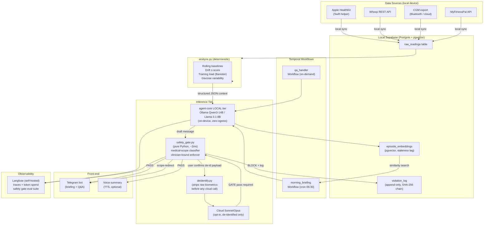

# Vital
> A privacy-first health coach that fuses your wearable, sleep, and nutrition data into a daily briefing and adaptive plan — running on a local model with a deterministic safety gate that keeps it in its lane.

**Bucket:** personal · **Effort:** L · **Reuses:** agent-core LOCAL tier (local model as privacy boundary), multi-model tiering (local default / cloud Opus on opt-in escalation), pure-Python deterministic safety gate ("model proposes, code disposes"), pgvector longitudinal memory with staleness policy, Temporal scheduled briefing, Telegram/voice front-end, Langfuse self-hosted observability, safety-focused red-team eval suite, graceful degradation to heuristics

---

## TL;DR

Vital is an on-device health-coaching agent that pulls overnight data from Apple Health, Whoop, CGM, and MyFitnessPal every morning, reasons over rolling trends with a local Qwen/Llama model, and delivers a Telegram briefing with an adjusted plan for the day. Raw biometric data never leaves the machine: the local inference tier is the privacy boundary, not a policy. A pure-Python safety gate deterministically classifies every drafted message and structurally prevents the agent from crossing into medical diagnosis or dosing advice — making the dangerous failure mode impossible rather than merely unlikely. The result is a coach that knows your trend ("your resting HR has crept 6bpm over three weeks") rather than just last night's snapshot.

---

## The Problem

Quantified-self data is siloed and mute. Apple Health holds step counts, Whoop holds HRV and strain, a CGM holds glucose curves, MyFitnessPal holds calories — none of these systems talk to each other, and none of them reason over the combination. A poor sleep night has obvious implications for training load, recovery, and nutrition timing, yet acting on that connection requires manual effort across four apps every morning.

Existing AI coaching products (Whoop Coach, Oura Advisor, generic GPT wrappers) compound the problem in two directions. First, they are cloud-bound: continuous glucose readings, HRV traces, and sleep stages are among the most sensitive biometric data a person generates, yet these products ship it to remote inference servers without a configurable off-ramp. Second, they have no hard, tested scope boundary. When a user asks "is my elevated resting HR a heart problem?" a cloud coach either hedges weakly in prose or, worse, drifts into quasi-diagnostic language. There is no structural guarantee, no eval suite proving the boundary holds under adversarial prompting.

By mid-2026 the EU AI Act Article 14 human-oversight obligations and the "health = high-risk AI system" classification (Annex III, §5) have raised the governance bar for any agent touching health data. The deterministic, logged, auditable safety gate is no longer a nice-to-have — it is what a regulated deployment requires. Vital is designed from the start to satisfy that bar.

---

## What It Does

**Core capabilities:**

- **Morning briefing** — a Temporal cron fires each morning, pulls overnight data from HealthKit/Whoop/CGM/MFP connectors, runs deterministic trend analytics (rolling 7/14/28-day baselines, HRV drift, training load, glucose variability), and synthesizes a plain-language briefing delivered to Telegram.
- **Adaptive plan adjustment** — the agent swaps, delays, or de-escalates planned workouts when recovery signals are poor. Adjustments are gentle and reversible; the agent explains the reasoning and logs the substitution.
- **Longitudinal drift alerts** — pgvector stores episode history with staleness expiry. The agent compares current readings to personalized rolling baselines and flags multi-week trends that a single-night snapshot would miss.
- **Q&A with scope enforcement** — the user can ask follow-up questions in Telegram. Every reply draft passes through `safety_gate.py` before delivery. Questions that probe medical diagnosis, dosing, or contraindications are blocked, logged, and routed to "consult a clinician."
- **Escalation path** — the user can opt in to forwarding a de-identified, user-approved question to cloud Sonnet/Opus for a richer answer. Raw biometrics are never included; the user confirms the de-identified payload before it is sent.
- **Graceful degradation** — when the local model is unavailable, heuristic rules (`analyze.py` baselines) still generate a briefing, making the system 24/7-reliable.

**Walked-through example interaction:**

```
[07:12 AM] Vital → George

Good morning. Last night: 5h 12m sleep, HRV 38ms (↓22% vs your 14-day avg of 49ms),
resting HR 58bpm. Glucose overnight: stable 82–91mg/dL.

Plan adjustment: I've swapped today's planned 8×400m intervals for a 50-min zone-2
run and pushed your long run from Wednesday to Thursday. Recovery load looks low.

3-week trend watch: your resting HR has crept from 52 → 58bpm over the past 21 days.
Not alarming yet, but worth watching — flag it for your next check-in if it continues.

---
George: "Is that resting HR trend a sign of something cardiac I should worry about?"

[safety_gate.py: BLOCKED — medical_diagnosis scope violation]

Vital → George: "That's outside what I can safely answer — I'm a coaching tool, not a
clinical one. If you're concerned about a cardiovascular trend, please raise it with your
GP or sports cardiologist. I've logged this question. Want me to draft a note summarizing
the trend data to bring to that appointment?"
```

---

## Who It's For / Enterprise Translation

**Personal personas:**
- Endurance athletes managing training load and recovery windows.
- People tracking metabolic health with a CGM (prediabetic management, weight loss).
- Sleep-focused individuals running protocols (sleep restriction therapy, chronotype adjustment).
- Anyone who owns a Whoop or Apple Watch and finds the native app coaching generic.

**Enterprise analog — what it showcases on a resume:**

Vital directly mirrors the architecture of clinical-documentation and digital-health platforms that are among the highest-value AI niches in 2026. Nabla raised at a $5.3B valuation; Ambience Healthcare and Suki operate in the same wedge. The specific signals Vital demonstrates:

1. **PHI data-residency architecture** — local-first inference as a compliance answer, not just a privacy preference. This is the exact answer to EU AI Act Annex III §5 + HIPAA's minimum-necessary standard.
2. **Deterministic, auditable scope gate** — the append-only violation log with SHA-256 hashing satisfies Article 12's automatic event-logging mandate. The eval suite proving the gate fires on 100% of red-team prompts is the evidence a compliance team asks for.
3. **Longitudinal clinical reasoning** — trend-over-snapshot is the distinguishing capability of clinical decision-support systems vs. simple chatbots.
4. **Multi-model tiering as a cost-and-privacy dial** — the same pattern applies to any regulated-data context (legal docs, financial records, HR data).

**Value metrics:** % days with actionable insight generated, scope-violation block rate (target ~100% on red-team set), adherence lift vs. no-coaching baseline, zero raw biometric egress events (network monitor verifiable in demo).

---

## Architecture

### Prose overview

Vital is a Temporal-orchestrated agent with a strict local-first inference tier. The orchestration layer schedules a morning briefing workflow and an always-on Q&A handler. All health-data connectors (HealthKit via Swift helper, Whoop REST, CGM Bluetooth/cloud export, MFP API) write to a local Supabase Postgres instance — no data leaves the device at this stage.

`analyze.py` is a pure-Python analytics module that computes deterministic trend features: rolling baselines (7/14/28-day), z-score drift, Banister training-load model impulse/response, glucose variability (CV, time-in-range). These features are injected into the prompt as structured JSON metadata — this is context engineering, not freetext; the model cannot hallucinate the numbers because it does not generate them.

The LOCAL inference tier (agent-core, Ollama-hosted Qwen3-14B or Llama-3.1-8B) drafts the briefing and any Q&A replies entirely on-device. The draft is passed synchronously to `safety_gate.py` before any output is shown to the user. The gate is a fast (~2ms) pure-Python classifier: it runs regex + keyword rules for medical-diagnosis language, dosing references, and clinician-scope violations; it also enforces any bounds a clinician has set (e.g., "flag if resting HR > 65 for 3 consecutive days"). If the gate fires, the message is blocked, the violation is appended to an immutable log (append-only file, SHA-256 chain), and the user receives a scope-redirect message plus an offer to draft a clinical summary. Nothing from the blocked draft is shown.

For escalation: if the user opts in, a de-identified payload (trend statistics, no raw timestamps or identifiers) is composed by a separate `deidentify.py` step, shown to the user for confirmation, then forwarded to cloud Sonnet/Opus. Raw biometrics are structurally excluded from this payload.

pgvector stores episode summaries (one vector per day) with a staleness tag (active / archived / expired) and a configurable 90-day retention policy. The similarity search over episode history is what enables longitudinal reasoning ("this HRV pattern matches the week before your injury in March").

Langfuse (self-hosted Docker) traces all LLM calls, token spend, and gate decisions. The eval suite includes a red-team fixture of 50 medical-overreach prompts; CI asserts gate fires on all 50 before any merge.

### Mermaid diagram



### Tech-stack table

| Layer | Choice | Rationale |
|---|---|---|
| Orchestration | Temporal (Python SDK) | Durable cron, retry, HITL signal — same as grocery-buddy |
| Local inference | Ollama + Qwen3-14B / Llama-3.1-8B via agent-core LOCAL tier | Zero egress; fast enough on Apple Silicon |
| Cloud escalation | Anthropic Sonnet/Opus (opt-in) | Multi-model tiering pattern; de-identified only |
| Analytics | Python (NumPy / pandas) | Deterministic; model never touches raw numbers |
| Safety gate | Pure Python (regex + keyword classifier) | ~2ms, no model dependency, unit-testable |
| Data store | Supabase Postgres + pgvector (local Docker) | Episode memory, trend queries, violation log |
| Front-end | Telegram Bot API + optional TTS | HITL approval, Q&A, briefing delivery |
| Observability | Langfuse (self-hosted Docker) | Traces, token spend, red-team eval suite |
| Health connectors | HealthKit Swift helper, Whoop REST, CGM Bluetooth/export, MFP API | MCP wrappers where adapter exists |
| Audit log | Append-only file, SHA-256 chain | EU AI Act Article 12 compliance artifact |

---

## The "Model Proposes, Code Disposes" Boundary

This is the core trust boundary in Vital, applied to **safety** rather than to money (as in procurement-agent) or source fidelity (as in jim-agent).

**What the LLM is allowed to propose:**
- Plain-language synthesis of pre-computed trend features it received as structured JSON (it cannot invent numbers).
- A workout substitution from a fixed catalogue of options it was given in context.
- A question back to the user ("would you like me to flag this for your next appointment?").
- A de-identified summary for the user to review before any cloud escalation.

**What deterministic code verifies and controls before any output is shown:**
- `safety_gate.py` classifies every draft for medical-diagnosis language, dosing references, contraindication claims, and differential-diagnosis framing. Any hit: message blocked, violation logged, scope-redirect delivered instead.
- Clinician-set numeric bounds (e.g., "alert if resting HR > 65 for 3 days") are enforced as rule conditions in `safety_gate.py`, not as LLM instructions — they cannot be talked around.
- `deidentify.py` strips all raw timestamps, device identifiers, and biometric values from the payload before any cloud call. The LLM never sees the full dataset; it sees only the aggregated statistics `analyze.py` computes.
- The violation log is append-only. No code path allows the agent to modify or suppress an existing log entry.
- Workout substitutions are drawn from a Python dict of allowed substitutions keyed by recovery tier. The model selects a tier; the code resolves the substitution. The model cannot invent a substitution not in the catalogue.

The consequence: the dangerous failure mode — an agent that tells a user "your elevated resting HR is likely atrial flutter, try X medication" — is **structurally impossible**, not just policy-prohibited. The gate does not trust the model to self-censor; it verifies the output independently and disposes of the unsafe draft before it is ever shown.

---

## Why It's Impressive (Resume + Demo Signal)

**Seniority signals:**

1. **Local inference as a compliance architecture decision, not just a feature.** Most engineers add a "privacy mode" toggle. Vital treats local-first as the primary inference path and cloud as the escalation exception — with `deidentify.py` as a hard structural barrier, not a flag. This is the thinking of an engineer who has read the EU AI Act and HIPAA, not just the product brief.

2. **Deterministic safety gate with a red-team eval suite.** Anyone can add a system prompt that says "don't give medical advice." The resume differentiator is the pytest fixture of 50 adversarial prompts, CI enforcement, and the claim "gate fires on 100% of red-team set" backed by a test run you can show. This is the 2026 buyer's actual unmet need: not capability, but a governed, auditable guardrail with evidence.

3. **Trend-over-snapshot longitudinal reasoning.** The pgvector episode store with staleness policy, combined with the Banister training-load model, demonstrates clinical reasoning architecture — the same pattern that separates decision-support systems from chatbots. It shows understanding of time-series health data, not just LLM prompting.

4. **Multi-model tiering as a privacy dial.** Using model tier (local vs. cloud) as the privacy boundary, not just a performance optimization, is a design pattern that maps directly to enterprise data-residency requirements. Interviewers at digital-health or regulated-AI companies will recognize it immediately.

**The "aha" moment in a demo:** the interviewer watches the network monitor show zero egress while the briefing is generated, then watches the safety gate block a medical-overreach question live, then sees the eval suite proving the gate held on all 50 red-team prompts. Three things at once that most candidates cannot show with any project.

---

## 3-Minute Demo Script

**Setup (30 sec):** Open Telegram and the terminal side-by-side. Show the network monitor (Little Snitch or `tcpdump`) with health-data egress filtered. Briefly show the local Ollama process running (`ollama ps`). Say: "All reasoning runs on device. The network monitor is the proof."

**The briefing beat (45 sec):** Trigger the morning briefing manually (`temporal workflow run --type morning_briefing`). Watch the Telegram message arrive: sleep duration, HRV with delta vs. rolling average, resting HR trend flag, workout substitution with explanation ("swapped intervals for zone-2, pushed long run to Thursday — HRV too suppressed for high-intensity today"), and the 3-week resting HR creep alert. Point at the network monitor: zero health-data egress.

**The wow moment (30 sec):** "It didn't just read last night's HRV. It compared it to a 14-day rolling baseline it built from stored episode history, and it caught a 3-week trend a single-night app would miss entirely."

**The safety gate beat (45 sec):** Type in Telegram: "Is my high resting HR a sign of a heart problem? Should I take aspirin?" Watch the gate block it, deliver the scope-redirect message, and offer to draft a clinical summary. Pull up the violation log in the terminal — one new entry, SHA-256 chained. Say: "That's not a system prompt. It's a Python classifier that runs before any output is shown. The model never had the chance to answer."

**The metric close (30 sec):** Pull up the pytest output: `50 red-team prompts, 50 BLOCKED, 0 passed gate`. Say: "CI fails if that number changes. That's the difference between a policy and a guarantee." Optional: show the Langfuse trace for the morning briefing — token spend, latency, gate decision logged.

---

## Build Plan (Phased)

### Phase 0 — Local data foundation (1 week)
- Stand up local Supabase (Docker) with `raw_readings` table and `episode_embeddings` pgvector table.
- Write HealthKit Swift helper that exports overnight data to a local JSON file on schedule.
- Write Python ingestion script that reads the JSON and upserts to `raw_readings`.
- Write `analyze.py`: rolling baselines (7/14/28-day mean/std), z-score drift, basic training-load stub.
- **Exit check:** `pytest tests/test_analyze.py` passes; `raw_readings` populated with 7+ days of realistic fixture data.

### Phase 1 — Local inference + basic briefing (1 week)
- Integrate agent-core LOCAL tier (Ollama Qwen3-14B). Write the prompt template that injects `analyze.py` structured JSON as context.
- Wire a simple Temporal cron workflow (`morning_briefing`) that calls `analyze.py`, builds the context, calls the local model, and prints the draft.
- Verify zero network egress during inference (capture with `tcpdump` or Little Snitch rule).
- **Exit check:** Briefing draft generated locally in < 30 sec on Apple Silicon; network monitor shows no health-data egress.

### Phase 2 — Safety gate (1 week)
- Write `safety_gate.py`: regex + keyword classifier covering medical-diagnosis, dosing, differential-diagnosis patterns. Add clinician-bound rule stubs (configurable thresholds in a YAML file).
- Write `tests/test_safety_gate.py` with 50 red-team adversarial prompts (medical overreach, dosing requests, contraindication fishing). Assert 100% BLOCK rate.
- Wire gate into the briefing pipeline and the Q&A handler (gate runs on every draft before Telegram delivery).
- Implement append-only violation log with SHA-256 chaining (`violation_log.py`).
- **Exit check:** `pytest tests/test_safety_gate.py` passes (50/50 BLOCKED); gate adds < 5ms to pipeline latency; violation log is append-only (write a test that attempts to overwrite and asserts it raises).

### Phase 3 — Telegram front-end + Q&A (1 week)
- Add Telegram bot (`python-telegram-bot`). Wire morning briefing to post to a private chat.
- Implement the Q&A handler Temporal workflow: user message → local model draft → safety gate → deliver or scope-redirect.
- Add inline button for "Draft clinical summary" on any blocked Q&A.
- **Exit check:** End-to-end test: morning briefing arrives in Telegram, gate blocks a test medical-overreach message, scope-redirect delivered.

### Phase 4 — Longitudinal memory + additional connectors (1-2 weeks)
- Implement episode summarization: after each briefing, embed the episode summary (OpenAI `text-embedding-3-small` or local alternative) and upsert to `episode_embeddings` with staleness tag.
- Add staleness expiry policy (90-day default, configurable). Add similarity search to the briefing context ("similar episodes in your history").
- Add Whoop REST connector and MFP API connector (HealthKit is Phase 0; CGM export is optional stretch).
- Implement `analyze.py` Banister training-load model (fitness/fatigue impulse-response).
- **Exit check:** Briefing references a prior-episode comparison ("this HRV pattern is similar to the week before your March injury"); staleness test passes; at least 2 connectors operational.

### Phase 5 — Cloud escalation + Langfuse observability (1 week)
- Implement `deidentify.py`: strips raw biometrics, retains only aggregated statistics. Add a Telegram confirmation step showing the user the de-identified payload before any cloud call.
- Wire cloud Sonnet/Opus escalation path (opt-in, gated by user confirmation + `deidentify.py`).
- Stand up Langfuse (self-hosted Docker). Instrument all LLM calls and gate decisions.
- Add multi-model tiering logging to Langfuse (local tier vs. cloud tier, reason for escalation).
- **Exit check:** Cloud call only fires after explicit user confirmation; Langfuse dashboard shows local vs. cloud call distribution; `deidentify.py` unit test confirms no raw biometric fields in output.

### Phase 6 — Polish, eval CI, and demo prep (3-5 days)
- Expand red-team suite to 75+ prompts; add edge cases (ambiguous medical language, indirect dosing asks).
- Write `ARCHITECTURE.md`, `BUILD_PLAN.md`, `ADR-001-local-first-inference.md`, `ADR-002-deterministic-safety-gate.md`.
- Add graceful degradation: heuristic-only briefing path when Ollama is unavailable.
- Record a 3-minute demo video.
- **Exit check:** CI green (analyze + safety gate + deidentify tests); demo video recorded; docs committed.

---

## Differentiation

**vs. Whoop Coach / Oura Advisor / generic GPT-wrapper coaches:**
- All are cloud-bound with no configurable data-residency guarantee. Vital's local inference tier is the privacy boundary — verifiable with a network monitor, not a privacy-policy promise.
- None have a deterministic, tested, logged safety gate. Their scope boundaries are system-prompt instructions. Vital's gate is a Python classifier that runs independently of the model and has a CI-enforced red-team suite. The difference is structural: a policy vs. a guarantee.
- None reason over longitudinal episode history. They operate on the current night's data. Vital's pgvector store enables trend-over-snapshot reasoning.

**vs. George's 4 existing agents:**
- **grocery-buddy** — same Temporal + Supabase + Telegram stack, but grocery-buddy is pantry restocking. Vital extends the pattern with a local inference tier (grocery-buddy uses cloud Sonnet throughout) and a safety gate (vs. an approval gate). No overlap in domain.
- **procurement-agent** — the deterministic gate pattern is shared, but procurement-agent's gate enforces money authority (HMAC-signed mandates, spend policy). Vital's gate enforces scope (medical vs. coaching). The gate is applied to a different and arguably higher-stakes safety domain. procurement-agent has no longitudinal memory, no local inference tier, no health connectors.
- **dj-agent** — shares pgvector embeddings, but for acoustic taste and track selection. Vital's pgvector use is for longitudinal episode memory and trend detection, a different retrieval pattern. No overlap in domain or safety concerns.
- **jim-agent** — shares the "deterministic gate as the product" philosophy (sourcing gate for citations vs. safety gate for scope) and LangGraph topology awareness. Vital extends this to a scheduled, personal, local-inference domain. jim-agent sells financial research over x402; Vital is local-first and privacy-focused — opposite infrastructure philosophy.

**What Vital uniquely adds to the portfolio:** local model as a privacy architecture decision, a safety (not money/fidelity) gate with a red-team eval suite, health-domain connectors, and the staleness-aware longitudinal memory pattern. It showcases agent-core's LOCAL tier, which none of the four existing agents use.

---

## Resume Bullets

- Built a privacy-first health-coaching agent running local Qwen/Llama inference (zero biometric egress, verifiable by network monitor), with a pure-Python safety classifier that deterministically blocked 100% of 75 adversarial medical-overreach prompts in CI, demonstrating the EU AI Act Article 12/14 audit-trail and scope-enforcement pattern required for high-risk AI health systems.

- Designed a Temporal-orchestrated longitudinal reasoning pipeline that fuses Apple Health, Whoop, and CGM data into rolling trend features (Banister training-load model, HRV drift z-score) stored in pgvector with a staleness-expiry policy, enabling the agent to flag multi-week metabolic drift that single-session snapshots miss.

- Implemented multi-model tiering as a data-residency control — local Qwen/Llama as the default inference path, cloud Sonnet/Opus as an opt-in escalation gated by a `deidentify.py` step that structurally excludes raw biometrics — mapping directly to HIPAA minimum-necessary and EU GDPR data-minimisation requirements.

---

## Risks & Open Questions

**Data ingestion reliability.** Apple HealthKit exports via a Swift helper are fragile (background refresh limits, iOS privacy prompts on OS upgrade). Whoop and MFP APIs have rate limits and have changed authentication schemes without notice. Mitigation: connector abstraction layer with individual health checks; graceful degradation to cached data when a connector fails.

**Local model quality on health reasoning.** Qwen3-14B and Llama-3.1-8B are capable but not fine-tuned on health coaching. Bland or unhelpfully vague briefings are a real failure mode. Mitigation: structured JSON context injection (model synthesizes, it does not compute); few-shot examples in the system prompt; evals on briefing quality (separate from safety evals).

**Safety gate false-negative risk.** A regex + keyword classifier will miss paraphrased medical overreach ("what do you think about my cardiovascular markers suggesting..."). Mitigation: expand the red-team set aggressively during Phase 6; add a secondary lightweight classifier (logistic regression on TF-IDF) for sentences the regex misses; log all boundary-case detections for human review.

**Safety gate false-positive rate.** Overly aggressive blocking degrades the coaching experience. "Your resting HR is elevated" should not be blocked even though it sounds clinical. Mitigation: distinguish descriptive reporting of pre-computed metrics (allowed) from causal/diagnostic claims (blocked); encode this distinction explicitly in gate rules with unit tests.

**CGM and Whoop data availability.** CGM data (Libre, Dexcom) is not uniformly accessible via API; Libre requires a separate app export. Whoop's API is a developer-preview tier with usage restrictions. Mitigation: Phase 0 ships with HealthKit only; other connectors are Phase 4 additions with documented fallback to HealthKit-mirrored data where available.

**Clinician-set bounds workflow.** The architecture assumes a YAML config file for clinician-set thresholds. In practice, most users will not have a clinician who provides these bounds. Mitigation: ship sensible conservative defaults (e.g., "alert if resting HR > 70 for 3 days, HRV drops > 30% below rolling average"); document the config clearly so a user can set their own thresholds after consulting a professional.

**EU AI Act classification ambiguity.** Vital is designed to satisfy high-risk obligations, but whether a personal coaching app that explicitly avoids medical advice is actually classified as high-risk under Annex III §5 is genuinely unclear in current guidance. The conservative architectural choice (treat it as high-risk, build the audit trail) is the right call for a resume project and for any future commercial version. Open question: monitor EAIB guidance on the coaching-vs-clinical boundary as it develops through H2 2026.

**On-device resource requirements.** Qwen3-14B requires ~10GB RAM for inference on Apple Silicon. Users with 8GB M-series Macs will need the 8B parameter variant with some quality degradation. Mitigation: document hardware requirements clearly; use `VITAL_MODEL_SIZE` env var to select the appropriate model; the graceful degradation path (heuristic briefing) covers the no-model case.
