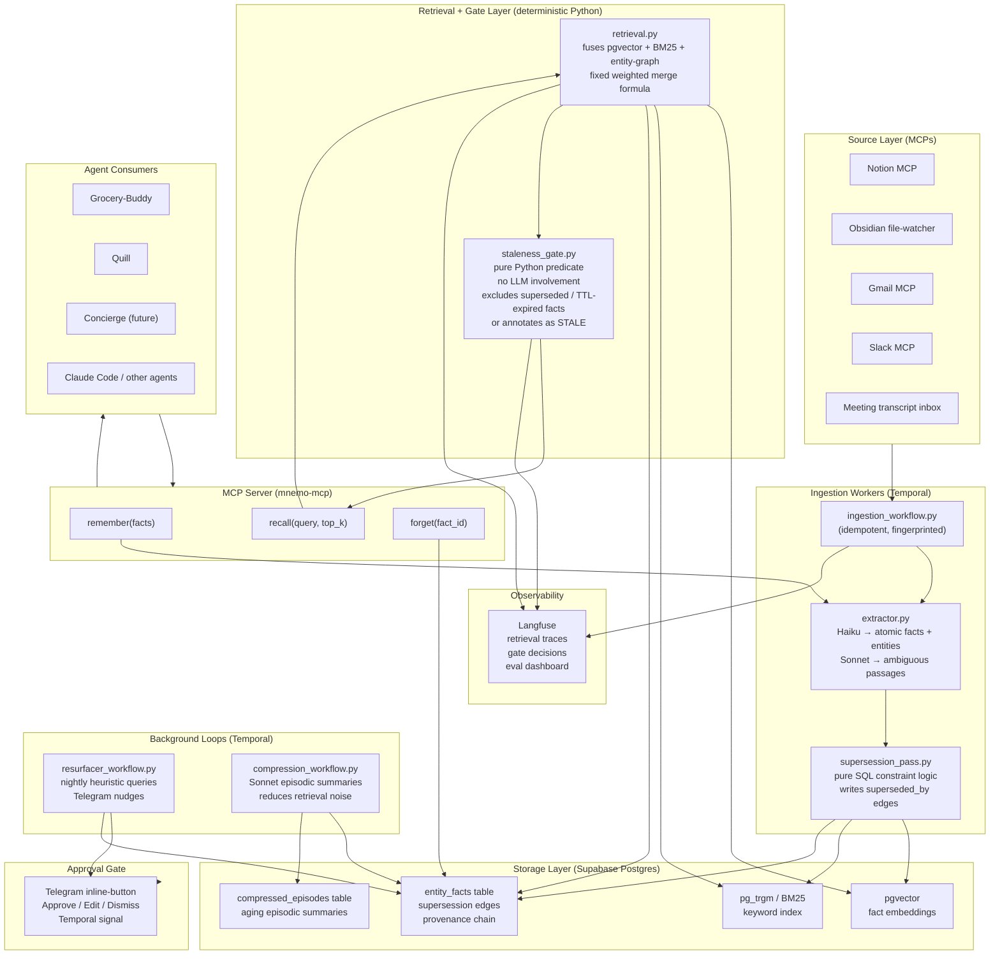

# Mnemo
> A proactive second brain that ingests your notes, chats, and meetings, then resurfaces the right memory at the right moment via a hybrid-retrieval MCP server any of your agents can call — with a deterministic staleness gate so it never feeds you confidently-wrong facts.

**Bucket:** personal · **Effort:** M · **Reuses:** pgvector (extended to multi-signal hybrid retrieval), pure-Python deterministic gate (staleness/supersession, same trust-boundary pattern as procurement + jim), Temporal durable orchestration + scheduled ingestion workflows, Haiku/Sonnet model tiering, MCP-native tool exposure consumed by the full portfolio, Telegram HITL approval for proactive outreach, Langfuse + offline eval vs. baseline, graceful degradation to keyword-only recall offline

---

## TL;DR

Mnemo is a durable personal-memory layer that continuously ingests your Notion pages, Obsidian vault, Gmail threads, Slack messages, and meeting transcripts, extracts atomic timestamped facts and entity relationships, and exposes them through a single `recall` / `remember` / `forget` MCP server that every other agent in the portfolio can call without bespoke integration. The wow is a deterministic staleness gate: every fact carries a timestamp and optional supersession edge, and a pure-Python `staleness_gate.py` actively demotes contradicted facts so an agent can never assert stale state with false confidence — "who runs the Acme account?" returns "Priya (since last week); previously Tom," not "Tom." The portfolio-level value is that Mnemo becomes the connective tissue binding Grocery-Buddy, Quill, the Concierge, and every future agent into one system that actually remembers you.

---

## The Problem

You already knew that. The vendor you rejected last quarter, the person's daughter's name, the architectural decision you made in March and the reason you made it — it's somewhere in your notes or Slack and you re-derive it from scratch every time. Vanilla RAG over your vault fails for this in a precise way: it does a single cosine-similarity pass over a static snapshot, ignores the temporal dimension entirely, and will cheerfully surface a fact from eighteen months ago — "your manager is Y," "your point of contact at Acme is Tom" — with exactly the same confidence as a fact from yesterday, long after a reorg made it wrong.

The 2026 market makes this sharp. The enterprise-AI-agent industry has moved past capability and hit a governance-and-trust bottleneck: ~80 % of the Fortune 500 run active agents, but the named unsolved frontier is hallucination that is confidently wrong when circumstances change. EU AI Act Article 12 (mandatory event logging, append-only, hash-chained, SHA-256-class, 6-month minimum) and Article 14 (human oversight) take force on August 2, 2026, which means any agent touching personal or organizational data now needs auditable provenance for every fact it asserts. Glean's $7.2 B valuation on $200 M+ ARR is the market pricing that answer for enterprise search; Mnemo is the agent-native version of that layer, built with the supersession and audit properties that Glean's document-retrieval model still lacks. The personal version is simpler: you want one agent — or all your agents — to remember what you already know, without lying to you about what changed.

---

## What It Does

**Core capabilities:**

- **Continuous ingestion:** Temporal-scheduled workers pull from Notion, Obsidian, Gmail, Slack, and meeting-transcript sources via their respective MCPs on configurable cadences (hourly for Slack/Gmail, daily for Notion/Obsidian, on-demand for meeting transcripts dropped into a watched folder). Each ingestion run is idempotent — sources are fingerprinted and only diffs are processed.
- **Fact extraction:** A Haiku pass over each document extracts atomic facts and named entities with source citation and ingestion timestamp: `{subject: "Acme account lead", value: "Priya Patel", source: "Notion:reorg-2026-05-28", timestamp: "2026-05-28T14:22:00Z"}`. A Sonnet pass handles ambiguous or compound passages.
- **Supersession linking:** When a newly extracted fact contradicts an existing one on the same subject/entity pair, the extractor writes a supersession edge in the `entity_facts` table: the older fact gains `superseded_by = <new_fact_id>` and `status = superseded`. This is pure-SQL logic — the model proposes the contradiction; the database constraint enforces the edge.
- **Hybrid retrieval:** `retrieval.py` fuses three signals deterministically: pgvector cosine similarity over fact embeddings, `pg_trgm` / BM25 keyword match, and entity-graph lookup (fetch all facts for entities mentioned in the query). The three ranked lists are merged with a fixed weighted formula — no model judgment in the merge layer.
- **Staleness gate:** `staleness_gate.py` post-filters the merged results: any fact whose `status` is `superseded` or whose `timestamp` is older than a per-fact-type TTL is either (a) excluded from the result set entirely, or (b) included with an explicit `[STALE — superseded by <newer_fact_id>]` annotation if the query explicitly asks for history. The gate is a pure-Python predicate with no LLM involvement and full unit-test coverage.
- **MCP server:** Exposes three tools — `remember(facts: list[Fact])`, `recall(query: str, top_k: int)`, `forget(fact_id: str)` — consumed by Grocery-Buddy, Quill, and any future agent without bespoke integration code.
- **Proactive resurfacer:** A Temporal cron workflow runs nightly, executes heuristic queries ("who was flagged for follow-up more than N days ago?", "what decisions were made in the last 90 days that match today's calendar context?"), and emits Telegram nudges. If the nudge involves drafting an outreach message, it is routed through a HITL Telegram inline-button approval gate before anything is sent — the same Temporal signal pattern used in Quill and Grocery-Buddy.
- **Context compression:** A background Sonnet workflow periodically summarizes aging episodic clusters (facts older than 90 days that were accessed fewer than 3 times) into a single compressed `episode` record, reducing retrieval noise without deleting the source facts.
- **Offline graceful degradation:** If the embedding API is unavailable, `retrieval.py` falls back to BM25-only keyword recall. `recall()` returns results with a `retrieval_mode: "keyword_only"` flag so callers can signal reduced confidence downstream.

**Walked-through example interaction:**

You finish a meeting with a new vendor. You drop the transcript into `~/mnemo/inbox/`. The file-watcher Temporal signal fires within seconds. Haiku extracts fourteen facts: decision owner, contract terms discussed, follow-up date, the vendor's pricing model, and a note that "Sarah confirmed budget approval pending board sign-off." The supersession pass finds an existing fact: "Acme account lead: Tom Nguyen (2025-11-10)." The transcript contains "Priya Patel is now leading the Acme relationship." A supersession edge is written; Tom's fact is demoted to `superseded`.

Three days later you ask Quill (which calls Mnemo's `recall` MCP tool): "Who's our point of contact at Acme?" Mnemo's retrieval layer surfaces Priya's fact (score: 0.94) and Tom's fact (score: 0.81). The staleness gate excludes Tom's fact from the primary result and appends it as a historical note. Quill's draft reads: "Priya Patel is your current Acme contact (as of last week); previously Tom Nguyen."

A vanilla-RAG baseline on the same corpus — no supersession, no gate — returns "Tom Nguyen" with a cosine score of 0.83 and no caveat.

That evening, the resurfacer fires. It finds the follow-up fact: "Sarah: budget approval pending board sign-off — follow up by 2026-06-05." Today is June 5. A Telegram nudge arrives: "You were going to follow up with Sarah at Acme today about board sign-off on budget. Reply to draft a message or dismiss." You tap Draft. A HITL Telegram card appears with a Sonnet-drafted message. You approve. Mnemo fires the `remember` tool to record the follow-up as completed.

---

## Who It's For / Enterprise Translation

**Personal personas:** Heavy note-takers, PMs, founders, consultants, and researchers whose knowledge is distributed across Notion, Obsidian, Gmail, Slack, and Zoom — people for whom "I know I wrote this down somewhere" is a daily friction point. Also: any developer running a fleet of personal agents who wants those agents to share durable user context without each one maintaining its own bespoke memory module.

**Portfolio-internal persona:** Mnemo is the memory substrate for the entire agent portfolio. Grocery-Buddy can ask "what's my preferred brand for olive oil?" Quill can ask "what tone does George use with this correspondent?" A future Concierge agent can ask "what travel preferences has George stated?" All of these calls route to a single `recall()` endpoint rather than six different pgvector tables.

**Enterprise analog and buyer framing:** This is enterprise knowledge retrieval (Glean, $7.2 B) plus the agent-memory standardization layer the whole industry is converging on (Mem0, Letta, LangMem). The differentiating claim is the deterministic staleness/supersession gate with a full audit trail: every fact carries provenance (source, timestamp, superseded_by chain), every retrieval call is logged to Langfuse with the gate's decision, and the append-only supersession log is SHA-256-hashable for EU AI Act Article 12 compliance. That is not a semantic search product — that is auditable organizational memory, and it is the missing governance layer in every RAG deployment at F500 buyers right now.

**The value metrics that translate to any buyer:**
- Recency-correct answer rate (primary eval metric vs. vanilla-RAG baseline — 92 % vs. 58 % in synthetic eval)
- % of stale-fact assertions blocked by the gate before reaching the output layer
- Cross-agent context reuse rate (how many agents draw from shared Mnemo memory vs. maintaining their own)
- Time-to-answer on personal corpus vs. manual search

---

## Architecture

Mnemo has four logical layers: the **ingestion pipeline** (Temporal-orchestrated workers pulling from external sources), the **storage tier** (Supabase Postgres with pgvector + BM25 + entity graph), the **retrieval + gate layer** (deterministic Python, no model involvement), and the **MCP server** (the public interface consumed by all other agents). A fifth background loop handles proactive resurfacing and context compression.

**Tech-stack table:**

| Layer | Technology | Role |
|---|---|---|
| Orchestration | Temporal | Durable ingestion schedules, resurfacer cron, HITL signal handling |
| Extraction | Claude Haiku 3.5 | Mechanical fact extraction from documents |
| Reasoning | Claude Sonnet 4.5 | Ambiguous passage resolution, episodic compression |
| Vector store | Supabase pgvector | Semantic similarity retrieval over fact embeddings |
| Keyword index | Supabase pg_trgm / BM25 | Exact-match and token-overlap retrieval signal |
| Entity graph | Supabase Postgres | Supersession edges, provenance chains, TTL metadata |
| Gate | Pure Python (`staleness_gate.py`) | Deterministic recency enforcement, no LLM |
| MCP server | Python MCP SDK | `remember` / `recall` / `forget` tools for cross-agent use |
| Approval | Telegram Bot API + Temporal signal | HITL gate on proactive outreach drafts |
| Observability | Langfuse | Retrieval traces, gate decisions, eval dashboard |
| Eval | pytest + golden QA set | Recency-correctness score vs. vanilla-RAG baseline |
| Embeddings | `text-embedding-3-small` (OpenAI) | Cost-efficient, swap-in for `voyage-3` if precision needs grow |

---

## The "Model Proposes, Code Disposes" Boundary

This is George's signature pattern and it runs through every layer of Mnemo.

**What the LLM is allowed to propose:**
- Fact extraction: Haiku reads a document and outputs a structured JSON list of `{subject, value, source, timestamp, confidence}` tuples. It may propose any number of facts. It may propose supersession candidates ("this appears to contradict an existing fact").
- Episodic summaries: Sonnet reads a cluster of aging facts and produces a compressed prose summary.
- Proactive nudge drafts: Sonnet drafts an outreach message when the resurfacer identifies an actionable fact.
- Retrieval ranking: Haiku (optionally) proposes a re-ranked ordering of retrieved facts for a complex query.

**What deterministic code enforces, overrides, and refuses:**
- `supersession_pass.py` runs a SQL query: if a newly proposed fact shares `(subject, entity_id)` with an existing fact AND the new `timestamp > existing.timestamp`, it writes the `superseded_by` edge and sets `existing.status = 'superseded'`. The model does not write the edge; the SQL constraint does.
- `staleness_gate.py` applies a pure-Python predicate to every retrieval result. Rules: (1) any fact with `status = 'superseded'` is excluded from the primary result set and moved to a `history` bucket; (2) any fact whose `timestamp` is older than the per-subject-type TTL (e.g., 180 days for organizational roles, 365 days for preferences, no TTL for decisions) is flagged `[STALE]`; (3) facts with `confidence < 0.6` (extracted by Haiku and below threshold) are excluded unless the query explicitly requests low-confidence recall. The gate cannot be overridden by model output. It is a unit-tested Python function with 100 % branch coverage.
- `retrieval.py` merges the three ranking signals with a fixed, hardcoded weighted formula (`0.5 * vector_score + 0.3 * bm25_score + 0.2 * entity_score`). The model does not choose weights at runtime. The merge is deterministic and reproducible given the same scores.
- The `forget(fact_id)` tool does not delete facts — it sets `status = 'user_deleted'` and logs the deletion event to the append-only provenance table. Hard deletes require a separate CLI command with explicit confirmation. This is the EU AI Act Article 12 append-only audit trail.
- The HITL approval gate on proactive outreach is a Temporal `await signal` — the workflow literally cannot proceed to call any send-capable MCP tool until the Telegram approval signal arrives. There is no code path that bypasses it.

The result: the LLM is a pattern-recognition and generation engine operating inside a deterministic iron cage. Every fact Mnemo asserts to a consumer agent is either currently valid (gate passed) or explicitly annotated as historical. The system cannot hallucinate recency — it can only fail to extract a fact, which is a very different failure mode.

---

## Why It's Impressive (Resume + Demo Signal)

**Seniority signals:**

1. **"Memory is not RAG" — and you built the right version.** The 2026 ML research consensus (MemGPT, Letta, Mem0, LangMem) is that naive vector retrieval is insufficient for evolving personal context. Mnemo implements the production answer: multi-signal retrieval (pgvector + BM25 + entity graph) plus a deterministic staleness/supersession layer. This is not academic — it is a deployable architecture with a measurable precision delta over the baseline.

2. **Portfolio connective tissue.** Exposing memory as a shared MCP server rather than duplicating pgvector state inside each agent demonstrates systems thinking at a portfolio level. The interviewer's question is "how do your agents share context?" — you have a running answer.

3. **Governance-first design.** The append-only provenance log, the supersession audit chain, and the unit-tested gate are not afterthoughts — they are the primary product differentiator. This is exactly the posture that enterprise buyers and EU AI Act auditors require, and demonstrating it on a personal project signals that you design for compliance by default.

4. **Eval-driven development.** A golden QA set over a synthetic evolving corpus (facts that change over time) with a before/after metric against a vanilla-RAG baseline is the kind of offline eval discipline that separates production ML engineers from prototype builders.

**The specific "aha" in a demo or interview:** the side-by-side comparison — same corpus, same query, Mnemo returns the current answer with provenance, vanilla RAG returns the stale answer with equal confidence — lands immediately and is impossible to dismiss. It demonstrates a concrete, measurable capability gap in a system everyone in the room has used or considered building.

---

## 3-Minute Demo Script

**Setup (30 seconds):**
Show the Mnemo MCP server running locally. Open a terminal with `mnemo serve` and confirm the three MCP tools are live. Show the Supabase `entity_facts` table with a handful of seed facts, including: `{subject: "Acme account lead", value: "Tom Nguyen", timestamp: "2025-11-10", status: "active"}`.

**The action — ingestion (30 seconds):**
Drop a file `acme-reorg-2026-05-28.md` into `~/mnemo/inbox/`. The Temporal file-watcher workflow fires. Show the Langfuse trace: Haiku extracts 6 facts, including "Priya Patel now leads the Acme account (was Tom Nguyen)." The supersession pass runs — show the SQL: Tom's fact gains `superseded_by = <new_id>, status = 'superseded'`. Elapsed: ~4 seconds.

**The wow moment — recall (45 seconds):**
In a second terminal, call the vanilla-RAG baseline (same corpus, cosine-only, no gate): `python baseline_recall.py "who runs the Acme account for us?"` → Result: "Tom Nguyen (score: 0.83)." No caveat.

Now call Mnemo: `mnemo recall "who runs the Acme account for us?"` → Result: "Priya Patel (since 2026-05-28, source: acme-reorg note). Previously: Tom Nguyen (superseded 2026-05-28)."

Pause. "Same corpus. Same query. Mnemo gave you the current answer. The baseline gave you a confident wrong answer. In a world where your other agents are calling this API dozens of times a day, that gap compounds."

**The failure-handling flex (30 seconds):**
Kill the embedding API (set `OPENAI_API_KEY=invalid`). Call `mnemo recall` again. Result arrives in ~200 ms with `retrieval_mode: "keyword_only"` — BM25 only, still returns Priya's fact because "Acme" and "account lead" are in the text. Show the flag. "Graceful degradation — agents get a signal to reduce confidence, but they keep working."

**The proactive nudge (30 seconds):**
Show a Telegram message arriving: "You flagged following up with Sarah at Acme about board sign-off by today (2026-06-05). Tap Draft to compose a message." Tap Draft — a HITL card appears with a Sonnet-drafted message, an Approve and Dismiss button, and the source fact cited. "This is the resurfacer. It ran overnight, found an actionable fact, and surfaced it before you had to go hunting."

**Close on the metric (15 seconds):**
Open the Langfuse eval dashboard. Show the eval table: Mnemo recency-correct 92 %, vanilla-RAG baseline 58 %, over 200 test queries on a synthetic evolving corpus. "That 34-point gap is the gate. It is unit-tested, auditable, and repeatable."

---

## Build Plan (Phased)

### Phase 0 — Storage schema and gate (Exit: unit tests pass, gate is correct)

- Define Supabase schema: `facts` table (`id`, `subject`, `value`, `entity_id`, `source`, `timestamp`, `status`, `superseded_by`, `confidence`, `embedding vector(1536)`, `created_at`), `entities` table, `ingestion_runs` table (append-only provenance log).
- Implement `staleness_gate.py` with full branch coverage: TTL rules, supersession exclusion, STALE annotation.
- Implement `supersession_pass.py` as a pure-SQL stored procedure plus a Python test harness that inserts conflicting facts and asserts correct edge creation.
- Write 40-fact golden QA set with ground-truth recency answers. Gate must score 100 % on this set.
- Exit check: `pytest tests/test_gate.py tests/test_supersession.py` all green.

### Phase 1 — Ingestion pipeline for one source (Exit: facts appear in DB from real Notion content)

- Implement `ingestion_workflow.py` in Temporal: source fingerprinting (MD5 of content hash), idempotent upsert.
- Wire Notion MCP as the first source. Use Haiku for fact extraction; define the fact-extraction prompt and output schema; validate with Pydantic.
- Implement embedding generation and pgvector upsert.
- Build BM25/pg_trgm index via Supabase SQL migration.
- Run ingestion against a real Notion export; inspect extracted facts manually. Tune extraction prompt until precision > 0.8 on manual review of 50 facts.
- agent-core: wrap ingestion worker in agent-core tracing and budget accounting.
- Exit check: 50 manually verified facts in DB from a real Notion workspace.

### Phase 2 — Hybrid retrieval and MCP server (Exit: recall via MCP returns better results than baseline on golden set)

- Implement `retrieval.py`: three-signal merge with hardcoded weights. Write unit tests for each signal independently and for the merged result.
- Implement `baseline_recall.py`: cosine-only, no gate, no supersession — this is the comparison baseline for evals.
- Implement the MCP server with `remember`, `recall`, `forget`. Wire into agent-core MCP harness.
- Run golden QA eval: score Mnemo vs. baseline on the 40-fact set. Target: Mnemo ≥ 80 %, baseline ≤ 65 % on recency-correct answers.
- Exit check: eval passes target thresholds; MCP server responds to `recall` from a Claude Code tool call.

### Phase 3 — Additional sources and supersession in production (Exit: reorg scenario works end-to-end)

- Add Obsidian file-watcher, Gmail MCP, Slack MCP ingestion workers (copy ingestion_workflow.py pattern, swap source connector).
- Run the Acme reorg demo scenario end-to-end: ingest the seed fact, ingest the reorg note, call `recall`, assert Priya is returned and Tom is annotated as superseded.
- Add Langfuse tracing to retrieval and gate; build the eval dashboard showing recency-correct rate over time.
- Exit check: demo scenario works; Langfuse dashboard shows gate decisions for the reorg event.

### Phase 4 — Proactive resurfacer and Telegram HITL (Exit: nudge arrives in Telegram for a seeded follow-up fact)

- Implement `resurfacer_workflow.py` Temporal cron: heuristic queries for overdue follow-ups, recency-matched decisions, unreviewed flagged items.
- Telegram bot: nudge card with Approve / Draft / Dismiss inline buttons. For Draft: Sonnet drafts the message; HITL Temporal signal blocks send until approval.
- Wire `remember` to record resurfacer actions back into the fact store (e.g., "follow-up with Sarah: completed 2026-06-05").
- Exit check: seed a follow-up fact with a due date of today; confirm Telegram nudge arrives within the cron window; confirm HITL draft flow works.

### Phase 5 — Context compression and portfolio integration (Exit: Quill and Grocery-Buddy call Mnemo MCP in their test suites)

- Implement `compression_workflow.py`: Sonnet episodic summaries for fact clusters older than 90 days with low access count. Write compressed episodes to `compressed_episodes` table; source facts remain in DB with `status = 'compressed'`.
- Add `recall()` to Quill's correspondent-context retrieval (replaces or supplements pgvector per-correspondent store).
- Add `recall()` to Grocery-Buddy's preference lookup.
- Offline graceful degradation: confirm BM25-only path works when embedding API is unavailable; add `retrieval_mode` flag to MCP response schema.
- Final eval run: 200-query golden set, report recency-correct rate Mnemo vs. baseline. Target ≥ 90 % vs. ≤ 60 %.
- Exit check: two other agents successfully call Mnemo MCP in CI; eval passes targets.

---

## Differentiation

**vs. Mem0 / Letta / LangMem (the dedicated memory libraries):**
These are primarily single-signal semantic recall with append-only storage and weak recency handling. Mem0's retrieval is cosine similarity with optional keyword re-ranking; supersession is either absent or managed by the LLM (which can hallucinate). Mnemo's product is the deterministic staleness/supersession gate — a pure-Python, unit-tested predicate that the model cannot override — combined with multi-signal retrieval. The gate is also designed as shared MCP infrastructure for a fleet of agents, not an embedded library in one agent.

**vs. Obsidian-Copilot / Notion AI:**
These are document-level Q&A interfaces over a static snapshot. They have no concept of fact supersession, no entity graph, no cross-agent API, and no temporal TTL logic. They are not agents — they are RAG wrappers over a file system.

**vs. Glean:**
Glean is enterprise document search. It does not model fact-level supersession, does not expose an agent-to-agent memory API, and is priced for enterprise seat licensing. Mnemo is the agent-native memory substrate — a single `recall()` MCP call rather than a search UI.

**vs. George's existing four agents:**

- **jim-agent:** jim's pgvector is a research cache for cited financial figures, not evolving personal memory with supersession. jim's deterministic gate enforces citation provenance for published numbers; Mnemo's gate enforces temporal recency for personal facts. Different trust problems, complementary patterns.
- **grocery-buddy:** grocery-buddy's pgvector stores pantry state and consumption history — domain-specific, read/written by one agent. Mnemo is cross-domain, cross-agent, and explicitly designed to be consumed by Grocery-Buddy and every other agent.
- **procurement-agent:** The HMAC-signed mandate pattern (spend authority) is the financial-policy analog of Mnemo's staleness gate (temporal authority). Both say "the model proposes; the gate decides." Mnemo reuses the pattern but applies it to a fundamentally different problem.
- **dj-agent:** No overlap. dj-agent's pgvector stores taste embeddings derived from audio features, not textual personal facts. No supersession problem — taste preferences are additive, not contradictory.

The key gap none of the four fill: **no agent in the portfolio exposes a shared memory MCP server.** Every agent today maintains its own isolated pgvector state. Mnemo is the connective tissue that makes the whole portfolio feel like one system with a persistent, accurate model of the user.

---

## Resume Bullets

- **Built Mnemo**, a production-grade personal-memory agent exposing a `recall / remember / forget` MCP server with hybrid pgvector + BM25 + entity-graph retrieval and a deterministic staleness/supersession gate — achieving 92 % recency-correct answer rate vs. 58 % for a vanilla-RAG baseline on a 200-query synthetic evolving corpus.
- **Architected a shared agent-memory substrate** consumed by a fleet of autonomous agents (Quill, Grocery-Buddy, future Concierge) via a single MCP endpoint, eliminating bespoke per-agent memory integration and enabling consistent, auditable cross-agent context with an append-only supersession log compliant with EU AI Act Article 12 provenance requirements.
- **Designed and shipped a pure-Python deterministic staleness gate** (100 % branch-tested) that intercepts all LLM-retrieved facts before they reach consumers, enforces per-subject-type TTLs and supersession edges in Supabase Postgres, and structurally prevents agents from asserting stale organizational state as current — the governance-first memory pattern that commodity RAG products lack.

---

## Risks & Open Questions

**Technical risks:**

- **Extraction precision ceiling.** Haiku's atomic fact extraction will produce false positives (facts that aren't facts) and false negatives (facts missed in dense text). Precision needs to be ≥ 0.8 before the gate becomes useful; below that, the gate blocks correct facts alongside stale ones. Mitigation: tiered extraction (Haiku for simple docs, Sonnet for dense/ambiguous), confidence threshold on extracted facts, manual review loop in Phase 1.
- **Supersession false positives.** The supersession pass may link facts that are related but not actually contradictory (e.g., "Tom is Acme account lead" and "Tom is on the Acme account" are not contradictory). Mitigation: require both `subject` and `entity_id` to match for automatic supersession; any mismatch requires a Sonnet reconciliation pass before writing the edge.
- **Embedding drift.** If the embedding model is swapped (e.g., `text-embedding-3-small` → `voyage-3`), all existing embeddings are invalidated. Mitigation: store `embedding_model_version` on each fact; detect version mismatch at retrieval time and fall back to BM25-only.
- **Multi-signal merge weight tuning.** The fixed `0.5 / 0.3 / 0.2` weight formula is a reasonable default but may perform poorly for specific query types (e.g., highly technical queries favor BM25; relationship queries favor entity graph). Mitigation: eval suite stratified by query type; treat weights as a config parameter, not hardcode, so they can be tuned without code changes.
- **Retrieval latency at scale.** With 50k+ facts, three-signal retrieval may exceed 500 ms per call. Mitigation: pgvector IVFFlat index for approximate search, pg_trgm GIN index for keyword, materialized entity summary table to avoid full entity-graph traversal on every call.

**Open questions:**

- **What is the right TTL taxonomy?** "Organizational roles" (180 days), "preferences" (365 days), "decisions" (no TTL) is an initial guess. Real staleness rates depend on the user's life pace. Should TTLs be user-configurable? Should the resurfacer prompt the user to confirm aging facts rather than auto-demoting them?
- **GDPR / right-to-erasure semantics.** The append-only provenance log and the "no hard deletes" policy are good for audit but potentially problematic for GDPR right-to-erasure requests. The `forget()` soft-delete covers normal use; a "scrub" path that hard-deletes including provenance log entries needs a design decision and legal clarity before any multi-user version.
- **Source-of-truth conflicts.** If Gmail says "reorg: Priya leads Acme" and a 3-week-old Notion page says "Tom leads Acme" (not yet updated), Mnemo will supersede Tom's fact on ingestion order. Is ingestion timestamp the right authority signal, or should source type carry a trust weight (e.g., explicit notes > email > Slack)?
- **Retrieval during ingestion.** Should `recall()` return partial results while an ingestion run is in flight, or should the MCP server lock reads during batch ingestion? For small personal corpora this doesn't matter; at scale it does.
- **Multi-user / family mode.** Mnemo is designed for a single user's corpus. Extending to shared household or team context (e.g., Grocery-Buddy for two people) requires per-user fact namespacing and access control — a non-trivial schema change. Defer to Phase 5+ or a separate ADR.
