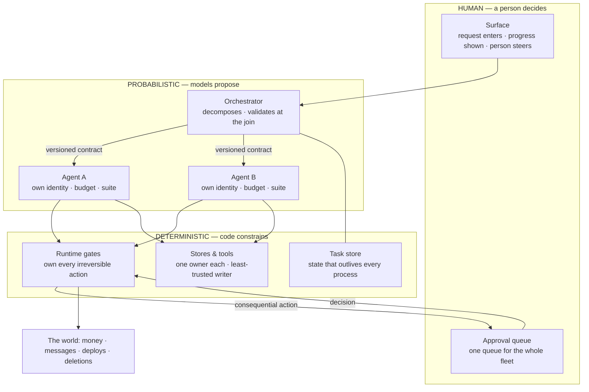

# Product Anatomy — building a product out of agents

*Visual companion: <https://claude.ai/code/artifact/71d81606-c4a2-4578-a623-e11a5d6fc845> —
this file is canonical; the visual renders it (`docs/visuals/README.md`).*

A product at this scope composes three kinds of parts: **probabilistic agents** that propose,
**deterministic gates and services** that constrain, and **human surfaces** where a person decides.
This guide walks the design of that composition in the order you actually face it — ten sections,
each a stage of the build:

**Orient → Shape → Constrain → Involve → Meter → Observe → Survive → Prove → Ship → Evolve** —
then a failure atlas and the evidence key.

The **eighteen decisions** live inside those stages and go by name — *Outcome*, *Seam
ownership*, *Model routing* — because a name is readable in isolation and stable without a
numbering scheme to maintain; stage numbers (§0–§9) are the only numbers this document keeps.
Decisions marked ***product-native*** exist only because a product has something one agent
never has: a peer with its own owner, release cadence, and reliability target — the agent-scope
checklist reaches further than people expect (its T2/T3 fields already ask which contracts must
stay stable and who owns merge order), but it cannot ask any of that *across an ownership
boundary*. Walk every stage for a new product or a consequential change; jump straight to a
decision for a refresher — each one is written to stand alone.

The test this doc must pass: a fresh builder answers every decision from the repositories, the
runtime policy, and the trace — without asking the original author. At this scope "the repository"
is plural.

**Every recommendation carries its evidence class.** *Demonstrated* means measured data.
*Standard* means a standards body says so. *Reported* means a first-party engineering account,
real but uncontrolled. *Claimed* means a convention that recurs everywhere and traces to no study.
*House* means our own decision, stated as a choice rather than a finding. **Anything without an
explicit label is House.** Where the field has no answer, this guide says so instead of inventing
one. The key and the limits live in the closing section; every source has a row in a spec's
citation ledger, enforced at commit time. (A deliberate divergence from `AGENT_ANATOMY.md`,
whose index dropped its per-row evidence column: there the labels were near-constant and
carried nothing; here the mix — measured, standards-backed, reported, and ours — genuinely
varies by row, so the column earns its keep.)

---

## 0. Orient — the shape of the thing

The thesis everything below serves: **probabilistic models propose, deterministic systems
constrain, humans decide.** The failure this guide exists to prevent is planning a platform out of
single-agent intuitions and never seeing the whole elephant. So here is the elephant:



Two threads run through every box, and they are what make this a *product* rather than a pile of
agents. An **outcome identifier**, minted where the request enters, stamped on everything the
request touches (§5). A **budget ledger**, one pool that every level of fan-out draws down in real
time (§4). If a component of your design touches neither thread, ask what it is for.

**One agent is still a product.** Strip the fan-out from the diagram and everything else remains:
the surface, the gates, the task store, both threads. The fleet is not the point — the composition
is. §1 opens with the gate that decides whether a second agent is earned at all, and the honest
2026 answer is: less often than the demos suggest.

**Altitude check.** One agent with one demoable outcome — even one that spawns subagents under its
own identity and budget — is `AGENT_ANATOMY.md`'s territory. You are here when a component has its
own identity, its own budget, its own repository, or its own owner. Headcount is not the test;
ownership boundaries are.

**Six laws cut across every stage.** Each is enforced by one decision, and the decisions stay
canonical — this box is the index, because a rule stated once inside a decision is a rule half
the fleet's builders never meet: every irreversible action has exactly one deterministic owner
(*Runtime authorization*); **never amplify** — delegation and model escalation carry the
requester's authority and budget, never more (*Credentials & blast radius*, restated one
altitude up by *Model routing*); a store is only as trusted as its least-trusted writer
(*Memory*); peer output is untrusted input, whoever's logo is on it (*Inputs & egress*);
traces link across async boundaries rather than pretending to be one mega-trace
(*Observability*); and a fallback never happens silently (*Model routing*). One deliberate
non-transfer: `AGENT_ANATOMY.md` moved its rulings and vocabulary ahead of its decisions
because they were shared by all of them — here the reference material (the span tree, the five
floors, the control plane) is stage-local, so it stays inline where it is used.

**How each decision is written.** Each opens with the question it answers; the first sentence of
every **Do this** is the gist. Then: a concrete **what it looks like**, the **why**, the graded
**evidence**, the **wrong when** failure signature, and **yours to decide** — the part that stays
a judgment call. A blank answer to any decision is an assigned design hole, not a surprise
waiting for integration.

**The decision index** — the skim layer. The last column grades the *recommendation itself* (the
full grading, leg by leg, is in each decision's Evidence).

| Decision | The question it answers | Stage | Rec. class |
|---|---|---|---|
| Outcome | What single sellable result does the product own? | Shape | Demonstrated |
| Loop & topology | One agent or many — and who writes? | Shape | Demonstrated |
| Seam ownership *(product-native)* | Who owns what belongs to no agent? | Shape | House |
| Cross-agent contracts *(product-native)* | How do independently-shipping agents keep agreeing — and what crosses the seam? | Shape | Demonstrated |
| Runtime authorization | Who may perform each irreversible action? | Constrain | Standard |
| Inputs & egress | What comes in, what leaves, and who enforces it? | Constrain | Standard |
| Memory | Who owns what the fleet remembers? | Constrain | House |
| Credentials & blast radius | What can the fleet touch when one agent falls? | Constrain | Standard |
| Human involvement | Where does a person actually decide? | Involve | Reported |
| Human surfaces | What does the person see, steer, and stop? | Involve | Reported |
| Budgets that nest | What stops a fan-out from spending forever? | Meter | House |
| SLO composition *(product-native)* | What reliability does the product promise, and how do parts compose into it? | Meter | House |
| Cost per accepted outcome | What does one accepted outcome cost — and what price survives that distribution? | Meter | House |
| Observability | Can you reconstruct the outcome end to end? | Observe | Standard |
| Durability | What survives a kill −9? | Survive | Reported |
| Failure & compensation | Who undoes agent A's side effect? | Survive | House |
| Eval & version sets | What exactly did we just ship? | Prove | Demonstrated |
| Model routing *(product-native)* | Which model serves which role — and who checks the checker? | Ship | Demonstrated |

---

## 1. Shape — what are you building, out of how many parts

You know the outcome you want to sell. This stage decides how many probabilistic parts earn a
place in producing it, where one part's responsibility ends, and what crosses the line between
parts. Get this wrong and every later stage compensates for it; get it right and most later
stages shrink.

### Outcome

**Do this.** Name the single sellable result the product owns, and make every agent's sub-outcome
traceable to it. An agent whose output no user-visible result depends on is coordination overhead
— delete it.

**What it looks like.** A one-line ledger at the top of the product repo: the outcome, then each
agent with the sub-outcome it owes. "Grocery run planned and ordered" → *planner* owes the cart,
*pricer* owes the cheapest fulfillment, *orderer* owes the placed order. An agent you cannot put
on that list — a "coordinator" whose output is vibes — has no row and no job.

**Why.** Adding agents is not free, and past a certain baseline quality it is actively negative:
coordination cost overtakes the benefit of decomposing the work.

**Evidence.** *Demonstrated* — across 14,742 trials on three model families, returns from adding
agents go negative once single-agent baseline accuracy passes roughly 45% (β≈−0.408, p<0.001)
([Kim et al., 2025-12](https://arxiv.org/html/2512.08296v1); preprint, short-horizon tasks). Read
the 45% figure as "adding agents stops paying on tasks that already decompose poorly," not as a
universal ceiling.

**Wrong when.** You cannot name the user-visible result a given agent contributes to.

**Yours to decide.** Which sub-outcomes are worth separating into their own agent at all — the
next block is the gate for that call.

### The one-agent gate

Before drawing a fleet, qualify it — and the gate has a rung below "one agent or many."
The full ladder is **deterministic service → one agent → fleet**, each rung earned against
the one below: the first rung is `AGENT_ANATOMY.md`'s *Model justification* asked per
component (a part of the outcome that is a schedule, a lookup, or a template is a service,
not an agent — §8's "deterministic script first" routing row is this rung applied, and
*Outcome*'s coordination-overhead test is its sibling: a part that earns no model and a part
that no result depends on both leave the fleet), and only what survives it competes for the
second. The field's oldest advice here is also its best-evidenced:
find the simplest composition that ships the outcome, and add machinery only when it demonstrably
improves results ([Anthropic, 2024-12-19](https://www.anthropic.com/engineering/building-effective-agents)).
What 2026 added is the measurement discipline that keeps the advice honest:

- *Demonstrated* — when the comparison protocol is normalized (same benchmark loader, same tools,
  same answer contract, same accounting), **at most one of six** published multi-agent systems beat
  a matched single-agent anchor; the other five trailed by 2.56–11.29 points at higher cost
  ([Fu et al., 2026-06-04](https://arxiv.org/abs/2606.05670); GPT-4.1, ten benchmarks).
- *Demonstrated* — 7 of 10 recent coordination architectures report headline gains **below the
  measured noise floor** of their own evaluation; the authors' own carefully-paired attempt landed
  at +5pp with a confidence interval spanning zero
  ([Kaliyev & Maryanskyy, 2026-06-15](https://arxiv.org/abs/2606.20695)).

The honest read is not "multi-agent is bad" — the same literature holds a 90.2% win for
orchestrator-workers on genuinely parallel research (*Loop & topology*). It is: **most published
coordination gains are protocol artifacts, and yours might be too.** So the house rule: every
fleet keeps a **paired single-agent anchor** — the same task, same tools, same accounting, one
agent — alive in the eval portfolio (§7, floor 3). The fleet re-earns its coordination cost
against that anchor, on your traffic, not on a vendor's demo. A fleet that cannot beat its anchor
is a simplification opportunity wearing an org chart.

### Loop & topology

**Do this.** Single-writer by default; fan out only work that genuinely decomposes, and validate
at the join. Read-heavy, independent, breadth-first work parallelizes; interdependent write-heavy
work does not — and the join needs an explicit verification step, not a concatenation.

**What it looks like.** A research product fans three searchers across disjoint source families
and funnels them through one validating synthesizer — parallel reads, single writer. A coding
product keeps one implementation lane and fans out only review. The shape to distrust: N agents
writing into the same artifact with a merge step that hopes.

**Why.** Independent agents each produce plausible output; the composition is where the errors
compound, and nothing catches them without an explicit verification step.

**Evidence.** *Demonstrated* — independent multi-agent pipelines amplified error **17.2×** over a
single-agent baseline; a centralized validating orchestrator cut that to **4.4×**, peer debate to
7.8× ([Kim et al., 2025-12](https://arxiv.org/html/2512.08296v1)). *Reported*, both directions: an
orchestrator-worker system beat single-agent by 90.2% on internal breadth-first research while
using about **15× the tokens of a chat** — and the same write-up notes most coding tasks hold
fewer truly parallelizable pieces than research
([Anthropic, 2025-06-13](https://www.anthropic.com/engineering/multi-agent-research-system)); the
counter-case argues single-threaded agents for interdependent work, because "actions carry
implicit decisions, and conflicting decisions carry bad results"
([Cognition, 2025-06-12](https://cognition.com/blog/dont-build-multi-agents)). The two disagree
because their tasks differed, not because one is wrong.

**Wrong when.** Parallel agents feed a result with no aggregation or verification step between
them.

**Yours to decide.** Which of your work is genuinely decomposable — that is the whole question,
and the paired anchor above is how you stop answering it by intuition.

### Seam ownership *(product-native)*

**Do this.** Draw the line where one agent's responsibility ends, and give the connective tissue —
orchestrator, shared gate, shared store, queue, shared tool catalogue — a named owner who is not
any single agent's owner. §8 is the sequence that owner runs.

**What it looks like.** A one-page seam register: each shared component, its owner, its consumers.
The shared tool catalogue belongs here too — two agents shipping near-duplicate `search` tools
with different semantics is a seam defect, and the register is where someone owns noticing.

**Why.** Work belonging to no single agent is on nobody's backlog by default, and the seam is
where failures concentrate.

**Evidence.** *Demonstrated* for the failure class, with its provenance split because the two
halves were not measured the same way. The **taxonomy** came from 150 traces closely examined by
six human experts, converging at κ=0.88. The **rates** came from 1,642 traces across seven
frameworks labelled by an o1-based LLM annotator calibrated against those experts at κ=0.77 —
only 21 traces in the released human set. On that basis, system design issues are one of three
top-level categories: disobeying task specification 11.8%, unawareness of termination conditions
12.4% ([MAST, Cemri et al.](https://arxiv.org/abs/2503.13657), rev. 2025-10-26). We do not restate
the paper's category-level ranking. *House* for the fix — naming a seam owner is our answer to
that failure class, not the paper's.

**Wrong when.** A shared component's problems are triaged by whoever noticed.

**Yours to decide.** Whether the seam owner is a person, a rotation, or §8's integration owner.

### Cross-agent contracts *(product-native)*

**Do this.** Write the handoff schema between agents down, version it, and design the payload —
what context crosses the seam is a decision, not a residue. State how the contract stays
compatible while each agent releases on its own cadence.

**What it looks like.** A `handoff/v3.json` schema in the product repo: task, constraints,
*decisions already made and why*, artifacts by reference, budget remaining. Version bumps reviewed
by the seam owner (*Seam ownership*). The payload half is measurable: a successor agent that receives a
context-bearing brief instead of raw repository state does less rediscovery — fewer events, fewer
tokens, more solves.

**Why.** Two agents shipping independently will eventually run against different ideas of the same
message. And a schema-valid handoff can still be a bad one — validity says the fields parse,
not that the next agent can act without re-deriving the sender's world.

**Evidence.** *Standard* — OWASP names insecure inter-agent communication (ASI07) a top-ten risk
([OWASP, 2025-12-09](https://genai.owasp.org/resource/owasp-top-10-for-agentic-applications-for-2026/)).
*Demonstrated* for the failure shape — inter-agent misalignment rates per
[MAST](https://arxiv.org/abs/2503.13657) (reasoning-action mismatch 13.2%; same annotation caveat
as *Seam ownership*) — and **read that source against itself:** it concludes protocol-focused solutions
are "often insufficient" for these failures, which is why this decision is a versioned contract
with an owner rather than a better protocol. *Demonstrated* for the payload half — context-bearing
handoffs cut median agent events 20–59% and prompt tokens 42–63% versus state-only takeover, with
solve rates up 1.1–14.9pp across 2,172 runs
([KC & Budathoki, 2026-06-01](https://arxiv.org/html/2606.02875); preprint). The craft of managing
context *within* one agent — compaction, structured notes, just-in-time retrieval, sub-agent
isolation — is agent-scope
([Anthropic, 2025-09-29](https://www.anthropic.com/engineering/effective-context-engineering-for-ai-agents));
what is product-scope is that a compaction at a seam is a *contract event*: the summary that
crosses carries the trust level of its writer (*Memory*) and the information budget of its
schema. *Standard* for a fourth compatibility mechanism the field added: adopt a protocol —
capability cards, task lifecycle, deliberately **opaque peers** that interact without exposing
internals ([A2A v1.0](https://a2a-protocol.org/latest/)) — which composes with *Inputs & egress*'s rule
that a peer's output is untrusted regardless of whose logo is on it.

**Wrong when.** The handoff format lives in whichever agent last touched it — or the payload is
whatever the sender's context window happened to hold.

**Yours to decide.** Whether compatibility is held by a schema registry, a contract test, review,
or a protocol — and what the payload's information budget is.

---

## 2. Constrain — authority before capability

Nothing in this stage makes the product smarter. All of it decides what the product may touch, on
whose say-so, and what happens when a part of it goes wrong or goes hostile. Do this stage before
the fleet exists, because retrofitting authority onto a working fleet is where blast radii come
from.

### Runtime authorization

**Do this.** Give every irreversible action exactly one deterministic owner, product-wide, and
enforce at the point of execution rather than in the prompt. No two agents may hold independent
paths to the same side effect. A model may recommend the action; it must never be the final
allow/deny authority.

**What it looks like.** A spend gate that is a code path, not a system-prompt clause: it knows the
budget line, the requester's authority (*Credentials & blast radius*), the daily ceiling, and it fails closed when
its verifier times out. Every irreversible action class — money, publication, deletion, deploy,
external message, consent — has exactly one such gate, and the fleet's agents all route through
it.

**Why.** An enforcement point inside the reasoning loop can be argued with. One outside it cannot.

**Evidence.** *Standard* — OWASP's Agentic Top 10 makes goal hijack the #1 risk precisely because
"agents cannot reliably distinguish instructions from data"
([OWASP, 2025-12-09](https://genai.owasp.org/resource/owasp-top-10-for-agentic-applications-for-2026/)).
*Reported* — OpenAI's practical guide recommends risk-rating every tool by "read-only vs. write
access, reversibility, required account permissions, and financial impact" and pausing for
guardrail checks before high-risk functions
([OpenAI](https://cdn.openai.com/business-guides-and-resources/a-practical-guide-to-building-agents.pdf);
the PDF carries no publication date). **Where we go further than the evidence** — *House*: the
published guidance stops at risk-rating and human escalation. The stronger rule here — a
deterministic, non-model code path holds final allow/deny authority, always — is ours, a
reasonable extension no verified source states.

**Wrong when.** Two agents can each reach the same side effect and neither knows the other exists.

**Yours to decide.** Where the single owner lives — a service, a gate, or a broker.

### Inputs & egress

**Do this.** Peer output is untrusted input; egress is one union list, enforced rather than
audited. Validate every agent-to-agent message exactly as hard as content from outside the
product, and check the egress list at a boundary the agents cannot argue with — one list across
the fleet, owned by one person.

**What it looks like.** The egress list is a network policy, not a paragraph: workers reach the
model API, the artifact store, and the three approved integrations, and nothing else resolves.
Every place agent output renders on a human surface escapes it first — a model that emits
markdown, HTML, or a link is writing into a person's browser, and that surface is a
code-execution sink like any other.

**Why.** A peer agent's output is an injection vector wearing a trusted uniform, and the surface
where output meets a person is the last unguarded hop.

**Evidence.** *Standard* — OWASP names insecure inter-agent communication (ASI07) and cascading
failures (ASI08) as distinct top-ten risks
([OWASP, 2025-12-09](https://genai.owasp.org/resource/owasp-top-10-for-agentic-applications-for-2026/)).
The compact test is the lethal trifecta: private-data access, exposure to untrusted content, and
an external communication channel together are sufficient for exfiltration
([Willison, 2025-06-16](https://simonwillison.net/2025/Jun/16/the-lethal-trifecta/)) — and a peer
agent supplies the middle term as soon as its output crosses into another agent's context.
*Reported* for enforcement layering — Google's agent-development product guidance runs identity →
in-tool policy → model safety → callbacks → sandbox → **network perimeter controls** so a
compromised agent has nowhere to exfiltrate *to*, and names **UI escaping** of agent output
explicitly ([ADK safety & security](https://adk.dev/safety/)) — vendor documentation, graded like
the other vendor docs this guide cites.

**Wrong when.** Agent B trusts agent A's output because A is also ours — or the egress "list" is
documentation while the network egresses anywhere.

**Yours to decide.** Who owns and reviews the union egress list, and which surfaces render agent
output raw because a human explicitly accepted that risk.

### Memory

**Do this.** Give every shared store exactly one named owner. Treat each store at the trust level
of its least-trusted writer, verify on read rather than on write, and test it with deliberately
poisoned entries.

**What it looks like.** The store register: each shared memory — vector store, notes directory,
cache, knowledge base — with owner, writer set, trust level (= its worst writer), retention, and
the date of its last poisoning drill. An agent's own summary of a hostile document carries the
document's trust level, not the agent's.

**Why.** Shared memory turns one bad write into every reader's problem, on a delay that hides the
cause.

**Evidence.** *Standard* for the risk class (OWASP ASI08, cascading failures). *House* for the
least-trusted-writer rule and the poisoning test — both ours, and stated as such.

**Wrong when.** A store exists that no single person owns.

**Yours to decide.** Retention, and what one poisoned write is allowed to reach.

### Credentials & blast radius

**Do this.** Scoped identity per agent; the fleet's blast radius is the **union**; delegation
never amplifies. Issue each agent a distinct, revocable non-human identity, and bound delegation
as well as measuring it — an agent acting on another's request evaluates that request against the
**requester's** authority for the resources named, never its own. Prefer short-lived,
task-specific credentials brokered outside the worker filesystem.

**What it looks like.** Agent A cannot spend; agent B can. A asks B to "renew the ad campaign."
B's spend gate (*Runtime authorization*) evaluates the request against *A's* authority for that budget line —
deny, escalate to the queue (*Human involvement*). The same request from the surface owner — allow. One
rule at one gate: *authority of the requester, for the resources named.* Without it, "A asks B"
produces an authorized call by B and the money moves — with *Runtime authorization* fully intact, because that
gate authorizes the identity that *calls* it. This is not only a read problem, and reads are the
first term of *Inputs & egress*'s lethal trifecta.

**Why.** Severity scales with permissions, and a compromised agent walks laterally through
legitimate-looking peer requests.

**Evidence.** *Standard*, and converging fast: Google's SAIF states severity "scales straight with
the agent's permissions"
([SAIF 2.0, 2026](https://cloud.google.com/blog/products/identity-security/cloud-ciso-perspectives-practical-guidance-building-with-SAIF));
Microsoft shipped agents as first-class identities
([Entra Agent ID, GA 2026-04](https://learn.microsoft.com/en-us/entra/agent-id/what-is-microsoft-entra-agent-id));
NIST is building agent identity guidance on OAuth 2.0/OIDC/SPIFFE
([NIST AI Agent Standards Initiative](https://www.nist.gov/artificial-intelligence/ai-agent-standards-initiative)).
*Standard* for the delegation semantics: RFC 8693 separates **delegation** from **impersonation**
and carries `act`/`may_act` claims naming the acting party
([RFC 8693, 2020-01](https://www.rfc-editor.org/rfc/rfc8693.html)). *Reported* — the bound now
ships as vendor behavior: in Claude Code's agent teams, a teammate denied an action "cannot relay
it to another teammate to bypass the check," and an approval claim relayed from another agent is
treated as untrusted input rather than consent
([Claude Code, agent teams](https://code.claude.com/docs/en/agent-teams)). *House* for the
universal bound itself — RFC 8693 recommends scope restriction but explicitly declines to define
the acting party's rights relative to the subject, so the ceiling stays ours. Deliberately **not**
an intersection rule: a low-privilege orchestrator legitimately asks a high-privilege specialist
to act. Amplification is banned; delegation is not.

**Wrong when.** A broad `.env` is copied into every worker — or B executes A's request under B's
own full authority, which makes the union blast radius reachable from any single compromised
agent.

**Yours to decide.** The broker, and which containment tier each risk level earns (§6 carries the
substrate half of that call).

---

## 3. Involve — the human leg

The thesis names three parts, and this is the one products shortchange: the surfaces where a
person directs, approves, and corrects the fleet. Two decisions own it — who decides, and what
the person actually sees — and the design space is wider than an approve button.

### Human involvement

**Do this.** Consolidate approvals into one queue rather than scattering them per agent; graduate
an action class on evidence; demote it the moment it becomes irreversible or unverifiable.

**What it looks like.** One queue, every agent's escalations, each item carrying: the action, the
evidence the agent brings, the blast radius, the undo. The person sees a decision, not a
transcript. Graduation is recorded — "publishing moved to notify-after on 2026-06-12 after 40
unmodified approvals" — and demotion has a named trigger, not a vibe.

**Why.** Approval volume above sustained attention stops being a decision and becomes a rubber
stamp — a control that reports as present while functioning as absent.

**Evidence.** *Reported* for the two triggers worth wiring: exceeding failure thresholds, and
actions that are "sensitive, irreversible, or have high stakes," with oversight heaviest early and
tapering as reliability is demonstrated
([OpenAI](https://cdn.openai.com/business-guides-and-resources/a-practical-guide-to-building-agents.pdf)).
*Claimed* for everything quantitative — the 95% promotion and 10–15% escalation thresholds that
circulate trace to no study. The mechanism is better grounded (decades of alarm-fatigue research
say volume defeats vigilance), and it is now **measurable**: the approval pause is a span with a
duration (§5), so the queue's p50/p95 wait and the approve-without-reading rate are dashboard
queries, not intuitions.

**Wrong when.** Approvals arrive faster than anyone can actually read them.

**Yours to decide.** Your thresholds — and, since nobody has measured this for agent products,
whether you can tell the difference between a human deciding and a human clicking. You now have
the instrument to find out.

### Human surfaces

**Do this.** Design what the person sees as deliberately as what the fleet does. The surface
owns five verbs: where a request enters (that entry point mints the outcome ID — the first of
§0's two threads starts here), progress that shows the decomposition rather than a spinner,
steering and interruption as first-class verbs rather than kill-and-restart, cancel as a
designed affordance with a designed aftermath (§6's cancellation block is what it triggers),
and every place agent output renders treated as the code-execution sink *Inputs & egress*
says it is.

**What it looks like.** A surface spec beside the seam register, one line per verb the person
holds: *request* — free text in, outcome ID minted, plan echoed back before work starts;
*watch* — the decomposition as it runs, per-agent status, spend against ceiling; *steer* — a
correction lands mid-run without restarting the tree; *stop* — cancel triggers §6's
propagation and reports per-agent disposition; *approve* — the queue (*Human involvement*),
one decision per item, never a transcript. The counter-example is the product whose only
surface verbs are "submit" and "wait": every other verb still exists, but as a support ticket.

**Three surface patterns with real weight behind them**, all *Reported* or *Claimed* today and
labeled accordingly. **Plan approval before execution** — the agent proposes, a person
approves the plan, the agent works read-only until then; shipped as protocol in agent teams
([Claude Code](https://code.claude.com/docs/en/agent-teams)). **Transparency of planning
steps** — show the decomposition, not just the result, so a person can steer before tokens
burn ([Anthropic, 2024-12-19](https://www.anthropic.com/engineering/building-effective-agents)).
**Steering mid-run** — interruption and redirection as first-class, not kill-and-restart
(*Claimed* — recurs across vendor surfaces, traced to no measured treatment). All three
convert human attention from re-verification (the expensive kind) to direction (the kind that
scales).

**Why.** The surface is where §0's two threads originate — the outcome ID is minted here, the
budget is a promise made here — and where the approval queue's items are read; a surface that
shows a spinner while a fleet burns tokens converts all three into support escalations. Direction is cheaper than re-verification, but only a surface that
exposes the decomposition lets a person direct.

**Evidence.** *Reported* for plan approval and decomposition transparency (vendor protocol and
first-party guidance, cited above); *Claimed* for steering mid-run. An earlier edition of this
document excluded a human-surface pattern language as too weakly sourced for its evidence bar;
this decision carries the load-bearing subset instead, with the weakness labeled per pattern
rather than the whole topic omitted — the bar is met by labeling, not by silence.

**Wrong when.** The person's only verbs are submit and wait — or the surface renders agent
output raw because nobody named it an egress channel.

**Yours to decide.** Which verbs your product's person actually holds, and how much
decomposition to show — a consumer surface and an operator console answer that differently.

---

## 4. Meter — the envelope

Before anything runs, the product needs its quantitative envelope: what it may spend, how long a
person will wait, what reliability the outcome promises — and whether the whole envelope
survives contact with the price. These are design inputs, not bills you discover.

### Budgets that nest

**Do this.** Make the product's budget a single shared ledger that every level of fan-out draws
down from in real time. Never implement a parent ceiling as N independent local ceilings.
Approvals are a budget in the same ledger sense: *Human involvement*'s single queue is one
attention pool the whole fleet draws down, and a fan-out that multiplies approval requests
breaches it exactly the way recursive spawns breach a spend ceiling — the queue gets a
per-person daily ceiling, and past it work waits or escalates rather than getting
rubber-stamped.

**What it looks like.**

```
product ceiling $40 — ONE ledger, every spawn RESERVES before it runs
conductor ($2 reserved)
 ├─ researcher₁ ($6) ── reader a ($4) · reader b ($4)
 ├─ researcher₂ ($6) ── reader c ($4)
 └─ researcher₃ ($6) ── ledger: $32/$40 → reader d gets $4 or queues
the failure this kills: ten processes each under a $10 local cap
= $100 of authority against a $40 intent — every check green, parent breached
```

**Why.** Independently-enforced child budgets multiply. Every child can pass its own check while
the parent breaches, because no layer sees the total.

**Evidence.** *Reported* for the failure — public incident reports document recursive fan-out
producing hundreds of descendant agents from a handful of top-level calls, surviving a top-level
stop ([claude-code#77414](https://github.com/anthropics/claude-code/issues/77414),
[#68110](https://github.com/anthropics/claude-code/issues/68110) — user-filed bug reports, not an
experiment, surfaced by a research pass rather than fetched directly); vendor docs corroborate the
cost shape — token spend scales linearly per teammate
([Claude Code, agent teams](https://code.claude.com/docs/en/agent-teams)), and the orchestrator
research system above ran ~15× chat tokens. *House* for the fix: **no vendor publishes a
nested-budget pattern.** The shared ledger is transplanted from classical distributed quota
enforcement, and this guide will not pretend otherwise.

**Wrong when.** Spend is reconstructable per run but not per outcome.

**Yours to decide.** How the surface latency budget is allocated downward — and unlike the last
edition of this doc, here are the levers the field actually pulls: decouple the interactive
surface from the working fleet so first response is fast while work continues; prewarm the
expensive path; cache aggressively at the model layer; and size teams down before scaling them up
— practitioner sizing converged on 3–5 concurrent workers with diminishing returns past that
([Claude Code, agent teams](https://code.claude.com/docs/en/agent-teams); *Reported*).

### SLO composition *(product-native)*

**Do this.** State the reliability target for the user-visible outcome and the function that
composes per-agent reliability into it. §7's floor 5 is where it gets measured.

**What it looks like.** A stated target with an error budget and an exhaustion action: "outcome
success ≥ 97% weekly; below that, feature work pauses for reliability work." Each agent holds a
sub-target *derived from* the composition, not asserted independently — and the derivation is
written down, because it will be wrong in an instructive direction.

**Why.** Per-step reliability multiplies rather than averages. That is true of one agent's long
loop too — what is product-specific is that the steps have **different owners**, each meeting a
target they believe in, and no one owns the product.

**Evidence.** *Demonstrated* for the measured part: step-level failures mostly are not local —
63% propagate from an upstream error, and end-to-end-only evaluation caught failures at 0.41
recall against 0.89 for structure-aware tracing (§7, with that section's caveats). The familiar
0.99¹⁰⁰ ≈ 36.6% is arithmetic, not a finding. *Demonstrated*, adjacent and worth internalizing:
reliability improves more slowly than capability across model generations — 12 metrics over
four dimensions, peer-reviewed
([Rabanser et al., ICML 2026](https://arxiv.org/abs/2602.16666)) — so a target set from a
capability demo will miss. *House*, stated plainly: **no validated method for composing agent
reliability into a product SLO is published.** Naive multiplication is a lower bound that ignores
retries and correlated failure. Treat any composition formula, ours included, as a hypothesis to
test against your own traffic.

**Wrong when.** Every agent meets its target, the product does not, and nobody predicted it.

**Yours to decide.** The target, the error-budget policy, and whether you measure end-to-end or
reconstruct from parts.

### Cost per accepted outcome

**Do this.** Treat the cost of one accepted outcome as a design input with a stated ceiling
above which the design changes rather than the bill. Everything that produced acceptance
counts into the unit — retries, compensation, fan-out, rejected attempts, and the priced
minutes of human review — measured from the trace (§7's floor-5 metric, computed per §5, is
this decision's instrument), and priced against the cost **distribution**, never the demo's
point estimate.

**What it looks like.** A weekly line beside the SLO dashboard: outcome = brief published;
unit cost p50 $3.10 / p95 $9.40 — model $1.80, retries $0.60, reviewer minutes $0.70; ceiling
$5.00 at p50 against a $12 price. The week p50 reads $5.80, a design lever moves — a cheaper
route on the draft role, a narrower outcome, one less approval — not the ceiling. The p95
matters because agent products have fat tails: a price set against the mean of a
distribution with 15× fan-out variance is a margin that evaporates on the bad weeks.

**The levers are design levers**, and one is not like the others. Route roles to cheaper
qualified models (§8), cache what repeats, narrow the outcome, move work from models to
deterministic code (the one-agent gate's first rung, §1) — all elastic. **The human-approval
line is not**: at product scale the review role is an operator function, and per-action
approval means reviewer headcount scaling with outcome volume — a superlinear cost line
disguised as a safety feature, which degrades before it breaches (a rubber stamp is not a
control). The mitigation is *Human involvement*'s graduation ledger: graduating a trustworthy
action class is the safety mechanism and the cost mechanism at once, which is why the
graduation ledger and this decision's weekly line belong in the same review.

**Why.** A fleet whose every tree stays under its ceiling (*Budgets that nest*) can still
lose money on every outcome it ships — the ledger bounds a run, not a business. This is the
question that kills agent products, and at product scope it compounds: fan-out multiplies the
variance, seams add retry cost that belongs to no single agent, and the invoice at ten
thousand users is the first honest measurement anyone took.

**Evidence.** *Reported* for the practitioner rollup this decision generalizes — cost per
*successful* unit, never per call, "cheaper routes that fail more often raise true cost"
([Braintrust, 2026-06-02](https://www.braintrust.dev/articles/how-to-track-llm-costs-2026)) —
and for token-yield economics with retry and orchestration overhead as a top consumption
driver ([FinOps Foundation, 2026-05-10](https://www.finops.org/insights/token-economics-the-atomic-unit-of-ai-value/));
§5 carries the token-class mechanics both rest on. *House* for the ceiling-as-design-input
rule, the distribution-not-point pricing rule, and the approval-headcount argument — no
published treatment of agent-product unit economics as a design decision exists that we
verified.

**Wrong when.** The tree budget held and the product still loses money per outcome; the price
was set against a demo's point estimate; or the unit-cost review counts tokens and never
counts the reviewer's day.

**Yours to decide.** The ceiling, the price, and which lever moves first when the line
breaks — routing, caching, scope, determinism, or graduation.

---

## 5. Observe — tracing the outcome, not the run

*Observability* states the rule; the rest of this section is the model that implements it — rebuilt
in 2026 terms, because the previous edition of this doc taught a mechanism the standards
deliberately break.

### Observability

**Do this.** Trace the outcome, not the run: an outcome identifier on every root span, span links
across every async boundary. Three identifiers with three lifetimes — a `trace_id` per
synchronous segment; the **outcome ID**, minted at the surface, carried in baggage, stamped on
every root span the request touches; a conversation ID for the user-visible thread.

**What it looks like.** The span tree below.

**Why.** Per-agent traces without a shared key are N private diaries and no story. And the naive
fix — one giant trace propagated through everything — is the thing the messaging conventions rule
out: at a queue, a webhook, a scheduled resume, or a human approval, the trace **ends by design**
and the consumer starts a new one that *links* back. Fragmentation is not prevented; it is made
explicit and re-joinable. Cost per accepted outcome (§7, floor 5) is then
`SUM(spend) GROUP BY outcome.id` across traces — the only version of that query that survives a
queue.

**Evidence.** *Standard* for links-by-default at async boundaries — the messaging conventions use
"spans links as the default mechanism" to correlate producers and consumers, and mark parent-child
"NOT RECOMMENDED" as the default when processing happens in another span's scope
([OTel messaging spans](https://opentelemetry.io/docs/specs/semconv/messaging/messaging-spans/)).
**Pre-standard, in motion** — verified 2026-07-30 — for the GenAI vocabulary itself: the
conventions live in a dedicated repository (created 2026-05-05) with **zero releases, zero tags,
and no surface marked Stable**, under active development (593 commits, conformance scenarios
including `claude-agent-sdk` and `openai-agents`)
([semantic-conventions-genai](https://github.com/open-telemetry/semantic-conventions-genai)).
Calling that *Standard*, as this doc previously did, was generous. Adopt the vocabulary; pin the
instrumentation library version and record the conventions' commit SHA, because there is no
release to pin. *House*, ahead of the field and stated with confidence: **outcome as a telemetry
concept exists in no standard.** The outcome ID is ours.

**Wrong when.** The ID dies at the first async boundary — or the cost dashboard prices the
*requested* model while a silent fallback served something else (*Model routing*).

**Yours to decide.** Content capture (below), retention, and which spans carry payloads at all.

### The span tree

The vocabulary is OTel GenAI where it exists (`gen_ai.*`), House where it does not — `[H]` marks
attributes no standard defines yet.

```
POST /v1/briefs                              ← trace A root; traceparent minted here
│    [H] outcome.id=out_7f3a  ·  outcome.id also into BAGGAGE
└─ invoke_workflow brief_pipeline            gen_ai.workflow.name · gen_ai.conversation.id
   ├─ invoke_agent orchestrator              gen_ai.agent.name/.id/.version
   │  ├─ plan orchestrator                   the planning LLM call is a child of plan
   │  │  └─ chat claude-sonnet-5             gen_ai.request.model ≠ gen_ai.response.model → Model routing
   │  ├─ invoke_agent researcher
   │  │  ├─ chat …                           token classes: see the trap below
   │  │  └─ execute_tool web_search          gen_ai.tool.name/.call.id
   │  │     └─ tools/call fetch_doc          MCP: context rides params._meta (SEP-414)
   │  └─ invoke_agent drafter
   ├─ gate egress_policy                     [H] gate.decision=allow · gate.rule_version → Runtime authorization
   ├─ approval await_publisher_signoff       [H] approval.wait_ms — Human involvement's instrument
   └─ publish brief.approved                 PRODUCER span ← trace A ENDS BY DESIGN
━━━ async boundary ━━━
process brief.approved                       ← trace B root · LINK → trace A · same outcome.id
└─ invoke_agent publisher
   └─ execute_tool cms_publish               [H] idempotency.key → Failure & compensation
async, later, against out_7f3a:
   event gen_ai.evaluation.result            name=factuality · score=0.91 → §7 floor 4
```

Span names and nesting per the agent conventions —
[`invoke_workflow` / `invoke_agent` / `plan` / `execute_tool`](https://github.com/open-telemetry/semantic-conventions-genai/blob/main/docs/gen-ai/gen-ai-agent-spans.md);
MCP propagation per [the MCP conventions](https://github.com/open-telemetry/semantic-conventions-genai/blob/main/docs/gen-ai/mcp.md).
Three teachings fall out of the tree:

1. **The approval pause is a span with a duration.** Its p50/p95 is *Human involvement*'s fatigue
   instrument. First-party precedent: Claude Code emits `tool.blocked_on_user`
   ([monitoring docs](https://code.claude.com/docs/en/monitoring-usage)). End long pauses and
   start a new linked trace — unended spans are never exported.
2. **The evaluation event makes evals telemetry.** `gen_ai.evaluation.result` (name, score,
   label, explanation) attaches scores to traces asynchronously
   ([GenAI events](https://github.com/open-telemetry/semantic-conventions-genai/blob/main/docs/gen-ai/gen-ai-events.md))
   — the wire between this section and §7: **the trace is the eval corpus**, and floor 4 is
   queries over annotated spans, not a separate pipeline.
3. **Watch the trace ceiling.** Hosted platforms cap trace size (one major one at 25,000 runs per
   trace — [LangSmith](https://docs.langchain.com/langsmith/observability-concepts)); a
   long-running product will hit it, which is one more reason outcome ID ≠ trace ID.

Beyond the tree, correlate per hop what the schema needs: task and contract version, parent and
child lane IDs; repo, base SHA, integrated commit, environment fingerprint; requested and served
model with prompt, policy and tool versions; retries, approvals and capability grants; token
classes, spend, latency and queue time; eval and review results with artifact pointers; release,
canary and rollback state; and the accepted outcome. And make the telemetry reachable by the
agents themselves — one agent-first team made per-worktree logs, metrics and traces queryable by
the agent, turning prompts like "no span in these four journeys exceeds two seconds" into
tractable work ([OpenAI, 2026-02-11](https://openai.com/index/harness-engineering/); *Reported*).

### Cost: the double-count trap, and value per token

The token classes carry sharp edges. `gen_ai.usage.input_tokens` **includes** cached tokens;
`cache_read` and `cache_creation` are broken out *within* it, and reasoning tokens ride the
output class
([GenAI spans](https://github.com/open-telemetry/semantic-conventions-genai/blob/main/docs/gen-ai/gen-ai-spans.md)).
Naive summing double-counts the ledger (§4). **No observability standard carries cost** — no
spend metric exists in the conventions; cost is always derived house-side: price table × token
class × **served** model, which makes *Model routing*'s requested-vs-served field load-bearing for
pricing, not only quality. The FinOps body is where cost standardization is actually moving
([FOCUS 1.4 ratified 2026-06-04; AI token/workload breakdown targeted at 1.5](https://focus.finops.org/what-is-focus/)),
and it supplies the sourced version of this doc's old unsourced "value per token" line: **token
yield rate** — the share of generated tokens contributing to business action — with retry and
orchestration overhead named as a top consumption driver
([FinOps Foundation, 2026-05-10](https://www.finops.org/insights/token-economics-the-atomic-unit-of-ai-value/);
*Reported*). The practitioner rollup worth stealing: cost per *successful* unit, never per call —
their version is "cost per successful eval," this doc's is floor 5's **cost per accepted
outcome** — because "cheaper routes that fail more often raise true cost"
([Braintrust, 2026-06-02](https://www.braintrust.dev/articles/how-to-track-llm-costs-2026);
*Reported*).

### Content capture, and what is still unsettled

**Capture is opt-in by default, and the emerging spec now says so too:** prompts, outputs, tool
arguments and results "SHOULD NOT" be captured by default, with seven attributes carrying explicit
sensitive-data warnings
([GenAI spans](https://github.com/open-telemetry/semantic-conventions-genai/blob/main/docs/gen-ai/gen-ai-spans.md))
— *House*, now matching a pre-standard SHOULD NOT rather than standing alone; it graduates to
*Standard* when the conventions cut a release. Keep sensitive
payloads separate from low-risk metadata; define retention before collecting. First-party
precedent for the posture: prompt text, tool inputs and tool content redacted by default behind
explicit opt-in flags ([Claude Code monitoring](https://code.claude.com/docs/en/monitoring-usage)).

Genuinely unsettled, stated so you don't inherit a private answer as truth: how agent-to-agent
handoffs are represented (the proposal is an open issue with a live objection that name-based
correlation breaks under concurrent handoffs —
[#98](https://github.com/open-telemetry/semantic-conventions-genai/issues/98)); whether prompt
content belongs in attributes or events; which of four competing session vocabularies wins; and
one-trace-vs-many for a long-running agent. **The named failure is silent trace fragmentation** —
still real, but the fix is links you test deliberately, not a mega-trace that a queue will break
for you.

---

## 6. Survive — failure is a design input

Any agent can be killed mid-action — and any outcome can be cancelled mid-fan-out. Machines
restart, providers time out, sessions evaporate. This stage decides what survives, who undoes
what, and what the compute substrate owes the tasks running on it.

### Durability

**Do this.** Put task state in a store that outlives every agent process, and make the lifecycle
explicit enough that a fresh process can distinguish not-started, in-progress,
side-effect-possibly-happened, and complete.

**What it looks like.** The substrate the field converged on has three separable parts: the
**brain** (the inference loop), the **hands** (an ephemeral, isolated execution sandbox), and the
**durable session log** — an append-only record from which a fresh process can restore, with
containers treated as cattle
([Anthropic, 2026-04-08](https://www.anthropic.com/engineering/managed-agents); *Reported*). Two
consequences worth paying for: credentials live *outside* the sandbox where untrusted code runs
(*Credentials & blast radius*'s broker, made physical), and long async gaps — CI, review, a human's weekend — are
survived by snapshot/restore rather than by a process holding its breath
([Cognition, 2026-04-23](https://cognition.com/blog/what-we-learned-building-cloud-agents);
*Reported*). The isolation tier is part of this decision: shared-kernel containers mean one
compromised session can reach every other session's filesystem — the microVM/VM tier exists
because of exactly the union blast radius *Credentials & blast radius* computes (same source).

**Why.** What an agent was doing has to survive the agent. And `side-effect-possibly-happened` is
the state that matters — the one no chat transcript records and no tracker has a column for.

**Evidence.** *Reported* — the published orchestration spec that matches this makes exactly one
component the mutator of scheduling state, runs agent commands only inside per-issue workspaces,
and names the lifecycle
([OpenAI Symphony `SPEC.md`](https://github.com/openai/symphony/blob/main/SPEC.md); the
announcement post is unreachable, so the spec is the citation). **A
disagreement engaged rather than ignored:** the 12-factor-agents position is to *unify* execution
state and business state into one serializable object
([12-factor agents, factor 5](https://github.com/humanlayer/12-factor-agents)). This doc keeps
them separate on purpose — §8's delivery states track *a change* (where `integrated` means
"passed against the real target head") and this decision's four track *a running task* (where
`side-effect-possibly-happened` has no delivery meaning). Different objects, different owners,
different recovery questions. Unification is elegant until the two objects disagree, and the
disagreement is the signal.

**Wrong when.** A stalled chat session is functioning as your task state.

**Yours to decide.** The store, the isolation tier per risk class, and whether durable-execution
machinery is earned yet (§9's ladder).

### Cancellation — the sad path a person triggers

A person cancels an outcome mid-fan-out, and cancellation at product scope is a propagation
problem before it is a state problem: the tree's children may be mid-side-effect on different
machines, and a cancel that only kills the orchestrator is a kill −9 wearing a stop button.
The protocol: the cancel propagates to every agent in the tree; each agent classifies its
in-flight work — safe to abandon, unsafe to interrupt (finish the single action, then stop),
or already dispatched (record `side-effect-possibly-happened` for *Failure & compensation* to
reconcile); the ledger (*Budgets that nest*) releases reserved-but-unspent budget; and the
surface (*Human surfaces*) reports per-agent disposition. **Silence from one worker is a
finding, not a footnote** — a cancel report that omits an agent is indistinguishable from an
agent still acting, and the reconciliation pass treats it that way. *House* — the agent-scope
version (one process classifying its own in-flight work) is `AGENT_ANATOMY.md`'s graceful-stop
rule; the propagation, ledger release, and per-agent disposition report are what the fan-out
adds.

### Failure & compensation

**Do this.** Name the compensation owner before the fan-out, not during the incident. Retries
after a side effect require an idempotency key and a lease; never retry a possibly-completed side
effect without durable state proving what happened.

**What it looks like.** A compensation column in the seam register (*Seam ownership*): for each side
effect, its undo, its owner, and — where there is no undo — the explicit acceptance. "Refund
issued twice" has an owner before the first refund is ever issued.

**Why.** Undoing agent A's side effect frequently requires agent B's context, and that ownership
question has no obvious answer once things are already broken.

**Evidence.** *House.* The idempotency-and-lease rule is ordinary distributed-systems practice; we
found no published treatment of cross-agent compensation ownership — still true after a 2026
re-check, and still this doc's most defensible unshared position.

**Wrong when.** The undo path is being discovered during the incident.

**Yours to decide.** Which side effects have no undo at all — that absence is part of the risk
decision, not an omitted field.

---

## 7. Prove — the eval portfolio

"Eval suite" is a per-agent term. At product scope the object is a **portfolio**: five floors that
measure different things, three standing duties that cut across all of them, and one routing rule
that keeps production failures flowing to the right floor. None of the floors substitutes for
another — that non-composition is the organizing thesis, and it now has sharper evidence than the
arithmetic.

### Eval & version sets

**Do this.** Version the whole set that moves together per release: model, prompt, policy, tool,
dataset, judge, and environment fingerprint. Record all of them with every result — and ship them
as one **immutable snapshot**, so a rollback is a pointer move, not an archaeology dig.

**What it looks like.** A release manifest: `planner v14 = {model: sonnet-5@2026-06-30, prompt:
7c3a, policy: 12, tools: [search v3, cart v9], eval-set: 2026-07-22, judge: opus-4.8@cal-9, env:
fp-a41}`. Every eval result names the manifest it ran against.

**Why.** Without the set, a moved number cannot be attributed to a cause.

**Evidence.** *Demonstrated* for the component teams skip: compute provisioning alone swung an
agentic benchmark by 6 points (p<0.01), and at strict enforcement 6% of tasks failed on
infrastructure rather than capability
([Anthropic, 2026-02-05](https://www.anthropic.com/engineering/infrastructure-noise)) — the
corollary: leaderboard differences under 3 points deserve skepticism. *Reported* for the snapshot
framing — an agent-product team that has run this loop since 2024 bundles code, prompts, model
version and knowledge base as one immutable release artifact
([Sierra, 2024-06-03](https://sierra.ai/blog/agent-development-life-cycle); dated, concepts
current).

**Wrong when.** A score moved and you cannot say which of seven things changed.

**Yours to decide.** What ships as one release unit when agents have different owners — §8's
release rule is where this lands.

### The five floors

| Floor | Object | Lives where |
|---|---|---|
| **1 — per-agent suites** | one agent's behavior | each agent's repo, held to the `/evals` contract (D1–D8) |
| **2 — seam evals** | a cross-agent path | the product repo |
| **3 — product episodes** | the whole outcome, offline | the product repo |
| **4 — production evaluation** | shipped traffic, sampled | the trace store |
| **5 — outcome metrics & SLO** | the business result | the dashboard with an owner |

**Floor 1 — per-agent suites.** Unchanged: each agent keeps its own, held to the `/evals`
contract; reliability operations (trials, flake classes, holdouts, judge calibration) live in that
contract and are not restated here.

**Floor 2 — seam evals.** Cases that need **two real agents** to reproduce — that is the
membership rule; anything reproducible with one agent and a stub peer is floor 1. What belongs
here: contract conformance (the handoff parses *and* carries what the schema promised —
*Cross-agent contracts*); graded handoff quality, not just validity; injection resistance *at the seam* (a hostile
payload in a peer's output — *Inputs & egress*); cascade containment (fault-inject one agent, measure
what the blast radius actually was); termination under fan-out (*Budgets that nest*'s ledger holds under
recursion). "Seam eval" is *House* terminology — the field has no settled name for this category;
the nearest published analogue is one vendor's "process evaluation," co-equal with system
evaluation ([Microsoft Foundry, 2026-06-02](https://learn.microsoft.com/en-us/azure/foundry/concepts/evaluation-evaluators/agent-evaluators)).

**Floor 3 — product episodes.** The floor the previous edition of this doc did not have: offline,
repeatable, **whole-product** cases — a user request in, an outcome out, every agent live, graded
twice (outcome quality *and* structure-aware path — see grading, below), with cost and latency
recorded per episode. **pass^k lives here** for anything unattended: consistency, not best-of.
**The paired single-agent anchor lives here** (§1): same episodes, one agent, standing comparison.
This floor is what makes "the fleet earns its coordination cost" a number instead of a belief.

**Floor 4 — production evaluation.** The same scorers run against sampled live traffic — an
*instrument*, with an instrument's disciplines: a sampling rate and a **spend cap** (online
judging scales with traffic, not with the suite — vendors ship per-evaluator weekly caps that
auto-pause for exactly this reason
([LangSmith](https://docs.langchain.com/langsmith/online-evaluations-llm-as-judge))); 100% lanes
for guardrail-triggered, low-confidence, and thumbs-down traces; and an annotation queue where
flagged traces become labeled cases. Treat floor 4 as a *candidate sampler*, not a quality
measurement — the one published production audit of an online judge found it caught 2 of 9
human-confirmed failure patterns and 0 of 23 defects, misfiling 113 of 114 state-tracking notes
under an axis that never reached any gate
([Zhang, Wang & Lei, 2026-06-08](https://arxiv.org/html/2606.10315); n=1 production system, vendor
authors — but the only measurement of its kind, and it is dire).

**Floor 5 — outcome metrics and the SLO.** The *target*: task success, human intervention rate,
escalation rate, **cost per accepted outcome** (§5 computes it; the Meter decision of the same
name owns its ceiling), under *SLO composition*'s stated reliability target
with an error budget and a named exhaustion action. This floor has an owner and a dashboard, not a
suite. Keeping it welded to floor 4 — as this doc's previous three-floor model did — hid the fact
that the instrument and the target have different owners, different failure modes, and different
adoption curves.

### The three standing duties

**The judge plane.** Everything above floor 3 is judge-mediated, so the judge is portfolio
infrastructure, not a per-case detail. Cross-family judging is the rule with real evidence:
same-family judges scored a model 93.3% where an independent one scored 39.5% on identical output
([arXiv 2410.21819](https://arxiv.org/html/2410.21819v2), with self-preference win rates of
75–84% in pairwise comparison), and self-preference persists even on *entirely objective* rubrics
— judges over 50% more likely to mark their own failed output as satisfying the criterion, with
subjective-rubric scores skewed by up to 10 points; ensembling mitigates without eliminating
([Pombal et al., 2026-04-08](https://arxiv.org/abs/2604.06996)). Same-vendor, different-size
review is model diversity, not provider independence — and never let a vendor's model certify
that vendor's model as the winner. The 2026 addition is **rubric coverage**: the production judge
failure above was not bad scoring — the judge's three axes had no category for half the confirmed
failure patterns. Audit the rubric against a failure taxonomy (MAST's modes are a ready-made
checklist), and assert that a finding on every axis can actually reach a gate.

**Verify the verifiers.** The portfolio's own checking machinery — seam-eval graders, the
runtime gates, the nested ledger, the outcome-ID join query, every floor's scorers — gets
deterministic planted-failure tests before its numbers are believed: a gate shown a refund it
must deny, a grader shown a known-bad handoff, a join query shown a deliberately fragmented
trace. The mechanism is `AGENT_ANATOMY.md` §2.4's L0 argument, one altitude up: a broken
checker stamping green is more dangerous than no checker, because a fake green is confidence
you then graduate an action class on, promote a route on, ship on. The per-agent half of this
duty is `AGENT_ANATOMY.md` §2.4's L0 layer — build-gate tests of each agent's own graders and
gates, deliberately outside the behavior evals they check; this duty is the product-scope
remainder — the machinery that belongs to no single agent, which is exactly the machinery
nobody's suite covers by default. The judge plane's rubric-coverage audit is this duty applied
to judges, and floor 4's blind-judge audit is what skipping it looks like in production.

**Eval integrity.** Product scope multiplies the contamination surface: in the one measured case,
a multi-agent configuration contaminated at 3.7× the single-agent rate (0.87% vs 0.24%) — with two
episodes of the model identifying the benchmark and decrypting the answer key
([Anthropic, 2026-03-06](https://anthropic.com/engineering/eval-awareness-browsecomp)). Their
conclusion is the right posture: integrity is *ongoing adversarial work*, not setup. Practical
minimum: a holdout slice that never touches the public internet, and a log line whenever an
agent's searches go benchmark-shaped.

### The routing rule, and the flywheel

Every production failure becomes a case **on the lowest floor that can reproduce it** — a prompt
regression lands in floor 1, a poisoned handoff in floor 2, a whole-journey failure in floor 3.
Without the rule, everything defaults to floor 1, where it re-fails at the seam. The mechanism is
the annotation queue: flagged floor-4 traces → human label → a case downward
([Braintrust, 2026-02-18](https://www.braintrust.dev/articles/eval-driven-development);
*Reported*). Population-level clustering across traces — "this handoff is late in 12% of runs" —
is deferred machinery (§9) with the trigger *production volume exceeds weekly triage capacity*
([the one published pattern](https://developers.openai.com/cookbook/examples/partners/macro_evals_for_agentic_systems/macro_evals_for_agentic_systems)).

### Grading, and the two failure modes of green

**Grade twice.** The previous edition quoted "prefer grading what the agent produced over the path
it took" unqualified. That is the right *per-case default* at agent scope
([Anthropic, 2026-01-09](https://www.anthropic.com/engineering/demystifying-evals-for-ai-agents))
— and measurably wrong as a portfolio rule: end-to-end-only evaluation caught failures at 0.41
recall versus 0.89 for structure-aware tracing, a gap that *widens* with workflow length
([AgentEval](https://arxiv.org/html/2604.23581v1) — now ACL 2026 Industry Track, no longer the
"non-peer-reviewed preprint" this doc previously called it; the self-comparison skepticism
stands), and outcome-only reading under-elicited pass^5 by ~50% in one careful replication
([Kirgis et al., 2026-05-08](https://arxiv.org/abs/2605.08545)). The house position matches our
own D5: safety-critical steps asserted programmatically, outcomes graded loosely, both recorded.

Case craft, from the same source that treats it most carefully: partial credit for multi-component
tasks; **balanced positive and negative** problem sets; grader resistance (design tasks the agent
cannot cheat); a reference solution proving each task solvable and each grader wired; and
eval-driven development — write the case before the capability exists
([Anthropic, 2026-01-09](https://www.anthropic.com/engineering/demystifying-evals-for-ai-agents)).
Use pass@k where one success is enough and pass^k where consistency is the point ([pass^k's
origin: τ-bench](https://arxiv.org/abs/2406.12045) — cite it for the concept; its 2024 absolute
numbers are stale).

**The green board** — every component passes its own gate and the composed system still fails the
user, because errors that trip no component's check still corrupt what crosses the seam. It now
has a sibling: **the invisible delta.** A suite that is green *and correct* still misses a real
regression below its minimum detectable effect — first-party case: a system-prompt change that
internal testing cleared shipped a 3% quality drop across two models, caught only by a broader
suite days later; the announced fixes are the portfolio disciplines above (broad per-model suites,
ablations, soak, gradual rollout)
([Anthropic postmortem, 2026-04-23](https://www.anthropic.com/engineering/april-23-postmortem)).
Compute the noise floor at product scope — it is larger than any one agent's — and read §1's
negative results again: an integration eval that cannot detect "the fleet is not helping" is a
ceremony.

**Membership is explicit and single-sourced.** One list defines the portfolio; every scorecard
derives from it. A product present in one view and missing from another is a bug. A portfolio you
have to remember to check is not a portfolio. *House*, learned rather than published.

---

## 8. Ship — integration, release, routing

Changes from many lanes land in one product. This stage owns the order they land in, the evidence
each landing carries, and which model serves which role while it all runs.

### Integration, and the task states

When multiple lanes regularly land concurrently, one integration owner: reads the diff and
completion artifact; confirms the lane stayed inside its contract; refreshes the real target
branch and records the actual integration base; rebases or merges in declared order, resolving
conflicts with the contract owner; runs the combined gate against the integrated tree; requests
the review the risk tier requires; runs dry-run, canary, migration rehearsal or post-merge
observation where required; and records integrated commit, evidence, review, rollback and
remaining risk. A merge queue is worth building only after ready branches regularly contend;
latest-head revalidation is required well before that scale.

**Task states.**

`proposed → ready → running → review → integrated → observed → done`

- `ready` — the contract and the verifier both exist.
- `review` — an executor stopped. It does not mean the task succeeded.
- `integrated` — the result passed against the actual target head.
- `observed` — the canary, dry run or post-merge check ran where required.
- `done` — the outcome was accepted, not merely the implementation.

`blocked` is an annotated side state with an owner and a next event. A stalled chat is not task
state. These seven track **a change** moving toward production; *Durability*'s four track **a
running task's** durable execution status — different objects, which is why `integrated` has no
runtime meaning and `side-effect-possibly-happened` has no delivery meaning. A change in `running`
contains a task in exactly one of the four. (Symphony's `Unclaimed → Claimed → Running/RetryQueued
→ Released`, [SPEC.md](https://github.com/openai/symphony/blob/main/SPEC.md), is a third party's
naming of the first object — map it, don't add a third vocabulary. The 12-factor unification
position is engaged at *Durability*.)

### Releases

**Treat model, prompt, policy, dependency, schema and workflow changes as releases.** Compare
repeated offline evals against baseline (floor 3); shadow without authority where possible; canary
on bounded users, data and spend; define soak time and rollback thresholds; promote an explicit
version or alias; keep the last known good route. Ship the whole thing as *Eval & version sets*'s immutable
snapshot so rollback is a pointer move.

**Stateful rollout is different, and agent products are stateful.** A normal cutover kills every
mid-run, multi-hour agent session. The pattern with first-party mileage is the **rainbow
deployment**: shift traffic gradually between versions while in-flight work drains on the version
that started it
([Anthropic, 2025-06-13](https://www.anthropic.com/engineering/multi-agent-research-system);
*Reported*). If your product holds long-running state, your rollout plan names what happens to
work in flight — or the rollout is a small outage you scheduled.

### Model routing *(product-native)*

**Do this.** Keep one registry of qualified routes across every role, record **requested and
served** model per call, and run review on a different model family than the implementer.
Choosing a model is not the product-scope part — a single agent does that. The plane is: one place
routes are qualified, provenance that survives a silent substitution, and independence between the
agent that produces and the agent that judges.

**What it looks like.** Stable aliases (`implementation.default`, `review.high_risk`) resolving to
logged exact versions, per the registry below.

**Why.** Per-agent model choices made independently produce a fleet nobody can price, debug or
trust: cost dashboards assume the requested model was served (§5 makes that assumption explicit
and falsifiable), and a same-family reviewer grades its own relatives generously.

**Evidence.** Carried by the control-plane sections below. The row with real strength is
cross-family review — *Demonstrated*, §7's judge plane. The cost-savings literature is *Claimed* —
benchmark-grounded, not production-validated.

**Wrong when.** Two agents resolve "the frontier model" differently and nothing records it; or
escalating a model quietly widens what it may touch — **model escalation never expands tool
authority or budget**, the same non-amplification rule as *Credentials & blast radius*, one altitude up.

**Yours to decide.** Which task classes earn a qualified route at all, versus one default.

### The model control plane

Route selection is manual today; there is no provider-neutral registry, no requested-versus-served
provenance, no qualified fallbacks. This is the target, honest about how much of it is evidenced.

**Capability registry, per qualified route.** Exact requested model ID, provider, family; actual
served ID and routing disclosure; supported tools, modalities, context and effort controls; data
retention and allowed data classes; price, p50/p95 latency, error behavior; eval results by task
class with dataset and prompt version; last-qualified date, known failure modes, eligible
fallbacks. *Reported* — the one published account of this working describes exactly this shape:
routing by "an internal benchmark suite that scores each model on key capabilities," re-benchmarked
on real workflows at each release ([Basis, 2025-08-12](https://openai.com/index/basis/); a vendor
customer story).

**Initial static routing policy.**

| Role | Initial candidates | Escalation / independence rule |
|---|---|---|
| Mechanical transformation | Deterministic script first; otherwise cheapest tier | Escalate only after verifier failure |
| Research fan-out | Mid tier | 2–3 lanes for separable research only |
| Ordinary implementation | Mid tier, chosen by repo eval | Escalate after a failed bounded attempt |
| Architecture and planning | Frontier tier | Longest-horizon model for broad or persistent work |
| Long contained migration | Best locally qualified frontier model | Evidence checkpoints, hard tree budget, resumable artifacts |
| **Review** | **A different family than the implementer** | Required for consequential work |
| Judge or arbitrator | Strongest unused qualified provider, or a human | Never authorizes an irreversible action alone |

**Escalation.** Escalate capability only on: repeated verifier failure with distinct hypotheses
exhausted; cross-system ambiguity; consequential risk; reviewer disagreement; or expected value
exceeding added cost. Never authority or budget with it.

**Fallback: never silently.** Retry only within bounded policy where side effects are idempotent;
use an alternate route only if it passed that task class's evals; record requested and served plus
the reason; pause when no qualified fallback exists. *Claimed* — gateways already fail over
silently on error and rate limit, which is the mechanism of **provenance blindness**: cost
dashboards, quality evals and incident review all assume requested = served, and a silent
substitution of a weaker model is undetectable downstream unless both are logged.

**Champion and challenger.** Start a task class on the strongest practical model to set the
ceiling; replay cheaper candidates on the same corpus; promote only on repeated trials clearing
the floor *and* improving a target constraint; canary the route; keep the old champion. *Claimed*
— classical MLOps applied to agents by analogy; a 2026 survey finds the routing literature
"benchmark-grounded, not production-validated," with routers that "struggle to generalize to new
models" and no independently verified production deployment matching the headline savings
([arXiv 2603.04445](https://arxiv.org/html/2603.04445v2)). Treat published routing savings as an
upper bound to test against your own traffic.

**Requalify on trigger, not calendar:** a relevant new model; degrading eval or cost evidence; a
repeated escalation pattern; a task class with no qualified route.

**Candidate families** — *Reported*, vendor positioning, never promote without local task
evidence: [Claude Fable 5](https://www.anthropic.com/claude/fable) for long-horizon work;
[Opus 4.8](https://www.anthropic.com/news/claude-opus-4-8) (2026-05-28);
[Sonnet 5](https://www.anthropic.com/news/claude-sonnet-5) (2026-06-30);
[GPT-5.6 Sol, Terra, Luna](https://openai.com/index/previewing-gpt-5-6-sol/) (2026-06-26).

---

## 9. Evolve — grow on trigger, shrink on trigger

The product's machinery is not a destination; it is a set of responses to observed conditions — in
both directions. Build nothing early, and delete what stops earning its keep, because **harnesses
encode assumptions about what models cannot do, and the assumptions rot as models improve**
([Anthropic, 2026-04-08](https://www.anthropic.com/engineering/managed-agents); *Reported* — and
seconded by the harness team that ended a build by deleting the sprint construct it had
introduced,
[Anthropic, 2026-03-24](https://www.anthropic.com/engineering/harness-design-long-running-apps)).

### Maturity modes

**Mode 1 — lean conductor and executor.** One conductor, one implementation lane, optional
read-only research, static model selection, a local build gate, a handoff. *Breaks when* ready
work waits primarily on session management or integration rather than execution.

**Mode 2 — review and evidence plane.** Consequential-change checklists, latest-main integration,
independent cross-family review, the trace schema, eval flake operations, dry run and canary and
rollback, outcome metrics, model qualification. *Breaks when* task dispatch, retry and
reconciliation become the recurring human bottleneck.

**Mode 3 — task-driven fleet.** An issue or task system becomes the authoritative state machine;
an orchestrator owns bounded concurrency, workspace isolation, retry, reconciliation and
operator-visible status. *Do not build the fleet scheduler before measured queueing and missed
work justify it.* *Reported* for the shape
([Symphony `SPEC.md`](https://github.com/openai/symphony/blob/main/SPEC.md)); *House* for the
sequence and break conditions.

### Deferred machinery — build triggers and unbuild triggers

Each item waits for its observed condition, never the calendar — and each built item carries a
deletion condition, reviewed on the same trigger discipline.

| Machinery | Build when | Unbuild / shrink when |
|---|---|---|
| Merge queue | Ready branches regularly contend | Contention disappears for a quarter |
| Approvals dashboard | Approvals missed or exceeding response SLO | Graduation empties the queue class |
| Adaptive model router | Static routes accumulate labeled outcome + cost data | The router's win over static routes falls inside the noise floor |
| Macro / population evals | Production volume exceeds weekly triage capacity | Triage keeps up again |
| Full OTel backend, SBOM, attestations | Shared or production release risk — meanwhile: locked dependencies, dependency/secret/code scanning, trace-to-commit linkage | — (ratchets; do not unbuild) |
| Shared agent-core library | A fix must propagate to a third consumer *and* a safe update mechanism exists — copying security machinery without patch propagation creates forks that age independently | Consumers drop to one |
| Any verification ritual | Its absence produced a real failure | It has not changed an outcome in living memory |

The last row is the standing one. The field's agent-first teams schedule the deletion pass —
entropy cleanup as a recurring discipline, not an aspiration; the equivalent here: every retro
asks which ritual stopped changing outcomes — this file included.

---

## The failure atlas

Every named failure in one place, each linking home. The adjacent "Wrong when" on each decision is
the live version; this is the recap.

- **The bag of agents** — parallel agents, no verification at the join; 17.2× error amplification
  (§1, *Loop & topology*). *Demonstrated.*
- **The unearned fleet** — coordination cost never re-tested against a single-agent anchor; most
  published gains sit below the noise floor (§1, the one-agent gate). *Demonstrated.*
- **Peer output trusted because it is ours** (§2, *Inputs & egress*). *Standard.*
- **Credential union blast radius** — grants reasoned one agent at a time; delegation amplifies
  (§2, *Credentials & blast radius*). *Standard* risk, *House* bound.
- **Approval fatigue as a control** — present on paper, rubber stamp in practice (§3, *Human involvement*).
  *Claimed*, now measurable (§5).
- **Local compliance, global breach** — every child under its own ceiling, the parent breached
  (§4, *Budgets that nest*). *Reported* failure, *House* fix.
- **Silent trace fragmentation** — the ID died at an async boundary and nothing links the pieces
  (§5). *Standard* for the boundary behavior; *House* for the outcome-ID fix.
- **The double-counted ledger** — cache tokens summed on top of the input class that already
  contains them (§5). *Pre-standard, in motion — verified 2026-07-30.*
- **Provenance blindness** — requested model priced, different model served (§8). *Claimed.*
- **The green board** — component pass rates read as product health (§7). *Demonstrated.*
- **The invisible delta** — a correct suite blind below its minimum detectable effect; the 3%
  regression that "showed no regressions" (§7). *Reported.*
- **The blind judge** — a rubric with no axis for half the real failures, findings that reach no
  gate (§7). *Demonstrated*, n=1 production audit.
- **The contaminated fleet** — multi-agent configurations leak eval answers at multiples of
  single-agent rates (§7). *Reported.*
- **The killed canary** — a stateless rollout killing every in-flight run (§8). *Reported.*
- **The stop button that is a kill** — cancel killed the orchestrator and the workers kept
  acting; one worker's silence read as done (§6, cancellation). *House.*
- **Submit-and-wait as the only surface** — every other verb the person needed became a
  support ticket, and the spinner hid the burn (§3, *Human surfaces*). *Claimed.*
- **Priced at the demo's point estimate** — the margin evaporated on the p95 week; the tree
  budget held the whole time (§4, *Cost per accepted outcome*). *House.*
- **The unverified verifier** — a seam grader that could not say no stamped green on the path
  to graduation (§7, the standing duties). *House.*
- **The model as final allow/deny authority** (§2, *Runtime authorization*). *Standard.*
- **Building the fleet scheduler before measured queueing justifies it** (§9). *House.*

---

## Evidence — how to read the labels, and the limits

| Label | Means | Treat it as |
|---|---|---|
| **Demonstrated** | Experiment or measured data | The strongest thing here — still check the study's scope |
| **Standard** | A standards body or institutional framework says so | Converging consensus, sometimes unratified |
| **Reported** | First-party engineering account | Real, uncontrolled, usually n=1, sometimes marketing |
| **Claimed** | A convention that recurs with no traceable origin study | Folklore that may well be right |
| **House** | Our own decision, no external source | A choice we made, open to being wrong |

**What this guide does not have evidence for.** Nested budget enforcement (*Budgets that nest*) — no vendor
publishes a pattern. Cross-agent compensation ownership (*Failure & compensation*). Agent-native
champion/challenger (§8). The autonomy-graduation thresholds (*Human involvement*). The non-amplification
bound (*Credentials & blast radius*) — RFC 8693 supplies the semantics and declines the ceiling. *SLO composition* —
propagation is measured, composition is not. The seam-eval category (§7) — the
grouping is ours even where its members are evidenced. From this edition: cancellation
propagation (§6), the unit-economics ceiling and distribution-pricing rules
(*Cost per accepted outcome*), and the verify-the-verifiers duty as a product-scope grouping
(§7). Each says so in place.

**Decisions considered and left out.** From the original derive-then-diff pass:
*value-chain accountability* (bigger-N, not product-native), *emergent collective behaviour*
(measured, but no published mitigation — revisit when a fix exists). From the 2026 research
pass: *the organizational operating model* (review economics at agent throughput, capacity
planning — real, and a different document), *a customer-facing autonomy taxonomy* (vocabulary,
not a decision), and *skills/procedural-knowledge packaging* (harness-side; its ownership
question folds into *Memory*'s store register). Two earlier exclusions were promoted to
decisions in this edition: commercial pricing under nondeterministic unit cost
(*Cost per accepted outcome*) and the human-surface pattern language (*Human surfaces*, its
sourcing weakness labeled per pattern instead of the topic omitted).

**Standing caveats on the strongest sources.** The 17.2× amplification figure and MAST's per-mode
rates are single-study numbers with the annotation caveats stated in place (MAST: human taxonomy
at κ=0.88, LLM-annotated rates at κ=0.77, 21 human-labelled traces). AgentEval's 0.41-vs-0.89
recall is now ACL 2026 Industry Track — peer-reviewed, and still the authors measuring their own
method against the baseline they replace; corroborated in direction by an independent replication
([Kirgis et al.](https://arxiv.org/abs/2605.08545)). The 2026 negative results on coordination
gains are two preprints with strong protocols and small author teams. Multipliers are
architecture- and benchmark-specific: right order of magnitude, right direction, not universal
constants.

**Broader limits on the whole direction.** An agent-first team reports ~1M lines across ~1,500 PRs
at ~3.5 merged PRs/engineer/day with no human-written code — vendor-reported, single product
([OpenAI, 2026-02-11](https://openai.com/index/harness-engineering/)). The time budget changes who
wins: agents scored 4× human experts at a 2-hour budget, humans reached 2× the best agent at 32
hours ([RE-Bench](https://arxiv.org/abs/2411.15114)). Self-measurement can flip sign: −20%
measured where +faster was believed, then +18%/+4% in the redesigned follow-up — read as a warning
about measurement ([METR, 2026-02-24](https://metr.org/blog/2026-02-24-uplift-update/)).

**Dated sections.** §5's OTel status and *Credentials & blast radius*'s NIST guidance both rest on standards in
motion — last verified **2026-07-30** and **2026-07-26** respectively; re-check rather than trust.

The workflow should get simpler as models and environments improve. Any ritual that stops changing
outcomes is a deletion candidate — this file included.
