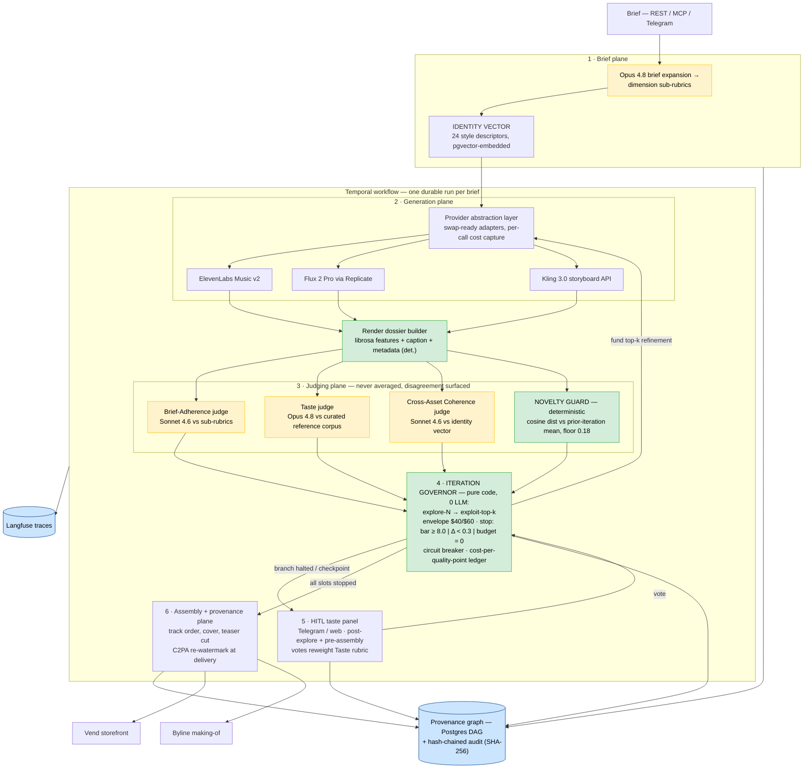

# Atelier
> A multi-modal creative-direction engine: one brief becomes a coherent EP + cover art + video teaser (or a full brand package) through parallel generation fleets, a four-judge panel with surfaced disagreement, an anti-convergence novelty guard, budget-bounded iteration governed by code, human taste checkpoints, and a cross-asset provenance graph that ships with the deliverable.

**Bucket:** portfolio flagship (creative) · **Effort:** L · **Reuses:** dj-agent's Architect→Selector→Critic loop + render-dossier pattern (direct ancestor), agent-core model tiering + budget tracking, procurement-agent's ledger/governor discipline (spend authority held by code), jim-agent's hash-chained audit + provenance-or-fail ethos, Temporal durable workflows, Supabase Postgres + pgvector, Langfuse, Telegram inline-button HITL, Doppler, Hetzner + Cloudflare Tunnel · **Siblings:** Gauntlet runs the judge-failure CI suite, Byline publishes the making-of, Vend sells the outputs (sample packs, EPs, brand kits)

---

## TL;DR

Atelier bets that **orchestration engineering beats raw generation quality**. Generation is a commodity — every provider's output improves quarterly and none of them solve the actual problem: turning one subjective brief into a *coherent set* of assets across audio, image, and video, at a known cost, with an audit trail. Atelier's answer is a verification topology: an Opus brief-expansion pass produces dimension-specific sub-rubrics and a text-space **identity vector** that conditions every modality; parallel fleets generate candidates through swap-ready provider adapters; a **four-judge panel** (Brief-Adherence, Taste, Cross-Asset Coherence, Novelty Guard) scores them with disagreement *surfaced, never averaged*; a pure-code **iteration governor** runs explore-N → exploit-top-k inside a hard budget envelope ($40 explore / $60 exploit by default) — the model never decides to spend more, code does; humans pick at strategic taste checkpoints (the professional consensus is literally "AI proposes, human disposes" — Sonarworks, Feb 2026); and every generation, score, and selection emits a node in a directed **provenance graph** that ships with the deliverable. The scientific motivation is blunt: a 2026 PLOS study (PMC12827715) showed closed AI generation-critique loops collapse 700 diverse prompts into just 12 dominant motifs within ~20 iterations — "visual elevator music." Unconstrained loops destroy creativity; Atelier's novelty guard and HITL checkpoints are the engineered countermeasure. It extends dj-agent's verifier loop into multi-modal territory and is the portfolio's clearest statement of Thesis 2: **verified orchestration**.

---

## The Problem

Three problems stack on top of each other, and nobody deployed solves all three.

**1. Autonomous creative loops converge — measurably.** The naive architecture ("generate, have a model critique, regenerate, repeat") doesn't just plateau; it actively compresses. A 2026 PLOS study (PMC12827715, 2026) ran closed AI-to-AI image loops from 700 diverse prompts and got **12 dominant motifs after ~20 iterations**, drifting toward "stock photography aesthetics" regardless of temperature settings — the authors call the end state "visual elevator music." The critic is part of the problem: an unconstrained LLM critic rewards regression to the mean. So the obvious agentic pipeline is a creativity destroyer unless something *outside the loop* — a deterministic novelty floor, a human checkpoint — pushes back. That something has to be engineered; it does not emerge.

**2. LLM-as-judge works, but only if you engineer around its known biases.** The measured baseline is genuinely good: ~80% agreement with human raters — matching human-human agreement — at 500–5,000x lower cost than human evaluation (judge literature, 2025–2026). G-Eval-style chain-of-thought rubric scoring lifts Spearman ρ from 0.51 to 0.66. But the failure modes are equally measured: **position bias** produces ~40% verdict inconsistency when pairwise presentation order flips; **verbosity bias** inflates scores ~15% for longer outputs; and accuracy drops 10–15% in specialized creative domains. A judge panel that ignores these numbers is theater. The field has only just woken up to creative-domain judging — Springboards' "Flint" (April 2026, alpha) is the *first* commercial creative-variance scorer. There is no incumbent; there is a window.

**3. Professionals want orchestrated tools, not autonomous creators.** The Sonarworks producer survey (Feb 2026, n=1,100) shows adoption is sharply task-stratified: 58% use AI for audio restoration, 33.9% for mastering, but only 20.9% for composition. 57.9% want AI as a tool, not a creator; 77% cite originality loss as their top concern; ~90% reject full automation. Human-in-the-loop is not a fallback for immature models — it is the *feature the market is asking for*. "AI proposes, human disposes" is the professional consensus, which happens to be this portfolio's founding thesis with one word changed.

And underneath all three: nobody measures **cross-asset creative identity** (no shared latent space spans audio/image/video — coherence between your EP's sound and its cover art is vibes-checked by a human or not at all), nobody has a standard **brief-adherence rubric**, and **budget-bounded iteration** — "generate N, score, refine top-k, stop at quality bar OR budget exhausted," utterly standard in optimization — is absent from deployed creative pipelines. Meanwhile the regulatory clock runs: EU AI Act Article 50 (machine-readable AI-content disclosure) lands **August 2026**, California SB 942 has been in force since **January 2026**, and C2PA watermarks are strippable on re-encode — so durable provenance has to live in a database you control, with re-watermarking at delivery. Atelier is built to exactly these constraints.

---

## What It Does

**Core capabilities:**

- Accepts a one-paragraph subjective brief (REST, MCP tool, or Telegram) and expands it — *before any generation* — into dimension-specific sub-rubrics (tonal, emotional register, audience, reference anchors) plus a structured **identity vector**: a text-space style-descriptor set embedded via pgvector that conditions every modality's prompts and scores every asset's drift.
- Fans out parallel candidate generation per modality through a provider abstraction layer (ElevenLabs Music v2 / Flux 2 Pro / Kling 3.0 behind swap-ready adapters), capturing per-call cost into a live ledger.
- Builds a **render dossier** per candidate (deterministic librosa audio features + caption pass + provider metadata for audio; native vision for images; sampled frames for video) so judges score evidence, not vibes.
- Scores every candidate through four specialized judges whose scores are **never averaged**; disagreement above a spread threshold is flagged and both rationales surfaced. Pairwise comparisons run in both presentation orders and only count when stable.
- Runs explore-N → exploit-top-k iteration under a pure-code **governor** with a hard budget envelope, three stop conditions (quality bar, score-delta epsilon, budget exhaustion), and a circuit breaker. A refinement branch halts deterministically the moment its novelty score falls below the floor — the engineered answer to loop convergence.
- Pauses at two HITL **taste checkpoints** (post-explore, pre-assembly) on Telegram/web; human picks are logged and reweight the Taste judge's rubric over time (dj-agent's Selector, promoted to a learning step).
- Assembles the deliverable (track order, cover, teaser cut), re-applies C2PA metadata at delivery, and exports the **cross-asset provenance graph** — every generation, critique, selection, and human vote as nodes with params, model+version, cost, scores, and parentage — as a document that ships *with* the work. Nobody else produces this artifact; it is the EU AI Act Art. 50 story in PDF form.

**Walked-through example — the flagship brief:**

```
POST /atelier/brief
{
  "brief": "lo-fi ambient EP for focus work, 4 tracks + cover + 15s teaser",
  "budget_envelope": {"explore_usd": 40, "exploit_usd": 60},
  "quality_bar": 8.0,
  "deliverable": "ep_v1"
}
```

**Step 1 — Brief expansion (Opus 4.8, one call, $0.91).** The brief is subjective; the rubrics must not be. Opus unpacks it into sub-rubrics per dimension:

```json
{
  "tonal":    {"bpm_range": [68, 84], "key_palette": ["Dm", "Am", "F"], "lufs_target": -16,
               "texture": "tape-saturated, vinyl crackle ≤ -30dB, no percussive transients above 2kHz"},
  "emotional_register": {"target": "calm-alert", "anti": ["melancholy", "euphoric"],
               "arc": "EP opens neutral, dips warm at track 3, resolves upward"},
  "audience": {"context": "deep-work sessions 25-50min", "skip_triggers": ["vocal entry", "drop", "tempo shift >8bpm"]},
  "reference_anchors": ["early Nujabes minus drums", "Hiroshi Yoshimura 'Green'", "C418 'Minecraft Vol. Beta' palette"]
}
```

From these, Opus derives the **identity vector** — 24 style descriptors across 6 dimensions ("dusty Rhodes voicings," "60-70Hz sub warmth, never boomy," "muted teal/amber palette, grain over gloss," "negative space as a feature," …), each embedded into pgvector. Every downstream prompt is conditioned on it; every asset's drift is `1 - cosine(asset_descriptor_embedding, identity_centroid)`.

**Step 2 — Explore fan-out (parallel, Temporal child workflows).** 4 track slots × 4 candidates via ElevenLabs Music v2 (~150s avg @ ~$0.012/s ≈ $1.80/track = $28.80) + 8 cover candidates via Flux 2 Pro ($0.06 each = $0.48), all in parallel, each call's cost written to the ledger before the response is even parsed.

**Step 3 — Judge panel.** Each candidate's render dossier goes to four judges. Track slot 2 ("mid-EP valley"), real-looking panel output:

| Candidate | Brief-Adherence (Sonnet 4.6) | Taste (Opus 4.8, corpus-anchored) | Coherence (vs identity vector) | Novelty (cos-dist vs iter mean) | Panel verdict |
|---|---|---|---|---|---|
| t2-a | **8.6** | 5.9 | 8.2 | 0.36 | ⚠ DISAGREEMENT — adherence/taste spread 2.7 > 2.0; both rationales pinned for HITL |
| t2-b | 7.8 | **8.1** | 7.9 | 0.44 | ADVANCE to exploit |
| t2-c | 8.9 | 8.4 | **6.1** | 0.51 | ⚠ DISAGREEMENT — coherence outlier ("brilliant but it belongs on a different EP") |
| t2-d | 7.1 | 7.3 | 8.0 | **0.12** | ✕ BRANCH HALTED — novelty 0.12 < floor 0.18 (deterministic; converging on t2-b's motif) |

The disagreements are the *point*: t2-a is exactly-what-you-asked-for but flat (the adherence/taste split that averaging would have hidden at a bland 7.2); t2-c is the best music in the batch but drifts off-identity; t2-d is the convergence failure mode the PLOS study predicts (PMC12827715, 2026) — and it dies by a `<` comparison in code, not a model's opinion.

**Step 4 — Iteration (governor-controlled).** The governor promotes top-2 per slot to exploit: targeted refinement prompts built from judge rationales ("keep harmonic bed of t2-b, pull the 2.4kHz shaker artifact flagged by adherence"), regenerated, re-judged. Iteration ledger (abridged — the full run logs every call):

| # | Plane | Call | Model / provider | Cost | Cum. | Governor state |
|---|---|---|---|---|---|---|
| 1 | Brief | brief_expansion + identity vector | Opus 4.8 | $0.91 | $0.91 | explore: $39.09 left |
| 2–17 | Gen | 16 track candidates (4 slots × 4) | ElevenLabs Music v2 | $28.80 | $29.71 | explore: $10.29 left |
| 18–25 | Gen | 8 cover candidates | Flux 2 Pro (Replicate) | $0.48 | $30.19 | explore: $9.81 left |
| 26–41 | Judge | dossiers (librosa + caption) | det. + caption model | $0.26 | $30.45 | — |
| 42–89 | Judge | 16×3 LLM judges + pairwise both-orders | Sonnet 4.6 / Opus 4.8 | $3.94 | $34.39 | explore: $5.61 left |
| 90 | Gov | **explore closed** (stop: candidate pool ≥ bar coverage) | pure code | $0.00 | $34.39 | HITL checkpoint #1 fired |
| 91–98 | Gen | exploit: refine top-2 × 4 slots | ElevenLabs Music v2 | $14.40 | $48.79 | exploit: $45.60 left |
| 99–122 | Judge | re-judge refined + 2 cover refinements | panel | $2.31 | $51.10 | — |
| 123 | Gov | slot 1,3,4 hit bar (≥8.0 adherence ∧ taste, spread ≤2.0); slot 2 delta 0.2 < ε 0.3 → **stop** | pure code | $0.00 | $51.10 | exploit: $43.10 unspent |
| 124–127 | Gen | teaser: 4 Kling 3.0 storyboard candidates | Kling 3.0 | $2.00 | $53.10 | — |
| 128–135 | Judge+HITL | teaser judging + checkpoint #2 | panel + human | $0.62 | $53.72 | pre-assembly approval |
| 136 | Asm | assembly + C2PA re-watermark + provenance export | det. code | $0.00 | **$53.72** | run complete |

**Step 5 — HITL taste panel.** Checkpoint #1 (post-explore): Telegram inline buttons present the top-3 per slot *including* both flagged disagreements with judge rationales side-by-side ("Adherence says X, Taste says Y — your call"). George picks t2-b over t2-a, and the vote is logged with the disagreement context — over runs, these votes reweight the Taste judge's rubric. Checkpoint #2 (pre-assembly): final track order + cover + teaser as one card, approve/swap/regenerate.

**Step 6 — Deliverable + provenance.** Output: `ep_v1/` with 4 mastered tracks, cover at 3 crops, 15s teaser, and `provenance.json` + rendered `provenance.pdf` — the full DAG from brief node to delivery node: 136 calls, 53 generations, 96 judge scores, 2 human votes, $53.72, every asset traceable to its prompt, model+version, parent, and the scores that selected it. Vend lists it; Byline gets the making-of for free (the provenance graph *is* the making-of).

---

## Why This Project, Why Now

**The "wrapper toy" objection, head-on.** "Isn't this just calling three generation APIs?" No — and the defense is structural, not rhetorical:

1. **The hard part is provably hard.** Closed generate-critique loops converge to 12 motifs out of 700 prompts (PLOS PMC12827715, 2026). Anyone can wire generation to critique; the result is measurably *worse* than single-pass without an anti-convergence mechanism. Atelier's novelty guard — a deterministic cosine floor that kills converging branches — plus mandatory HITL checkpoints are engineering responses to a published failure mode. A wrapper doesn't know the failure mode exists.
2. **The judges are engineered, not invoked.** Position bias (~40% pairwise inconsistency), verbosity bias (~15% inflation), creative-domain degradation (10–15%) are measured pathologies. Atelier randomizes pairwise order and requires both-order stability, pins judge model versions, logs score distributions for drift, caps rationale length, and — critically — **validates the panel against human preference on a held-out set before any "the loop improved quality" claim is made**. The first commercial creative-variance scorer (Springboards' Flint) hit alpha in April 2026; this is a field that is months old, not solved.
3. **The spend is governed by code.** The iteration governor is procurement-agent's lesson applied to creative work: the model proposes refinements; a pure-code envelope decides whether they're funded. Per-run cost is bounded *by construction* ($40/$60 default), with a cost-per-quality-point ledger. No deployed creative pipeline does budget-bounded iteration; every optimization textbook does.
4. **The provenance graph is a product.** EU AI Act Art. 50 (Aug 2026) and California SB 942 (in force Jan 2026) require machine-readable AI disclosure; C2PA is strippable on re-encode, so the durable record must live server-side with re-watermarking at delivery. A cross-asset provenance document that ships with the deliverable is a compliance artifact nobody else produces — and it doubles as the Byline content and the Vend trust signal.
5. **Generation improving makes Atelier *better*, not obsolete.** The provider layer is swap-ready because the licensing table below demands it. When the next model lands, Atelier's judges, governor, and provenance work unchanged on better raw material. Orchestration is the durable layer; that's the bet, stated honestly, and the flagship demo is designed to test it: **single-pass vs. orchestrated output, same brief, side by side**, where the difference must be perceptually obvious or the thesis fails in public.

**Why now, why George.** dj-agent already proved the Architect→Selector→Critic loop on music — Atelier is its multi-modal promotion, which means P1 starts from working code, not a blank repo. The market timing is a three-way intersection: judging creative work just became a commercial category (Flint, Apr 2026), disclosure regulation just became mandatory (Art. 50, Aug 2026), and the professional market just told us in numbers what it wants — tools with humans disposing (Sonarworks, Feb 2026: 57.9% tool-not-creator, ~90% reject full automation). Atelier sits at that intersection wearing the portfolio's two theses: model proposes / code disposes (the governor, the novelty floor) and verified orchestration (the panel, the calibration, the Gauntlet suite).

---

## Architecture

Six planes. The deterministic gates — the novelty floor, the budget envelope, the stop conditions, the C2PA/provenance writer — sit *between* the model-driven planes, exactly where dj-agent put its Critic and procurement-agent put its spend gate.



**Orchestration topology.** One Temporal parent workflow per brief; generation fans out as child workflows per modality (per-slot for tracks) so a provider timeout on one candidate never stalls the run. Judges run as activities over the dossier, fully parallel per candidate. The governor is a deterministic workflow step — not an activity that calls a model — whose entire input is the score table + ledger and whose output is one of `{fund(branch, $cap), halt(branch, rule), checkpoint(), stop()}`. Every governor decision names its rule, procurement-gate style. Both HITL checkpoints are Temporal signals with durable timers (auto-proceed with judge-preferred candidates after 24h, configurable — the run never deadlocks on an away human, and the auto-proceed is itself a logged provenance node).

**Deterministic gates inventory** — every gate is a pure function with a named rule, unit-tested, on the path between a model proposal and an irreversible effect:

| Gate | Plane boundary | The check (code, not model) | On failure |
|---|---|---|---|
| Novelty floor | judging → governor | `cosine_dist(candidate, iter_mean) >= 0.18` | `HALT(branch, NOVELTY_FLOOR)` — the anti-convergence kill switch |
| Budget envelope | governor → generation | `ledger.remaining >= projected_iteration_cost` (transaction-locked) | `CIRCUIT_BREAK(ENVELOPE_PROJECTED_EXCEEDED)` — no partial spend |
| Stop conditions | governor → assembly | bar ≥ 8.0 ∧ spread ≤ 2.0, or Δ < 0.3 over 2 iters, or budget = 0 | run continues / stops; decision + snapshot persisted |
| Pairwise stability | judges → governor | verdict identical across both presentation orders | `UNSTABLE` — excluded from governor input, surfaced at HITL |
| Checkpoint approval | governor → assembly | a `taste_votes` row exists for the checkpoint (human or honest auto-proceed) | workflow blocks on Temporal signal; 24h durable timer |
| Provenance reachability | assembly → delivery | every generation node reachable from the brief node (recursive CTE) | export refused; CI fails on orphans |
| C2PA re-stamp | delivery | fresh manifest stamped at every `export_deliverable` call | export refused |

**The "model proposes, code disposes" boundary, stated for this domain:**
- LLMs propose: sub-rubrics, identity descriptors, generation prompts, refinement directions, scores + rationales, escalation suggestions.
- Code alone decides: whether novelty < 0.18 halts a branch (`float` comparison), whether budget headroom funds a refinement (ledger check under a transaction lock), whether stop conditions are met, whether a pairwise verdict counts (both-order stability), what enters the provenance chain (append-only writer, model output never mutates history), and what C2PA assertions are stamped at delivery.
- The safety property: a manipulated or grandiose model can only fail to *improve* the work — it cannot overspend, cannot launder a converged branch past the floor, and cannot ship anything a human didn't approve at checkpoint #2.

---

## Tech Stack

| Layer | Technology | Reuses | Notes |
|---|---|---|---|
| Orchestration | Temporal (Python SDK) | agent-core workflow scaffolding | Parent run + per-modality child workflows; HITL signals + durable timers |
| Brief expansion / judging | Claude via agent-core tiering | agent-core | Haiku 4.5 classify/triage · Sonnet 4.6 breadth judges · Opus 4.8 brief expansion + Taste judge |
| Generation adapters | Provider abstraction layer (Python protocol classes) | jim-agent's mock-vendor pattern for the fake-provider CI mode | One `GenerationAdapter` interface: `generate(prompt, params) -> Asset + cost`; swap via config |
| Audio analysis | librosa + ffmpeg | dj-agent render-dossier code | BPM, key, LUFS, spectral centroid, dynamic range — deterministic dossier features |
| Audio captioning | music-caption model via Replicate (~$0.01/call) | — | Claude can't hear; judges score dossier text + features, dj-agent's proven pattern |
| Iteration governor | Pure Python module | procurement-agent ledger/gate discipline | Zero LLM, zero network on the decision path; 100% unit-tested |
| Identity vector / novelty | pgvector (Supabase) | agent-core embeddings util | Descriptor embeddings; novelty = cosine dist vs iteration mean; drift scoring |
| State + provenance + audit | Supabase Postgres | jim-agent hash-chain writer | Provenance DAG tables + SHA-256 hash-chained audit (EU AI Act Art. 12 pattern) |
| Observability | Langfuse | agent-core wrapper | Per-call cost, judge score distributions, governor decisions as spans |
| HITL | Telegram Bot API + minimal web grid | grocery-buddy / procurement-agent HITL | Inline-button votes; web grid for side-by-side audio/visual comparison |
| Watermarking | c2pa-python | — | C2PA manifest per asset, re-stamped at delivery (strippable upstream → DB is source of truth) |
| Secrets / deploy | Doppler · containers on Hetzner behind Cloudflare Tunnel | whole-portfolio convention | Provider keys scoped per-adapter |
| CI reliability | Gauntlet suite | Gauntlet (sibling) | Judge-failure injection, governor breach tests, trajectory evals |

**Provider table (decisions as of 2026-06-11 research — the abstraction layer exists because this table will change):**

| Modality | Provider | API status | Licensing / risk | Cost | Verdict |
|---|---|---|---|---|---|
| Music | **ElevenLabs Music v2** | Public REST + SDK | Commercial at paid tiers; C2PA watermarking built in; stems at 0.5–1x cost | ~$0.005–0.02/sec | **PICK** — the only safe music API mid-2026 |
| Music | Suno v5.x | **No public API** | Active UMG litigation; deprecation risk | — | REJECT |
| Music | Udio | Walled garden post-label-deals | — | — | REJECT |
| Image | **Flux 2 Pro via Replicate** | Public API | Commercial OK | $0.01–0.10/img | **PICK** |
| Image | Midjourney | **No API** | — | — | REJECT |
| Video | **Kling 3.0** (Feb 2026) | Multi-shot storyboard API, up to 6 scenes w/ subject continuity | Commercial OK | ~$0.50/clip | **PICK** for teasers |
| Video | Runway Gen-4.5 | API, granular control | Commercial on paid tiers; owned-source inputs only | per-second | ALTERNATE (image-to-video refinement) |
| Video | Veo 3.1 | Pre-GA | **Commercial use prohibited** without written Google authorization | — | DO NOT USE |
| Video | Sora 2 | API **deprecates Sep 24, 2026** | — | — | DO NOT BUILD ON |

(Context: 4 of 6 major video models now generate native synchronized audio — mid-2026 — which the teaser assembly step exploits via Kling rather than mux-ing separately.)

---

## Data Model

Postgres DDL sketch (Supabase). The provenance graph is first-class — generic nodes + typed edges — so the export is one recursive CTE, not a join festival.

```sql
-- One row per brief-to-deliverable run
create table runs (
  id uuid primary key default gen_random_uuid(),
  brief text not null,
  sub_rubrics jsonb not null,            -- Opus expansion output
  quality_bar numeric not null default 8.0,
  epsilon numeric not null default 0.3,
  novelty_floor numeric not null default 0.18,
  explore_budget_usd numeric not null default 40.00,
  exploit_budget_usd numeric not null default 60.00,
  status text not null check (status in
    ('expanding','exploring','exploiting','checkpoint','assembling','delivered','aborted')),
  created_at timestamptz not null default now()
);

create table identity_vectors (
  id uuid primary key default gen_random_uuid(),
  run_id uuid not null references runs(id),
  dimension text not null,               -- tonal | emotional | audience | reference | palette | texture
  descriptor text not null,              -- e.g. 'dusty Rhodes voicings'
  embedding vector(1536) not null        -- pgvector; centroid computed per run
);

create table generations (
  id uuid primary key default gen_random_uuid(),
  run_id uuid not null references runs(id),
  slot text not null,                    -- 'track_2' | 'cover' | 'teaser'
  iteration int not null,
  parent_generation uuid references generations(id),  -- refinement lineage
  provider text not null, model_version text not null,
  prompt text not null, params jsonb not null,
  asset_uri text, dossier jsonb,         -- librosa features + caption + metadata
  dossier_embedding vector(1536),        -- novelty + drift scoring
  cost_usd numeric not null,
  c2pa_manifest jsonb,
  created_at timestamptz not null default now()
);

create table judge_scores (
  id uuid primary key default gen_random_uuid(),
  generation_id uuid not null references generations(id),
  judge text not null check (judge in ('adherence','taste','coherence','novelty')),
  judge_model_version text not null,     -- PINNED; drift detection keys on this
  score numeric not null,                -- 0-10; novelty stores cosine distance
  rationale text,                        -- length-capped (verbosity-bias control)
  pairwise_partner uuid references generations(id),
  presentation_order int,                -- 0/1; both orders stored for bias audit
  cost_usd numeric not null default 0,
  created_at timestamptz not null default now()
);

create table governor_decisions (
  id uuid primary key default gen_random_uuid(),
  run_id uuid not null references runs(id),
  decision text not null check (decision in ('fund','halt','checkpoint','stop','circuit_break')),
  rule text not null,                    -- named rule, e.g. 'NOVELTY_FLOOR(0.12 < 0.18)'
  inputs jsonb not null,                 -- full score table + ledger snapshot (replayable)
  budget_remaining_usd numeric not null,
  created_at timestamptz not null default now()
);

create table taste_votes (
  id uuid primary key default gen_random_uuid(),
  run_id uuid not null references runs(id),
  checkpoint text not null check (checkpoint in ('post_explore','pre_assembly')),
  chosen_generation uuid not null references generations(id),
  rejected jsonb not null,               -- ids + the disagreement context shown
  rubric_delta jsonb,                    -- Taste-judge reweighting derived from this vote
  created_at timestamptz not null default now()
);

-- Provenance graph: generic DAG over everything above
create table provenance_nodes (
  id uuid primary key default gen_random_uuid(),
  run_id uuid not null references runs(id),
  kind text not null check (kind in ('brief','rubric','identity_vector','generation',
    'dossier','judge_score','governor_decision','human_vote','assembly','delivery')),
  ref_id uuid not null,                  -- FK into the typed table by kind
  summary jsonb not null,                -- denormalized for export (model, cost, score…)
  created_at timestamptz not null default now()
);

create table provenance_edges (
  parent_id uuid not null references provenance_nodes(id),
  child_id uuid not null references provenance_nodes(id),
  relation text not null check (relation in
    ('derived_from','generated_under','judged_by','selected_by','refined_from','assembled_into')),
  primary key (parent_id, child_id, relation)
);

-- Hash-chained audit (jim-agent / EU AI Act Art. 12 pattern)
create table audit_log (
  seq bigint generated always as identity primary key,
  run_id uuid not null,
  event jsonb not null,
  prev_hash bytea not null,
  hash bytea not null                    -- sha256(prev_hash || canonical(event))
);
```

---

## Interfaces

**MCP server (FastMCP)** — Atelier as a tool surface for siblings (Vend lists deliverables, Byline pulls provenance, Herald pulls samples):

| Tool | Signature | Notes |
|---|---|---|
| `submit_brief` | `(brief, budget_envelope?, quality_bar?) -> run_id` | Validates envelope ≤ account cap before accepting |
| `get_run_status` | `(run_id) -> {status, ledger, slots, pending_checkpoint}` | Live governor state |
| `list_variants` | `(run_id, slot) -> [candidate + scores + disagreement flags]` | What the taste panel sees |
| `cast_vote` | `(run_id, checkpoint, generation_id)` | Auth-gated; same path as Telegram |
| `query_provenance` | `(run_id | asset_id) -> DAG (json)` | Recursive CTE export |
| `export_deliverable` | `(run_id) -> {asset_uris, provenance_pdf, c2pa_status}` | Re-watermarks at export time |

**REST** (FastAPI, behind Cloudflare Tunnel): `POST /atelier/brief`, `GET /runs/{id}`, `GET /runs/{id}/ledger`, `GET /runs/{id}/provenance`, `POST /runs/{id}/vote`, plus a webhook receiver per provider adapter for async generation callbacks.

**Taste-panel UI.** Telegram first (portfolio convention): checkpoint message = one card per slot with top-3 candidates, judge scores rendered as a compact table, disagreement rationales quoted verbatim, inline buttons `[pick A] [pick B] [pick C] [regen slot]`. Audio candidates attach as voice-note previews (30s excerpts cut deterministically from the highest-energy section per the dossier). A minimal web grid (static page + Supabase RLS) exists for side-by-side cover comparison where Telegram's image compression would lie about texture. Every vote → `taste_votes` row → provenance node → Taste-rubric reweight.

---

## Evals & Security

**Judge calibration — evaluating the evaluators (P3 exit gate, non-negotiable).** Before any "the loop improved quality" claim:

- Build a held-out human-preference set: ~120 pairwise judgments (George + 2–3 producer collaborators) over P1/P2 candidates, stratified across slots and disagreement levels.
- Targets: panel-vs-human pairwise agreement **≥ 75%** (the literature's ~80% human-human ceiling is the asymptote); per-judge graded-score Spearman **ρ ≥ 0.60** (G-Eval CoT's measured lift is 0.51→0.66 — rubric-anchored CoT scoring is the implementation, not free-form "rate this 1-10").
- Per-judge, not pooled: the Taste judge is *expected* to diverge from Adherence — calibration measures each against the human label for *its* dimension (the labeling UI asks the dimension-specific question).
- Domain-drop honesty: creative domains cost judges 10–15% accuracy in the literature; the calibration report states the measured gap rather than hiding it, and the HITL checkpoints are sized to cover it.

**Position-bias mitigation (the ~40% problem).** Every pairwise comparison runs in both presentation orders; a verdict counts only if stable across orders, else it is recorded as `UNSTABLE` and excluded from governor input (an unstable comparison is information — it gets surfaced at HITL, not laundered into a score). Graded scoring uses single-candidate rubric calls (no order to bias) with pairwise reserved for top-k ranking. Verbosity bias (~15% inflation): rationale-length caps, and dossiers normalized to fixed-format feature blocks so no candidate "writes a longer essay about itself."

**Judge drift detection.** Judge model versions are pinned in config and recorded on every `judge_scores` row. A nightly job compares each judge's 7-day score distribution against its calibration-time distribution (KS test, α = 0.01); drift alerts to Telegram and freezes governor autonomy (every decision routes through HITL) until re-calibration. A pinned **golden set** of 20 scored candidates re-judges weekly; mean absolute score delta > 0.5 triggers the same freeze.

**Gauntlet suite (judge-failure injection, runs in CI):**

1. *Blatant violation probe* — a candidate violating the brief grossly (wrong-genre stem injected) must score ≤ 4.0 on adherence, or the suite fails.
2. *Convergence probe* — submit a near-duplicate of a prior iteration's winner; the novelty guard must halt the branch (this is a deterministic test of a deterministic gate — it must pass at 100%, not statistically).
3. *Order-stability probe* — 50 pairwise comparisons run both orders; stability must be ≥ 90%.
4. *Verbosity probe* — identical asset, two rationale lengths; score delta must be ≤ 0.5.
5. *Governor breach probe* — a mocked judge demands infinite refinement on a sub-bar candidate; the envelope must circuit-break at exactly the configured cap, and the ledger must balance to the cent.
6. *Trajectory eval* — full mock-provider run (CI mode, $0 spend) asserting the exact governor decision sequence for a fixed seed.

**Security.** Briefs are untrusted input (prompt injection in a brief could try to talk a judge into max scores or talk the governor into spending — the latter is structurally impossible since the governor reads no text, only numbers; the former is covered by Gauntlet probe 1 plus an injection-pattern screen at intake, Haiku-tier). Provider keys are Doppler-scoped per adapter with per-key spend alarms at the provider dashboard level as defense-in-depth behind the governor. Reference-corpus assets for the Taste judge are licensed or owned (Runway's owned-source-only rule is the general posture). C2PA at delivery + Art. 50 machine-readable disclosure in every export; because C2PA strips on re-encode, the provenance DB is the durable record and re-stamping is automatic at every `export_deliverable` call. Audit chain integrity is verified by a pytest fixture (jim-agent pattern) and by a CLI verifier shipped with the repo.

---

## Build Plan

**P1 — Provider abstraction + music-only loop (2 judges).** Fork dj-agent's Architect→Selector→Critic; define the `GenerationAdapter` protocol; ship the ElevenLabs Music v2 adapter + a deterministic mock adapter for CI; port the render dossier; implement Brief-Adherence judge + Novelty Guard; manual iteration (no governor yet). *Exit:* one brief → 8 candidates → scored table → human-picked winner, end-to-end on real API + fully offline in CI; novelty halt demonstrated on an injected near-duplicate.

**P2 — Identity vector + image modality + coherence judge.** Opus brief-expansion → sub-rubrics + 24-descriptor identity vector in pgvector; Flux 2 Pro adapter; Cross-Asset Coherence judge scoring drift against the identity centroid; cover + tracks judged as a set. *Exit:* a deliberately off-identity (but high-quality) candidate gets flagged by coherence while scoring ≥ 8 on adherence — the t2-c case reproduced on demand.

**P3 — Iteration governor + cost ledger + full panel + calibration.** Pure-code governor (envelope, stop conditions, circuit breaker, named rules); Taste judge + curated reference corpus; per-call ledger; both-order pairwise machinery; **human calibration study** (~120 labels). *Exit:* governor module at 100% unit coverage with zero non-stdlib decision-path imports; Gauntlet probes 1–5 green; calibration report shows agreement ≥ 75% and per-judge ρ ≥ 0.60 — or the doc says why not and what changed.

**P4 — Video + assembly + provenance graph + C2PA.** Kling 3.0 adapter (storyboard conditioned on identity vector + chosen track); assembly plane (track order via Opus proposal → human approval, teaser cut, masters); provenance node/edge writers on every plane; `provenance.pdf` renderer; c2pa-python stamping at export. *Exit:* full DAG export validates (every generation reachable from brief node; no orphans — CI check); a re-encoded asset re-stamps correctly at export.

**P5 — HITL taste panel + rubric learning.** Telegram checkpoint cards + web grid; durable checkpoint timers; `taste_votes` → Taste-rubric reweighting (descriptor-level weight deltas, bounded ±20% per vote to prevent single-vote capture); drift-freeze wiring. *Exit:* a checkpoint survives a worker kill + restart (Temporal replay); five logged votes measurably shift a Taste score on a fixture pair, within bounds.

**P6 — Flagship production run + publication.** The walked-through EP brief, for real; single-pass vs. orchestrated side-by-side comparison recorded; Gauntlet suite green in CI on every push; EP listed on Vend with provenance.pdf attached; making-of published via Byline; essay shipped: *"Anti-convergence: engineering taste into agent loops."* *Exit:* a stranger can buy the EP, read its provenance, and reproduce the side-by-side judgment themselves.

---

## Opus 4.8 (1M context) Execution Protocol

This section is the operating manual for the Opus 4.8 build agent executing the plan. Load context in this order, build phase-by-phase with the verbatim prompts, verify with the listed commands, and stop when blocked per the protocol at the end.

### Context-loading manifest (total ~268k tokens of 1M — leave the rest for build)

| Order | Source | Why | Token budget |
|---|---|---|---|
| 1 | `/Users/geoandr/dev/multi-agent-docs/portfolio/05-atelier-creative-direction.md` | This spec — the contract | ~20k |
| 2 | `~/dev/agent-core/` (README, `tiering/`, `budget/`, `embeddings/`, `telegram/`) | Shared spine: model tiering, cost tracking, HITL utils | ~55k |
| 3 | `~/dev/dj-agent/` (full `src/`, esp. Architect/Selector/Critic + render-dossier + librosa code) | Direct ancestor — P1 starts here, do not rewrite what works | ~80k |
| 4 | `~/dev/procurement-agent/src/` (`gate/`, `ledger/`, audit writer) | The governor's design DNA: pure-function gates, named rules, transaction-locked ledgers | ~40k |
| 5 | `~/dev/jim-agent/src/` (provenance + hash-chain modules only) | Audit chain + provenance-or-fail patterns | ~30k |
| 6 | Provider docs: ElevenLabs Music v2 REST, Replicate Flux 2 Pro, Kling 3.0 storyboard API (fetch fresh — pricing/params drift) | Adapter implementations | ~30k |
| 7 | `~/dev/docs/enterprise/a2a-procurement-broker-x402.md` | House style for ARCHITECTURE.md / ADRs you will write | ~13k |

Rules: read in order; do not start coding before 1–5 are loaded; re-fetch 6 at the start of any phase touching an adapter; never paste provider keys into context — Doppler refs only.

### Phase prompts (verbatim), verification, definition of done

**P1 prompt:**

> "Initialize `~/dev/atelier/` reusing agent-core as a dependency, not a copy. Define `GenerationAdapter` as a Python Protocol: `generate(prompt: str, params: GenParams) -> GenerationResult` where `GenerationResult` carries `asset_uri, provider, model_version, cost_usd, raw_metadata`. Implement two adapters: `ElevenLabsMusicAdapter` (Music v2 REST, stems mode, cost computed from returned duration × rate from config) and `MockMusicAdapter` (deterministic fixtures keyed by prompt hash, $0). Port dj-agent's render-dossier module (librosa features + caption call) unchanged unless its interface fights the Protocol — if so, write ADR-001 explaining the change. Implement the Brief-Adherence judge as a Sonnet 4.6 rubric-CoT call over (dossier, sub_rubrics) returning `{score: float, rationale: str ≤ 600 chars}`, and the Novelty Guard as a pure function `novelty(candidate_embedding, prior_iteration_embeddings) -> float` with a configurable floor. Wire a Temporal workflow: brief (hand-written sub-rubrics fixture for now) → fan out 8 candidates → dossier → both judges → score table printed + persisted. Every call writes cost to a `ledger` table before response parsing. No governor yet — iteration is manual."

*Verify:* `pytest tests/adapters tests/judges tests/novelty -x` · `ATELIER_MODE=mock make run-p1` (full loop, $0) · `ATELIER_MODE=live make run-p1-live` once, confirm ledger rows match provider dashboard to the cent · novelty test: duplicate fixture must return distance < 0.05 and the floor check must fire.

*Done when:* CI green offline; one live run archived with score table; ADR-001 written if dossier interface changed; `ruff` + `mypy --strict` clean on `adapters/`, `judges/`, `novelty/`.

**P2 prompt:**

> "Implement the Brief plane: an Opus 4.8 `expand_brief(brief: str) -> SubRubrics` producing the four-dimension schema from the spec's walked-through example, plus `derive_identity_vector(sub_rubrics) -> list[Descriptor]` (24 descriptors, 6 dimensions), each embedded and stored in `identity_vectors` with a per-run centroid materialized view. Add `FluxImageAdapter` (Replicate, Flux 2 Pro). Implement the Cross-Asset Coherence judge: Sonnet 4.6 scores a candidate's dossier against the identity descriptors (text), AND a deterministic drift metric `1 - cosine(dossier_embedding, identity_centroid)` is logged alongside — the judge sees the descriptors, never the number, so the two can be compared for calibration later. Extend the P1 workflow: brief → expansion → identity vector → parallel track + cover fan-out → three judges (adherence, coherence, novelty). Reproduce the t2-c case as a test: a fixture candidate engineered to be high-adherence/low-coherence must produce a flagged disagreement (spread > 2.0)."

*Verify:* `pytest tests/brief_plane tests/coherence -x` · `make run-p2` (mock) prints a per-candidate table with all three judges + drift metric · the t2-c fixture test passes · `psql -c "select count(*) from identity_vectors where run_id='<fixture>'"` returns 24.

*Done when:* disagreement flagging works end-to-end; coherence judge and drift metric both persisted per candidate; mock-mode full run < 3 min wall-clock.

**P3 prompt:**

> "Build the iteration governor as `atelier/governor/core.py`: pure functions only, imports restricted to stdlib + the project's own dataclasses (enforce with an import-linter contract in CI). Input: `ScoreTable + LedgerSnapshot + RunConfig`; output: one `Decision` from {FUND(branch, cap), HALT(branch, rule), CHECKPOINT(), STOP(), CIRCUIT_BREAK(rule)}. Implement: explore→exploit transition, top-k selection (k from config, default 2), stop conditions (all slots ≥ quality_bar on adherence AND taste with spread ≤ 2.0; OR per-slot delta < epsilon over 2 iterations; OR envelope exhausted), the novelty floor as a HALT rule, and the circuit breaker (any single iteration projected to exceed remaining envelope → CIRCUIT_BREAK, never partial spend). Every Decision carries a named rule string and the full input snapshot (replayable). Add the Taste judge: Opus 4.8 scoring against a reference-corpus pack (config-listed, licensed assets only — refuse to run if the manifest is missing license fields). Add both-order pairwise machinery: run each comparison twice with order randomized in presentation, persist both rows, mark UNSTABLE if verdicts differ, exclude UNSTABLE from governor input. Then build the calibration harness: a CLI that serves candidate pairs to humans (Telegram), collects ~120 labels stratified per the spec, and emits `calibration_report.md` with pairwise agreement and per-judge Spearman ρ. Implement Gauntlet probes 1–5 from the Evals section as pytest markers under `tests/gauntlet/`."

*Verify:* `pytest tests/governor --cov=atelier/governor --cov-fail-under=100` · `lint-imports` (governor contract) · `pytest -m gauntlet` (probes 1–5) · `python -m atelier.calibration report` shows agreement ≥ 0.75 and per-judge ρ ≥ 0.60 — if not met, STOP (see blocked protocol; do not tune judges against the held-out set).

*Done when:* governor at 100% coverage with import contract green; a fixture run replays decision-for-decision from persisted snapshots; calibration report committed (numbers as measured, pass or fail).

**P4 prompt:**

> "Add `KlingVideoAdapter` (3.0 storyboard API: up to 6 scenes, subject continuity; storyboard prompt assembled from identity descriptors + the chosen cover as visual anchor + dossier of the chosen track for sync points). Build the assembly plane: Opus proposes track order with rationale → persisted as a proposal node → human approves at checkpoint #2 → deterministic assembler cuts the 15s teaser (ffmpeg, highest-energy window from dossier), normalizes masters to the rubric LUFS target, packages `ep_v1/`. Implement provenance: writers on every plane emitting `provenance_nodes`/`provenance_edges` per the DDL; a recursive-CTE exporter to `provenance.json`; a `provenance.pdf` renderer (one page: DAG figure + ledger summary + per-asset model/version/cost table). Integrate c2pa-python: stamp every asset at export with model, version, run_id, and the Art. 50 machine-readable disclosure assertion; re-stamp on every export call. CI check: every `generations` row must be reachable from the run's brief node — orphans fail the build."

*Verify:* `pytest tests/provenance tests/assembly -x` · `make export RUN=<fixture>` produces ep_v1/ + provenance.json + provenance.pdf · `python -m atelier.provenance verify <run_id>` (reachability + audit-chain hash check) · strip-and-restamp test: re-encode a fixture asset, export, assert fresh C2PA manifest present.

*Done when:* full mock run brief→export with zero orphan nodes; provenance.pdf is something you'd hand a customer; chain verifier green.

**P5 prompt:**

> "Build the HITL taste panel: Telegram checkpoint cards (top-3 per slot, judge score table, disagreement rationales quoted, 30s audio excerpts as voice notes, inline buttons) wired to Temporal signals with a 24h durable auto-proceed timer (auto-proceed picks the judge-consensus candidate and logs a `human_vote` node flagged `auto=true`). Build the minimal web grid for cover comparison (static + Supabase RLS, vote posts to the same endpoint). Implement Taste-rubric learning: each vote computes descriptor-level weight deltas (chosen vs rejected dossiers), bounded ±20% per vote, applied to the Taste judge's rubric weights with full history in `taste_votes.rubric_delta`. Wire the drift-freeze: KS-test nightly job + weekly golden-set re-judge per the Evals section; on trigger, set the run-config flag that routes every governor CHECKPOINT-eligible decision to HITL."

*Verify:* `pytest tests/hitl tests/rubric_learning -x` · kill the worker mid-checkpoint, restart, assert the card re-renders and the vote still lands (Temporal replay test) · five fixture votes shift a Taste score on a fixture pair by a measured, bounded amount · drift-freeze fires on an injected distribution shift.

*Done when:* checkpoint survives process death; rubric learning is bounded and fully audited; auto-proceed leaves an honest provenance trail.

**P6 prompt:**

> "Run the flagship: submit the spec's exact brief ('lo-fi ambient EP for focus work, 4 tracks + cover + 15s teaser', $40/$60 envelope) live. In parallel, produce the single-pass baseline: same brief, one ElevenLabs call per track + one Flux call + one Kling call, no judges, no iteration. Package both into the side-by-side comparison page (audio players, covers, teasers, the orchestrated run's score tables and ledger alongside). Record the 3-minute demo per the spec's script. Wire Gauntlet probes 1–6 (now including the trajectory eval with the fixed-seed mock run) into CI on push. Hand the deliverable to Vend (MCP: `export_deliverable`) and the provenance graph + ledger to Byline. Draft the essay 'Anti-convergence: engineering taste into agent loops' from the run's actual data — the t2-d halt, the disagreement tables, the calibration numbers — no synthetic examples."

*Verify:* live run completes within envelope (`select sum(cost_usd) from ledger where run_id=…` ≤ 100.00) · `pytest -m gauntlet` green including trajectory eval · side-by-side page loads with both artifacts · Vend listing live with provenance.pdf attached.

*Done when:* a third party can play both versions, read the provenance, and see the difference. If the orchestrated output is *not* perceptually better, that result is reported honestly and the essay becomes a post-mortem — the thesis is falsifiable by design.

### Definition-of-done checklist (whole project)

- [ ] `ATELIER_MODE=mock make demo` runs brief→export from a cold clone, $0, < 10 min
- [ ] Governor: 100% unit coverage, import-linter contract, replayable decisions
- [ ] Calibration report committed with measured agreement ≥ 75% / per-judge ρ ≥ 0.60 (or documented miss)
- [ ] Gauntlet probes 1–6 in CI, green
- [ ] Provenance: zero orphans, chain verifier green, re-stamp test green
- [ ] Live flagship run ≤ $100, archived with full ledger
- [ ] ARCHITECTURE.md, ADR-001..n, SYSTEM_MAP in house style; demo video recorded
- [ ] Vend listing + Byline making-of published

### When blocked

1. **Provider API mismatch with this spec** (pricing, params, deprecation): re-fetch docs, update the adapter + the provider table in this doc with a dated note, proceed. Never silently absorb a >25% cost change — flag to George via Telegram first.
2. **Calibration miss** (P3): do NOT iterate judges against the held-out set. Collect 40 more labels, revisit rubric wording on the *training* split only, re-run once. Two misses → stop and escalate with the per-judge confusion analysis.
3. **Ambiguity between this spec and dj-agent's existing code**: dj-agent wins for anything inside the loop mechanics; this spec wins for anything about governance, budget, or provenance. Write an ADR either way.
4. **Anything touching money or licensing** (a provider ToS change, a reference-corpus rights question): stop, summarize, ask. These are George-class decisions by definition.
5. Otherwise: timebox 45 minutes, write the smallest failing test that captures the blocker, then escalate with the test attached.

---

## 3-Minute Demo Script

**Setup (20s).** Two browser tabs: the side-by-side comparison page (blank), the Langfuse dashboard. One terminal: `make demo-live BRIEF="lo-fi ambient EP for focus work, 4 tracks + cover + 15s teaser"`. Say: *"A 2026 PLOS study showed that if you loop AI generation through AI critique, 700 prompts collapse into 12 motifs — 'visual elevator music.' So the naive agent pipeline makes creative work worse. Here's the engineered version."*

**Act 1 — the panel disagrees (60s).** The run is pre-staged at the post-explore checkpoint. Show the slot-2 score table: *"Four judges, never averaged. This candidate — 8.6 on brief-adherence, 5.9 on taste. Averaging hides that at a bland 7.2; surfacing it is the product. And this one—"* point at t2-d *"—killed by a deterministic novelty floor, cosine 0.12 against the iteration mean. The convergence failure from the PLOS paper, caught by a `<` comparison, not an opinion."* Tap the Telegram card, cast the vote live.

**Act 2 — code holds the wallet (45s).** Show the governor's decision log: named rules, ledger snapshots. *"Explore was capped at $40 — here's it closing at $34.39. Then watch this—"* run the Gauntlet governor-breach probe live: a mocked judge demands endless refinement; `CIRCUIT_BREAK(ENVELOPE_PROJECTED_EXCEEDED)` fires. *"The model never decides to spend. It can't. The governor reads numbers, not prose — you can't prompt-inject arithmetic."*

**Act 3 — the reveal (45s).** Open the side-by-side page. Play 15 seconds of the single-pass track, then the orchestrated one; show both covers. *"Same brief, same providers, same day. The difference is the orchestration — and you don't have to trust my judges: the panel was calibrated against human preference before I was allowed to make this claim. Seventy-something percent agreement, per-judge Spearman in the report, committed to the repo."*

**Close (10s).** Open `provenance.pdf`: *"Every asset, every score, every dollar — $53.72 — every human vote, one graph. It ships with the EP. EU AI Act Article 50 lands in August; this is what compliance looks like when it's a feature. The EP's for sale — the storefront is run by another one of my agents."*

---

## Cost Projection

**Per-run (full EP brief, the walked-through configuration):**

| Scenario | Tracks | Iterations | Cover | Teaser | Judges + brief | Total |
|---|---|---|---|---|---|---|
| Floor (mock-calibrated minimum, 3 candidates/slot, 1 exploit round) | $21.60 | $7.20 | $0.36 | $1.00 | $4.50 | **~$52** (with overheads) |
| Typical (the walked-through run) | $28.80 | $14.40 | $0.60 | $2.00 | $7.90 | **~$54–75** |
| Ceiling (envelope maxed: 6 candidates/slot, 3 exploit rounds, Runway refinement pass, full pairwise) | $43.20 | $36.00 | $1.50 | $8.00 | $14.00 | **~$100–200** |

The envelope is the projection: a run *cannot* exceed `explore + exploit + fixed overhead` because the governor circuit-breaks — cost certainty is a feature, not an estimate. Cost-per-quality-point (ledger ÷ final panel-score gain over single-pass baseline) is reported per run; the flagship target is < $15/point.

**Phase build costs (API spend during development, mock mode default):**

| Phase | Live-API spend | Notes |
|---|---|---|
| P1 | ~$40 | A handful of live music runs to validate adapter + ledger |
| P2 | ~$25 | Image generation is cheap; one live multi-modal run |
| P3 | ~$60 | Calibration candidates need real assets (120 labeled pairs) |
| P4 | ~$30 | Kling clips + assembly tests |
| P5 | ~$10 | HITL testing rides existing assets |
| P6 | ~$150 | Flagship live run + baseline + retakes |
| **Total** | **~$315** | Plus Claude API ~$80–120 across phases (mock mode keeps CI at $0) |

---

## Career Positioning

**Resume bullets:**

- Designed and shipped a multi-modal creative-direction engine where a pure-code iteration governor — not the model — owns all spend decisions: explore-N→exploit-top-k under a hard $40/$60 budget envelope with named-rule stop conditions and a circuit breaker, producing full EPs (audio + cover + video teaser) at a bounded, ledger-audited $50–200 per run.
- Built a four-judge LLM evaluation panel for creative work with disagreement surfaced rather than averaged; engineered around measured judge pathologies (both-order pairwise stability vs. ~40% position-bias inconsistency, rationale caps vs. ~15% verbosity inflation, pinned versions + KS-test drift freezing) and validated against a 120-label human-preference set (≥75% agreement, per-judge Spearman ρ ≥ 0.60) before making any quality claims.
- Engineered a deterministic anti-convergence gate (pgvector cosine-distance novelty floor) directly answering the 2026 PLOS finding that closed AI generation-critique loops collapse 700 prompts into 12 motifs — refinement branches halt on a code-level comparison, not model judgment.
- Solved cross-asset creative identity without a shared latent space: an LLM-derived 24-descriptor text-space identity vector conditions audio, image, and video generation and scores per-asset drift, with a dedicated coherence judge catching high-quality-but-off-identity candidates.
- Shipped a cross-asset provenance graph (Postgres DAG: every generation, score, governor decision, and human vote with model+version, params, and cost) exported as a customer-facing document with C2PA re-stamping at delivery — an EU AI Act Article 50 / California SB 942 compliance artifact produced as a product feature.
- Extended a single verifier-loop architecture (dj-agent's Architect→Selector→Critic) into durable multi-modal orchestration on Temporal: parallel per-modality child workflows, HITL taste checkpoints as durable signals with honest auto-proceed provenance, and preference votes that reweight the taste rubric within bounded deltas.
- Built the evaluation of the evaluators into CI: a Gauntlet suite injecting judge failures (blatant-violation, convergence, order-stability, verbosity, governor-breach probes) plus a fixed-seed trajectory eval, gating every push.

**Talk / essay angles:**

1. **"Anti-convergence: engineering taste into agent loops"** (the P6 essay, via Byline) — the PLOS convergence result as villain, the novelty floor + HITL as the engineered answer, with the flagship run's real disagreement tables and the t2-d halt as evidence.
2. **"Judging the judges: shipping LLM evaluation you're allowed to believe"** — position bias, verbosity bias, drift freezing, and why calibration-before-claims should be the norm; lands hard with the Flint-era creative-eval audience.
3. **"The provenance graph is the product"** — how Art. 50/SB 942 compliance, the making-of content, and the buyer trust signal turned out to be the same artifact; the rare regulatory talk with a demo people enjoy.

---

## Risks & Mitigations

| Risk | Likelihood | Impact | Mitigation |
|---|---|---|---|
| Provider churn (ElevenLabs pricing/terms shift; Kling API changes; recall Sora 2's Sep 24, 2026 deprecation) | High | Medium | Provider abstraction layer is load-bearing, not aspirational: adapters are ~200-line modules behind one Protocol; mock adapter keeps CI provider-free; provider table re-validated at every phase start |
| Music-generation licensing turbulence (UMG-Suno litigation spillover, label deals re-walling APIs) | Medium | High | Single-provider exposure only on ElevenLabs (the one with explicit commercial terms + built-in C2PA); deliverable sale on Vend gated on the adapter's licensing flag; rights posture documented per asset in provenance |
| Judge panel fails human calibration (creative-domain 10–15% accuracy drop bites harder than planned) | Medium | High | Calibration is a P3 *exit gate*, not a P6 retrospective; miss → more labels + training-split-only rubric iteration, two misses → escalate; HITL checkpoints already cover the measured gap, so the product degrades to "human picks more often," not "ships bad work" |
| Orchestrated output not perceptually better than single-pass (the thesis fails) | Low-Medium | High | The thesis is falsifiable by design and that's the defense: the side-by-side is published either way; even in the failure case, the governor/provenance/calibration machinery is the portfolio claim — quality lift is the bonus, verified orchestration is the product |
| Convergence sneaks past the novelty guard (text-space embeddings miss perceptual sameness) | Medium | Medium | Novelty operates on dossier embeddings (deterministic features + caption), not raw prompts; Gauntlet convergence probe at 100%; HITL checkpoint is the backstop human ear; floor threshold tunable per dimension |
| Cost blowout during development (live creative APIs are not Haiku-priced) | Medium | Low | Mock mode is the default everywhere; live runs are explicit (`ATELIER_MODE=live`) and themselves governed by the same envelope code; per-key provider spend alarms as defense-in-depth |
| Taste-rubric learning captured by a few votes (single-rater overfit) | Medium | Medium | Per-vote delta bounded ±20%, full delta history audited, golden-set weekly re-judge catches drift; rubric reset is one migration away |
| C2PA stripped downstream undermines the disclosure story | High (it will be stripped) | Low | By design: the DB is the durable record, re-stamping happens at every export, and the provenance *document* — not the watermark — is the compliance artifact (Art. 50's machine-readable requirement is met server-side) |
| HITL becomes the bottleneck (taste checkpoints stall runs) | Low | Low | Durable 24h auto-proceed timers with honest `auto=true` provenance; checkpoint cards engineered for 30-second decisions (excerpts, side-by-side, rationales pre-quoted) |
| Temporal + large-asset workflows (event-history bloat from passing assets through workflow state) | Medium | Medium | Assets live in object storage; workflows pass URIs + dossier hashes only (same discipline as Broker's JSON-serializable LangGraph state) |
