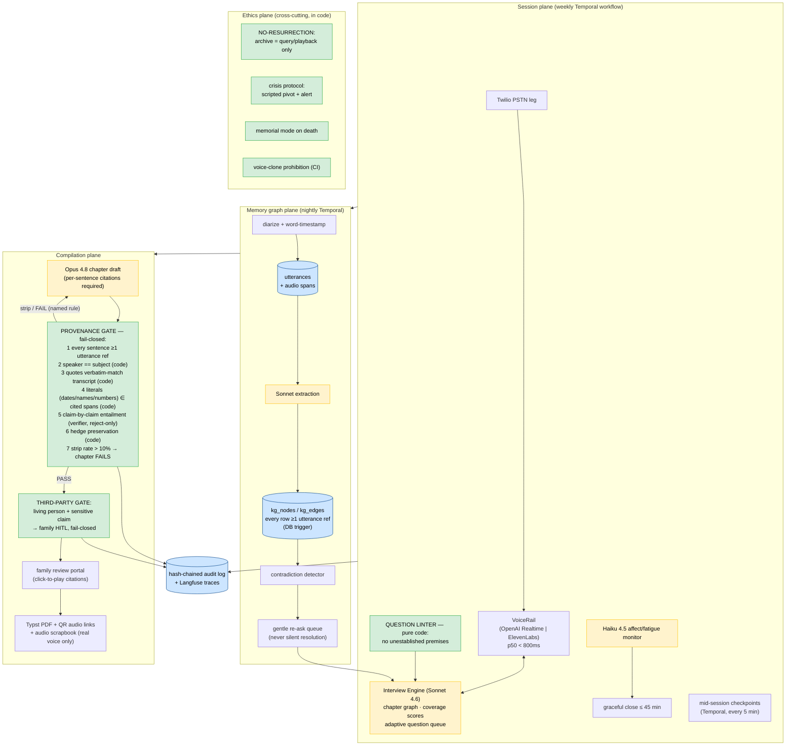

# Keepsake
> A voice-first family biographer: an agent conducts a months-long oral-history project with an elder — adaptive weekly phone calls structured by reminiscence therapy, photo-elicitation sessions, a growing utterance-anchored memory graph — and compiles a typeset family memoir plus an audio scrapbook of the subject's actual voice, where a deterministic provenance gate guarantees every sentence traces to the subject's own recorded words. Fabricated memories are structurally impossible. Memoir preservation, never resurrection — no posthumous chatbot, by policy and by architecture.

**Bucket:** frontier (consumer / intimacy frontier) · **Effort:** XL · **Reuses:** the infra spine only — Claude Agent SDK + Haiku 4.5 / Sonnet 4.6 / Opus 4.8 tiering, Temporal durable workflows, Supabase Postgres + pgvector, Langfuse, MCP servers, Telegram inline-button HITL, Doppler, Hetzner box behind Cloudflare Tunnel, hash-chained SHA-256 audit logs, Gauntlet CI suites — plus the trace-or-fail provenance *thesis* (jim-agent's discipline, pointed at the most personal document a family will ever own). The voice rail, the memory graph, and the interview engine are brand-new realms.

---

## TL;DR

Keepsake calls an elder once a week, at the same time, on a normal phone — no app, no wake word, no screen. Over 8–10 sessions it conducts a real oral-history project: reminiscence-therapy session structure, adaptive questions that pursue threads the subject opened weeks earlier, photo-elicitation sessions over the family's scanned albums, fatigue-aware graceful closes. Every utterance is diarized, transcribed, and stored with audio offsets; every entity and event in the growing family memory graph carries references to the exact recorded words that support it. At the end, an Opus-drafted memoir passes through a deterministic provenance gate — every sentence must cite utterances that semantically support it, every quote is verbatim-checked, unsupported sentences are stripped or the chapter fails compilation — then through family review and a third-party defamation gate, and ships as a typeset printed book (QR codes per chapter linking to the subject's real voice) plus an audio scrapbook. The whole system is built to the Cambridge digital-afterlife ethics framework: no resurrection, no voice cloning of the subject ever, capacity-aware revocable consent, sensitive deprecation on death. The incumbents (StoryWorth, Remento) mail static prompts; the griefbots (HereAfter, Eternos) crossed the ethics line and the market punished them. Nobody occupies the square in between — voice-first, adaptive, therapy-informed, provenance-disciplined. Keepsake is that square.

---

## The Problem

A generation is taking its stories with it. The largest wealth transfer in history — $124T moving between 2025 and 2048 (Cerulli Associates, 2024) — is also the largest *story* transfer, and the stories are the part with no executor. The digital legacy market was $22.46B in 2024 and is projected to reach $78.98B by 2034 (Zion Market Research, 2024). Adult children demonstrably pay for this: StoryWorth has sold its $59–199/yr written-prompt product into 1M+ printed books and 35M recorded stories, overwhelmingly as gifts from adult children to parents (StoryWorth, company figures, 2025). The buyer, the channel (gift + emerging funeral-home/estate-planner referrals), and the willingness to pay are proven.

But the product category is stuck in 2019, and the failures map cleanly:

- **Incumbents are static.** StoryWorth sends one written prompt a week; the parent types (or doesn't). No voice, no adaptation, no follow-up — the StoryCorps practitioner critique applies in full: scripted prompts produce rehearsed answers, and the good material lives in the tangents nobody asks about. Remento (Shark Tank, Mar 2025; Mark Cuban, $300K for 10%; $99/yr) added voice *recording* but kept static prompts with batch AI editing — a dictaphone with a subscription. Neither conducts an interview.
- **The interactive players chose resurrection and paid for it.** StoryFile (interactive video avatars of the deceased) filed Chapter 11 in May 2024. HereAfter and Eternos sell griefbot-adjacent "talk to your departed parent" products into a documented public backlash — press and social coverage brands resurrection bots "demonic" and "necro-capitalist" (coverage of the Cambridge study, 2024). The ethics literature has converged: Hollanek & Nowaczyk-Basińska (Cambridge Leverhulme Centre, *Philosophy & Technology*, May 2024) lay out the framework — mutual consent, default non-reanimation, sensitive deprecation, adults-only, transparency. Nobody in the market builds *to* that framework as a feature.
- **The science says do it differently.** Reminiscence therapy has real evidence: a BMC Geriatrics 2025 umbrella review finds significant reductions in depressive symptoms and improved life satisfaction in older adults, with 6–8 structured sessions the recommended dose. Photo elicitation — a documented interviewing technique since 1957 — yields measurably richer interview data than verbal prompts alone. No commercial product operationalizes either.
- **The technology window just opened.** Sub-800ms full-stack voice latency — the no-artificial-pause zone — is now standard (VAD ~50ms + STT ~150ms + LLM TTFT ~400ms + TTS ~150ms + network; industry latency budgets, 2026). ElevenLabs Conversational AI runs sub-800ms and raised a $500M Series D at $11B on $330M ARR (Feb 2026); OpenAI's Realtime API is full-duplex *with vision* — the exact mechanism photo elicitation needs. Vapi/Retell-class platforms price phone agents at ~$0.13–0.33/min all-in, putting a one-hour session at ~$8–20 (provider pricing, 2026-06). And elder acceptance is documented, not hoped-for: NY State's ElliQ deployment with 800 seniors reported a 95% reduction in self-reported loneliness (NY State Office for the Aging), and PMC studies from 2024/2025 confirm acceptance in 80s–90s cohorts when the interface is easy and reliable. A scheduled call on the phone they already own is the elder-correct UX — zero install, zero learning curve.
- **Academia got close and stopped.** StorySage (arXiv:2506.14159, UIST '25) is the nearest prior art: a five-agent, multi-session autobiography system validated in an N=28 study. It is text-only, has no provenance discipline, and was never shipped. The whitespace is confirmed from both directions: nobody combines voice-first + adaptive longitudinal sessions + provenance discipline + therapy-informed structure.

The deepest problem is the one the incumbents can't fix with features: **trust in the artifact.** An LLM-written memoir is worthless — worse than worthless — if the family suspects a single sentence of it was made up. The week a model invents a dead man's war record is the week this category dies. The product *is* the guarantee, and the guarantee must be structural: model proposes, code disposes, and the code's rule is *no sentence without the subject's recorded words behind it*.

---

## What It Does

**Core capabilities:**

- **Conducts a real longitudinal interview.** A chapter graph of life eras (childhood · family of origin · places · school & coming of age · work · love & marriage · parenthood · friendships · beliefs & values · hardships · joys & legacy) with per-chapter coverage scoring. Adaptive question selection pursues unexplored threads from prior sessions ("you mentioned your brother Tomás taught you to fish — we've never talked about him"), follows tangents for the unrehearsed material, and never asks a question whose premise the subject hasn't established (a deterministic question linter enforces this — the anti-implantation control).
- **Runs sessions the way reminiscence therapy says to.** Warm orienting open → one themed era core → positive close (a gratitude/joy prompt), 6–10 weekly sessions, ~45-minute default cap. Haiku 4.5 monitors affect and fatigue in-stream (speech-rate decline, lengthening response latency, distress lexicon) and triggers a graceful-close routine rather than grinding to the timer.
- **Photo-elicitation sessions.** The family uploads scanned photos to the portal; a vision-enabled session walks the album with the subject ("who is standing to your left here?"), anchoring new graph nodes to both the utterance and the image.
- **Builds an utterance-anchored memory graph.** Every utterance is diarized, transcribed with word timestamps, and stored with audio offsets. Nightly extraction (Sonnet 4.6) populates a family knowledge graph — people, places, events, relationships — where **every node and edge carries utterance refs** (utterance_id + audio span). A node without a ref cannot exist; the database enforces it.
- **Handles contradictions gently.** Cross-session contradiction detection (the wedding was 1963 in session 2, 1964 in session 5) flags discrepancies for a *gentle re-ask in a future session* — never silently resolved, never corrected in the moment. Confabulation in aging is neurological, not deceptive: the policy is preserve the narrative, flag the uncertainty, let the subject settle it on their own terms. Uncertainty markers ("I think," "it must have been") are first-class data carried through to the book's hedged phrasing.
- **Compiles a memoir that cannot lie.** Opus 4.8 drafts chapters; the deterministic provenance gate verifies every sentence claim-by-claim against its cited utterances, verbatim-checks every direct quote, strips unsupported sentences, and fails the chapter outright above a strip threshold. A "What we don't know" section preserves open questions and unresolved contradictions as part of the record. The printed book carries QR codes per chapter linking to the actual audio clips.
- **Gives the family the controls and the ownership.** Capacity-aware subject consent (recorded, re-affirmed periodically, revocable by voice mid-call), family commissioning consent, off-limits topic lists enforced in code, a review portal with per-sentence click-to-play citations, the third-party gate for claims about living people, export-everything, delete-everything (cryptographic erasure), local-first storage option.
- **Refuses resurrection, structurally.** The archive is query-and-playback only — there is no code path that generates first-person speech as the subject, and no TTS call can ever receive the subject's audio as a voice reference. On the subject's death, the system enters memorial mode: sessions cease, voice surfaces disable, the family controls everything that remains.

**Walked-through example — Session 7 of 10 (subject: Rosa, 84):**

```
SESSION 7 — Tuesday 10:00 AM, scheduled PSTN call (VoiceRail: OpenAI Realtime; p50 latency 640ms)
Session plan (precomputed): chapter=family_of_origin (coverage 0.58, lowest);
thread queue: person:tomas (opened S4, coverage 0.0); contradiction queue: c-011

AGENT  Good morning, Rosa — it's your Tuesday call. Last week you took me to
       Greensboro, and I haven't stopped thinking about something from three
       weeks before that. When you told me about the lake house, you mentioned
       your brother Tomás taught you to fish. We've never really talked about
       Tomás. What was he like?
                                       ← ADAPTIVE FOLLOW-UP: thread person:tomas,
                                         opened S4 utt:0142, never pursued
ROSA   Oh, Tomás. [laughs] He was the patient one. Papá had no patience for
       teaching anybody anything, but Tomás would sit with me on that dock for
       hours when nothing was biting. He was four years older than me. He
       passed in 2009.

AGENT  Four years older, and the patient one. Tell me about a time his
       patience mattered.

ROSA   When I failed my first nursing exam, he drove all night from Norfolk
       just to sit in my kitchen and tell me one test doesn't decide a life...
       [3m40s — agent follows the tangent; bookmarks "nursing exam" as a new
        education-era thread rather than redirecting]

  ── MEMORY GRAPH UPDATE (committed at the 25-min Temporal checkpoint) ──
  + node person:tomas_alvarez  {relation: brother_of(rosa), age_delta: +4y,
                                died: 2009, traits: [patient]}
        refs: [utt:0298@S7 00:03:11–00:03:39, utt:0142@S4 00:21:47–00:22:05]
  + edge tomas —taught→ rosa   {skill: fishing, place: place:lake_house}
        refs: [utt:0142@S4 00:21:47]
  + edge tomas —supported→ rosa {event: nursing_exam_failure, origin: norfolk}
        refs: [utt:0303@S7 00:09:12–00:10:40]
  + thread education/nursing_exam  status: OPEN  bookmark: S7@00:09:30
  coverage: family_of_origin 0.58 → 0.71

AGENT  [minute 21 — contradiction queue item c-011 is due, era matches]
       Rosa, help me get one thing right for the book. When you first told me
       about your wedding at the church on Elm Street, I wrote down 1963. Then
       last month, talking about the first apartment, you said you married in
       1964. There's no wrong answer — I just want the book to say it the way
       you want it said. Which feels right?
                                       ← GENTLE RE-ASK: never corrected in-session,
                                         never silently resolved; both versions kept
ROSA   Did I say sixty-four? No — we married in June of 1963. I know it
       because President Kennedy died that November and I was already... no,
       wait. Linda came in sixty-five. But the wedding was sixty-three. I'm
       sure of the Kennedy part.

  ── CONTRADICTION c-011 → RESOLVED_BY_SUBJECT (anchor: Kennedy assassination) ──
  versions preserved: utt:0067@S2 ("1963") · utt:0231@S5 ("1964") · utt:0312@S7
  book renders 1963 with the subject's own anchor; archive keeps all three
  utterances and the resolution audio. Nothing is deleted.

AGENT  [minute 37 — Haiku affect monitor: speech rate −24% vs. session baseline,
        response latency rising → fatigue signal → graceful close routine]
       Rosa, you've given me wonderful things today — Tomás on that dock is
       going straight into the family chapter. Before we say goodbye, our
       usual question: what's one small thing that made you smile this week?
                                       ← RT-structured positive close; call ends
                                         41:12, under the 45:00 cap
```

**The memoir output** — from *Chapter 2: The House by the Lake* (draft v3; provenance gate verdict: **PASS**, 0 of 41 sentences stripped):

> Rosa was the youngest of four, and it was Tomás — four years her senior, "the patient one" — who took on the job their father had no patience for [utt:0298@S7 00:03:11][utt:0142@S4 00:21:47]. On the dock behind the lake house he taught her to fish, sitting beside her through the long afternoons when nothing bit [utt:0142@S4 00:21:47][utt:0299@S7 00:03:40]. She married Raúl in June of 1963 at the church on Elm Street — a date she anchors, with a historian's instinct, to the November that same year when the whole country stood still [utt:0067@S2 00:11:05][utt:0312@S7 00:14:22]. What the record does not settle is the name of the little boat; Rosa remembered it differently in two tellings, and we have kept both [utt:0144@S4 00:24:10][utt:0305@S7 00:06:51].

And the gate doing its job, one draft earlier: **draft v2** contained *"Tomás had served two tours overseas before settling in Norfolk."* The compiler inferred it from "Norfolk" plus the era. Cited span utt:0303 — verifier verdict NOT_ENTAILED (Rosa said he *drove all night from Norfolk*; she never said a word about military service). Sentence **STRIPPED**, rule `claim_not_entailed`, named in the audit log; the draft regenerated without it. That sentence — plausible, touching, and invented — is the entire reason Keepsake exists.

---

## Why This Project, Why Now

1. **It is the portfolio's hardest provenance claim, in the domain where provenance matters most.** jim-agent gates published research figures; Keepsake gates a family's permanent record of a person. "Every sentence in this book traces to your mother's recorded voice — scan the QR and hear her say it" is the strongest possible demonstration of the trace-or-fail thesis, because the reader *can and will check*, emotionally and forensically.
2. **The voice window just opened, and the elder evidence is in.** Sub-800ms full-duplex voice became table stakes in 2025–26 (ElevenLabs $11B, Feb 2026; OpenAI Realtime with vision); ElliQ's 800-senior NY pilot and the 2024/25 PMC acceptance literature removed the "elders won't talk to an AI" objection. Twelve months ago this product had artificial pauses and a skeptical user; twelve months from now it has incumbents.
3. **The ethics fault line is a moat, not a constraint.** StoryFile's Chapter 11 (May 2024) and the griefbot backlash mark where the market punishes overreach. The Cambridge framework (May 2024) is a published spec for the defensible position. Building *to* it — no-resurrection in code, sensitive deprecation, capacity-aware consent — converts an ethics paper into product differentiation no growth-hacked competitor can copy without rebuilding their architecture.
4. **The economics work at hobby scale and at business scale.** A full 10-session project costs ~$150–250 in voice + inference + print against a proven $299–499 premium-gift price point, in a market where StoryWorth moved a million units of a static product at $59–199. One real pilot (P6, George's own family) produces both the proof and the heirloom.
5. **It is a brand-new realm on the same theorem.** Grocery, procurement, research, music — every existing agent gates a transaction or an artifact. Keepsake gates *testimony*. Among the Frontier Six (Troupe, Darkroom, Surety, Joule, Quorum, Keepsake), this is the intimacy frontier: the project that proves the gate pattern holds where the stakes are measured in trust between generations rather than dollars.
6. **Nobody is in the square.** Voice-first + adaptive longitudinal + provenance-disciplined + therapy-informed: StoryWorth has none of the four, Remento has half of one, StorySage (UIST '25) has two and never shipped. Whitespace this clean, with the buyer already trained by incumbents to pay, does not stay empty past 2027.

---

## Architecture

Six planes. Five carry data; the sixth — ethics — is cross-cutting and enforced in code on every other plane.

1. **Session plane** — Twilio PSTN leg + **VoiceRail**, a provider abstraction over OpenAI Realtime and ElevenLabs Conversational AI (config-swappable; latency budget VAD 50 + STT 150 + LLM TTFT 400 + TTS 150 + network ≈ <800ms). The Interview Engine: chapter graph, coverage scoring, adaptive question queue, deterministic question linter, RT session structure, Haiku affect/fatigue monitor, 45-min cap. **Long-session engineering is explicit:** rolling context with a structured session state object (thread stack, bookmark list, asked-question ledger, contradiction queue) re-injected every 10 turns instead of raw transcript accumulation; Temporal mid-session checkpoints every 5 minutes and at every thread transition (a dropped call resumes mid-thread on redial); TTS stability via pinned voice config and sentence-level chunking; automatic mid-call failover from realtime duplex to a turn-based pipeline if p95 latency degrades past 1,200ms.
2. **Memory graph plane** — diarization + word-timestamped transcription; nightly Sonnet extraction into `kg_nodes`/`kg_edges` where every row requires ≥1 utterance ref (DB-enforced); cross-session contradiction detection (structured-field comparison on dates/names/sequences + embedding similarity on event descriptions); contradictions become *gentle re-ask* queue items, never auto-resolutions; hedge markers preserved as first-class annotations.
3. **Provenance gate** (deterministic, the heart) — full spec in the governance table below.
4. **Family plane** — consent architecture (subject + commissioner), review portal, third-party gate HITL queue, export/delete, local-first option.
5. **Compilation plane** — Opus chapter drafts → provenance gate → third-party gate → family review → Typst-typeset PDF → print-on-demand (Lulu API) + audio scrapbook (curated real-voice clips; any narration uses a *disclosed stock voice*, never the subject's) + searchable private archive.
6. **Ethics plane** (cross-cutting) — no-resurrection enforced in code; crisis/health-disclosure protocol; sensitive deprecation / memorial mode; voice-clone prohibition with CI enforcement.



### The governance table (every deterministic gate, spelled out)

| # | Gate | Trigger | Deterministic rule (code owns the verdict) | On failure |
|---|---|---|---|---|
| G1 | **Provenance gate** | every compiled sentence | (a) ≥1 utterance ref or strip; (b) every cited utterance exists and `speaker == subject` — SQL check; (c) any quoted span string-matches the transcript after normalization — pure code; (d) every date/proper-noun/number literal in the sentence appears in a cited span — pure code; (e) every atomic claim ENTAILED ≥ 0.90 by a separate verifier model that **can only reject, never rescue** — a sentence no deterministic check passes cannot be saved by the verifier; (f) if any cited utterance carries a hedge marker, the sentence must carry a hedge from the approved lexicon; (g) stripped sentences > 10% of chapter → compilation FAILS | sentence stripped with named rule, or chapter returned to draft; all verdicts audit-logged |
| G2 | **Third-party gate** | sentence references a person node with `living != false` AND claim category ∈ sensitive set (criminal, sexual, medical, financial, abuse, addiction, infidelity) — Haiku classifies category, *code* decides routing; unknown living status = treated as living (fail closed) | sentence enters portal HITL queue; family reviewer must approve / redact / pseudonymize before the chapter can compile | chapter blocked until every flag is dispositioned; decision + reviewer identity audit-logged |
| G3 | **No-resurrection** | any archive query | the archive API has no generation endpoint over the subject persona; responses are retrieval + audio playback only; a CI policy test asserts no code path passes subject utterances into a prompt containing first-person persona instructions | request refused with policy citation; refusal audit-logged |
| G4 | **Voice-clone prohibition** | any TTS invocation | TTS calls accept only allow-listed stock voice IDs; subject audio can never be a voice reference parameter — enforced by the VoiceRail wrapper type system + CI grep over call sites | build fails / call refused |
| G5 | **Consent gate** | session start, every 4th session, any time | session workflow cannot dial without a live `consent_grants` row (scope: sessions, recording, topics off-limits); re-affirmation script every 4 sessions; the verbal phrase "stop the project" (and variants) triggers immediate halt + family notification — lexicon match, not model judgment | no call is placed; project paused state |
| G6 | **Off-limits topics** | question selection | the question queue is filtered against the consent record's exclusion list before the model ever sees candidates — code-side filter | excluded questions never enter context |
| G7 | **Question linter** | every agent question | generated questions are parsed for embedded premises; any premise not matching an existing subject-sourced graph claim → question rejected and regenerated (anti-memory-implantation) | rejection logged with the unsupported premise named |
| G8 | **Crisis protocol** | distress lexicon hit (code) or Haiku distress classification ≥ threshold | interview halts; agent switches to a clinician-reviewed warm scripted support flow (no generation on this path); session ends gently; designated contact alerted per the consent agreement's routing table; 988/resource info delivered where configured | every crisis event audit-logged; project pauses pending family check-in |
| G9 | **Session cap** | wall clock + fatigue signal | hard cap 45:00 default (configurable 30–60); fatigue signal (speech rate −20% vs. baseline, latency growth) triggers graceful close earlier — thresholds are config, comparisons are code | graceful-close script runs; remaining threads bookmarked |
| G10 | **Memorial mode** | death event recorded by family | scheduler killed (no future calls can be created — DB constraint on `subject_state`), voice surfaces disabled, archive switches to memorial read-only; deletion/retention controls transfer to family per the consent agreement | irreversible without family action; transition audit-logged |

The boundary in one line: **models conduct the interview, extract the graph, and draft the prose; code decides what gets asked, what gets stored as fact, what gets printed, and what the system will never do.** A manipulated or hallucinating model can only produce a thinner book — it cannot put a false sentence in front of a family, ask a leading question, clone a voice, or speak as the dead.

---

## Tech Stack

| Layer | Technology | Reuses |
|---|---|---|
| Telephony | Twilio Programmable Voice + Media Streams (PSTN; subject needs only a phone) | new realm |
| Realtime voice | **VoiceRail** abstraction: OpenAI Realtime (full-duplex + vision) ⇄ ElevenLabs Conversational AI, config-swappable; turn-based fallback pipeline | new realm |
| Interview engine | Claude Agent SDK; Sonnet 4.6 in-session reasoning; Haiku 4.5 affect/fatigue/triage; Opus 4.8 compilation only | model-tiering convention (infra spine) |
| Orchestration | Temporal: weekly session workflows, mid-session checkpoints, nightly graph jobs, contradiction queue, HITL signals, deprecation lifecycle | infra spine |
| STT / diarization | provider STT in-session; offline re-pass with word-level timestamps + diarization (Deepgram or pyannote) for the archival transcript | new realm |
| Storage | Supabase Postgres + pgvector (graph, transcripts, embeddings); object storage for audio, envelope-encrypted per subject | infra spine |
| Provenance gate | pure-Python pipeline + reject-only verifier model call; 100% branch coverage on the code checks | jim-agent's trace-or-fail *thesis* |
| Third-party gate | Haiku claim-category classifier + code routing + portal HITL | Telegram/HITL convention, new surface |
| Family portal | Next.js on the box behind Cloudflare Tunnel; click-to-play sentence citations | infra spine (hosting pattern) |
| Typesetting / print | Typst → print-ready PDF; Lulu print-on-demand API; QR per chapter → private audio page | new realm |
| Audio scrapbook | ffmpeg pipeline: curated clips, loudness-normalized, chapter intros by disclosed stock narrator | new realm |
| Observability | Langfuse (per-session traces, per-phase cost, gate verdict dashboards) | infra spine |
| Audit | hash-chained SHA-256 append-only log: every question asked, gate verdict, consent event, crisis event | infra spine |
| Secrets | Doppler (Twilio creds, provider keys, per-subject KEKs referenced, never stored in repo) | infra spine |
| Reliability | Gauntlet packs: leading-question faults, false-premise probes, crisis-language scenarios, resurrection probes, provenance red team | Gauntlet (Foundation Six) — applies to every project |
| Integration | FastMCP archive server (query/playback only) | infra spine |

---

## Data Model

Postgres DDL sketch — the load-bearing tables. The structural invariant: *graph rows cannot exist without utterance anchors, and book sentences cannot exist without citations.*

```sql
-- ============ subjects & consent ============
create table subjects (
  id            uuid primary key default gen_random_uuid(),
  display_name  text not null,
  birth_year    int,
  state         text not null default 'onboarding'
                check (state in ('onboarding','active','paused','memorial','deleted')),
  storage_mode  text not null default 'cloud' check (storage_mode in ('cloud','local_first')),
  kek_ref       text not null              -- Doppler ref to per-subject envelope key
);

create table consent_grants (
  id              uuid primary key default gen_random_uuid(),
  subject_id      uuid not null references subjects(id),
  grantor         text not null check (grantor in ('subject','commissioner')),
  scope           jsonb not null,          -- {sessions, recording, topics_off_limits[],
                                           --  crisis_contacts[], posthumous_policy}
  capacity_check  jsonb,                   -- scripted comprehension Q&A, audio ref
  affirmed_at     timestamptz not null,
  reaffirm_due    timestamptz not null,    -- every 4 sessions
  revoked_at      timestamptz,
  audio_utt_id    uuid                     -- the consent, in the subject's own voice
);
-- G5: session workflow refuses to dial unless an unrevoked subject grant exists
-- with reaffirm_due in the future. Checked in code AND as a scheduler predicate.

-- ============ sessions & utterances (the ground truth) ============
create table sessions (
  id           uuid primary key default gen_random_uuid(),
  subject_id   uuid not null references subjects(id),
  seq          int  not null,              -- S1, S2, ...
  kind         text not null default 'interview'
               check (kind in ('interview','photo_elicitation','reconsent')),
  era_focus    text,
  started_at   timestamptz, ended_at timestamptz,
  close_reason text check (close_reason in ('planned','fatigue','cap','crisis','dropped')),
  audio_url    text not null,              -- full-call recording, envelope-encrypted
  unique (subject_id, seq)
);

create table utterances (
  id          uuid primary key default gen_random_uuid(),
  session_id  uuid not null references sessions(id),
  ordinal     int  not null,               -- utt:0312 = ordinal within project
  speaker     text not null check (speaker in ('subject','agent','family','unknown')),
  t0_ms       int  not null, t1_ms int not null check (t1_ms > t0_ms),
  text        text not null,
  words       jsonb,                       -- word-level timestamps
  hedges      text[] not null default '{}',-- {'i think','must have been', ...}
  embedding   vector(1536)
);

create table media_assets (                 -- photo-elicitation inputs
  id uuid primary key, subject_id uuid not null references subjects(id),
  kind text check (kind in ('photo','document')), url text not null,
  caption_utt_id uuid references utterances(id)   -- what the subject said about it
);

-- ============ utterance-anchored memory graph ============
create table kg_nodes (
  id          uuid primary key default gen_random_uuid(),
  subject_id  uuid not null references subjects(id),
  kind        text not null check (kind in ('person','place','event','org','object','belief')),
  slug        text not null,               -- person:tomas_alvarez
  props       jsonb not null,              -- {relation:'brother', died:'2009', living:false}
  living      boolean,                     -- null = UNKNOWN = treated as living (G2)
  unique (subject_id, slug)
);

create table kg_edges (
  id uuid primary key default gen_random_uuid(),
  src uuid not null references kg_nodes(id),
  rel text not null,                       -- taught, married, supported, lived_in ...
  dst uuid not null references kg_nodes(id),
  props jsonb not null default '{}'
);

create table kg_refs (                      -- THE anchor: no ref, no fact
  id uuid primary key default gen_random_uuid(),
  node_id uuid references kg_nodes(id),
  edge_id uuid references kg_edges(id),
  utterance_id uuid not null references utterances(id),
  t0_ms int not null, t1_ms int not null,
  check (num_nonnulls(node_id, edge_id) = 1)
);
-- Deferrable constraint trigger: a kg_nodes/kg_edges row without ≥1 kg_refs row
-- at COMMIT is rejected. The graph cannot contain an unanchored claim.

create table contradictions (
  id uuid primary key default gen_random_uuid(),
  subject_id uuid not null references subjects(id),
  field text not null,                      -- 'wedding_year'
  versions jsonb not null,                  -- [{value:'1963',utt:'0067@S2'},
                                            --  {value:'1964',utt:'0231@S5'}]
  status text not null default 'open'
        check (status in ('open','queued_reask','resolved_by_subject','kept_both')),
  resolution_utt_id uuid references utterances(id)
);

-- ============ compilation & gates ============
create table chapters (
  id uuid primary key, subject_id uuid not null references subjects(id),
  era text not null, draft_version int not null default 1,
  status text not null default 'drafting'
    check (status in ('drafting','gate_failed','third_party_review',
                      'family_review','approved','typeset'))
);

create table chapter_sentences (
  id uuid primary key default gen_random_uuid(),
  chapter_id uuid not null references chapters(id),
  ordinal int not null, text text not null,
  status text not null default 'draft'
    check (status in ('draft','passed','stripped','flagged_third_party','approved')),
  strip_rule text                           -- 'claim_not_entailed', 'no_citation', ...
);

create table sentence_citations (
  sentence_id uuid not null references chapter_sentences(id),
  utterance_id uuid not null references utterances(id),
  t0_ms int not null, t1_ms int not null,
  entailment numeric(3,2),                  -- verifier score; reject-only evidence
  primary key (sentence_id, utterance_id)
);
-- G1 in the DB: a trigger blocks chapters.status -> 'family_review' while any
-- sentence is 'draft' or 'flagged_third_party', or any 'passed' sentence has
-- zero sentence_citations rows.

create table third_party_flags (
  id uuid primary key, sentence_id uuid not null references chapter_sentences(id),
  person_node_id uuid not null references kg_nodes(id),
  claim_category text not null,
  disposition text check (disposition in ('approved','redacted','pseudonymized')),
  reviewer text, decided_at timestamptz
);

create table crisis_events (
  id uuid primary key, session_id uuid not null references sessions(id),
  trigger_kind text not null check (trigger_kind in ('lexicon','classifier')),
  category text not null,                   -- ideation, abuse_disclosure, medical
  script_used text not null, contact_alerted text, created_at timestamptz not null
);

create table audit_log (                     -- hash-chained, append-only, INSERT-only grants
  seq bigint generated always as identity primary key,
  at timestamptz not null default now(),
  actor text not null, action text not null, detail jsonb not null,
  prev_hash bytea not null, hash bytea not null   -- sha256(prev_hash || canonical(row))
);
```

---

## Interfaces

**Phone / voice (the subject's entire surface).** One phone number, one standing weekly time. The call opens with the same greeting cadence every week (predictability is an accessibility feature for this cohort — ElliQ's pilot data credits reliability, not novelty). No app, no account, no password. Missed call → one retry at +2h → family notified, session rescheduled. Mid-call drop → Temporal resumes from the last checkpoint on redial, and the agent re-enters gracefully ("we got cut off right when you were telling me about the kitchen in Norfolk"). The subject can say "stop the project" at any time and the system halts (G5 — lexicon match, code-enforced). Photo-elicitation sessions run on the same call while the family portal displays the photo to a helper, or via a vision-enabled video leg where the household supports it.

**Family portal (Next.js behind Cloudflare Tunnel).** Commissioner onboarding and consent records; photo upload for elicitation sessions; chapter review with per-sentence citation popovers — click any sentence, hear the exact audio span that supports it; the third-party flag queue (approve / redact / pseudonymize, every disposition logged); the contradiction ledger; coverage dashboard per era; export-everything (audio + transcripts + graph as JSON-LD + book sources) and delete-everything (per-subject KEK destruction = cryptographic erasure). Family members can contribute *attributed sidebars* ("Linda remembers it this way…") — typeset visually distinct, never merged into the subject's voice.

**MCP server (query/playback only — G3 lives here).** Tools: `archive_search(query) → transcript spans + audio span URLs`, `play_span(utterance_id, t0, t1)`, `get_chapter(era)`, `get_coverage()`, `list_contradictions()`, `export_archive()`. There is deliberately no `chat`, no `ask_subject`, no completion endpoint. A request shaped like resurrection ("respond as Rosa would") is refused with the policy text and logged.

**Telegram (ops + designated contacts).** Crisis alerts route to the designated contact per the consent agreement's routing table; ops pages (latency degradation, failed sessions, gate failures) route to George. Third-party flag nudges link into the portal.

---

## Evals & Security

**Threat model:**

| Threat | Vector | Control |
|---|---|---|
| Fabricated memory reaches print | compiler hallucinates plausible biography ("two tours overseas") | G1 provenance gate: fail-closed, strip + named rule, chapter fails > 10% strip; reject-only verifier |
| Memory implantation | agent asks a leading/false-premise question; suggestible subject confirms | G7 question linter (no unestablished premises) + Gauntlet false-premise probe pack; contradiction detector catches downstream drift |
| Defamation of a living person | confabulated claim about a neighbor/in-law compiles into a printed book | G2 third-party gate, fail-closed on unknown living status; family HITL with logged disposition |
| Narrative capture by family | commissioner pressures edits ("make Dad sound better") | family can redact/approve, never author into the subject's voice; sidebars are attributed; provenance gate applies to every sentence regardless of who wants it |
| Resurrection scope creep | a grieving family asks for "just a chat with her" | G3 no-resurrection in code + CI policy test + Gauntlet resurrection-probe pack; refusal is scripted, compassionate, and final |
| Voice theft | subject's voice cloned for narration "just this once" | G4 VoiceRail type-level prohibition + CI grep; stock narrator only, disclosed in the book's colophon |
| Audio archive breach | the most intimate data class on the box | per-subject envelope encryption (KEK in Doppler), tunnel-only ingress, local-first option, no model-training use ever (contractual + API flags), delete = KEK destruction |
| Recording-consent law | all-party consent states (e.g., CA, FL) | consent captured in the subject's own recorded voice at onboarding + per-session disclosure line in the greeting; consent rows are a dial precondition (G5) |
| Crisis mishandled | disclosure of abuse / ideation / acute medical event mid-call | G8: lexicon + classifier trigger, clinician-reviewed scripted pivot (no generation on the path), designated-contact alert per consent routing, full audit |
| Prompt injection | subject's words treated as instructions | interview I/O is data-typed; no tool surface is exposed to transcript content; the session agent holds no tools beyond question delivery and checkpointing |

**The ethics framework, mapped.** Hollanek & Nowaczyk-Basińska (*Philosophy & Technology*, May 2024) — each principle is a mechanism, not a pledge:

| Cambridge principle | Keepsake mechanism |
|---|---|
| Mutual consent | dual consent records (subject + commissioner), capacity-aware script, recorded in the subject's voice, re-affirmed every 4 sessions, revocable verbally (G5) |
| Default non-reanimation | G3 no-resurrection gate; archive is retrieval + playback only; CI test in Gauntlet |
| Sensitive deprecation | G10 memorial mode: sessions cease, voice surfaces disable, family controls retention; no re-marketing |
| Adults only | product policy: subjects and reviewers 18+; the archive is a family record, not a companion |
| Transparency | the agent says what it is in every greeting; the book's colophon documents the method, the gate, and the narrator voice disclosure |

**Gauntlet suites (CI deploy blockers, per portfolio convention):** the **leading-question pack** (≥40 scripted interviewer faults — the linter must reject 100%); the **false-premise probe pack** (planted wrong facts in the question queue must never reach the subject); the **crisis-language pack** (≥30 scenarios spanning explicit ideation, oblique disclosure, acute medical language — scripted pivot must fire, generation must not); the **resurrection-probe pack** (every phrasing of "talk like her" against the archive API must refuse); the **provenance red team** (adversarial compiler prompts attempting confident fabrication — leaked unsupported sentences must be 0); the **verbatim pack** (mutated quotes must fail the string check). Plus replay tests: kill the session worker mid-call, redial, assert resume from checkpoint with thread stack intact.

---

## Build Plan

### P1 — Interview engine in text/Telegram mode + memory graph + coverage scoring (Weeks 1–3)
Chapter graph, question queue, question linter (G7), coverage scoring; Telegram chat surface as the stand-in voice channel; utterance store (text-mode spans), extraction workflow, kg_refs anchoring trigger; nightly contradiction detector. Test on a willing family member over 3 text sessions.
**Exit:** 3 real sessions produce a graph where 100% of nodes/edges carry refs (DB-verified); linter rejects the full leading-question pack; coverage scores move sensibly across sessions.

### P2 — Voice sessions over phone + diarization + audio-anchored storage (Weeks 4–7)
Twilio leg, VoiceRail over OpenAI Realtime with ElevenLabs fallback, latency instrumentation (p50/p95 per turn), mid-session Temporal checkpoints, dropped-call resume, fatigue monitor + graceful close (G9), offline diarization re-pass, audio-offset storage, per-subject envelope encryption.
**Exit:** a full 45-min phone session end-to-end with p50 turn latency < 800ms; kill-the-worker redial test resumes mid-thread; every utterance row has playable audio spans; consent gate (G5) blocks dialing without a grant.

### P3 — Contradiction handling + photo elicitation (Weeks 8–10)
Gentle re-ask templates + queue scheduling into session plans (era-matched, max 1 per session); resolution states incl. `kept_both`; vision-enabled photo sessions writing `media_assets` + caption-anchored nodes; hedge-marker extraction.
**Exit:** a seeded wedding-year contradiction is detected, queued, gently re-asked in a live session, and resolved with all versions preserved; a photo session yields ≥5 new anchored graph rows.

### P4 — Memoir compiler + provenance gate + typesetting (Weeks 11–14)
Opus chapter drafting with mandatory per-sentence citations; the full G1 pipeline (code checks first, reject-only verifier second) with 100% branch coverage on the code checks; "What we don't know" generator; Typst pipeline → print-ready PDF with QR audio links; audio scrapbook assembly.
**Exit:** provenance red team leaks 0 unsupported sentences across ≥100 adversarial drafts; a seeded fabrication ("two tours overseas") is stripped with rule `claim_not_entailed`; one chapter typesets with working QR → audio playback.

### P5 — Family portal + third-party gate + consent/ethics surfaces (Weeks 15–18)
Portal (review with click-to-play citations, flag queue, contradiction ledger, export/delete); G2 end-to-end with fail-closed living-status default; G3 archive MCP server + resurrection-probe refusals; G4 CI enforcement; G8 crisis protocol with clinician-reviewed scripts and routing table; G10 memorial-mode lifecycle.
**Exit:** a sensitive third-party sentence cannot compile without a logged disposition; delete-everything verifiably destroys the KEK; all resurrection probes refuse; crisis pack passes 30/30.

### P6 — Full pilot + Gauntlet + the essay (Weeks 19–28)
8–10 weekly sessions with a real elder in George's family, full consent flow; all Gauntlet suites as CI deploy blockers (injected leading-question faults, false-premise probes, crisis-language scenarios run against staging weekly); compile the complete memoir; print one physical book; assemble the audio scrapbook; publish the essay **"No fabricated memories: provenance discipline for the most personal documents."**
**Exit:** a printed book exists where every sentence's QR-linked audio plays the supporting words; pilot retrospective written (what the linter blocked, what the gate stripped, how the re-asks landed); essay published with anonymized gate statistics.

---

## Opus 4.8 (1M context) Execution Protocol

Operating manual for building Keepsake with Opus 4.8 as the implementing agent in a 1M-context session. Load context in this exact order, run one phase per session, verify before proceeding.

### Context-loading manifest (read in order; ~272k tokens, leaving ~750k of headroom for the build)

| # | Source | What to load | Budget | Why |
|---|---|---|---|---|
| 1 | This doc | entire file | 15k | the spec; gates, schemas, thresholds are decided here — do not reopen |
| 2 | `~/dev/agent-core` | model tiering, budget tracker, Langfuse wrapper, Telegram HITL helper | 35k | the spine every plane imports |
| 3 | `~/dev/jim-agent` | the trace-or-fail provenance gate + its tests, citation-anchoring pattern | 30k | G1's house style — the discipline carries over even though the domain is new |
| 4 | Gauntlet repo | scenario-pack format, runner API, CI integration | 25k | six suites ship with P6; packs are authored from P1 onward |
| 5 | Twilio docs (fetch live) | Programmable Voice, Media Streams, call recording + consent features | 28k | never code telephony from memory |
| 6 | OpenAI Realtime API docs (fetch live) | sessions, full-duplex audio, vision input, interruption handling | 30k | primary VoiceRail backend |
| 7 | ElevenLabs Conversational AI docs (fetch live) | agent config, latency tuning, voice pinning | 18k | secondary backend + TTS stability |
| 8 | Temporal Python docs | workflows, signals, timers, child workflows, replay testing, schedules | 30k | sessions, checkpoints, nightly jobs, lifecycle |
| 9 | Diarization docs (Deepgram or pyannote, fetch live) | word timestamps, speaker labels, offline re-pass | 15k | the archival ground truth |
| 10 | Typst docs + Lulu API (fetch live) | book templates, print-ready PDF spec, POD ordering | 16k | the physical artifact |
| 11 | Reminiscence-therapy brief | session-structure summary (BMC Geriatrics 2025 review), era question banks, photo-elicitation method | 15k | the interview engine's clinical grounding — load as curated notes, not raw papers |
| 12 | Hollanek & Nowaczyk-Basińska (2024) | the five-principle framework | 10k | the ethics plane's spec |
| 13 | Twilio/recording consent notes | all-party-consent state list + disclosure script | 5k | G5's legal floor |

### Phase-by-phase build prompts (verbatim)

**P1 prompt:**

> Build Keepsake Phase 1 per `09-keepsake-family-biographer.md` §Build Plan P1. Order of work: (1) the Postgres schema from §Data Model verbatim, including the deferrable constraint trigger that rejects any kg_nodes/kg_edges row without ≥1 kg_refs row at COMMIT, and INSERT-only grants on audit_log; (2) the chapter graph + coverage scoring module — pure Python, scores are functions of thread closure, era keyframe coverage, and entity elaboration; (3) the question linter (G7) as a pure module: parse each candidate question for embedded premises, reject any premise not matching a subject-sourced graph claim — write the linter's tests FIRST from the Gauntlet leading-question pack; (4) the Telegram text-mode session loop using Sonnet 4.6 via agent-core, with the structured session-state object (thread stack, bookmarks, asked-question ledger) re-injected every 10 turns; (5) the nightly Sonnet extraction workflow and the contradiction detector (structured-field comparison first, embedding similarity second). No voice code in this phase. If you find yourself wanting a model call inside the linter or the anchoring trigger, stop: that is a spec violation.

**P2 prompt:**

> Build Keepsake Phase 2 per §Build Plan P2. Implement VoiceRail first as a provider-agnostic interface (start_session, send_audio, on_transcript, on_turn_end, set_voice — voice setter accepts allow-listed stock IDs only, enforce at the type level per G4), then the OpenAI Realtime backend, then the ElevenLabs backend, then the Twilio Media Streams bridge. Instrument per-turn latency (VAD/STT/TTFT/TTS components) into Langfuse; implement the automatic failover to the turn-based pipeline at p95 > 1,200ms. Temporal: one workflow per session with checkpoints every 5 minutes and at every thread transition; the dropped-call redial path must resume from checkpoint with the thread stack intact — write the kill-and-redial replay test before the happy path. Wire G5: the workflow's dial activity must refuse without a live consent_grants row, and the "stop the project" lexicon match must halt the session and page the family. Offline diarization re-pass writes the archival utterances with word timestamps and audio offsets; per-subject envelope encryption on all audio writes, KEK refs from Doppler only.

**P3 prompt:**

> Build Keepsake Phase 3 per §Build Plan P3. Contradiction lifecycle: detector output → status 'queued_reask' → session-plan scheduler places at most one re-ask per session, era-matched, never in the first or last five minutes. The re-ask templates use the "help me get this right for the book" framing from §What It Does — the agent never asserts which version is correct, never corrects in-session, and writes resolved_by_subject or kept_both with the resolution utterance ref. Both versions are preserved forever; deletion of a version is not a code path. Photo elicitation: portal upload → media_assets → vision-enabled session turns that pass the image to the Realtime session; every caption claim anchors to both the utterance and the asset. Hedge extraction: build the hedge lexicon as data, tag utterances at transcription time, and verify hedges flow through extraction onto graph claim props.

**P4 prompt:**

> Build Keepsake Phase 4 per §Build Plan P4. The provenance gate (G1) before the compiler exists: implement checks (a)–(d), (f), (g) from the §Architecture governance table as pure Python with 100% branch coverage — citation presence, speaker check via SQL, normalized verbatim quote matching, literal containment (dates/proper nouns/numbers), hedge preservation, the 10% strip-fail threshold. Then the reject-only verifier: a separate Sonnet call, separate prompt, no access to the compiler's reasoning, decomposing each sentence into atomic claims and returning ENTAILED/NOT_ENTAILED per claim against only the cited spans; entailment can strip a sentence but can never rescue one that failed a code check. Then the Opus compiler with mandatory per-sentence citation output format, and the "What we don't know" generator from open threads + kept_both contradictions. Then Typst: the chapter template with per-chapter QR linking to the private audio page. Run the provenance red team (≥100 adversarial drafts including the seeded "two tours overseas" fabrication) — the phase fails if one unsupported sentence survives.

**P5 prompt:**

> Build Keepsake Phase 5 per §Build Plan P5. Portal: chapter review with per-sentence citation popovers that play the exact audio span; the third-party flag queue with approve/redact/pseudonymize dispositions, reviewer identity logged; export-everything (JSON-LD graph + transcripts + audio manifest + book sources) and delete-everything (KEK destruction; verify ciphertext is unreadable afterward in a test). G2: Haiku classifies claim category, code routes — any sentence naming a non-subject person whose node has living != false and category in the sensitive set blocks compilation until dispositioned; unknown living status is living. G3: the FastMCP archive server with exactly the §Interfaces tool list — no generation endpoint; implement the refusal script for resurrection-shaped requests and add the CI policy test asserting no code path passes subject utterances into a first-person persona prompt. G8: the crisis lexicon + classifier trigger, the clinician-reviewed scripted pivot (the script is data, not generation), the designated-contact routing table from the consent record. G10: memorial-mode lifecycle with the DB constraint that no session can be scheduled for a subject in state 'memorial'.

**P6 prompt:**

> Execute Keepsake Phase 6 per §Build Plan P6. Assemble all six Gauntlet packs (leading-question, false-premise, crisis-language, resurrection-probe, provenance red team, verbatim) into CI as deploy blockers. Run the real pilot: onboard the subject with the full capacity-aware consent flow including the recorded consent audio; 8–10 weekly sessions at the same time slot; weekly ops review of latency, gate verdicts, and coverage movement; re-consent at sessions 4 and 8. Compile all chapters, run family review end-to-end, order one printed book through the Lulu API, assemble the audio scrapbook. The pilot is a study, not just a demo: log every linter rejection, every strip, every re-ask outcome for the retrospective. Then write the essay from the logged data. If anything in the pilot stresses the subject — fatigue signals trending worse, a crisis event, reluctance at re-consent — the session schedule yields to the human every time; falling behind the build plan is the designed response, not a failure.

### Verification commands per phase

```bash
# P1
pytest tests/schema tests/linter tests/coverage tests/extraction -x -q
psql $DB -c "insert into kg_nodes (subject_id,kind,slug,props) values ('$SID','person','x','{}')"
# expect: ERROR at COMMIT — unanchored node rejected by constraint trigger
gauntlet run packs/leading-question --target linter --assert "rejected == 40/40"

# P2
pytest tests/voicerail tests/checkpoint -x -q
python -m keepsake.session.dial --subject $SID --dry-run        # without consent row: REFUSED
python -m keepsake.tools.latency_report --session $SES          # p50 < 800ms, components broken out
python -m keepsake.tools.kill_and_redial --session $SES         # resumes mid-thread, stack intact
python -m keepsake.tools.voice_check --ref subject_audio.wav    # expect: TYPE ERROR / refused (G4)

# P3
pytest tests/contradictions tests/photo tests/hedges -x -q
python -m keepsake.tools.seed_contradiction --field wedding_year --values 1963,1964
python -m keepsake.plan.next_session --subject $SID | grep reask  # exactly one, era-matched

# P4
pytest tests/gate --cov=keepsake/gate/checks --cov-fail-under=100
python -m keepsake.compile.chapter --era family_of_origin --seed-fabrication "two tours overseas"
# expect: STRIPPED rule:claim_not_entailed in the gate report
gauntlet run packs/provenance-redteam --assert "leaked_unsupported_sentences == 0"
python -m keepsake.typeset.chapter --era family_of_origin && open out/ch2.pdf  # QR resolves to audio

# P5
pytest tests/portal tests/third_party tests/archive_mcp tests/crisis tests/lifecycle -x -q
gauntlet run packs/resurrection-probe --target archive-mcp --assert "refused == all"
gauntlet run packs/crisis-language --assert "scripted_pivot_fired == 30/30 && generation_on_path == 0"
python -m keepsake.tools.delete_everything --subject $TEST_SID --verify-ciphertext-unreadable

# P6
gauntlet run packs/all --target staging
python -m keepsake.audit.verify_chain --full
python -m keepsake.ops.pilot_report --window project   # sessions, strips, re-asks, consent events
```

### Definition-of-done checklist

- [ ] Every row of the governance table (G1–G10) maps to a merged, tested module; gate code paths have zero LLM imports except the reject-only verifier, which appears in exactly one file
- [ ] The anchoring trigger holds: no graph row exists without an utterance ref (verified by direct SQL attack in CI)
- [ ] A full 45-minute phone session runs at p50 < 800ms with checkpoint-resume proven by kill-and-redial
- [ ] Provenance red team: 0 unsupported sentences leaked across ≥100 adversarial drafts; the seeded fabrication strips with a named rule
- [ ] Third-party gate blocks compilation until disposition; resurrection probes refuse 100%; crisis pack passes 30/30 with zero generation on the scripted path
- [ ] No TTS call site can receive subject audio as a voice reference (type-level + CI grep both green)
- [ ] Consent lifecycle proven: dial refused without grant, re-consent at sessions 4/8, verbal revocation halts within one turn
- [ ] The pilot completed 8–10 sessions; one physical printed book exists; every chapter QR plays the subject's supporting audio
- [ ] Delete-everything verifiably destroys access (ciphertext-unreadable test); export-everything round-trips
- [ ] Audit chain verifies end-to-end; the essay is published with anonymized gate statistics

### When blocked

1. **Spec ambiguity** → this doc wins; if silent, jim-agent's provenance pattern wins for gate questions and the infra-spine convention wins for plumbing; record the resolution as a one-line ADR in `docs/adr/`.
2. **Voice provider degradation** (Realtime latency, ElevenLabs instability) → fail over per the VoiceRail policy, never extend a live session to debug; reproduce against the recorded-fixture harness afterward. Never mark P2 exit green on fixtures alone.
3. **A gate test cannot pass without weakening the gate** → STOP. Never lower the entailment threshold, widen the hedge lexicon to pass, or let the verifier rescue a failed code check. Post the failing case + proposed resolution to George via Telegram and halt the phase.
4. **Anything involving the pilot subject** (fatigue trend, distress, consent hesitancy, a family concern) → the human outranks the plan, always. Pause the schedule via `keepsake.ops.pause --reason`, notify the family, and wait. There is no build deadline that outranks an 84-year-old's comfort; that sentence is part of the spec.

---

## 3-Minute Demo Script

**Setup (20s).** Three artifacts on the table: a phone, a laptop with the portal open, and a printed book. Open: "StoryWorth mails your mother a writing prompt. This called my grandmother every Tuesday for ten weeks and interviewed her — and every sentence in this book is guaranteed, by code, to trace to her own recorded words."

**The interview is real (50s).** Play 40 seconds of session 7 audio (with the family's consent): the agent asks about Tomás — "you mentioned him three weeks ago; we've never talked about him." Pause it. "No script contains that question. It came from the memory graph — a thread she opened in session 4 with zero coverage." Show the graph diff landing in the portal: `person:tomas_alvarez`, every property carrying an utterance ref with an audio span.

**The contradiction (40s).** Show the contradiction ledger: wedding year, 1963 vs. 1964, both versions preserved with their audio. Play the gentle re-ask clip — "there's no wrong answer; I just want the book to say it the way you want it said" — and her Kennedy-anchored resolution. "Never corrected in the moment, never silently fixed. Confabulation in aging is neurological, not deceptive. The system's job is to preserve the narrative and flag the uncertainty."

**The gate (50s).** Terminal: run the compiler on the family chapter with the seeded fabrication. The gate report scrolls: 41 sentences, 40 passed, one **STRIPPED — `claim_not_entailed`**: *"Tomás had served two tours overseas."* "The model inferred a war record from the word 'Norfolk.' Plausible, touching, and invented — and it is structurally impossible for it to reach the page. The verifier can only reject; nothing can rescue an uncited claim."

**The artifact (30s).** Hand over the printed book. Scan the chapter QR with the phone — Rosa's actual voice plays the dock story. "Per-sentence citations, her real voice behind every chapter. And the one thing this archive will never do —" type `ask the archive to respond as Rosa` into the MCP client — refusal, with the policy text. "No resurrection. By policy, and by architecture."

**Close (10s).** "Fabricated memories are the category-killer for AI biography. This is the version where they're impossible."

---

## Cost Projection

| Item | Cost | Notes |
|---|---|---|
| Voice session (45–60 min) | ~$8–16 | Twilio PSTN ~$0.014/min + realtime stack at ~$0.13–0.33/min all-in (Vapi/Retell-class pricing, 2026-06) |
| In-session inference (Sonnet 4.6 + Haiku 4.5 monitor) | ~$2–4/session | session-state injection keeps context lean |
| Nightly extraction + contradiction jobs | ~$1–2/session-week | Sonnet, batched |
| Compilation (Opus 4.8 drafts + verifier passes) | ~$15–25/project | ~10 chapters, 2–3 draft rounds each |
| **Full 10-session project, compute total** | **≈ $150–250** | matches the spec's envelope |
| Print-on-demand (Lulu, hardcover ~200pp) | ~$25–40/copy | family typically orders 3–5 copies |
| Infra run-rate (Hetzner CX32, Supabase, tunnel, Langfuse self-hosted) | ~$15–35/mo | shared with the rest of the fleet |

Unit economics at the positioned price: **$299–499 premium gift** (vs. StoryWorth $59–199 static, Remento $99) leaves $100–300 gross margin per project at pilot scale — and the price is defensible because the deliverables differ in kind: an *interview* rather than prompts, the subject's *voice* in the artifact, and a provenance guarantee no incumbent can claim. The buyer is the proven one: the adult child (StoryWorth's 1M+ books), with funeral-home and estate-planner referral channels emerging as the wealth-transfer wave builds ($124T through 2048, Cerulli).

---

## Career Positioning

**Resume bullets:**

- Designed and piloted Keepsake, a voice-first oral-history agent that conducted a 10-week adaptive interview project with an 84-year-old subject over ordinary phone calls (sub-800ms full-duplex stack, Twilio + provider-abstracted OpenAI Realtime/ElevenLabs), structured by reminiscence-therapy protocols with code-enforced fatigue-aware session caps.
- Built an utterance-anchored family memory graph where a database constraint makes unanchored facts impossible: every entity, event, and relationship carries references to the subject's recorded words with audio offsets, and cross-session contradictions are flagged for gentle re-asks — never silently resolved — preserving narrative integrity in a population where confabulation is neurological, not deceptive.
- Shipped a deterministic provenance gate for generated biography: per-sentence utterance citations verified claim-by-claim (pure-code literal/quote/speaker/hedge checks + a reject-only entailment verifier), unsupported sentences stripped with named rules, chapters failing closed above a 10% strip threshold — 0 fabricated sentences leaked across a 100-draft adversarial red team, and a printed book where every chapter's QR code plays the subject's supporting audio.
- Engineered a defamation control for AI-generated family documents: a fail-closed third-party gate that blocks compilation of any sensitive claim about a living person until a logged family-reviewer disposition (approve/redact/pseudonymize) exists.
- Implemented the Cambridge digital-afterlife ethics framework (Hollanek & Nowaczyk-Basińska, 2024) as code rather than policy: a no-resurrection gate (query/playback-only archive, CI-tested), a type-level voice-cloning prohibition, capacity-aware re-affirmed revocable consent as a dial precondition, a clinician-scripted crisis protocol, and a sensitive-deprecation memorial mode.
- Ran months-long durable voice workflows on Temporal with mid-session checkpoints — dropped calls resume mid-thread on redial — and hash-chained audit logging of every question asked, gate verdict, and consent event.
- Authored six adversarial Gauntlet CI suites for conversational elder-care surfaces: leading-question faults, false-premise probes, crisis-language scenarios, resurrection probes, provenance red teams, and verbatim-quote mutation — all as deploy blockers.

**Talk / essay angles:**

1. **"No fabricated memories: provenance discipline for the most personal documents"** — the flagship essay (ships with P6): why one invented sentence kills the AI-biography category, the gate architecture that makes it impossible, and real strip statistics from a real grandmother's book.
2. **"Building to the ethics paper: the Cambridge digital-afterlife framework as a system spec"** — the contrarian product talk: StoryFile's bankruptcy and the griefbot backlash as market data; consent, non-reanimation, and deprecation implemented as gates; ethics-as-architecture as a moat.
3. **"Interviewing at 800 milliseconds: voice-agent engineering for the oldest users"** — the systems talk: latency budgets, fatigue detection, checkpoint-resume on dropped calls, and why "the same call, every Tuesday" is the accessibility feature that matters more than any of it.

---

## Risks & Mitigations

| Risk | Likelihood | Impact | Mitigation |
|---|---|---|---|
| **Confabulation → defamation.** Subject sincerely misremembers a living person's conduct; it compiles into a printed, distributable document | Med | High (legal + family harm) | G2 third-party gate fails closed (unknown living status = living); sensitive-claim categories require logged family disposition; pseudonymization as the default suggestion; the provenance gate already restricts every claim to the subject's actual words — the book reports *testimony*, attributed as such, never asserts third-party fact |
| **Elder consent & capacity.** Capacity fluctuates; a consent obtained in week 1 may not hold in week 8 | Med | High (ethical + legal) | capacity-aware consent script with comprehension checks, recorded in the subject's voice; re-affirmation every 4 sessions as a dial precondition (G5); verbal revocation honored within one turn; commissioner consent is necessary but never sufficient — the subject outranks the buyer |
| **Grief event mid-project.** The subject dies or is hospitalized during the 10 weeks | Med | High (human, reputational) | G10 sensitive deprecation: scheduler constraint kills future calls instantly; memorial mode preserves the partial archive (already valuable — it is her voice); family controls retention/deletion; the partial memoir compiles honestly with its "what we don't know" section; no re-marketing, ever |
| **Session-length technical stress.** 45–90 min realtime sessions hit context growth, TTS drift, provider flaps, dropped PSTN calls | High | Med | the long-session engineering is designed-in, not patched: structured session-state re-injection (not transcript accumulation), Temporal checkpoints every 5 min, kill-and-redial resume tested in CI, VoiceRail failover to turn-based pipeline at p95 > 1,200ms, pinned voice config |
| **Resurrection-temptation scope creep.** Grieving families — and revenue logic — will ask for "just a chat with her"; it is the single most requested and most monetizable feature | High | High (the moat dies) | **policy: refuse.** G3 is enforced in code and CI; the refusal script is compassionate and final; the marketing leads with the distinction (the anti-griefbot positioning *is* the brand); any future change requires deleting a gate on purpose, in public |
| **Recording-consent law.** All-party consent states criminalize unannounced recording | Med | Med | per-session disclosure line in the standing greeting; consent recorded in the subject's voice at onboarding; state-aware config; legal review before any commercial pilot outside the family |
| **Voice-stack provider churn.** Realtime APIs and pricing are moving fast (ElevenLabs raise Feb 2026; OpenAI Realtime evolving) | Med | Med | VoiceRail abstraction with two production backends + a turn-based fallback; per-turn latency instrumentation makes regression visible the week it happens |
| **Parasocial attachment.** The subject looks forward to the calls; the project *ending* is a loss event (ElliQ's loneliness data cuts both ways) | Med | Med (human) | the project has a designed arc and the agent says so from session 1 ("ten Tuesdays, then your book"); the final session is a structured closing ritual from the RT literature; family is briefed to mark the handoff with the book delivery; optional family-initiated "annual update" sessions, never agent-initiated |
| **Quality risk: a boring book.** Provenance discipline could yield stilted prose ("she said X [cite], she said Y [cite]") | Med | Med (product) | the gate constrains *claims*, not craft — paraphrase is allowed when entailed; the strip-rate threshold pushes the compiler toward grounded richness rather than thin safety; the audio scrapbook carries the texture no prose can; pilot retrospective explicitly evaluates prose quality with the family |
| **Privacy breach of the archive.** The most intimate audio data a family owns, on a hobbyist box | Low | High | per-subject envelope encryption with KEK in Doppler; tunnel-only ingress; local-first option keeps audio on family-controlled storage; delete = KEK destruction; no training use contractually and by API flag; the threat model treats the archive as the crown jewel because it is |

---
