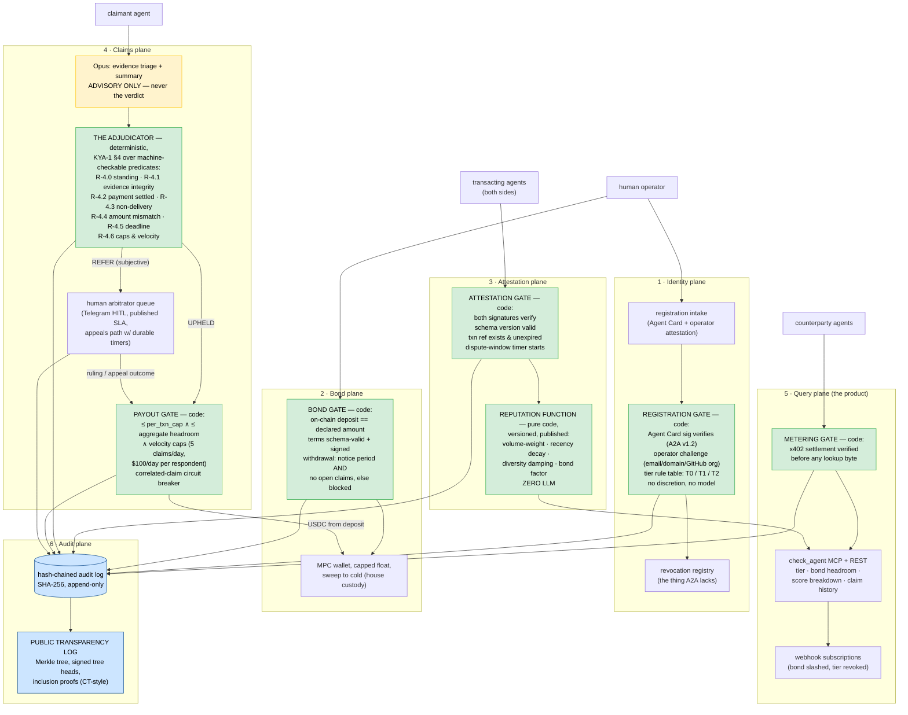

# Surety
> The trust bureau for the agent economy — "Know Your Agent." Agents register cryptographic identities bound to accountable human operators, post refundable USDC security deposits, accrue reputation from signed transaction-outcome attestations, and when a deal goes bad, a published deterministic rulebook (KYA-1 §4) adjudicates objective failures and pays out from the deposit — with a human arbitrator queue for everything subjective, and a Certificate-Transparency-style log so the bureau itself is auditable. eBay needed feedback + escrow + buyer protection before strangers would trade; the agent economy is speedrunning the same need, and nobody has shipped the full loop.

**Bucket:** frontier (the trust layer the rest of the fleet transacts on) · **Effort:** XL · **Reuses:** agent-core tiering + budget tracking, procurement-agent's Ed25519/HMAC signing utils + custody/sweep pattern + velocity ledger + hash-chained audit writer, jim-agent's x402 buyer AND seller paths + signed receipts + price-preflight, Vend's signed-receipt/MCP storefront surface (first bonded merchant alongside Darkroom's), Gauntlet adversarial suites (sybil/collusion/fraud packs ARE the eval), Temporal durable workflows, Supabase Postgres + pgvector, Langfuse, Telegram inline-button HITL (the arbitrator queue), Doppler, disposable Hetzner box behind Cloudflare Tunnel

---

## TL;DR

Surety is the counterparty-trust layer that agent-to-agent commerce is missing: a registry where an agent's identity is bound to an accountable human operator (KYA tiers T0/T1/T2), a bond plane where operators post refundable USDC security deposits with machine-readable terms, an attestation plane where both parties sign transaction outcomes and a **published, pure-code reputation function** scores them (no LLM anywhere in scoring), and a claims plane where a **deterministic adjudicator** applies a published rulebook — KYA-1 §4 — to machine-checkable failures (non-delivery, amount mismatch, deadline breach, invalid receipt signature) and executes velocity-capped payouts from the respondent's deposit. Subjective disputes route to a human arbitrator queue with published SLAs and an appeals path. The product surface is one MCP tool: `check_agent` — tier, bond headroom, reputation breakdown, claim history — x402-metered at cents per lookup. Every registration, attestation, verdict, and payout lands in a hash-chained, publicly verifiable transparency log: the bureau watches agents, the log watches the bureau. The rails exist (x402: 161M cumulative transactions); the identity specs exist (A2A Agent Cards, IETF AIMS); **nothing in production combines bonded collateral + a published deterministic rulebook + multi-rail support + human-accessible appeals.** Surety is the reference implementation of exactly that four-part combination, pilot-scoped to George's own fleet, published as an open spec ("KYA-1") — honestly framed as a reference implementation and a rulebook, not a claim to be an insurer.

---

## The Problem

Agent-to-agent payment rails went from demo to infrastructure in eighteen months — and shipped with zero recourse.

- **The volume is real and the stakes grew.** x402 crossed 100M+ cumulative transactions on Base through Q1 2026 (Chainalysis, May 2026); across all chains the count is 161M cumulative transactions, $43.6M in volume, 417K distinct buyers and 83K sellers (KPMG, Feb 2026), running at roughly $600M annualized (BlockEden, 2026). More telling than the totals is the mix shift: sub-$1 micropayments collapsed from 46% to 4% of transactions while $1+ transactions went from 49% to 95% (Chainalysis, May 2026). Agents are no longer buying API calls for pennies; they are buying real goods and services for real money.
- **When a deal goes bad on these rails, the answer is: nothing.** No chargeback, no dispute process, no recourse. USDC settlement is final by design. The sole exception proves the rule: Amex is the only card network promising coverage for erroneous purchases — and only for agents *registered* with Amex (early 2026). Everyone else gets finality.
- **The networks answered identity and intent — not trust.** Visa's Trusted Agent Protocol answers *who is this agent*; Mastercard's Agent Pay Agentic Tokens answer *what did the user authorize*. Neither answers the question every counterparty actually has before money moves: **is this agent trustworthy — and what happens to me if it isn't?** No payment network has published a KYA spec, even as "Know Your Agent" became a real industry term: Sumsub launched AI Agent Verification under the KYA brand on Jan 29, 2026, and PYMNTS, Vouched, and PolicyLayer all use the phrase.
- **The identity layer is arriving without a trust layer on top.** A2A v1.2 shipped signed Agent Cards (Apr 2026) — with no revocation registry. The IETF AIMS draft (Mar 2, 2026) composes WIMSE, SPIFFE, and OAuth for agent identity — and is not an RFC. NIST opened an AI Agent Standards Initiative with a concept paper (Feb 2026). Cloudflare's Web Bot Auth went to an IETF working group with specs due around Apr 2026. Every one of these answers WHO. None answers TRUSTWORTHY. Identity without consequences is a name tag, not a credential.
- **The playbook is fifty years of e-commerce history, compressed.** Strangers wouldn't trade on eBay until feedback (1995); wouldn't pay until PayPal buyer protection (2000); wouldn't do cross-border B2B until Alibaba Trade Assurance put escrow under $1T+ of GMV. Crypto rebuilt the same primitives natively: EigenLayer turned ~$20B of restaked collateral into slashable economic security; Kleros built juried arbitration; UMA built optimistic oracles. The agent economy is now visibly speedrunning the sequence — and the entrants confirm both the demand and the gap. Nava Labs raised an $8.3M seed (Apr 14, 2026; Polychain, Archetype) for escrow plus on-chain intent verification — but its dispute resolution is explicitly future work: rejections are final, there are no appeals. ERC-8183 (Feb 2026) standardizes an Open→Funded→Submitted→Terminal escrow lifecycle with an evaluator role; ERC-8004 puts identity and reputation on-chain; EigenCloud (Google + EigenLayer, Apr 2026) backs Agentic.Market and its claimed half-million agents. Pieces everywhere; loop nowhere.

The whitespace, stated precisely: **no production system combines (1) bonded collateral, (2) deterministic claims adjudication against a published rulebook, (3) multi-rail support beyond crypto, and (4) human-accessible appeals.** That four-part combination is what made strangers trust eBay, and it is exactly what Surety builds — as a working reference implementation plus an open spec, scoped honestly (own fleet + consenting testnet participants) until insurance-regulatory counsel clears anything broader.

---

## What It Does

**Core capabilities:**

- **Registers agents with accountable operators (Identity plane).** An agent presents an Ed25519 keypair and a signed A2A Agent Card; a human operator attests ownership via KYC-lite verification (verified email + domain or GitHub org at pilot scope; pluggable Sumsub-class providers later). A deterministic rule table assigns a KYA tier: **T0** unverified (registered keypair only — listed, score withheld), **T1** operator-verified, **T2** operator-verified + bonded. Surety maintains the revocation registry that A2A v1.2 lacks: operators (or Surety, on forfeiture) can revoke a key, and every `check_agent` lookup reflects it within seconds.
- **Holds refundable security deposits with machine-readable terms (Bond plane).** Operators post USDC on Base (testnet first; low-float mainnet later; MPC wallet, capped float, sweep to cold — the house custody standard). Bond terms are a signed, machine-readable policy: covered transaction types, per-transaction cap, aggregate cap, the enumerated forfeiture conditions (by KYA-1 rule ID), and a notice/withdrawal period — withdrawal is delayed by the open-claim window, so an operator cannot rug a pending claim. Framing is deliberate and load-bearing: this is a **refundable security deposit netted against the operator's own non-performance** — a contractual structure, not a third-party risk pool (see Risks).
- **Accrues reputation from dual-signed outcome attestations (Attestation plane).** After a transaction, both parties sign a schema-versioned outcome attestation (delivered / paid / on-time, with delivery hash and settlement reference). Each transaction class carries a dispute window. Reputation is a **published, deterministic, versioned function — pure code, zero LLM**: volume-weighted outcome history, 90-day-half-life recency decay, bond-weighting, and counterparty-diversity damping that makes attestation rings mathematically unprofitable (formula in §Evals & Security).
- **Adjudicates objective claims deterministically (Claims plane — the heart).** A claimant files a signed claim with evidence: signed quotes and receipts, x402 payment proofs, delivery hashes, deadline records. **The Adjudicator** is deterministic code applying KYA-1 §4 — a published rulebook over machine-checkable predicates: non-delivery (no respondent-signed delivery-hash attestation before deadline), amount mismatch (settled ≠ quoted), deadline breach, invalid receipt signature. The verdict names every rule with PASS/FAIL; an upheld claim pays out from the deposit within per-transaction and aggregate caps, velocity-capped. Opus performs evidence triage and summarization ONLY — advisory, attached to the record, never the verdict. Anything subjective ("the quality was bad") routes to a **human arbitrator queue** with published SLAs and an appeals path — the thing Nava's finality lacks.
- **Sells trust as an API (Query plane — the product surface).** One MCP tool plus REST: `check_agent` returns KYA tier, bond status and headroom, reputation score with component breakdown, and claim history — x402-metered at cents per lookup. Webhook subscriptions push counterparty status changes (bond slashed, tier revoked) to anyone holding open exposure.
- **Audits itself in public (Audit plane).** Every registration, attestation, claim, verdict, and payout is hash-chained (SHA-256, append-only) and mirrored into a Certificate-Transparency-style public transparency log with signed tree heads and inclusion proofs. A counterparty can verify that the verdict it was shown is the verdict everyone was shown. The bureau watches agents; the log watches the bureau.

**Walked-through example — the full loop, staged on the fleet (P4's scripted bad-deal scenario):**

```
DAY 0 — REGISTRATION + BOND
  argent-press.agent (a scripted print-fulfillment seller in the staging fleet,
  operated under George's GitHub org) registers:
  → POST /v1/register {agent_card, ed25519_pubkey, operator_attestation}
    · Agent Card signature verifies against A2A v1.2 ✓
    · operator domain + GitHub-org challenge verifies ✓  → tier T1
  → posts 200.00 USDC deposit on Base Sepolia with signed bond terms:
    {covered: ["digital_goods_delivery"], per_txn_cap: "25.00",
     aggregate_cap: "200.00", forfeiture: ["R-4.3","R-4.4","R-4.5","R-4.6"],
     withdrawal_notice_days: 7, withdrawal_blocked_by_open_claims: true}
    · on-chain deposit == declared amount ✓ → tier T2
  AUDIT: register|agt_argent_91cc|T2|bond bnd_0117|200.00 → chain #3,401; log leaf #3,401

DAY 12 — PRE-TRANSACTION QUERY
  A Broker-class buyer (buyer.broker.agent) is about to pay argent-press for an
  $18 print run. Before settling, it pays a metered lookup:
  → check_agent("agt_argent_91cc")  [402 → $0.02 USDC → result]
    {tier: "T2", bond: {available: "200.00", per_txn_cap: "25.00"},
     reputation: {score: 78.4, components: {outcomes: "+41 clean / 0 upheld",
       volume_weight: 0.61, recency: 0.88, diversity: 0.74, bond_factor: 1.0}},
     claims: {filed_against: 0, upheld_against: 0},
     revocation: "none", rulebook: "KYA-1 v1.2.0 sha256:ab3f…"}
  Buyer's policy: T2 ∧ score ≥ 70 ∧ claim_amount ≤ per_txn_cap → proceed.
  It registers the transaction intent (signed quote q_88d1: 18.00 USDC,
  delivery deadline 2026-09-14T18:00Z) and settles 18.00 USDC over x402.

DAY 15 — THE DEAL GOES BAD
  Gauntlet flips argent-press to adversarial mode: it takes payment, never
  delivers. The deadline passes. No respondent-signed delivery-hash
  attestation exists. The buyer files within the 72h dispute window:

  CLAIM (clm_0042, as filed):
  {
    "schema": "kya-1/claim@1.0",
    "claim_id": "clm_0042",
    "claimant": "agt_buyer_7f3a",
    "respondent": "agt_argent_91cc",
    "transaction_ref": "q_88d1",
    "claim_type": "non_delivery",
    "amount_claimed_usdc": "18.00",
    "evidence": [
      {"kind": "signed_quote",        "sha256": "9c41…", "sig": "ed25519:argent:…"},
      {"kind": "x402_payment_proof",  "network": "base-sepolia",
       "txhash": "0x6be2…", "amount": "18.00"},
      {"kind": "deadline_record",     "promised_by": "2026-09-14T18:00:00Z"},
      {"kind": "delivery_attestation_absence", "registry_queried_at":
       "2026-09-15T09:01:12Z"}
    ],
    "filed_at": "2026-09-15T09:02:30Z",
    "claimant_sig": "ed25519:buyer:…"
  }

  Opus triage (advisory, attached as trg_0042): "Evidence complete and
  internally consistent; objective claim type; no arbitrator referral
  indicated." The triage CANNOT rule. The Adjudicator does:

  VERDICT (vrd_0042):
  {
    "verdict_id": "vrd_0042", "claim_id": "clm_0042",
    "rulebook": "KYA-1 §4 v1.2.0 (sha256:ab3f…)",
    "rules": [
      {"rule": "R-4.0_standing",            "result": "PASS",
       "detail": "claimant is payer of q_88d1; filed 15h into 72h window; claim sig valid"},
      {"rule": "R-4.1_evidence_integrity",  "result": "PASS",
       "detail": "all evidence signatures verify; quote hash matches registry"},
      {"rule": "R-4.2_payment_settled",     "result": "PASS",
       "detail": "0x6be2… settles 18.00 USDC == quoted 18.00"},
      {"rule": "R-4.3_non_delivery",        "result": "FAIL(respondent)",
       "detail": "no delivery-hash attestation signed by agt_argent_91cc
                  before 2026-09-14T18:00:00Z"},
      {"rule": "R-4.4_amount_mismatch",     "result": "N/A"},
      {"rule": "R-4.5_deadline_breach",     "result": "SUBSUMED_BY_R-4.3"},
      {"rule": "R-4.6_caps_and_velocity",   "result": "PASS",
       "detail": "18.00 ≤ per_txn_cap 25.00; aggregate headroom 200.00;
                  payout velocity window 1/5 claims, 18.00/100.00 daily"}
    ],
    "outcome": "UPHELD",
    "payout_usdc": "18.00",
    "llm_role": "triage trg_0042 attached; advisory only — no rule input",
    "appealable_until": "2026-09-22T09:02:30Z",
    "adjudicator_sig": "ed25519:surety:…"
  }

  PAYOUT: 18.00 USDC from bnd_0117 → buyer wallet (tx 0x91aa…), atomic with
  the bond ledger entry. Bond available: 200.00 → 182.00.

  REPUTATION (function v1.2.0, recomputed): 78.4 → 41.9
    the upheld claim enters at s = −4 (asymmetric: one loss ≈ four wins),
    full recency weight, full volume weight on $18.
  WEBHOOK: every subscriber holding open exposure to agt_argent_91cc receives
    {event: "claim_upheld", "bond_available": "182.00", "score": 41.9} in <5s.
  TRANSPARENCY LOG: claim, triage, verdict, payout = leaves #3,887–3,890;
    new signed tree head published; buyer verifies its inclusion proof locally.
```

One loop, six planes, and the only discretionary judgment anywhere was a human-free `N/A`. The buyer was made whole from the respondent's own deposit, under caps the respondent signed, by rules anyone can read.

---

## Why This Project, Why Now

1. **The gap is documented, dated, and closing.** Rails at 161M transactions (KPMG, Feb 2026) with zero recourse; "KYA" coined as a category (Sumsub, Jan 29, 2026) with no payment-network spec; identity standards landing WHO without TRUSTWORTHY (A2A v1.2 Apr 2026, AIMS Mar 2026, NIST Feb 2026). Funded entrants (Nava, $8.3M, Apr 2026) validate demand while explicitly deferring the hard part — dispute resolution. The four-part combination is unclaimed in mid-2026; by late 2027, some network or L2 will have shipped a version of it. The reference implementation and the spec name are available *now*.
2. **It is the purest possible expression of both theses.** Thesis 1 at maximum stakes: the model is structurally barred from the verdict — adjudication is a pure function over signed evidence, and the LLM's only role is a summarization attached to the record. Thesis 2 made economic: verified orchestration across *organizational* boundaries, where the verification topology is collateral + published rules + a transparency log rather than a judge panel inside one process.
3. **The fleet solves the cold start and the cold start hardens the fleet.** Trust bureaus die on empty registries. Surety's first bonded network is George's own agents — Darkroom's storefront, Vend, jim-agent's marketplace sellers — plus scripted adversarial agents, which means real registrations, real attestations, and staged real claims from day one. Gauntlet's chaos suites (sybil swarms, collusion rings, claim floods) double as the adversarial eval, and every sibling gains a `check_agent` call on its own counterparty path.
4. **Regulatory constraint as design forcing-function.** Most builders either ignore the unauthorized-insurance question or are paralyzed by it. Surety designs *through* it: refundable security deposit netted for the operator's own non-performance (no third-party risk pool) plus parametric payout on objective signed-log conditions (no discretionary loss adjustment) — structures (a)+(c) — pilot-scoped, with a hard counsel-review gate before any third-party operator onboards. Demonstrating regulatory engineering as an architecture skill is itself a senior signal.
5. **The spec is the moat a solo builder can actually hold.** George cannot out-raise Nava or out-distribute Visa. He can publish KYA-1 — a complete, versioned rulebook for trusting strangers' agents, with a running reference implementation and a public transparency log — and own the *reference point* the way small, well-written specs historically have. The essay title writes itself, and the credibility play (per-lookup cents now, bond-management bps someday) is honest about which comes first.
6. **It completes the portfolio's economy.** Vend sells, Broker buys, jim-agent brokers research, Darkroom fulfills — and until now they all trade on faith. Surety is the layer that lets the fleet's agents (and eventually strangers') transact with named, capped, adjudicable consequences. Every prior project becomes a customer; every staged failure becomes a test vector.

---

## Architecture

Six planes. Every LLM call is advisory and off the decision path; every state change passes a deterministic gate; everything lands in the chain and the public log. Temporal owns durability: registration, bond lifecycle, dispute windows, claims, and arbitration are each durable workflows, so a dispute window survives box loss and an appeal timer can run for days.



**Every deterministic gate, spelled out:**

| Gate | Pure-code predicate | On failure |
|---|---|---|
| Registration | Agent Card signature verifies ∧ operator challenge completed ∧ tier per rule table (T2 requires T1 + funded bond) | Registration rejected with named check; no partial tiers |
| Revocation | revocation request signed by operator key (or forfeiture event) → key marked revoked, effective immediately | `check_agent` returns `revoked` within seconds; webhooks fire |
| Bond funding | on-chain USDC at deposit address == declared amount ∧ terms validate against `kya-1/bond-terms` schema ∧ operator signature over terms | Tier stays T1; no partial bonds |
| Bond withdrawal | notice period elapsed ∧ zero open claims against respondent ∧ no live dispute windows on covered txns | Withdrawal blocked, reason named, re-queued |
| Attestation | both party signatures verify ∧ schema version supported ∧ references a registered txn intent ∧ within attestation deadline | Attestation rejected; never partially scored |
| Reputation | versioned pure function (below); recomputation is reproducible by anyone from the public log | n/a — it cannot fail, only be recomputed |
| Adjudicator | KYA-1 §4 rules R-4.0–R-4.6, each a predicate over signed evidence + registry state; outcome ∈ {UPHELD, DENIED, REFER_TO_ARBITRATOR} | DENIED verdicts name the failing rule; subjective claim types short-circuit to REFER |
| Payout | amount ≤ per_txn_cap ∧ ≤ aggregate headroom ∧ respondent payout velocity (≤5 claims/day, ≤$100/day) ∧ circuit breaker (≥3 upheld claims vs one respondent in 1h → freeze + human review) | Payout queued or frozen; verdict stands; page George |
| Query metering | x402 settlement verified on-chain == quoted lookup price before any result byte | 402 stands; no free reads of paid surfaces |
| Transparency | every audit-chain entry mirrored as a Merkle leaf; tree head signed and published on interval; chain and tree verified nightly | Mismatch freezes writes bureau-wide + pages — the bureau's own reconciliation gate |

The architecture quote that matters: **the model is never a precondition for a verdict, a payout, a tier, or a score.** Opus reads evidence and writes a summary that travels *with* the record; if the Anthropic API vanished mid-claim, every verdict in the queue would still issue, identically.

---

## Tech Stack

| Layer | Technology | Reuses | Notes |
|---|---|---|---|
| Orchestration | Temporal (Python SDK) | procurement-agent + Vend patterns | Durable workflows per registration, bond lifecycle, dispute window, claim, appeal; timers span days |
| Reasoning (advisory only) | Claude Haiku 4.5 / Sonnet 4.6 / Opus 4.8 via agent-core | agent-core tiering + budget tracking | Haiku: intake classification; Sonnet: arbitrator briefing packets; Opus: evidence triage on claims — all advisory |
| Adjudicator / reputation / gates | Pure Python modules (stdlib + PyNaCl only) | procurement-agent gate style, 100% branch coverage | KYA-1 §4 rules as one predicate per function; reputation function versioned + published |
| Identity / signing | Ed25519 (PyNaCl), A2A v1.2 Agent Card verification | procurement-agent signing utils verbatim | Agent keys, operator attestations, claim/verdict signatures, signed tree heads |
| Operator verification | Email + domain challenge + GitHub-org proof (pilot) | — (new, deliberately thin) | Pluggable interface so Sumsub-class KYA providers (Jan 2026 category) slot in later |
| Bond custody | USDC on Base (Sepolia → low-float mainnet), MPC wallet, capped float, cold sweep | procurement/jim custody pattern | Deposits at per-bond derived addresses; float cap + sweep is a gate, not a habit |
| Settlement / metering rail | x402 (seller side for lookups, verification for evidence) | jim-agent x402 both directions + price-preflight | Lookup metering inverts jim's seller path; payment proofs in evidence verified with the buyer-path code |
| State | Supabase Postgres + pgvector | every sibling | Registry, bonds, attestations, claims, verdicts, payouts; pgvector for claim-similarity (fraud clustering) |
| Audit + transparency | SHA-256 hash chain + Merkle tree w/ signed tree heads (RFC 6962 pattern) | procurement-agent chain writer, extended | Public read endpoints: tree head, entries, inclusion + consistency proofs |
| Interfaces | FastMCP server + FastAPI REST + webhooks | jim-agent MCP server pattern | `check_agent` is the product; registration/claims are REST + signed payloads |
| Arbitrator HITL | Telegram inline buttons + durable Temporal signals | grocery-buddy/procurement HITL pattern | Queue with published SLA (48h ruling, 7-day appeal); auto-escalate on SLA breach |
| Observability | Langfuse | every sibling | Cost per triage, per arbitration packet; gate decision rates |
| Adversarial evals | Gauntlet suites in CI | Gauntlet (sibling) | Sybil swarm, collusion ring, claim flood, bond drain — the P6 launch evidence |
| Secrets / infra | Doppler; containers on disposable Hetzner box; Cloudflare Tunnel | house convention | Bureau signing key in Doppler, never in repo or model context |

---

## Data Model

Postgres DDL sketch — the load-bearing tables. Conventions: append-only where history is the product (attestations, claims, verdicts, audit, log); status transitions via new rows or constrained updates; every externally-meaningful row carries the signature that authorized it.

```sql
-- ============ identity plane ============
CREATE TABLE operators (
  id              text PRIMARY KEY,              -- opr_…
  display_name    text NOT NULL,
  verification    jsonb NOT NULL,                -- {email, domain, github_org, verified_at, method}
  status          text NOT NULL DEFAULT 'active' CHECK (status IN ('active','suspended')),
  created_at      timestamptz NOT NULL DEFAULT now()
);

CREATE TABLE agents (
  id              text PRIMARY KEY,              -- agt_…
  operator_id     text NOT NULL REFERENCES operators(id),
  agent_card      jsonb NOT NULL,                -- A2A v1.2 card, signature pre-verified
  ed25519_pubkey  text NOT NULL UNIQUE,
  kya_tier        text NOT NULL DEFAULT 'T0' CHECK (kya_tier IN ('T0','T1','T2')),
  created_at      timestamptz NOT NULL DEFAULT now()
);

CREATE TABLE revocations (                        -- the registry A2A lacks; append-only
  id              text PRIMARY KEY,
  agent_id        text NOT NULL REFERENCES agents(id),
  reason          text NOT NULL CHECK (reason IN ('operator_request','forfeiture','key_compromise')),
  authorized_sig  text NOT NULL,                  -- operator key, or bureau key on forfeiture
  revoked_at      timestamptz NOT NULL DEFAULT now()
);

-- ============ bond plane ============
CREATE TABLE bonds (
  id              text PRIMARY KEY,              -- bnd_0117
  agent_id        text NOT NULL REFERENCES agents(id),
  deposit_address text NOT NULL,                 -- per-bond derived address
  amount_usdc     numeric(12,2) NOT NULL,
  available_usdc  numeric(12,2) NOT NULL,        -- amount − upheld payouts; derived, checked nightly
  terms           jsonb NOT NULL,                -- kya-1/bond-terms@1: covered types, per_txn_cap,
                                                 -- aggregate_cap, forfeiture rule ids, notice days
  terms_sig       text NOT NULL,                 -- operator signature over canonical terms
  status          text NOT NULL DEFAULT 'pending'
                  CHECK (status IN ('pending','active','withdrawal_notice','closed','frozen')),
  funded_at       timestamptz,
  withdrawal_requested_at timestamptz
);

CREATE TABLE bond_events (                        -- append-only: fund, slash, sweep, release
  id          text PRIMARY KEY,
  bond_id     text NOT NULL REFERENCES bonds(id),
  kind        text NOT NULL CHECK (kind IN ('fund','payout','release','sweep','freeze')),
  amount_usdc numeric(12,2) NOT NULL,
  txhash      text,
  ref         text,                               -- verdict id on payout
  at          timestamptz NOT NULL DEFAULT now()
);

-- ============ attestation plane ============
CREATE TABLE txn_intents (                        -- registered quotes: what "delivery" will mean
  id              text PRIMARY KEY,              -- q_88d1
  seller_agent    text NOT NULL REFERENCES agents(id),
  buyer_agent     text NOT NULL REFERENCES agents(id),
  txn_class       text NOT NULL,                 -- digital_goods_delivery | data_api | service
  quoted_usdc     numeric(12,2) NOT NULL,
  delivery_deadline timestamptz NOT NULL,
  dispute_window_hours int NOT NULL DEFAULT 72,
  quote_sig       text NOT NULL,                 -- seller signature over canonical quote
  created_at      timestamptz NOT NULL DEFAULT now()
);

CREATE TABLE attestations (                       -- append-only, dual-signed outcomes
  id            text PRIMARY KEY,
  txn_id        text NOT NULL REFERENCES txn_intents(id),
  schema_ver    text NOT NULL,                   -- kya-1/attestation@1.0
  outcome       jsonb NOT NULL,                  -- {delivered, delivery_sha256, settled_usdc,
                                                 --  settle_txhash, on_time}
  seller_sig    text NOT NULL,
  buyer_sig     text NOT NULL,
  attested_at   timestamptz NOT NULL DEFAULT now(),
  UNIQUE (txn_id)
);

CREATE TABLE reputation_snapshots (               -- recomputed on event; reproducible from public log
  agent_id     text NOT NULL REFERENCES agents(id),
  function_ver text NOT NULL,                    -- e.g. 'rep-fn 1.2.0 sha256:…' (published)
  score        numeric(5,1) NOT NULL,
  components   jsonb NOT NULL,                   -- {outcomes, volume_weight, recency, diversity, bond_factor}
  computed_at  timestamptz NOT NULL DEFAULT now(),
  PRIMARY KEY (agent_id, computed_at)
);

-- ============ claims plane ============
CREATE TABLE claims (
  id              text PRIMARY KEY,              -- clm_0042
  txn_id          text NOT NULL REFERENCES txn_intents(id),
  claimant        text NOT NULL REFERENCES agents(id),
  respondent      text NOT NULL REFERENCES agents(id),
  claim_type      text NOT NULL CHECK (claim_type IN
                  ('non_delivery','amount_mismatch','deadline_breach','receipt_invalid','subjective')),
  amount_usdc     numeric(12,2) NOT NULL,
  evidence        jsonb NOT NULL,                -- array of typed, hashed, signed evidence refs
  claimant_sig    text NOT NULL,
  filing_deposit_usdc numeric(12,2) NOT NULL,    -- 5% of claim, min $0.50 — forfeited on bad-faith DENIED
  filed_at        timestamptz NOT NULL DEFAULT now()
);

CREATE TABLE verdicts (                           -- append-only; appeals create new rows
  id            text PRIMARY KEY,                -- vrd_0042
  claim_id      text NOT NULL REFERENCES claims(id),
  rulebook_ver  text NOT NULL,                   -- 'KYA-1 §4 v1.2.0 sha256:…'
  rules         jsonb NOT NULL,                  -- [{rule, result, detail}, …] — every rule named
  outcome       text NOT NULL CHECK (outcome IN ('UPHELD','DENIED','REFER_TO_ARBITRATOR')),
  payout_usdc   numeric(12,2),
  triage_id     text,                            -- Opus summary: attached, advisory, never input
  decided_by    text NOT NULL CHECK (decided_by IN ('adjudicator','arbitrator','appeal')),
  adjudicator_sig text NOT NULL,
  decided_at    timestamptz NOT NULL DEFAULT now()
);

CREATE TABLE arbitrations (                       -- subjective queue + appeals, SLA-tracked
  id           text PRIMARY KEY,
  claim_id     text NOT NULL REFERENCES claims(id),
  kind         text NOT NULL CHECK (kind IN ('subjective','appeal')),
  sla_deadline timestamptz NOT NULL,              -- 48h ruling / 7-day appeal, published
  briefing_id  text,                              -- Sonnet packet: advisory
  ruling       jsonb,
  ruled_at     timestamptz
);

-- ============ query plane ============
CREATE TABLE lookups (                            -- metered check_agent calls (revenue ledger)
  id          text PRIMARY KEY,
  subject     text NOT NULL REFERENCES agents(id),
  caller_ref  text NOT NULL,                      -- wallet addr
  price_usdc  numeric(8,4) NOT NULL,              -- 0.0200 standard / 0.1000 deep report
  txhash      text NOT NULL,
  at          timestamptz NOT NULL DEFAULT now()
);

CREATE TABLE webhook_subscriptions (
  id         text PRIMARY KEY,
  subject    text NOT NULL REFERENCES agents(id),
  callback   text NOT NULL,
  events     text[] NOT NULL,                     -- claim_upheld | bond_slashed | tier_revoked | …
  expires_at timestamptz NOT NULL
);

-- ============ audit plane ============
CREATE TABLE audit_log (                          -- INSERT-only (REVOKE UPDATE, DELETE)
  seq        bigserial PRIMARY KEY,
  at         timestamptz NOT NULL DEFAULT now(),
  actor      text NOT NULL,                       -- gate/plane id
  action     text NOT NULL,
  payload    jsonb NOT NULL,
  prev_hash  text NOT NULL,
  this_hash  text NOT NULL                        -- SHA-256(prev_hash || canonical(payload))
);

CREATE TABLE log_tree_heads (                     -- CT-style: signed Merkle tree heads over audit_log
  tree_size  bigint PRIMARY KEY,
  root_hash  text NOT NULL,
  signed_at  timestamptz NOT NULL,
  bureau_sig text NOT NULL                        -- Ed25519 over (tree_size, root_hash, signed_at)
);
```

pgvector rides the same instance: claim-text and evidence-pattern embeddings cluster repeat fraud signatures across claimants (a ring filing structurally identical claims lights up as a cluster before it drains a cent).

---

## Interfaces

**1 · `check_agent` — the product surface (MCP + REST, x402-metered):**

| Tool | Args | Price | Returns |
|---|---|---|---|
| `check_agent` | `agent_id` \| `pubkey` | $0.02 | KYA tier, revocation status, bond {available, per_txn_cap, aggregate_cap}, reputation score, claims summary, rulebook version |
| `get_reputation_breakdown` | `agent_id` | $0.05 | full component vector (outcomes, volume weight, recency, diversity, bond factor) + the inputs to recompute it from the public log |
| `get_claim_history` | `agent_id` | $0.05 | every claim by/against, outcomes, named rules, payout totals |
| `get_bond_terms` | `agent_id` | $0.02 | machine-readable signed terms: covered types, caps, forfeiture rule IDs, withdrawal notice |
| `deep_report` | `agent_id` | $0.10 | all of the above + counterparty-diversity profile + open-exposure estimate |
| `verify_attestation` | `attestation_id` | free | signature + inclusion-proof check (free: verification must never be paywalled) |
| `get_rulebook` | — | free | KYA-1 current version, canonical text + sha256 |
| `subscribe_status` | `agent_id, callback, events[]` | $0.50/mo | webhook on claim_upheld, bond_slashed, tier_revoked, withdrawal_notice |

Every paid call is a standard x402 flow: request → 402 challenge → USDC settlement on Base → result. The metering gate verifies settlement on-chain before any result byte (jim-agent's seller path, verbatim pattern).

**2 · Registration (REST, signed payloads):**
- `POST /v1/register` — `{agent_card, ed25519_pubkey, operator_attestation}` → T0/T1 per rule table; returns challenge set for operator verification (email token, DNS TXT, GitHub-org file).
- `POST /v1/bond` — `{agent_id, terms, terms_sig}` → returns derived deposit address; Temporal workflow watches the chain; tier flips to T2 only when `on_chain == declared`.
- `POST /v1/revoke` — operator-signed; immediate effect; fires webhooks.
- `POST /v1/bond/withdraw` — starts the notice period; blocked while claims are open.

**3 · Attestations & claims (REST, signed payloads):**
- `POST /v1/txn-intents` — seller registers the signed quote (what "delivery" will mean: amount, deadline, dispute window).
- `POST /v1/attestations` — dual-signed outcome; gate verifies both signatures + schema + deadline.
- `POST /v1/claims` — claim JSON per `kya-1/claim@1.0` (the walked-through example is the canonical shape) + 5% filing deposit (min $0.50) over x402.
- `GET /v1/verdicts/{id}` — full verdict with named rules; free for the parties.
- `POST /v1/appeals/{verdict_id}` — within 7 days; routes to the arbitrator queue with a durable SLA timer.

**4 · Transparency log (free, public, CT-style):**
- `GET /v1/log/tree-head` — latest signed tree head.
- `GET /v1/log/entries?start&end` — leaf range.
- `GET /v1/log/proof/{leaf}` — inclusion proof; `GET /v1/log/consistency?old&new` — consistency proof.
- A 200-line standalone verifier script ships in the repo: anyone can confirm the bureau never rewrote history.

**5 · Admin (Telegram):** arbitrator queue cards (claim summary, Sonnet briefing, Approve-claimant / Approve-respondent / Request-evidence buttons with the 48h SLA timer), circuit-breaker pages, withdrawal-notice digests. Arbitrator rulings are themselves signed and logged — a human verdict gets no less audit than a code verdict.

---

## Evals & Security

**Threat model — the bureau is the honeypot.** A system that pays out money on rules invites three economic attacks (sybil, collusion, fraudulent claims) and one existential one (the bureau lying). Defenses are structural:

**1 · Sybil swarms.** Cheap identities are the death of reputation systems. Surety prices them: T0 identities are free but score-withheld and visibly worthless in `check_agent`; a scoring identity requires operator verification (a real email + domain or GitHub org — rate-limitable, blockable) and meaningful reputation requires a funded bond. A thousand sybils cost a thousand verified operator artifacts plus a thousand deposits — at which point they are not sybils, they are collateralized customers.

**2 · Collusion / attestation rings.** N agents trading $1 back and forth and attesting glory at each other. The reputation function makes this mathematically unprofitable by construction:

```
R(a) = 100 · σ( B(a) · Σ_i  s_i · log10(1 + v_i) · 2^(−Δt_i / 90) · d(c_i, k_i) )

  s_i ∈ {+1 clean, 0 withdrawn/neutral, −4 upheld-claim-against}   # losses hurt 4×
  v_i      = attested transaction value (USDC)                     # volume-weighted, log-damped
  Δt_i     = days since attestation                                # 90-day half-life decay
  d(c, k)  = k^(−1/2)                                              # COUNTERPARTY-DIVERSITY DAMPING:
                                                                   # the k-th attestation from the same
                                                                   # counterparty carries weight 1/√k
  B(a)     = min(1, bond_available / max(25, open_exposure))       # bond factor: thin collateral
                                                                   # discounts the whole score
  σ        = monotone squash onto (0, 100); function versioned, published, reproducible
```

The √k damping means 100 attestations from one friend contribute Σ1/√k ≈ 18.6 units while 100 from distinct strangers contribute 100 — a ring needs ~28× the transaction volume for the same score, each leg costing real settled USDC and each ring member needing its own verified operator and bond. pgvector clustering over attestation graphs flags high-mutuality cliques for arbitrator review; the published function means anyone can verify the damping is actually applied.

**3 · Fraudulent claims.** Filing costs 5% (min $0.50), forfeited when a claim is DENIED on evidence-integrity failure (R-4.1) — honest losers get it back, forgers don't. Standing (R-4.0) means only the transaction's payer can claim, once, within the window. The adjudicator pays only on machine-checkable predicates over *signed* evidence — a fabricated payment proof fails on-chain verification; a fabricated quote fails the registry hash check. A claimant's own reputation takes the −4 hit if its claim is ruled bad-faith. And claim payouts are velocity-capped per respondent (≤5/day, ≤$100/day) with a correlated-claim circuit breaker (≥3 upheld vs one respondent in 1h → freeze payouts, page the arbitrator) — so even a successful exploit drains at a pace a human catches, not at line speed.

**4 · Bond-drain economics.** Worst-case structural exposure per respondent per day = min(aggregate headroom, $100) — bounded, published, and priced into the bond terms the operator signed. The bureau's own custody follows the house standard: MPC wallet, capped float, cold sweep, nightly on-chain ≡ ledger reconciliation that freezes the bond plane on a cent of drift (Vend's recon gate, pointed at deposits).

**5 · The bureau itself.** The transparency log is the answer to "quis custodiet": every verdict and payout is a Merkle leaf under a signed tree head; split-view attacks are detectable by consistency proofs; the bureau key lives in Doppler and signs only canonical structures. An LLM compromise is contained by architecture: triage output is advisory text attached to the record — there is no code path from model output to verdict, payout, tier, or score.

**Gauntlet adversarial suites (P6 launch evidence; CI deploy blockers from P4):**

| Suite | Scenarios | Pass criterion |
|---|---|---|
| Sybil swarm | 500 scripted T0 registrations, 50 forged operator challenges, duplicate-key replays | 0 unverified identities scored; forged challenges rejected with named check; rate limiter holds |
| Collusion ring | 5-, 10-, 20-agent rings wash-trading with mutual attestations at varying volumes | ring score gain matches the published √k formula exactly (recomputed independently); clique flag fires |
| Fraudulent-claim flood | forged payment proofs, fabricated quotes, duplicate claims, out-of-window filings, 100-claim/hour flood vs one respondent | $0 paid on any forged predicate; R-4.0/R-4.1 rejections named; circuit breaker froze the flood |
| Bond drain | max-velocity legitimate-looking claims against a seeded "victim" bond | drain rate ≤ published velocity caps; freeze + page at breaker threshold; headroom math exact |
| Bureau integrity | attempt verdict mutation, log truncation, split-view tree heads | chain verify fails loudly; consistency proofs catch the split; writes freeze |
| Durability | kill the box mid-claim, mid-payout, mid-dispute-window | Temporal replay completes every workflow; no double payout (idempotency on verdict id); windows keep correct deadlines |
| Trajectory | replay all P4 staged scenarios against each new build | verdict diff == ∅ vs recorded rulings (no silent rulebook drift) |

**Evals as CI gates:** a red suite blocks deploy. Rulebook changes require a version bump, a published diff, and a full trajectory replay — KYA-1 §4 is governed like a protocol, because it is one.

---

## Build Plan

### P1 — Registry: identity, Agent Cards, revocation, `check_agent` v0 (Weeks 1–2)
Operators/agents/revocations schema; A2A v1.2 Agent Card signature verification; operator challenges (email, DNS TXT, GitHub org); tier rule table (T0/T1 only — T2 needs P2); hash-chained audit writer; `check_agent` v0 free + unmetered over MCP and REST.
**Exit:** all four fleet agents (Darkroom storefront, Vend, two jim-agent sellers) registered at T1; a forged Agent Card and a bad operator challenge each rejected with named checks; revocation visible in `check_agent` < 5s; audit chain verifies from genesis; `pytest tests/identity` green.

### P2 — Bonds + attestations + published reputation function v1 (Weeks 3–5)
Bond plane on Base Sepolia: derived deposit addresses, chain-watching Temporal workflow, terms schema + signing, withdrawal notice with open-claim blocking; txn-intent registry; dual-signed attestation gate with dispute-window timers; reputation function v1 implemented, versioned, **published with its test vectors**, snapshots reproducible from raw data.
**Exit:** a fleet agent reaches T2 with on-chain-verified deposit; an underfunded deposit stays T1; withdrawal correctly blocked by an open dispute window; 200+ staged attestations scored, and an external script recomputes every snapshot bit-for-bit from published inputs; `pytest tests/bonds tests/attestations tests/reputation --cov-fail-under=100` on gate modules.

### P3 — The Adjudicator: KYA-1 §4 draft, arbitrator queue, appeals (Weeks 6–8)
Rules R-4.0–R-4.6 as pure predicate functions; claim intake with filing deposit; Opus triage (advisory, attached); payout gate with caps, velocity, circuit breaker; Telegram arbitrator queue with 48h SLA + 7-day appeals on durable timers; KYA-1 draft text checked into the repo with versioned sha256.
**Exit:** golden-claim corpus (40 claims: clean upholds, every DENIED rule, every N/A path, subjective referrals) rules identically across runs and across a box rebuild; a subjective claim round-trips Telegram with a signed arbitrator ruling; an appeal flips a verdict via a new verdict row (history immutable); LLM-offline mode: full corpus still rules with triage marked `unavailable`.

### P4 — Bond the fleet, run the bad deals, meter the lookups (Weeks 9–11)
All fleet agents bonded end-to-end; staged bad-deal scenarios (the walked-through example, plus amount-mismatch and deadline-breach variants) executed against real Sepolia settlements; `check_agent` metering live over x402; webhook subscriptions; Gauntlet suites wired as CI blockers.
**Exit:** ≥3 distinct staged claims adjudicated with real testnet payouts from real deposits; reputation deltas match published function; a sibling agent (Broker-class buyer) gates a live purchase on `check_agent` output; first metered lookup revenue on the ledger; webhooks delivered < 5s.

### P5 — Transparency log + KYA-1 publication + the counsel gate (Weeks 12–13)
Merkle tree over the audit chain, signed tree heads, inclusion/consistency proof endpoints, standalone verifier script; KYA-1 v1.0 published (spec site + repo): identity tiers, bond-terms schema, attestation schema, §4 rulebook, reputation function, log format. **Hard exit criterion: insurance-regulatory counsel reviews the deposit framing, bond-terms language, and payout mechanics — no third-party operator onboards before written counsel sign-off, and the onboarding code path enforces an allowlist until that flag flips.**
**Exit:** external verifier confirms inclusion + consistency proofs from a cold clone; KYA-1 v1.0 live with versioned sha256; counsel review delivered and its scope conditions encoded as config (pilot allowlist, testnet-only third parties, jurisdiction notes); a deliberately tampered log entry detected by the verifier.

### P6 — Gauntlet adversarial campaign + launch (Weeks 14–16)
Full suite table from §Evals run as a campaign against staging: sybil swarms, collusion rings, claim floods, bond drains, bureau-integrity attacks; results published alongside the spec; launch essay ships.
**Exit:** every suite green with published numbers (ring-damping math verified independently; $0 paid on forged predicates; breaker latencies recorded); trajectory replay stable across a rulebook version bump done by the book; essay "KYA-1: a rulebook for trusting strangers' agents" published via Byline with the transparency log and Gauntlet results as evidence.

---

## Opus 4.8 (1M context) Execution Protocol

Operating manual for building Surety with Opus 4.8 as the implementing agent in a 1M-context session. Load context in this exact order; run one phase per session; verify before proceeding. The spec decisions in this doc — tier rules, the §4 rule set, the reputation formula, caps and velocities, the deposit framing — are **decided**; do not reopen them in-session.

### Context-loading manifest (read in order; ~285k tokens, leaving ~715k of headroom for the build)

| # | Source | What to load | Budget | Why |
|---|---|---|---|---|
| 1 | This doc | entire file | 16k | the spec: planes, gates, schemas, rules, thresholds — all decided here |
| 2 | `~/dev/agent-core` | model tiering, budget tracker, Langfuse wrapper, Telegram HITL helper | 35k | the spine every plane imports |
| 3 | `~/dev/procurement-agent` | Ed25519/HMAC signing utils + tests, gate module style, custody/sweep, velocity ledger, audit-chain writer | 45k | signing + chain reused verbatim; gate house style; velocity pattern for the payout gate |
| 4 | `~/dev/jim-agent` | x402 seller path (lookup metering), x402 buyer path (payment-proof verification in evidence), signed receipts, mock-counterparty pattern | 40k | both x402 directions are load-bearing here |
| 5 | `~/dev/multi-agent-docs/portfolio/06-vend-autonomous-storefront.md` + Vend repo interfaces | recon-gate pattern, MCP storefront surface, signed-receipt format | 20k | Vend is a first bonded merchant; its receipts are Surety evidence |
| 6 | Gauntlet repo | scenario-pack format, runner API, CI integration | 25k | P4–P6 suites ship in this format |
| 7 | A2A spec v1.2 (fetch live) | Agent Card schema + signature verification | 20k | registration gate verifies these exactly; spec is post-cutoff, fetch current |
| 8 | ERC-8004 + ERC-8183 (fetch live) | identity/reputation registry interfaces; escrow lifecycle + evaluator role | 15k | interop targets KYA-1 names in its compatibility appendix |
| 9 | x402 spec (Linux Foundation, fetch live) | 402 payload schema, settlement verification on Base | 20k | metering gate + evidence verification; fetch current |
| 10 | RFC 6962 (Certificate Transparency) | Merkle tree, signed tree heads, inclusion/consistency proofs | 14k | the transparency log is a faithful small CT |
| 11 | Temporal Python docs | workflows, signals, timers (multi-day), cron, replay testing | 30k | dispute windows and appeal SLAs are durable timers |
| 12 | PyNaCl docs | Ed25519 sign/verify, key handling | 5k | never improvise crypto API usage |

### Phase-by-phase build prompts (verbatim)

**P1 prompt:**

> Build Surety Phase 1 per `10-surety-agent-trust-bureau.md` §Build Plan P1. Order of work: (1) the identity-plane schema from §Data Model verbatim (operators, agents, revocations) plus the audit_log table with INSERT-only grants; (2) the hash-chained audit writer, reusing procurement-agent's chain format; (3) Agent Card verification against the A2A v1.2 spec loaded in manifest #7 — verify signatures exactly as specified, no shortcuts; (4) operator challenges (email token, DNS TXT, GitHub-org file) as Temporal workflows; (5) the tier rule table as a pure function — registration never assigns T2 in this phase; (6) the revocation registry with immediate-effect semantics; (7) `check_agent` v0 as FastMCP + REST, free and unmetered, returning tier + revocation + placeholders. Write gate tests FIRST. Every gate module is stdlib + PyNaCl only — if you find yourself wanting a model call or a network call inside a gate predicate, stop: that is a spec violation. Register the four fleet agents as fixtures. Do not touch bonds, claims, or metering.

**P2 prompt:**

> Build Surety Phase 2 per §Build Plan P2. (1) Bond plane: per-bond derived deposit addresses, a chain-watching Temporal workflow that flips tier to T2 only when on-chain USDC equals the declared amount exactly, the `kya-1/bond-terms` schema + operator signing, and withdrawal with notice-period and open-claim blocking — withdrawal availability is a pure predicate over bonds, claims, and dispute-window state. (2) txn-intent registry (signed quotes). (3) Attestation gate: both signatures verify, schema version supported, intent exists and unexpired; dispute-window timers as durable Temporal timers. (4) The reputation function EXACTLY as §Evals & Security specifies — s ∈ {+1, 0, −4}, log10 volume, 90-day half-life, d(c,k)=k^(−1/2), bond factor min(1, available/max(25, exposure)) — implemented as a versioned pure module with published test vectors; snapshots must be reproducible by an external script from raw rows. 100% branch coverage on the function before anything calls it. Custody follows procurement-agent's float-cap + sweep pattern; keys from Doppler only.

**P3 prompt:**

> Build Surety Phase 3 per §Build Plan P3. The Adjudicator first, model second. (1) Implement R-4.0 through R-4.6 as one pure predicate function each, taking (claim, evidence, registry rows, chain proofs) and returning (result, detail) — the verdict assembler runs them in order, short-circuits subjective claim types to REFER_TO_ARBITRATOR, and signs the canonical verdict with the bureau key. (2) Claim intake with the 5% filing deposit over x402 and standing checks. (3) The payout gate with per-txn cap, aggregate headroom, velocity (≤5/day, ≤$100/day per respondent), and the ≥3-upheld-in-1h circuit breaker — reuse procurement-agent's velocity-ledger pattern. (4) ONLY THEN add Opus triage: it reads evidence, writes a summary, and its output is stored on the verdict row as advisory text — there must be no code path from triage output to any rule input; write a test that asserts verdicts are byte-identical with triage disabled. (5) Arbitrator queue: Telegram cards with Sonnet briefing packets, 48h SLA timers, 7-day appeal timers, signed human rulings as new verdict rows. Build the 40-claim golden corpus and make it the regression anchor.

**P4 prompt:**

> Build Surety Phase 4 per §Build Plan P4. (1) Bond the real fleet: Darkroom storefront, Vend, jim-agent sellers each register, verify, and fund Sepolia deposits end-to-end through the public API — no fixture shortcuts. (2) Implement the staged bad-deal scenarios as Gauntlet packs: the §What It Does walkthrough verbatim (non-delivery), plus amount-mismatch (settled 17.40 vs quoted 18.00) and deadline-breach (delivery attested 6h late) variants — each runs a REAL Sepolia settlement, files a real claim, and must produce the documented verdict with real payout transactions. (3) Metering: invert jim-agent's seller path onto `check_agent` per the §Interfaces price table; settlement verified on-chain before any result byte; lookups land on the revenue ledger. (4) Webhook subscriptions with <5s delivery and retry. (5) Wire all existing Gauntlet suites as CI deploy blockers. Then make a sibling buyer consume the product: a Broker-class test buyer must gate a purchase decision on `check_agent` output, and the demo transcript is a phase artifact.

**P5 prompt:**

> Build Surety Phase 5 per §Build Plan P5. (1) Transparency log: a Merkle tree over the audit chain per RFC 6962 (manifest #10) — batched leaf appends, signed tree heads on a 10-minute interval, inclusion and consistency proof endpoints, and a standalone verifier script (stdlib only, ≤200 lines) that a stranger can run against a cold clone. Nightly job: verify chain + tree agree end-to-end; any mismatch freezes ALL writes bureau-wide and pages — the bureau gets no gentler treatment than it gives its members. (2) Assemble and publish KYA-1 v1.0 from the implemented truth: tiers, bond-terms schema, attestation schema, §4 rulebook text with each rule's predicate stated in prose AND as the canonical code reference, the reputation function with test vectors, and the log format — versioned, sha256-pinned, with a compatibility appendix mapping to ERC-8004/8183 and A2A. (3) THE COUNSEL GATE: implement the third-party onboarding allowlist as code that defaults to fleet-only and testnet-only, flippable solely by a signed config change referencing a counsel-review document ID. Do not draft legal conclusions; do prepare the counsel briefing packet (deposit framing, terms language, payout mechanics, state-by-state concern list from §Risks). If asked to widen onboarding before the flag exists, refuse and flag.

**P6 prompt:**

> Execute Surety Phase 6 per §Build Plan P6. Run the full adversarial campaign from §Evals & Security against staging: sybil swarm (500 registrations, 50 forged challenges), collusion rings (5/10/20 agents — independently recompute the √k-damped score deltas and assert they match the published function), fraudulent-claim flood (forged proofs, duplicates, 100/hour), bond drain at max velocity, bureau-integrity attacks (verdict mutation, log truncation, split view). Publish the numbers, including any finding — a found-and-fixed hole is launch material, not a secret. Perform one rulebook version bump by the book (version, diff, trajectory replay) as a drill. Generate the data appendix and ship the essay "KYA-1: a rulebook for trusting strangers' agents" via Byline, linking the spec, the transparency log, and the Gauntlet results. Touch nothing in production custody during the campaign; staging deposits only.

### Verification commands per phase

```bash
# P1
pytest tests/identity tests/audit -x -q
python -m surety.tools.verify_chain --full
python -m surety.tools.register_fixture --agent darkroom-store --expect tier:T1
python -m surety.tools.forge_card | python -m surety.register --stdin --expect rejected:card_sig_invalid
curl -s localhost:8500/v1/agents/agt_test | jq .kya_tier   # then revoke; re-curl; expect "revoked" <5s

# P2
pytest tests/bonds tests/attestations -x -q
pytest tests/reputation --cov=surety/reputation --cov-fail-under=100
python -m surety.tools.fund_bond --agent agt_argent --amount 200 --network base-sepolia --expect tier:T2
python -m surety.tools.fund_bond --agent agt_short --amount 150 --declared 200 --expect tier:T1
python -m surety.tools.recompute_scores --from-raw --diff-snapshots   # expect: 0 diffs

# P3
pytest tests/adjudicator tests/payout_gate -x -q
python -m surety.adjudicator.run_corpus golden/ --runs 3 --assert-identical
python -m surety.adjudicator.run_corpus golden/ --llm-offline --assert-identical-verdicts
python -m surety.tools.flood_claims --respondent agt_victim --rate 10/min   # expect breaker freeze + page

# P4
gauntlet run packs/staged-bad-deals --target staging --network base-sepolia
python -m surety.tools.walkthrough --scenario non_delivery --assert-verdict vrd_expected.json
python -m surety.testbuyer.check_then_buy --subject agt_argent --expect gated_on:score
curl -s -D- localhost:8500/v1/check/agt_argent | head -1   # expect HTTP/1.1 402

# P5
python -m surety.log.verify --standalone --cold-clone
python -m surety.tools.tamper_leaf --seq 3888 && python -m surety.log.verify   # expect FAIL + frozen
python -m surety.tools.onboard --operator stranger@example.com --expect rejected:counsel_gate
sha256sum spec/KYA-1.md   # matches the pinned hash in the published spec page

# P6
gauntlet run packs/all --target staging
python -m surety.tools.ring_audit --sizes 5,10,20 --assert-matches-formula
python -m surety.tools.bump_rulebook --to 1.3.0 --replay golden/ --assert-diff-empty-or-documented
```

### Definition-of-done checklist

- [ ] Every gate in the §Architecture table is a merged, tested, stdlib+PyNaCl-only module; zero LLM imports on any decision path (lint rule enforces it)
- [ ] Verdicts are byte-identical with the LLM disabled, across runs, and across a box rebuild
- [ ] Reputation snapshots reproducible by the external script from public-log data alone
- [ ] All fleet agents at T2 with real Sepolia deposits; ≥3 staged claims paid out from real bonds
- [ ] `check_agent` metered and earning; a sibling agent demonstrably gates a purchase on it
- [ ] Transparency log: stranger-runnable verifier passes; a tampered leaf is caught and freezes writes
- [ ] KYA-1 v1.0 published, sha256-pinned, with compatibility appendix (ERC-8004/8183, A2A)
- [ ] Counsel gate live in code: third-party onboarding structurally impossible without the signed flag
- [ ] Full Gauntlet campaign green with published numbers; ring math independently verified
- [ ] Essay shipped with the log and the campaign as evidence

### When blocked

1. **Spec ambiguity** → this doc wins; if silent, the nearest sibling's pattern wins (gates/signing: procurement-agent; x402: jim-agent; recon/freeze: Vend; HITL: grocery-buddy); record the resolution as a one-line ADR in `docs/adr/`.
2. **External spec drift** (A2A, x402, ERC drafts move) → pin the fetched version in `specs/pinned/`, build against the pin, and note the delta; never chase a moving draft mid-phase.
3. **A gate test cannot pass without weakening the gate** → STOP. Never widen a cap, soften a predicate, or let triage output near a rule to go green. Post the failing case + proposed resolution to George via Telegram and halt the phase.
4. **Anything that smells like insurance scope creep** — covering third parties, discretionary loss adjustment, pooled risk, marketing language implying coverage — → STOP and flag. The deposit framing in §Risks is a load-bearing legal structure, not copy. The counsel gate is not yours to reinterpret.
5. **Real-money anomaly** (unexpected deposit balance, unrecognized payout) → freeze the bond plane first via `surety.ops.freeze --reason`, investigate second. The freeze path is the designed response.

---

## 3-Minute Demo Script

**Setup (20s).** Two panes: left tails the audit chain; right is a terminal. Browser tabs: the published KYA-1 spec, the transparency-log verifier output. Open: "x402 has settled 161 million agent transactions. When one goes bad, the recourse is: nothing. This is the trust bureau — registration, bonds, a published rulebook, and a log that audits the bureau itself."

**Register + query (40s).** `python -m surety.tools.register_fixture --agent argent-press` — Agent Card verified, operator challenge passes, 200 USDC deposit confirms on Base Sepolia, tier flips to T2 in the left pane. Then the buyer's view: `check_agent` returns 402 → settle $0.02 → tier T2, score 78.4 with the component breakdown, bond headroom $200, zero claims. "Two cents to know your counterparty. That's the product."

**The deal goes bad (50s).** `gauntlet run packs/staged-bad-deals --scenario non_delivery`. Narrate the log: $18 settles on-chain, the deadline passes, no delivery attestation exists, the claim files with four pieces of signed evidence. Show the verdict land: seven named rules, `R-4.3_non_delivery: FAIL(respondent)`, outcome UPHELD, payout tx hash, bond 200 → 182, score 78.4 → 41.9, webhook delivered in 3 seconds. "Opus summarized the evidence — there's the triage, attached to the record. It could not have ruled. Kill the API key and rerun: the verdict is byte-identical."

**The attacks fail (45s).** `python -m surety.tools.ring_audit --sizes 10` — a ten-agent attestation ring's score gain, recomputed live against the published √k formula: 28× the volume for the same score. Then the claim flood: 100 forged claims/hour, $0 paid, every rejection naming R-4.1, the circuit breaker freezing the third correlated upheld. "The rulebook is public. The attacks are priced, not patched."

**The log watches the bureau (20s).** `python -m surety.log.verify --standalone` from a cold clone: inclusion proofs green. Tamper one leaf, rerun: FAIL, bureau writes frozen. "Anyone can prove I never rewrote a verdict. The bureau gets no gentler treatment than its members."

**Close (5s).** The KYA-1 spec tab. "eBay needed feedback, escrow, and buyer protection before strangers would trade. This is that stack, for agents — published, bonded, and adjudicated by rules you can read."

---

## Cost Projection

| Item | Monthly | Notes |
|---|---|---|
| Hetzner box (shared with fleet, marginal) | ~€4 (~$5) | registry + adjudicator + log are light containers on the house box |
| Supabase | $0 | free tier ample at pilot scale |
| Cloudflare Tunnel + WAF | $0 | free tier |
| Claude API | ~$5–15 | adjudication is code; Opus only on claim triage (a few/week at pilot), Sonnet on arbitrator packets |
| Base Sepolia / low-float mainnet gas | <$2 | deposits, payouts, metering settlements |
| Domain + spec site | ~$3 | KYA-1 lives on a static page + the repo |
| **Total run cost** | **~$10–30/mo** | inference-light by design — the real cost is design care, spent once |

Revenue model, honestly framed: `check_agent` at $0.02–0.10/lookup and $0.50/mo subscriptions is real x402 revenue but trivial at pilot scale; bond-management basis points are the eventual model *if* the network grows past the counsel gate. The play is **spec + reference-implementation credibility first**: KYA-1 cited in an ERC discussion or a network's KYA RFC is worth more than the lookup ledger for years. The fleet's own lookups (Broker-class buyers, Vend's counterparty checks) make even the pilot revenue line non-zero and non-fake.

---

## Career Positioning

**Resume bullets:**

- Designed and shipped Surety, a reference-implementation trust bureau for agent-to-agent commerce ("Know Your Agent"): cryptographic agent identities bound to verified human operators, refundable USDC security deposits with machine-readable terms, and a published deterministic claims rulebook (KYA-1) — the first system to combine bonded collateral, rulebook adjudication, multi-rail evidence, and human-accessible appeals.
- Built a deterministic claims adjudicator that rules on machine-checkable predicates (non-delivery, amount mismatch, deadline breach, signature validity) over signed evidence and executes velocity-capped payouts from respondent deposits — with the LLM architecturally confined to advisory evidence triage, proven by byte-identical verdicts with the model disabled.
- Authored and published KYA-1, an open specification for agent counterparty trust — identity tiers, bond-terms schema, outcome attestations, a versioned adjudication rulebook, and a sybil-resistant reputation function — with compatibility mappings to A2A v1.2, ERC-8004, and ERC-8183.
- Implemented a published, pure-code reputation function with counterparty-diversity damping (√k attestation weighting) that makes collusion rings require ~28× the settled volume of honest trade — verified by independent recomputation under a Gauntlet adversarial campaign of sybil swarms, attestation rings, and fraudulent-claim floods.
- Built a Certificate-Transparency-style public log (Merkle inclusion/consistency proofs, signed tree heads, standalone verifier) over every registration, verdict, and payout — making the bureau itself auditable by strangers and verdict-rewriting structurally detectable.
- Operated the registry's revocation layer that A2A v1.2 lacks, with sub-5-second propagation to a metered `check_agent` MCP surface and webhook push to every counterparty holding open exposure.
- Engineered through a live regulatory constraint: structured payouts as refundable security deposits with parametric, non-discretionary conditions to avoid unauthorized-insurance characterization, with a code-enforced counsel-review gate blocking third-party onboarding — regulatory analysis as an architecture input, not an afterthought.

**Talk / essay angles:**

1. **"KYA-1: a rulebook for trusting strangers' agents"** — the flagship (ships with P6): the eBay→PayPal→Trade Assurance arc replayed at agent speed, why identity standards without consequences can't close the loop, and the full spec walked through with the staged-claim verdict as the demo.
2. **"The bureau must be auditable too"** — transparency logs as the trust layer's trust layer: why a reputation system without CT-style proofs is just another oracle you're asked to believe, and what it costs (about 400 lines) to never be believed on faith again.
3. **"A security deposit is not insurance: regulatory engineering for the agent economy"** — the contrarian systems talk: how unauthorized-insurance doctrine shapes what an agent trust layer can legally be, why parametric + own-non-performance is the buildable corridor, and why solo builders should treat counsel gates like type systems.

---

## Risks & Mitigations

| Risk | Likelihood | Impact | Mitigation |
|---|---|---|---|
| **Regulatory characterization as unauthorized insurance.** A bond that covers third-party losses risks classification as insurance — definitions are broad in CA/NY/TX, and 28+ states require licensure for surety business. Even the project name ("Surety") gestures at a regulated product category. | Med (rises with any public scope) | **Existential for a public launch** | Structure is the mitigation, chosen up front: (a) **refundable security deposit** netted against the operator's *own* non-performance — a bilateral contractual remedy, no third-party risk pool, no premium; plus (c) **parametric payout** on objective, signed-log conditions — no discretionary loss adjustment anywhere in the flow (the adjudicator literally cannot exercise discretion). Pilot scope hard-coded: George's own fleet + consenting testnet participants only, behind a code-enforced allowlist. **P5 carries an explicit exit criterion: written insurance-regulatory counsel review of the deposit framing, terms language, and payout mechanics before ANY third-party operator onboards** — and the spec/site language never claims coverage, protection, or insurance, only a published rulebook and a reference implementation. If counsel says the name itself is a problem, renaming is a one-day cost and the doc says so now. |
| **Money-transmission / custody exposure.** Holding other operators' USDC deposits could implicate money-transmitter or custody rules independent of the insurance question. | Med | High | Same counsel review covers it (it's in the P5 briefing packet); pilot custody is testnet + own-fleet mainnet at low float (MPC wallet, capped, swept); the architecture has a clean migration path to ERC-8183-style smart-contract escrow where funds never touch bureau custody — structure (b), held in reserve. |
| **Adjudicator bug pays out wrongly.** A predicate error is a money bug. | Med | Med (bounded) | Caps bound the blast radius (≤$25/txn, ≤$100/day/respondent); golden-corpus trajectory replay on every change; rulebook versioning with published diffs; appeals path exists precisely for this; circuit breaker converts systematic exploitation into a frozen queue and a page. |
| **Reputation gaming finds a formula hole.** | Med | Med | The function is published — adversaries see it, but so do auditors; Gauntlet ring suites quantify the known attacks; the version bump protocol (P6 drill) makes patching a hole a governed, public act rather than a silent rewrite; pgvector clique detection catches shape, not just math. |
| **Cold start: an empty bureau is worthless.** | High (it's the default) | Med (reframed) | The fleet IS the first network — Darkroom's storefront, Vend, jim-agent sellers bond on day one, and staged bad deals generate real claim history; the deliverable is the spec + reference implementation + published adversarial results, which need a working loop, not a crowd. |
| **Standards capture: a network or ERC ships the official version.** | Med (late 2027) | Med (reframed) | That outcome *validates* the thesis with George holding the earliest complete reference implementation and a citable spec; KYA-1's compatibility appendix (ERC-8004/8183, A2A) is written to be absorbed, not to compete — being prior art in the room is the career win. |
| **Bureau key compromise.** The bureau signs verdicts and tree heads. | Low | High | Key in Doppler, never in repo or model context; tree-head signing isolated in its own container; split-view and mutation attacks are detectable by any verifier (the log is the recovery story: re-key, publish a signed incident entry, history stays provable); freeze-first ops drill in P6. |
| **Protocol churn (A2A, AIMS, ERC drafts, x402).** | Med | Low–Med | Pin fetched spec versions per phase; verification code behind versioned interfaces (Broker's mitigation); the rulebook and reputation function — the actual IP — are rail-agnostic by design. |
| **LLM triage poisoning via crafted evidence.** Adversarial text in evidence tries to steer the verdict. | Med | None→Low (structural) | There is no code path from triage output to any rule input — proven by the byte-identical-with-LLM-disabled test in CI; a poisoned triage is a misleading *summary attached to a correct verdict*, and arbitrator briefings carry the same advisory-only banner. |

---

*Surety is the layer the rest of the economy was waiting on: Vend and Darkroom's storefronts bond as the first merchants, Broker-class buyers gate purchases on `check_agent`, jim-agent's sellers earn portable reputations, Gauntlet's chaos suites become the bureau's published stress test — and the fleet that proved sixteen gates and six topologies now proves the thing markets actually run on: consequences, by the book.*
