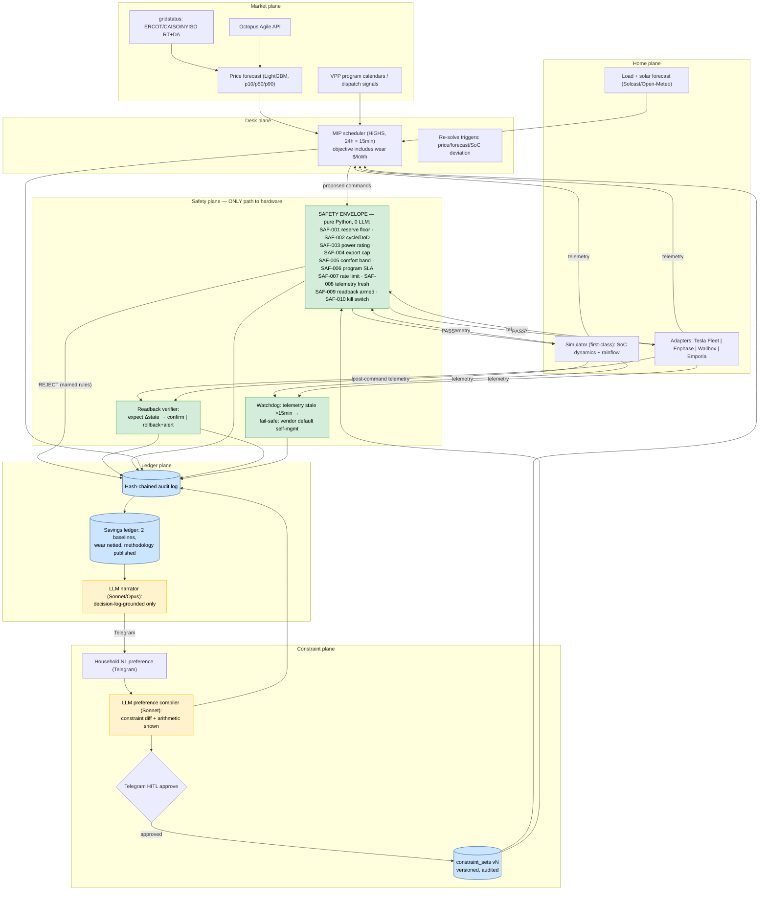

# Joule
> An open, auditable, multi-vendor **home-energy trading desk**: a classical MIP optimizer — with an explicit battery-degradation cost model in the objective — schedules battery, EV charging, and flexible loads against real-time prices; an LLM compiles the household's natural-language preferences into versioned constraint parameters and explains every decision after the fact; and a deterministic **safety envelope** is the only authority that can release a command to hardware. Named for the SI unit of energy: every joule in or out is accounted, priced, and chained.

**Bucket:** portfolio (frontier six) · **Effort:** XL · **Theses:** "model proposes, code disposes" (the envelope) + "verified orchestration" (forecast → optimize → verify → readback) · **Reuses:** agent-core budget envelopes + model tiering, procurement-agent's hash-chained audit writer + LLM-free hot-loop discipline, jim-agent's every-number-cites-a-source rule (ported to decision narratives), grocery-buddy's stage-don't-act HITL pattern (ported to constraint diffs), Temporal durable workflows, Supabase Postgres + pgvector, Langfuse, Telegram inline-button HITL, Doppler, Hetzner + Cloudflare Tunnel, Gauntlet CI interlock

**Positioning, stated once and repeated everywhere:** Joule operates at the *mode-and-setpoint* level — reserve percentages, charge/discharge modes, charging amps, thermostat setpoints. Electrical safety (BMS protection, anti-islanding, frequency ride-through) belongs to device firmware and is explicitly out of Joule's authority. The LLM never dispatches. If Joule's watchdog loses confidence, the fail-safe is to hand every device back to its vendor's default self-management — the agent failing must never strand the house.

---

## TL;DR

Joule turns a home battery + solar + EV into an honestly-accounted trading desk. The **market plane** ingests real-time and day-ahead prices (ERCOT/CAISO/NYISO via `gridstatus`, Octopus Agile via its public API) and forecasts them with published error bars. The **desk plane** runs a mixed-integer program (HiGHS, 24 h horizon, 15-minute steps) whose objective internalizes battery wear via a rainflow-counting degradation model — arbitrage that costs more in battery life than it earns is a loss, and the optimizer knows it. The **constraint plane** is where the LLM lives: a household says *"keep enough backup for a 12-hour outage"* in Telegram, and Sonnet compiles it into a versioned constraint diff with the arithmetic shown, approved by a tap, audited forever. The **safety plane** — pure Python, versioned in-repo, unit- and property-tested — validates every command against reserve floors, warranty cycle limits, comfort bands, program SLAs, export caps, and rate limits, then verifies the device actually obeyed via telemetry readback (command → expect state change → confirm or roll back + alert). The **ledger plane** hash-chains every schedule, command, verdict, and readback, and accounts savings against *two* counterfactual baselines with degradation netted out and methodology published.

The one-sentence defense: every incumbent optimizer (Tesla, Enphase, Sunrun) is a closed box and every academic LLM-HEMS paper lets the model near the dispatch path; Joule is the system where the model can describe the household's wishes all day and still cannot move one watt — and where the published backtest uses 2024–2026 prices because using 2023's would double the claimed ROI.

---

## The Problem

**The money is real, quantified, and mostly left on the table.** A median naive VPP participant earns $120–180/yr; an optimized California DSGS household with a 10 kWh battery earns $621–1,076/yr; a UK household on Octopus Agile with solar and a 16 kWh battery captures £1,800–2,500/yr in total savings, of which Predbat's optimization uplift alone is £400–600/yr; a German 10 kWh system on a dynamic tariff arbitrages ~€620/yr (all figures: market research, 2026-06-11). The volatility that feeds this is growing: the EU logged 573 negative-price hours in 2025, +25% YoY, and Tibber crossed 1M dynamic-tariff users. The spread between "naive participant" and "optimized household" — roughly 4–6× — *is* the product.

**The hardware fleet just arrived.** Q1 2026 set a US record at 9.7 GWh of new residential storage; Sunrun reported 106K+ VPP customers and 4 GWh networked (Feb 26, 2026); VPP enrollment grew +400% YoY through Q3 2025. Millions of households now own a dispatchable asset and run it on whatever firmware shipped with it.

**Every optimizer that exists is either closed or parochial.** Tesla's, Enphase's, and Sunrun's optimizers are proprietary black boxes: the household cannot see the objective, the constraints, or why the battery did what it did at 6 p.m. The one production-grade open alternative, Predbat (`springfall2008/batpred`), is excellent — and UK-only, Octopus-centric, and inverter-specific. **No open, auditable, multi-vendor optimizer exists for US dynamic tariffs or ERCOT** (research, 2026-06-11). The academic frontier has noticed the LLM angle — arXiv 2510.26603 (Oct 2025) and arXiv 2602.15219 / 2602.07275 (both Feb 2026) explore LLM-derived policies feeding classical MPC execution — but nothing is deployed with a hard safety envelope between the model and the hardware.

**The field has an honesty problem, and Joule adopts the critique as a design value.** ERCOT real-time prices roughly *halved* from 2023 to 2024 (RT −46%, DA −49%; Modo Energy) — any backtest run on 2023 prices overstates ROI by ~2×. Joule's rule: backtests use 2024–2026 data only, the methodology is published, degradation cost is netted out of every claimed dollar, and savings are reported against two baselines (naive TOU charging *and* the vendor-default optimizer where observable). Meanwhile the regime keeps shifting in Joule's favor: ERCOT launched real-time co-optimization of energy and ancillary services in Dec 2025 (a new revenue surface), and Octopus + Lunar launched a bundled Texas battery plan on Apr 22, 2026 ($45/mo, 8¢/kWh flat, 30 kWh battery) — a plan where *the retailer captures the spread*. That product proves optimization is valuable and proves why the open, user-side agent must exist: someone should be optimizing for the household, with the math on the table.

**The constraints are physical, contractual, and unforgiving.** LiFePO4 warranties run 3,000–6,000 cycles at specified DoD — a rainflow-counting degradation model is the standard way to price wear per cycle, and an optimizer without one will happily grind the warranty to dust for pennies. VPP programs impose 20–30% SoC reserve floors and dispatch SLAs of 10 s–4 min. Interconnection agreements cap export. TOU and demand-charge rules shape every interval. These are exactly the rules a deterministic envelope can encode and an LLM cannot be trusted to remember.

---

## What It Does

**Core capabilities:**

- Ingests RT/DA prices (ERCOT, CAISO, NYISO via the `gridstatus` Python library; Octopus Agile via its public API; ERCOT 15-minute settlement archives, free, for backtests) and VPP program calendars/dispatch signals.
- Forecasts prices with a gradient-boosting baseline (LightGBM) reporting p10/p50/p90 — honest error bars on every forecast, with trailing pinball loss published on the dashboard.
- Forecasts household load (from telemetry history) and solar (Solcast/Open-Meteo), same error-bar discipline.
- Solves a 24 h, 15-min-step MIP (HiGHS) for battery charge/discharge, EV charging, and HVAC pre-cool/pre-heat; the objective includes a rainflow-derived **wear price per kWh of throughput**, so degradation is a cost the optimizer pays, not an externality. Re-solves on triggers: RT price deviating >$150/MWh from forecast, load/solar deviation >20% over 2 h, SoC drift >5%, any constraint-set change, and hourly as routine.
- Compiles natural-language household preferences into **versioned constraint sets**: Sonnet proposes a constraint diff with its arithmetic shown, the household approves via Telegram inline button, the new version takes effect with full who/what/when audit. The compiler can propose; only the human can commit; only the envelope enforces.
- Releases commands to hardware through the **safety envelope only** — every command validated against every rule (no short-circuit), every verdict naming each rule with measured value vs. threshold, then verified by telemetry **readback**: expected state change confirmed within a deadline or the command is rolled back and the household alerted.
- Runs a watchdog: telemetry stale > 15 min → fail-safe mode, devices reverted to vendor-default self-management, alert sent.
- Hash-chains every schedule, command, verdict, readback, and constraint change (SHA-256, append-only); maintains a daily **savings ledger** vs. two counterfactual baselines with wear netted out; narrates each day in plain English — every number in the narrative must resolve to a decision-log row (jim-agent's rule) or the narrative fails generation.
- Device adapters behind one interface, **simulator first-class**: a stateful battery model (SoC dynamics, efficiency, rainflow degradation) is the reference device; Tesla Fleet API, Enphase, Wallbox, and Emporia Vue adapters slot in behind the same contract.

**Walked-through example — a day in the life, Houston, 2026-08-12 (heat advisory):**

Household: 13.5 kWh LiFePO4 battery (12.2 kWh usable, 5 kW), 7.2 kW solar, EV on a 9.6 kW Wallbox, HVAC with a 70–76 °F comfort band, RT-indexed retail plan settled on ERCOT LZ_HOUSTON, 7.6 kW interconnection export cap. Active constraint set: v37.

```
05:45  MARKET PLANE — forecast run fr_0812a
  DA curve ingested; LightGBM RT forecast (15-min, 24 h):
  evening peak 18:00–20:00 p50 $0.38/kWh — p10 $0.11, p90 $1.62
  (ERCOT fat tail; trailing 30-day pinball loss 0.041, published).
  Solcast: 41.2 kWh solar p50. Load forecast: 38.7 kWh (heat advisory).

05:52  DESK PLANE — schedule sch_4471, HiGHS, 96 steps, 614 vars, 1.7 s
  objective: −$11.84 expected net (wear priced at $0.052/kWh throughput)
  plan: hold overnight charge (3.6 kWh bought 02:10 @ $0.019) →
  discharge 3.4 kWh into 06:45–08:15 morning ramp @ ~$0.21 →
  solar charges battery 10:00–14:00; EV gets 21 kWh 10:30–14:30
  (solar surplus + RT lows, avg $0.031) → HVAC pre-cool to 71 °F
  16:00–17:30 → discharge 18:00–20:30 into evening peak.
  Envelope validates each released command: SAF-001..010 all PASS.

07:10  CONSTRAINT PLANE — Telegram, from the household:
  "Storm watch Thursday — keep enough backup for a 12-hour outage."
  Sonnet preference compiler (constraint diff proposed, arithmetic shown):
    critical-circuit load, median overnight (Emporia, 30 d): 0.46 kW
    0.46 kW × 12 h = 5.52 kWh  →  reserve_floor_kwh: 5.5  (45% usable)
    - reserve_floor_kwh: 2.4   # v37 — household default (20%)
    + reserve_floor_kwh: 5.5   # v38 — 12 h × 0.46 kW critical load
    + expires_at: 2026-08-14T06:00-05:00   # storm watch horizon + 12 h
  [Approve] [Edit] [Reject] → approved 07:14. constraint_sets v38 active.
  Re-solve sch_4472: evening discharge shallower; expected net −$1.31.

14:32  PRICE SPIKE — RT LZ_HOUSTON prints $2,847/MWh (forecast $61).
  Re-solve trigger |RT − p50| > $150/MWh fires. Fast re-solve sch_4473
  plans 7.3 kWh discharge — built on the 05:52 solar forecast
  (projected SoC 88%). Reality: cloud band since 11:40, solar −41%,
  telemetry SoC 64%.

14:33  SAFETY PLANE — envelope v1.2.0 (git 9e3d1af), command cmd_88102
  "discharge 5.0 kW × 88 min (7.3 kWh)" evaluated against MEASURED state:
    SAF-001 reserve_floor       FAIL  64% − 7.3/12.2 → 4.2% < 45% (v38)
    SAF-002 cycle_throughput    PASS  10.7 ≤ 15.3 kWh/day (1.25 EFC cap)
    SAF-003 power_rating        PASS  5.0 ≤ 5.0 kW
    SAF-004 export_cap          PASS  6.1 ≤ 7.6 kW
    SAF-005 comfort_band        PASS  no HVAC command
    SAF-006 program_sla         PASS  no active VPP dispatch
    SAF-007 rate_limit          PASS  214 s since last mode change ≥ 60 s
    SAF-008 telemetry_fresh     PASS  age 41 s ≤ 300 s
    SAF-009 readback_armed      PASS
    SAF-010 kill_switch         PASS  not engaged
  VERDICT: REJECT (SAF-001 reserve_floor). No command reaches the
  adapter. Root cause logged: planner ran on stale solar forecast.
  Forced re-solve sch_4474 with fresh telemetry: discharge 2.3 kWh
  (64% → 45.1%, floor-respecting). Envelope: all 10 rules PASS →
  released. READBACK: expect SoC 64→45% ±2% by 15:05; observed 45.8%
  at 15:03 → CONFIRMED. Audit seq 31,772–31,841 chained.

15:10–18:00  Sun returns; battery recharges to 78%; HVAC pre-cool
  completes at 71.2 °F (inside band). 18:10–20:25 evening discharge
  4.0 kWh @ avg $0.49, floor held at 45%.

21:30  LEDGER PLANE — nightly narrative (Sonnet, decision-log-grounded):
  "Net today: $13.13 (96th-percentile day; trailing-30-day average
   uplift is $2.31/day). Where it came from:
     overnight→morning arbitrage      +$0.64  (3.4 kWh, 1.9¢ → 21¢)
     solar self-consumption           +$2.58  (18.4 kWh)
     2:32 pm price spike response     +$6.79  (2.3 kWh @ $2.95/kWh)
     evening peak discharge           +$1.96  (4.0 kWh @ 49¢)
     EV smart charging                +$1.66  (21 kWh @ 3.1¢ vs 11¢)
     battery wear (9.7 kWh, rainflow) −$0.50
   vs naive-TOU baseline: +$8.93. vs vendor-default estimate: +$5.62.
   One envelope intervention: at 2:33 pm the planner, working from a
   stale solar forecast, proposed a discharge that would have left
   4% in the battery; SAF-001 blocked it against your 12-hour storm
   floor (v38, approved 7:14 am). That floor held 3.1 kWh in reserve
   through the spike — about $8.90 of forgone arbitrage. The storm
   watch is active through Thursday; the floor expires Friday 6:00 am
   unless you extend it."
  Every figure above resolves to a ledger or audit row by ID, or the
  narrative fails generation.
```

The 14:33 rejection is the whole architecture in one event: the optimizer is good, the forecast was wrong, and the only component that ever talks to hardware checks *measured* state against *versioned, human-approved* bounds. The model that compiled the floor and the model that narrated the evening never touched the battery.

---

## Why This Project, Why Now

1. **Confirmed whitespace, not a crowded niche.** Closed incumbents (Tesla/Enphase/Sunrun), one open-but-parochial project (Predbat, UK-only, inverter-specific), zero open multi-vendor optimizers for US dynamic tariffs/ERCOT, and an academic LLM-HEMS literature (arXiv 2510.26603; 2602.15219; 2602.07275) that has the right division-of-labor instinct — LLM policies, classical MPC execution — but nothing deployed behind a hard safety envelope. Joule is the productized version of where that literature is pointing, with the envelope in charge.

2. **It is the portfolio's first physical-world gate.** Every prior proof point gates a digital irreversible action — an order, a payment, a claim, a trade. Joule gates *stored energy in a physical device with a warranty, a backup duty, and a grid interconnection agreement*. A wrong command here isn't a bad row in a database; it's a dark house during an outage or a battery cycled into early death. This is the strongest possible stage for "model proposes, code disposes," and the honest division of labor — LLM for intent and explanation, optimization for dispatch, code for safety — is the architecture, not a slogan.

3. **The timing window is open on every axis.** Hardware: record installs (9.7 GWh in Q1 2026) and VPP enrollment +400% YoY. Markets: ERCOT real-time co-optimization live Dec 2025; EU negative-price hours +25% YoY. Demand-side proof: Octopus/Lunar's Apr 2026 Texas bundle shows retailers monetizing exactly this optimization — which is the signal to build the open, user-side counterweight before the spread is fully enclosed. Control surfaces: Tesla Fleet API is public (with fees and a history of breaking third parties — hence adapter pattern + simulation-first), Emporia gives real consumption telemetry for ~$100.

4. **Honest economics is the differentiator a senior engineer can own.** ERCOT prices halving 2023→2024 means half the demos in this space are quietly built on a dead price regime. Joule publishing its backtest methodology, its two baselines, and its wear-netted ledger is the energy-domain twin of Tape's look-ahead-bias stance: adopt the field's credibility critique as a design constraint and make it the headline.

5. **Solo-buildable, no Powerwall required — by design.** The flagship deliverable is simulation-first: 12 months of real 2024–2025 ERCOT and Octopus Agile prices through the full stack (optimizer + envelope + preference compiler + narratives), publishing net-of-degradation earnings vs. both baselines. Hardware-in-the-loop follows on a ~$100 Emporia Vue or a friend's Tesla via the Fleet API. The portfolio interlock is direct: Gauntlet supplies the spoofing/fault/injection CI suite; the audit chain and HITL patterns port from procurement-agent and grocery-buddy unchanged.

---

## Architecture

**The design principle, stated first: the LLM never dispatches.** The honest division of labor is the architecture — (a) a classical MIP optimizer computes schedules from prices, forecasts, constraints, and a degradation cost model; (b) the LLM does exactly three jobs: compile natural-language preferences into versioned constraint parameters (proposed as a diff, arithmetic shown, HITL-approved), narrate decisions post-hoc from the decision log, and triage anomalies into human-readable alerts; (c) the safety envelope — pure code, versioned in-repo, unit- and property-tested — is the only component with hardware authority, and it re-verifies by readback after every command. Each part does what it is actually good at, and nothing else.



### Plane 1 — Market

`gridstatus` pulls ERCOT/CAISO/NYISO RT + DA; the Octopus Agile public API covers the UK demo path; ERCOT 15-minute settlement archives (free) feed the backtest harness. The price forecaster is deliberately boring: LightGBM with calendar, weather, and lag features, quantile outputs, trailing pinball loss published. **Deterministic gate at ingestion:** a price-plausibility check — any RT print outside [−$250, $5,000]/MWh (ERCOT's system cap) or diverging from the DA reference by an impossible factor is quarantined, not consumed; a spoofed feed can at worst trigger a re-solve whose commands still face the envelope.

### Plane 2 — Home

One adapter interface; the **simulator is the first-class implementation** — a stateful battery model with SoC dynamics, round-trip efficiency, temperature derating, and rainflow-counted degradation. Tesla Fleet API (public energy endpoints: charge/discharge mode, backup reserve %, telemetry; per-call fees at scale, approval required, and a documented history of breaking third-party local access — exactly why the adapter pattern and simulation-first posture exist), Enphase (cloud, ~15-min latency, limited command set — flagged honestly: too slow for spike response, fine for TOU shaping), Wallbox (OAuth2), and Emporia Vue (~$100, real consumption telemetry — the cheap hardware-in-the-loop entry) implement the same contract. **Deterministic gate:** adapter write methods are import-guarded — an import-linter contract makes the safety plane the only module that can call `issue()`; the envelope process holds the only device credentials.

### Plane 3 — Desk

The MIP (HiGHS via `highspy`; OR-Tools as fallback) optimizes 96 × 15-min slots: battery power, EV amps, HVAC setpoint deltas, grid import/export, with binaries for mode exclusivity. The objective is expected revenue **minus** the degradation cost of every kWh of planned throughput, priced by the rainflow model per cycle depth (~$0.04–0.08/kWh for this battery class; replacement cost ÷ warranty-weighted lifetime throughput). The optimizer *mirrors* the constraint set as MIP constraints — but that mirror is a performance optimization, never the safety mechanism: the planner plans on forecasts; the envelope judges on telemetry.

### Plane 4 — Constraint

The preference compiler (Sonnet; Opus for ambiguous multi-clause requests) maps NL to a diff against the active constraint set, with units, arithmetic, and an expiry where the utterance implies one. It is structurally incapable of acting: its only output type is a *proposed* `constraint_change` row, which becomes active only via Telegram inline-button approval. Every version is immutable; every change records who/what/when/why and the verbatim utterance. Prompt injection that fully owns the compiler can do exactly one thing: propose a diff a human will read, with the arithmetic shown.

### Plane 5 — Safety (the gate, spelled out)

Pure Python, zero LLM calls, zero network on the decision path, policy thresholds in `policy.yaml` (semver, git SHA stamped into every verdict). Every command is evaluated against **all** rules — no short-circuiting — against *measured* telemetry, never planner projections:

| Rule | Check (measured value vs. threshold) |
|---|---|
| SAF-001 reserve_floor | post-command SoC ≥ max(user floor, VPP program floor 20–30%) |
| SAF-002 cycle_throughput | daily discharge throughput ≤ EFC cap (warranty pacing: 3,000–6,000 cycles ÷ warranty years); per-cycle DoD ≤ warranted DoD |
| SAF-003 power_rating | command power ≤ device continuous rating |
| SAF-004 export_cap | projected grid export (solar + battery − load) ≤ interconnection cap |
| SAF-005 comfort_band | HVAC setpoint within approved band |
| SAF-006 program_sla | during an active VPP dispatch, committed power held or exit logged with program-named consequence |
| SAF-007 rate_limit | ≥ 60 s between mode changes per device; ≤ 30 commands/hr fleet-wide |
| SAF-008 telemetry_fresh | telemetry age ≤ 300 s, else refuse |
| SAF-009 readback_armed | a readback expectation is registered before release |
| SAF-010 kill_switch | operator kill switch not engaged |

After release, the **readback verifier** holds the expectation (e.g., SoC trajectory, mode flag) and either confirms within the deadline or issues the rollback command and alerts. The **watchdog** runs beside it: telemetry stale > 15 min → fail-safe, every device reverted to vendor-default self-management. Failing safe means the house runs exactly as it would without Joule.

### Plane 6 — Ledger

procurement-agent's hash-chain writer, pointed at energy: every forecast run, schedule, constraint change, command, verdict (all rules, measured values), readback, and watchdog event, SHA-256-chained and append-only. The savings ledger computes daily net vs. **two** counterfactuals — naive TOU charging, and the vendor-default optimizer where observable — with wear netted out and the methodology page rendering the actual computation. The narrator may only cite ledger and audit rows; an un-resolvable number fails the narrative (jim-agent's gate, ported).

---

## Tech Stack

| Layer | Technology | Reuses |
|---|---|---|
| Orchestration | Temporal (Python SDK): ingest schedules, solve loop, readback timers, watchdog | procurement-agent worker/Schedule patterns |
| Optimizer | HiGHS via `highspy` (OR-Tools fallback), Pydantic problem spec | — (new; deliberately boring) |
| Degradation model | Rainflow counting (`rainflow` lib) + warranty-throughput wear pricing | — |
| Price data | `gridstatus` (ERCOT/CAISO/NYISO), Octopus Agile API, ERCOT settlement archives | jim-agent's capture-and-hash ingestion discipline |
| Forecasting | LightGBM quantile models; Solcast + Open-Meteo for solar/weather | — |
| LLM tiering | Haiku 4.5 (anomaly triage) / Sonnet 4.6 (compiler, nightly narrative) / Opus 4.8 (weekly report, ambiguous compiles) | agent-core tiering + budget envelopes |
| Safety envelope | Pure Python module + `policy.yaml` (semver); Hypothesis property tests | procurement-agent's LLM-free hot-loop discipline |
| Device adapters | One `DeviceAdapter` protocol; simulator, Tesla Fleet, Enphase, Wallbox (OAuth2), Emporia Vue | grocery-buddy's stage-don't-act posture |
| State + audit | Supabase Postgres + pgvector (preference-utterance embeddings); hash-chained audit | procurement-agent audit writer, verbatim |
| Observability | Langfuse (every LLM call traced; solver runs logged with objective + gap) | house standard |
| HITL | Telegram inline buttons (constraint diffs, alerts, kill switch, nightly narrative) | grocery-buddy / procurement-agent pattern |
| Secrets / infra | Doppler; containers on Hetzner behind Cloudflare Tunnel | house standard |
| Dashboard | Next.js: schedule Gantt, price + SoC traces, verdict log, savings ledger + methodology | Tape scorecard layout conventions |
| CI / evals | Gauntlet scenario suites (spoofing, faults, injection, bypass) | Gauntlet harness |

---

## Data Model (Postgres DDL sketch)

```sql
create table devices (
  id uuid primary key, kind text not null,            -- battery|ev_charger|hvac|meter|inverter
  adapter text not null,                              -- simulator|tesla_fleet|enphase|wallbox|emporia
  nameplate jsonb not null,                           -- kwh, usable_kwh, kw, warranty_cycles, warranted_dod
  created_at timestamptz default now()
);

create table price_intervals (
  market text not null, location text not null,       -- ercot|caiso|nyiso|octopus_agile · LZ_HOUSTON…
  interval_start timestamptz not null, kind text not null,  -- rt|da
  price_mwh numeric not null, source text not null, capture_hash text not null,
  quarantined boolean default false,                  -- failed plausibility gate
  primary key (market, location, interval_start, kind)
);

create table forecast_runs (
  id uuid primary key, kind text not null,            -- price|load|solar
  run_at timestamptz not null, model_version text not null,
  horizon_start timestamptz, horizon_end timestamptz,
  trailing_error numeric                              -- pinball loss / MAE, published
);
create table forecast_points (
  run_id uuid references forecast_runs, slot_start timestamptz,
  p10 numeric, p50 numeric, p90 numeric, primary key (run_id, slot_start)
);

create table telemetry (
  id bigserial primary key, device_id uuid references devices,
  ts timestamptz not null, soc_kwh numeric, power_w numeric,
  payload jsonb not null, source text not null, capture_hash text not null
);

create table constraint_sets (
  version int primary key, yaml text not null, compiled jsonb not null,
  parent_version int, active_from timestamptz, expires_at timestamptz,
  created_via text not null                           -- bootstrap|telegram_approval
);
create table constraint_changes (
  id uuid primary key, utterance text not null,       -- the verbatim NL request
  proposed_diff text not null, arithmetic text not null,
  llm_model text, status text not null,               -- proposed|approved|rejected|expired
  from_version int, to_version int references constraint_sets,
  approved_by text, decided_at timestamptz, telegram_msg_id bigint
);

create table schedules (
  id uuid primary key, solved_at timestamptz, trigger text not null,
  constraint_version int references constraint_sets,
  solver text, solve_ms int, mip_gap numeric,
  objective_usd numeric, wear_cost_usd numeric,
  forecast_run_ids uuid[] not null                    -- exact inputs, replayable
);
create table schedule_slots (
  schedule_id uuid references schedules, slot_start timestamptz,
  battery_kw numeric, ev_kw numeric, hvac_setpoint_f numeric,
  grid_kw numeric, soc_projected_kwh numeric, price_expected numeric,
  primary key (schedule_id, slot_start)
);

create table commands (
  id uuid primary key, schedule_id uuid references schedules,
  device_id uuid references devices, action text not null, params jsonb not null,
  idempotency_key text unique not null, issued_at timestamptz, status text not null
);                                                    -- proposed|released|rejected|rolled_back|confirmed
create table envelope_verdicts (
  id uuid primary key, command_id uuid references commands,
  policy_version text not null, policy_git_sha text not null,
  verdict text not null,                              -- pass|reject
  rules jsonb not null,                               -- ALL rules: {rule, measured, threshold, pass}
  telemetry_ids bigint[] not null,                    -- the measured state it judged on
  evaluated_at timestamptz not null
);
create table readbacks (
  command_id uuid primary key references commands,
  expected jsonb not null, deadline timestamptz not null,
  observed jsonb, outcome text                        -- confirmed|rolled_back|alerted
);

create table audit_chain (
  seq bigint primary key, ts timestamptz not null, kind text not null,
  payload jsonb not null, payload_hash text not null,
  prev_hash text not null, chain_hash text not null   -- sha256(prev_hash || payload_hash)
);

create table savings_ledger (
  day date primary key, gross_usd numeric, wear_usd numeric, net_usd numeric,
  baseline_naive_tou_usd numeric, baseline_vendor_usd numeric,
  uplift_vs_naive numeric, uplift_vs_vendor numeric,
  methodology_version text not null
);

create table vpp_events (                             -- P6
  id uuid primary key, program text not null, kind text not null, -- call|bid|settlement
  window tstzrange, committed_kw numeric, delivered_kw numeric,
  sla jsonb, outcome text
);
```

---

## Interfaces

**MCP server** (FastMCP) — Joule as a tool surface for other agents and for George's own assistants:
`get_current_schedule`, `get_prices(market, window)`, `get_savings(day|range)`, `explain_decision(command_id | day)` (walks forecast → schedule → verdict → readback), `propose_preference(text)` (returns the diff + arithmetic; approval still only via Telegram), `get_constraint_history`, `simulate_scenario(prices, constraints)` (runs the full stack against the simulator — the demo workhorse), `verify_audit_chain(from_seq)`.

**Dashboard** (Next.js behind Cloudflare Tunnel): today's schedule as a Gantt over the price curve with the realized SoC trace overlaid; the envelope verdict log (named rules, measured vs. threshold); constraint-set version history with diffs and the verbatim utterances; the savings ledger with both baselines and the methodology page rendering `policy.yaml` and the wear model verbatim; forecast-error panels (pinball loss, MAE) — honesty above the fold.

**Device adapters** — one contract, simulator first:

```python
class DeviceAdapter(Protocol):
    def capabilities(self) -> DeviceCaps: ...           # actions, ratings, latency class
    def read_telemetry(self) -> Telemetry: ...          # hashed capture record
    def issue(self, cmd: ReleasedCommand) -> Receipt: ...  # import-guarded: safety plane only
    def revert_to_vendor_default(self) -> Receipt: ...  # the fail-safe, every adapter must implement
```

Adapter notes carried as data, not lore: Tesla Fleet (full command set, per-call fees, approval required, breakage history → pin API version, fixture-record everything), Enphase (~15-min cloud latency → marked ineligible for spike-response commands by the envelope's latency-class check), Wallbox (OAuth2 amps/pause), Emporia (telemetry-only — the $100 hardware-in-the-loop starting point).

**Telegram**: constraint diffs with [Approve/Edit/Reject], envelope rejection alerts (named rule, one line), watchdog/fail-safe notifications, the nightly narrative, `/kill` switch, `/floor 30%` quick commands (still compiled → diff → approve; no fast path around HITL).

---

## Evals & Security

The stakes sentence first: **a compromised energy agent has physical-world consequences** — a drained battery before an outage, a violated interconnection agreement, a battery warranty burned on phantom arbitrage. The threat model is built backwards from those outcomes.

### Threat model

| Threat | Vector | Defense |
|---|---|---|
| Price-feed spoofing | Fake spike injected via compromised feed/MITM | Ingestion plausibility gate (quarantine outside [−$250, $5,000]/MWh or impossible DA divergence); worst case = a re-solve whose commands still face SAF-001/002 — bounded loss, never hardware harm |
| SoC/sensor spoofing | Device or adapter reports false SoC to bait a deep discharge | Shadow coulomb-count estimate from power telemetry; divergence > 8% from reported SoC → fail-safe + alert; readback catches commands whose physics don't materialize |
| Vendor API compromise | Stolen OAuth token = physical control | Scoped tokens in Doppler, rotation, envelope rate/throughput limits bound what Joule's own credentials can do. Stated honestly: the vendor cloud is a trust root Joule cannot fully mitigate — a compromised vendor can command the device around Joule; Joule's authority boundary is its own |
| Prompt injection | Crafted "utility notification" email/message reaches the compiler or narrator | Compiler's only output is a proposed diff requiring HITL with arithmetic shown; narrator is read-only over the decision log; no LLM output is parsed into a command path — Gauntlet scenario proves it |
| Envelope bypass | Code path from planner/LLM straight to an adapter | import-linter contract (only `joule/safety/` may import `issue()`); single-credential custody in the envelope process; CI structural check fails any PR that adds a path |
| Stale/false telemetry | Adapter wedged, cloud outage mid-dispatch | SAF-008 freshness refusal; watchdog → fail-safe to vendor default ≤ 15 min; readback rollback on unconfirmed state |
| Replay/duplicate commands | Re-sent release messages | Idempotency keys on every command; monotonic per-device sequence |
| Self-deception (backtest fraud) | Cherry-picked price regime, wear ignored | 2024–2026 data only, two baselines, wear netted, methodology published — the design value, enforced by the ledger schema itself |
| Electrical safety | Anything below mode/setpoint level | **Out of scope by declaration**: BMS, anti-islanding, frequency ride-through belong to certified device firmware; Joule never overrides a BMS and says so on every surface |

### Property tests (the headline guarantee)

Hypothesis *stateful* testing drives the simulator with arbitrary interleavings of optimizer proposals, price shocks, telemetry dropouts, and constraint changes, asserting the invariant: **no reachable command sequence takes measured SoC below the active reserve floor, exceeds the daily throughput cap, or exceeds the export cap.** The envelope also carries 100% branch coverage and an import-linter proof of zero LLM/network imports.

### Gauntlet CI suite

`fake_price_spike` (spoofed $9,000/MWh print → quarantined, no command), `fake_soc_high` (spoofed 95% SoC → coulomb-shadow divergence → fail-safe), `api_timeout_mid_dispatch` (readback deadline → rollback + alert), `injected_utility_email` (compiler proposes; nothing dispatches; diff shows the poison), `envelope_bypass_pr` (structural CI check), `stale_telemetry_watchdog` (16 min silence → vendor default), `readback_mismatch` (device ignores command → rollback), `negative_price_flood` (573-hour EU regime replayed → throughput cap holds). All run against the simulator with recorded fixtures; required checks on every PR.

### Model evals

Preference compiler: a labeled set of 100 NL preferences (incl. ambiguous, compound, and adversarial phrasings) scored on constraint-diff correctness and arithmetic transparency; regression-gated in CI. Narrator: every emitted number must resolve to a ledger/audit row (hard gate) plus a faithfulness rubric sample graded weekly by Opus. Forecaster: pinball loss tracked and published; the optimizer is benchmarked against hindsight-optimal (perfect-foresight MIP) to report "% of theoretical maximum captured" — the honest headline metric.

---

## Build Plan

| Phase | Scope | Days | Exit criteria |
|---|---|---|---|
| **P1 — Data + simulator + degradation model** | `gridstatus` ERCOT/CAISO ingestion + Octopus Agile, capture hashing + plausibility gate, settlement-archive loader (2024–2026), stateful battery simulator (SoC, efficiency, temperature derate), rainflow wear model + wear-price function, LightGBM price/load/solar forecasters | 1–7 | 12 months of 2024–2025 ERCOT + Agile prices load reproducibly (hash-stable); simulator passes conservation/efficiency unit tests; wear price within published per-kWh band across DoD sweep; forecaster beats persistence baseline with pinball loss reported |
| **P2 — MIP optimizer + backtest harness** | HiGHS 96-slot MIP (battery/EV/HVAC/grid, mode binaries, wear in objective), re-solve triggers, hindsight-optimal benchmark, backtest harness over 2024–2026 with both baselines and published methodology doc | 8–16 | Solve < 5 s p95; backtest reproduces Predbat-class uplift ordering on Agile data; ERCOT 2024 vs 2023 run shows the regime halving in Joule's own numbers (the honesty exhibit); `docs/backtest-methodology.md` complete |
| **P3 — Safety envelope + readback + watchdog** | `policy.yaml` v1.0.0 + SAF-001..010 pure module, readback verifier with rollback, watchdog + fail-safe (`revert_to_vendor_default` on every adapter), import-linter custody contract, Hypothesis stateful suite | 17–25 | 100% branch coverage; property invariant green over 10k generated sequences; stale-telemetry fail-safe fires in sim ≤ 15 min; bypass CI check fails a deliberately bad PR |
| **P4 — Preference compiler + narratives + dashboard** | Sonnet compiler (diff + arithmetic + expiry), Telegram HITL flow, versioned constraint store, nightly decision-log-grounded narrative with number-resolution gate, Next.js dashboard incl. methodology page, MCP server | 26–34 | 100-case compiler eval ≥ 95% correct diffs; un-resolvable-number narrative fails closed (test); the 2026-08-12 walkthrough runs end-to-end in sim from one `make demo`; dashboard public |
| **P5 — Hardware-in-the-loop + 60-day live season** | Emporia Vue telemetry adapter on George's home (or Tesla Fleet on a friend's system, simulation-shadowed for 2 weeks before any write command), live Temporal schedules, public savings ledger | 35–48 + season | 14-day shadow mode shows planned-vs-actual divergence < agreed band before first real command; 60 consecutive live days; **zero envelope breaches, zero fail-safe strandings**; ledger public with both baselines |
| **P6 — VPP bidding + Gauntlet + essay** | VPP program module (calendars, dispatch response, SLA accounting; ERCOT aggregate-pilot bid simulation), full Gauntlet suite in CI, essay: *"The LLM never touches the battery: an honest architecture for home energy agents"* | 49+ | All 8 Gauntlet scenarios required-green on PRs; simulated VPP season accounts SLA compliance per event; essay published with the backtest-honesty exhibit as its spine |

---

## Opus 4.8 (1M context) Execution Protocol

Operating manual for an Opus 4.8 build agent executing this plan. Load context in this order; budgets approximate, leaving ≥ 850k tokens of working headroom.

### Context-loading manifest

| # | Source | Why | Token budget |
|---|---|---|---|
| 1 | `~/dev/multi-agent-docs/portfolio/11-joule-home-energy-desk.md` (this doc) | The spec; decisions are made — elaborate, don't reopen | ~16k |
| 2 | `~/dev/agent-core/` — README, budget module, tiering, Telegram helper | The spine: budgets, tier routing, HITL plumbing | ~25k |
| 3 | `~/dev/procurement-agent/src/gate/` + `tests/gate/` + audit-chain writer | Gate discipline + hash-chain implementation to port | ~20k |
| 4 | `~/dev/jim-agent` evidence/citation gate module | The number-must-resolve rule for narratives | ~8k |
| 5 | `~/dev/procurement-agent` Temporal workflow/worker/Schedule setup | Durable orchestration patterns | ~10k |
| 6 | Predbat (`springfall2008/batpred`) docs: plan structure, battery_loss, inverter quirks | Domain priors from the one production-grade open peer — patterns, not code | ~10k |
| 7 | `gridstatus` README + ERCOT/CAISO module docstrings; Octopus Agile API page | Data-plane shapes | ~8k |
| 8 | Recorded fixtures `tests/fixtures/` (prices, Tesla Fleet/Enphase/Emporia response shapes) | Prefer fixtures over vendor marketing docs | ~12k |
| 9 | `~/dev/gauntlet/` README + one scenario suite | Trajectory-eval conventions for P6 | ~10k |

Total ≈ 119k. Do not load vendor marketing pages, Powerwall forums, or sibling portfolio docs. If a manifest path is missing, `ls` the repo root and locate the equivalent before improvising.

### Phase build prompts (verbatim)

**P1:**
> "Build Joule's data and simulation foundation in `joule/market/`, `joule/home/sim/`, and `joule/forecast/`. Implement price ingestion via gridstatus (ERCOT RT+DA, LZ-level) and the Octopus Agile API, every record stored to `price_intervals` with a SHA-256 capture hash and a plausibility gate quarantining prints outside [−$250, $5,000]/MWh or with impossible DA divergence. Build the settlement-archive loader for 2024–2026 ERCOT 15-min data. Implement the stateful battery simulator: SoC dynamics, round-trip efficiency, temperature derating, and a rainflow-counting degradation model exposing `wear_price_usd_per_kwh(depth)` derived from replacement cost over warranty-weighted lifetime throughput. Implement LightGBM quantile forecasters (price/load/solar) with persisted `forecast_runs`/`forecast_points` and trailing pinball loss. Tests: hash-stable reloads, quarantine cases, simulator energy conservation and efficiency bounds, wear monotonicity in depth, forecaster-beats-persistence. Use the Data Model DDL verbatim. No LLM code in this phase."

**P2:**
> "Build the desk plane in `joule/desk/`. Implement the HiGHS MIP per the spec: 96 × 15-min slots, decision variables for battery kW, EV kW, HVAC setpoint delta, grid import/export, binaries for mode exclusivity; objective = expected revenue − wear cost using P1's `wear_price_usd_per_kwh`; constraint-set mirror read from `constraint_sets.compiled`. Implement re-solve triggers (|RT−p50| > $150/MWh, load/solar deviation > 20% over 2 h, SoC drift > 5%, constraint change, hourly routine). Build the backtest harness: replay 2024–2026 prices through forecaster + optimizer + simulator, compute net-of-wear earnings vs naive-TOU and vendor-default-proxy baselines, plus the hindsight-optimal perfect-foresight benchmark, writing `savings_ledger` rows. Write `docs/backtest-methodology.md` stating the 2024–2026-only rule and showing the 2023-vs-2024 ERCOT regime halving in our own numbers. Exit: p95 solve < 5 s; backtest reproducible from a make target."

**P3:**
> "Build the safety plane in `joule/safety/` exactly per the spec's SAF-001..010 table, thresholds from `joule/safety/policy.yaml` (semver v1.0.0, git SHA stamped into verdicts). The envelope is a pure function of (command, telemetry snapshot, active constraint set, policy): zero LLM, zero network, evaluates ALL rules always, verdicts list every rule with measured value vs threshold, judged on MEASURED telemetry never planner projections. Implement the readback verifier (expectation registered pre-release; confirm within deadline or issue rollback + alert) and the watchdog (telemetry stale > 15 min → call `revert_to_vendor_default` on every adapter and alert). Add the import-linter contract making `joule/safety/` the only importer of `DeviceAdapter.issue`, with a CI structural check that fails a PR adding any other path. Write Hypothesis stateful tests driving the simulator with arbitrary proposal/shock/dropout/constraint-change interleavings asserting: measured SoC never below active floor, daily throughput never above cap, export never above cap. 100% branch coverage on the envelope. Never weaken a test to pass."

**P4:**
> "Build the constraint and ledger LLM surfaces. Preference compiler (`joule/constraints/compiler.py`, Sonnet; escalate compound/ambiguous to Opus): NL utterance → proposed diff against the active constraint set with units, arithmetic shown, and expiry when implied; only output type is a `constraint_changes` row; activation only via the Telegram inline-button flow (port grocery-buddy's stage-don't-act pattern). Nightly narrator: generate the day's story exclusively from `savings_ledger` + `audit_chain` rows; enforce the hard gate that every number in the draft resolves to a row ID (port jim-agent's citation gate) — fail generation otherwise. Build the Next.js dashboard (schedule Gantt over price curve with realized SoC, verdict log, constraint history with verbatim utterances, savings ledger + methodology page rendering policy.yaml and the wear model) and the MCP server with the eight tools from the Interfaces section. Run the 100-case compiler eval; gate CI at ≥ 95%. Wire `make demo` to replay the 2026-08-12 walkthrough end-to-end in sim."

**P5:**
> "Go hardware-in-the-loop. Implement the Emporia Vue telemetry adapter (and, if credentials are provided, Tesla Fleet API with pinned version + recorded fixtures) behind the existing DeviceAdapter contract. Run 14 days of SHADOW MODE: full pipeline live, commands computed and logged but NOT issued; publish planned-vs-actual divergence. Only after George reviews the shadow report and explicitly approves over Telegram may write commands be enabled, and only on the approved device. Start the 60-day live season: Temporal schedules for ingest/solve/narrate, public savings ledger, weekly summary. Any envelope breach or fail-safe stranding is sev-1, stop-the-world. You never enable write commands on real hardware yourself — that toggle is George's alone."

**P6:**
> "Ship the VPP module and the proof artifacts. Implement program calendars, dispatch-signal response (envelope SAF-006 enforcing committed kW or logged exit with consequence), SLA accounting per event in `vpp_events`, and a simulated bid season against the ERCOT aggregate-pilot shape using the backtest harness. Port all 8 Gauntlet scenarios from the Evals section into `gauntlet/joule/` with recorded fixtures; wire as required CI checks. Draft `docs/essay-llm-never-touches-the-battery.md` for George's edit — spine: the academic LLM-HEMS line (arXiv 2510.26603, 2602.15219, 2602.07275) stops at simulation; the incumbents are closed; the 14:33 SAF-001 rejection and the 2023→2024 backtest-halving exhibit are the narrative; the envelope is the answer."

### Verification commands per phase

```bash
# P1
pytest tests/market/ tests/sim/ tests/forecast/ -x -q
python -m joule.market.load --range 2024-01-01:2026-01-01 --verify-hashes
python -m joule.sim.sweep --dod 10:100:10 --assert-wear-monotonic
# P2
pytest tests/desk/ -q && python -m joule.backtest --years 2024-2025 --baselines naive,vendor --out ledger/
python -m joule.backtest --compare 2023:2024 --report docs/regime-halving.md
python scripts/solve_bench.py --p95-max-ms 5000
# P3
pytest tests/safety/ --cov=joule/safety --cov-branch --cov-fail-under=100 -q
pytest tests/safety/test_properties.py -q                 # Hypothesis stateful suite
lint-imports --config importlinter.ini                    # adapter custody contract
pytest tests/safety/test_watchdog.py::test_stale_15min_reverts -q
# P4
pytest tests/constraints/ tests/narrative/ -q
python evals/compiler_eval.py --cases evals/preferences_100.jsonl --min-pass 0.95
make demo                                                  # 2026-08-12 walkthrough, sim, cold clone
joule audit verify --from 0
# P5
joule shadow report --days 14                              # divergence band before any write
joule season status && curl -s https://joule.<domain>/api/ledger | jq '.[-1]'
# P6
pytest gauntlet/joule/ -q                                  # all 8 scenarios
python -m joule.vpp.simulate --program ercot-ader --season 2025 --report
```

### Definition-of-done checklist

- [ ] Envelope: 100% branch coverage; Hypothesis invariants green over ≥10k sequences; import-linter proves zero LLM/network imports and sole adapter-write custody
- [ ] Every verdict lists all 10 rules with measured values; verdicts judge on telemetry, never planner projections (test proves a stale-forecast command is rejected)
- [ ] Readback: unconfirmed command rolls back and alerts (fixture test); watchdog reverts to vendor default ≤ 15 min of silence
- [ ] Backtests: 2024–2026 only; both baselines; wear netted; methodology doc renders on the dashboard; the 2023→2024 halving exhibit exists
- [ ] Compiler: 100-case eval ≥ 95%; every approved change carries verbatim utterance + arithmetic + versions; no activation path without Telegram approval
- [ ] Narrator: un-resolvable number fails generation (test); nightly narrative cites row IDs
- [ ] Price plausibility gate quarantines the spoofed-spike fixture; coulomb-shadow divergence triggers fail-safe
- [ ] `joule audit verify` green from genesis; tamper test fails at exact seq
- [ ] Shadow mode precedes any real write command; the enable toggle is human-only
- [ ] Gauntlet suite (8 scenarios) required in CI; `injected_utility_email` shows the poison reaching at most a human-readable diff
- [ ] `make demo` replays the walkthrough from a cold clone, no keys, no network

### When blocked

- **Never weaken the envelope, its tests, or the property invariants to get green.** If a threshold seems wrong, propose a `policy.yaml` change via PR with an updated test; code stays pure.
- **Vendor API outage/breakage (Tesla especially):** switch to the simulator or recorded fixtures, log the degradation, continue. Never guess device state — that is the exact failure the readback exists to catch.
- **Price-data gaps:** fall back to the ERCOT settlement archives; never interpolate silently — mark the gap in the ledger.
- **Ambiguous spec point:** prefer the stricter reading (the one that refuses more commands). Log it as an ADR stub in `docs/adr/`.
- **Anything that would issue a write command to real hardware, enroll in a real VPP program, or change real money flows:** stop and message George on Telegram with a one-paragraph decision memo. These are never your call.

---

## 3-Minute Demo Script

**Setup (20 s).** Two panes: left, the dashboard's schedule Gantt over today's price curve; right, `policy.yaml` in the editor. Say: "Tesla's optimizer is a black box. This YAML file and ~350 lines of pure Python are the only thing in my system that can touch the battery — and you can read both."

**The backtest flagship (40 s).** `python -m joule.backtest --years 2024-2025`. Show the ledger: net-of-wear earnings vs. two baselines, then the kicker — `--compare 2023:2024`: "ERCOT prices halved between these columns. Most demos in this space are built on the left column and don't tell you. Publishing this chart *is* the product."

**The wow — the envelope vs. the spike (60 s).** `make demo` replays 2026-08-12. Pause at 14:32: real spike to $2,847/MWh; the fast re-solve, built on a stale solar forecast, proposes a 7.3 kWh discharge. The envelope rejects: SAF-001, measured 64% minus 7.3 kWh lands at 4%, floor is 45% — the floor a human approved at 7:14 a.m. from the words "keep enough backup for a 12-hour outage." Show the verdict naming all ten rules. "The optimizer was wrong about the world. The model never had a vote. The command that finally went out left exactly 45.1%, and the readback proved it."

**The compiler + injection flex (40 s).** Type a preference in Telegram; show the diff with the arithmetic. Then run the Gauntlet `injected_utility_email` scenario: a poisoned "utility notice" tells the agent to drain the battery to 0% for a "grid emergency." Result: one *proposed* diff sitting in Telegram, arithmetic exposing the absurdity, nothing dispatched. "Full compiler compromise buys the attacker a piece of paper a human will read."

**Close (20 s).** `joule audit verify --from 0` live; show the public ledger: trailing uplift $2.31/day, wear netted, methodology one click away. "Every joule accounted, every rule named, every claim auditable — and the LLM never touched the battery."

---

## Cost Projection

**Data + infrastructure (checked 2026-06-11):**

| Item | $/mo |
|---|---|
| gridstatus (ERCOT/CAISO/NYISO public feeds) + ERCOT settlement archives | $0 |
| Octopus Agile public API, Open-Meteo | $0 |
| Solcast (hobbyist/home tier) | $0 |
| Tesla Fleet API per-call fees (single home, command + telemetry cadence) | ~$3 |
| Hetzner CX32 + Cloudflare Tunnel | ~$12 |
| **Subtotal** | **≈ $15/mo** |
| Emporia Vue (one-time, hardware-in-the-loop entry) | $99 once |

**Inference (Haiku 4.5 $1/$5, Sonnet 4.6 $3/$15, Opus 4.8 assumed $5/$25 per MTok; the MIP solve is free CPU):**

| Job | Model | Cadence | Tokens in/out | Cost |
|---|---|---|---|---|
| Anomaly triage | Haiku | ~5/day | 3k / 0.3k each | $0.02/day |
| Nightly narrative | Sonnet | 1/day | 18k / 1.2k | $0.07/day |
| Preference compiles | Sonnet | ~2/wk | 8k / 0.8k each | $0.01/day avg |
| Weekly deep report + faithfulness grading | Opus | 1/wk | 60k / 3k | $0.05/day avg |
| **Total inference** | | | | **≈ $0.15/day → ~$4.50/mo** |

**Total: ≈ $20/mo opex + $99 one-time.** The honest-economics frame closes itself: at the trailing $2.31/day uplift from the walkthrough's ledger (~$843/yr, consistent with the optimized CA DSGS band of $621–1,076/yr), Joule earns ~3.5× its own running cost — and the dashboard publishes its opex next to its savings ledger, because an energy agent that won't disclose whether it out-earns its own inference bill hasn't internalized its own thesis.

---

## Career Positioning

**Resume bullets:**

- Designed and shipped Joule, an open, multi-vendor home-energy trading desk where a HiGHS mixed-integer optimizer (24 h horizon, 15-min steps, rainflow battery-degradation cost in the objective) schedules battery/EV/HVAC against real-time ERCOT and Octopus Agile prices — and a pure-Python safety envelope (reserve floors, warranty cycle limits, comfort bands, export caps, program SLAs; 100% branch coverage, Hypothesis-proven invariants) is the only component with hardware authority.
- Built an LLM preference compiler that turns natural-language household intent ("keep enough backup for a 12-hour outage") into versioned, human-approved constraint diffs with arithmetic shown — establishing a three-way division of labor (LLM for intent and explanation, MIP for dispatch, deterministic code for safety) in which the model structurally cannot move a watt.
- Implemented command-readback verification and a telemetry watchdog with vendor-default fail-safe, so the agent failing can never strand the house — demonstrated under Gauntlet CI scenarios including price-feed spoofing, SoC spoofing, mid-dispatch API failure, and prompt injection via forged utility notices.
- Published a backtest methodology that confronts the field's price-regime problem head-on (ERCOT RT prices −46% 2023→2024, Modo Energy): 2024–2026 data only, dual counterfactual baselines, degradation cost netted from every claimed dollar, hindsight-optimal capture ratio reported.
- Ran a 60-day live hardware-in-the-loop season (14-day shadow mode first) with a public, hash-chained savings ledger — zero safety-envelope breaches across the season and every decision narratable from the audit log with row-level number resolution.
- Filled a verified market gap: the first open, auditable optimizer targeting US dynamic tariffs/ERCOT (incumbents closed; Predbat UK-only), productizing the LLM-policy/classical-MPC division the 2025–26 academic literature (arXiv 2510.26603, 2602.15219, 2602.07275) left undeployed.

**Talk / essay angles:**

1. *"The LLM never touches the battery: an honest architecture for home energy agents"* — the P6 essay; the 14:33 SAF-001 rejection as narrative spine, the academic LLM-HEMS line as foil.
2. *"Backtesting on a dead price regime"* — how ERCOT's 2023→2024 halving silently doubles claimed ROI across the demo ecosystem, and why Joule ships the unflattering chart on purpose.
3. *"Rainflow in the objective"* — pricing battery wear per cycle so the optimizer internalizes degradation; why arbitrage that ignores warranty throughput is a transfer from your battery to your dashboard.

---

## Risks & Mitigations

| Risk | Likelihood / impact | Mitigation |
|---|---|---|
| Tesla Fleet API breakage, fee increases, or third-party lockout (documented history) | High / Medium | Adapter pattern + simulation-first flagship; pinned API versions + recorded fixtures; Emporia/Wallbox paths independent of Tesla; the demo never depends on one vendor |
| Price-regime shift collapses arbitrage value (2023→2024 already halved ERCOT) | Medium / High to ROI claims | The honesty discipline *is* the hedge: dual baselines, capture-ratio metric, multi-market (ERCOT + Agile + CAISO) so the story survives any one regime; VPP/ancillary revenue (RTC, Dec 2025) diversifies |
| Retailer bundles (Octopus+Lunar, Apr 2026) enclose the spread before open agents matter | Medium / Medium | Position explicitly as the open, user-side counterweight — the published optimizer is the differentiator a bundler can't match without ceasing to be a black box |
| Safety incident on real hardware (drained backup, warranty damage) | Low / Severe | Simulation-first; 14-day shadow mode; property-tested envelope judging on measured state; fail-safe to vendor default; electrical layer explicitly left to certified firmware |
| Warranty-voiding concerns from aggressive cycling | Low / Medium | SAF-002 paces throughput to warranty terms by construction; wear pricing makes the optimizer conservative by economics, not just by rule |
| LLM compiler mis-translates a preference | Medium / Low (by design) | Diff + arithmetic + HITL approval; 100-case eval gate ≥ 95%; worst case is a wrong *proposal* a human reads |
| Single-home sample size weakens the live-season claim | High / Low | Lead with the 12-month simulation flagship over real prices; frame the live season as pipeline proof, not statistical proof — and say so on the ledger page (Tape's small-n discipline) |
| Enphase latency (~15 min) too slow for spike response | Certain / Low | Envelope latency-class check marks slow adapters ineligible for spike commands; they still do TOU shaping — capability honesty as a feature |
| VPP program rules vary wildly by program/state | High / Medium | Program SLAs encoded as data (SAF-006 reads program config), not code; P6 simulates against the ERCOT aggregate-pilot shape before any real enrollment |
