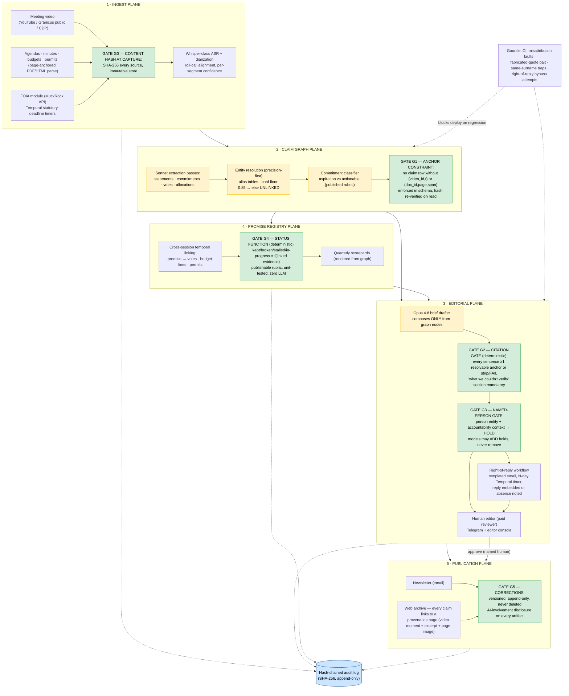

# Quorum
> An agentic civic newsroom for the towns where local news died: it ingests one local government's public exhaust — meeting video, agendas, minutes, budgets, permits — builds a citation-anchored civic claim graph, publishes weekly briefs through an editorial gate that **structurally cannot emit an uncited claim**, holds anything touching a named person for human approval plus right-of-reply, and maintains the longitudinal promise registry (what officials said in March vs. how they voted in September) that no tool on earth currently provides.

**Bucket:** frontier / civic accountability · **Effort:** XL · **Reuses:** agent-core model tiering (Haiku 4.5 / Sonnet 4.6 / Opus 4.8) + budget + tracing, jim-agent's claim-trace provenance gate (pointed at journalism), Byline's per-sentence citation compiler + publish-gate pattern, procurement-agent's hash-chained SHA-256 audit log, Temporal durable workflows + statutory-deadline timers, Supabase Postgres + pgvector, Langfuse, MCP server (FastMCP), Telegram inline-button HITL, Doppler, Hetzner + Cloudflare Tunnel, Gauntlet CI suite from phase one

**Relationship to siblings:** Darkroom is the natural supplier of verified-human local photojournalism for Quorum's briefs; Gauntlet certifies Quorum's misattribution and right-of-reply defenses before anything publishes. Quorum is Thesis 1 ("model proposes, code disposes") applied to the highest-stakes irreversible action in the portfolio: **a published claim about a named human being in their own town.**

---

## TL;DR

Quorum is a civic accountability desk for news deserts. It points the portfolio's verified-orchestration spine at one mid-size municipality's public record: council and school-board meeting video is transcribed and diarized; agendas, minutes, budget PDFs, and permit feeds are parsed with page-anchored extraction; every captured source is content-hashed at ingest. Sonnet extraction passes build a **civic claim graph** where every node and edge carries a primary-source anchor — `(video_id, t_start, t_end)` or `(doc_id, page, span)` — with no exceptions and no orphan nodes. An Opus drafter composes weekly briefs **only from graph nodes**, and two deterministic gates own publication: the **citation gate** (every sentence must carry resolvable anchors or the brief fails compilation — uncited prose is not "discouraged," it is uncompilable) and the **named-person gate** (any sentence containing a resolved person entity in accountability context is held for a human editor plus a templated right-of-reply window — non-negotiable HITL, budgeted as a paid part-time reviewer from day one). On top of the graph sits the **promise registry**: commitments classified against a published rubric, linked longitudinally to subsequent votes, budget lines, and permits, with a kept/broken/stalled status that is a **deterministic function over linked evidence** — never a vibe. Everything publishes to a newsletter and a public web archive where every claim hyperlinks to its provenance page: the exact video moment, embedded, with transcript excerpt and document page image. AI surfaces and structures; a human approves; the provenance chain is always public. The one-line thesis: **the Gannett and Hoodline failures were governance failures, not AI failures — and Quorum is the governance, shipped as architecture.**

---

## The Problem

Local news in America is not declining; in a measurable set of places it is **gone**. The Medill/Northwestern *State of Local News* report (Oct 2025) counts **213 news-desert counties** — a record, up from 206 the year before — plus **1,524 single-source counties** one closure away from joining them. **50 million Americans** live with limited or no local news. **136 newspapers closed in the past year alone**, the majority family-owned independents, not chain consolidations. The beats that died first are exactly the ones accountability depends on: statehouse and city-hall coverage — the reporters who sat through three-hour council meetings and remembered in September what was promised in March. The market has noticed the gap without filling it: **300+ local news startups launched in five years**, but 80% are digital-only and metro-concentrated (Medill, Oct 2025). The startups go where the audiences are dense; the deserts stay deserts. Nobody is sitting in the Riverton council chamber on a Tuesday night, and the officials know it.

The obvious response — "point AI at the meetings" — has already been tried, and the forensics of how it failed are the most useful design document in this space:

- **Gannett/LedeAI (Aug 2023):** AI-generated high-school sports recaps published with **literal unfilled template variables** in the copy ("[[WINNING_TEAM_MASCOT]]"-class failures), no human gate, no grounding in source data, halted after viral mockery. The failure was not that a model wrote sports recaps; it was that **nothing between the model and the publish button checked anything**.
- **Hoodline (2024):** AI-written local articles published under **fabricated bylines with AI-generated headshots** — fake provenance presented as human journalism, exposed by a CNN investigation, trust permanently damaged. The failure was not AI authorship; it was **lying about it**.

Meanwhile the survivors prove the viable pattern. **6AM City** (1.3M subscribers, $8M revenue in 2023) acquired Good Daily's **350+ AI-assisted local newsletters** in Jul 2025 and runs them with human editorial control. **Axios Local** (2M free subscribers, 15K paying) signed an OpenAI partnership in Jan 2025 — AI-assist with a human gate, disclosed. The pattern that survives is the pattern Quorum hard-codes: **AI as infrastructure, humans as authority, provenance as product.** The audience data says the same thing: only **12% of audiences are comfortable with fully AI-generated news, versus 62% for human-made — and comfort rises significantly with human oversight and transparency** (Reuters Institute, *Generative AI and News*, Oct 2025). Quorum's public provenance pages are not a compliance afterthought; they ARE the trust mechanism the Reuters data says audiences require.

The substrate is half-built, which is what makes this buildable now rather than a research program. **Granicus serves ~4,500 government agencies** with meeting video, transcription, and searchable agendas — though API access for systematic journalism may require city-by-city agreements, so Quorum plans around it (public pages + city YouTube as primary, Granicus as opportunistic). The **Council Data Project** provides open-source pipelines making council videos, transcripts, and votes searchable. The **Documenters Network** (City Bureau) fields **4,000+ paid community members in 19 cities, 50 cities planned by 2027**, and published guidance (Jun 2025) that AI should **augment, not replace, human documenters** — which is precisely Quorum's posture and the natural partnership. **MuckRock's public API + Periodic FOIA** automate records requests. What remains unsolved — whitespace confirmed by field scan dated 2026-06-11 — is the layer above transcription: **semantic commitment extraction, cross-session temporal linking, and vote/budget record joins**. PolitiFact's Obameter is the canonical promise tracker, hand-maintained at presidential scale; **no automated council-level equivalent exists anywhere.** That layer is Quorum's core.

Two hard constraints shape everything else. First, **defamation is the existential risk, and it is live**: AI defamation suits are in active litigation — *Starbuck v. Meta*, *Wolf River Electric v. Google*, *ANI v. OpenAI* (Bloomberg Law, Nov 2025). A single false automated claim about a named local official would not damage Quorum; it would **end** it, correctly. Hence the named-person gate is HITL non-negotiable, right-of-reply is built into the workflow rather than bolted on, and the architecture's central promise is that **nothing publishable exists without a primary-source anchor**. Second, **this is not ad-supported and cannot be** — news deserts repel advertisers by definition; that's partly why they're deserts. The honest sustainability frame is philanthropic civic infrastructure: **Press Forward has committed $500M+** across 22 funders including MacArthur and Knight, **mobilized $400M in two years**, and granted **$22.7M to 22 newsroom projects in Jul 2025 alone**; the American Journalism Project backs nonprofit local news at the operating level. Quorum is built as a **grant-fundable civic-tech reference implementation plus one live pilot town** — the artifact a funder can kick the tires on, not a startup pretending deserts are a CAC problem.

---

## What It Does

**Core capabilities:**

- **Ingests one town's full public exhaust.** Council and school-board meeting video from the city YouTube channel, Granicus public pages, or Council Data Project pipelines; agendas, minutes, budget books, and permit feeds as PDFs/HTML. Whisper-class transcription plus speaker diarization, aligned against the roll call. Every source artifact is **SHA-256 content-hashed at capture** and stored immutably — the evidentiary chain starts at ingest, not at publication.
- **Runs a FOIA module with statutory clocks.** Records requests filed via the MuckRock API; each request gets a Temporal timer pinned to the state's statutory response deadline, with automated follow-up drafts staged for human approval when the clock expires. The government's own deadlines become workflow signals.
- **Builds the civic claim graph.** Sonnet 4.6 extraction passes pull four claim kinds from transcripts and documents — **statements, commitments, votes, allocations** — plus entity resolution over officials, projects, and places. Every node and every edge carries source anchors: `(video_id, t_start_ms, t_end_ms)` or `(doc_id, page, span)`. A claim without an anchor cannot be inserted; the constraint lives in the schema, not in a prompt.
- **Resolves entities precision-first.** NER on noisy transcripts is the top failure mode, so entity linking runs with precision-first thresholds, **human-correctable alias tables**, and a confidence floor (default 0.85) below which entities **stay unlinked** — an unlinked mention can never trip the promise registry or a named-person sentence. Two officials with the same surname is a designed-for case, not an edge case.
- **Classifies commitments against a published rubric.** The commitment classifier distinguishes *aspiration* ("we should really look at sidewalks") from *actionable promise* ("we will fund Oak Street repairs in this year's capital budget"), using four published criteria: speaker authority, specific action, specific object, stated or implied window. The rubric is a public page; residents and officials can read exactly what counts.
- **Drafts weekly briefs from the graph only.** The Opus 4.8 drafter's context is graph nodes and their anchors — it never sees raw transcript and is never asked to "remember" anything. Composition is constrained generation: every output sentence must declare which node(s) it renders.
- **Enforces the citation gate (deterministic).** At compile time, pure code verifies that every sentence carries ≥1 resolvable anchor (the anchor must dereference to a live source row whose content hash still matches). Sentences marked droppable are stripped; otherwise the brief **fails compilation**. A mandatory **"What we don't know / what we couldn't verify"** section is boilerplate-enforced — the brief is uncompilable without it.
- **Enforces the named-person gate (deterministic trigger + HITL).** Any sentence containing a resolved person entity in accountability context is held for human editor approval, and triggers the **right-of-reply workflow**: a templated email to the official with an N-business-day window (default 5), with the response embedded in the published brief or its absence noted. The deterministic floor: a person-entity sentence can only skip the hold if it is a verbatim procedural record (roll-call vote, attendance). Model classifiers may **add** holds; nothing may remove one except a named human in the editor console. A paid part-time reviewer is budgeted from day one — stated honestly as an operating cost, because the research is unambiguous that the gate without the human is theater.
- **Maintains the promise registry.** Commitments are tracked longitudinally: promise node → linked subsequent votes, budget lines, permits via cross-session temporal linking. The status function — **kept / broken / stalled / in-progress** — is a deterministic, unit-tested function over linked evidence against a publishable Obameter-style rubric. Quarterly scorecards render directly from the graph.
- **Publishes with public provenance.** Email newsletter + web archive where **every claim is a hyperlink to its provenance page**: the exact video moment embedded at the timestamp, transcript excerpt, document page image, content hashes. Corrections are versioned and never deleted. Every artifact carries an AI-involvement disclosure — the anti-Hoodline posture, and the Reuters-Institute-aligned trust mechanism.

### Walked-through example: one meeting, end to end

**Tuesday 2026-03-03, 19:00.** Riverton City Council (pilot town, pop. ~48,000) meets for 2h47m. The city's YouTube channel posts the video Wednesday morning. Quorum's ingest workflow fires: video captured, `SHA-256: 9a41…` written to `sources`, Whisper large-v3 transcription + pyannote diarization produce 9 speaker clusters, aligned against the agenda's roll call (7 councilmembers, city manager, public works director). Diarization confidence per segment is stored; segments below 0.90 attribution confidence are flagged `speaker_uncertain` and **cannot anchor a person-attributed claim**.

**Extraction.** Sonnet passes over the transcript and the night's agenda packet yield 41 statements, 6 commitments, 12 votes, 9 allocations. One commitment node:

```json
{
  "claim_id": "clm_01JX8Q4D",
  "kind": "commitment",
  "speaker_entity": "ent_diaz_m",            // Councilmember Marisol Diaz, link conf 0.97
  "text": "We will fund the Oak Street sidewalk repairs in this year's
           capital budget — that is a commitment I am making tonight.",
  "anchors": [{ "video_id": "vid_20260303_council",
                "t_start_ms": 4921000, "t_end_ms": 4937000 }],
  "rubric_class": "actionable_promise",
  "rubric_criteria_met": ["speaker_authority", "specific_action",
                          "specific_object", "implied_window:FY2026"],
  "classifier_confidence": 0.93
}
```

A promise row is opened in the registry, status `in_progress`, window `FY2026 budget cycle`.

**Six months later, 2026-09-16.** The council votes on the FY2026 capital budget. Quorum ingests the minutes PDF (page-anchored) and the meeting video. Extraction finds: the Oak Street line item was struck in committee (budget doc, p. 47), and an amendment to restore it failed 3–4 — **Diaz voting no** (minutes, p. 12; video at 1:38:22). Cross-session temporal linking joins both evidence claims to promise `clm_01JX8Q4D`. The deterministic status function evaluates rubric rule R3 — *explicit actionable promise + recorded vote against the enabling measure within the stated window* — and flips the status to **`broken`**, citing both anchors. No model touched the verdict.

**Friday: the weekly brief.** The Opus drafter composes from the week's graph. Compilation output:

```
$ quorum brief compile --week 2026-W38
✓ 18/19 sentences carry resolvable anchors (hashes verified)
✗ sentence 12 ("residents seemed frustrated"): no anchor → STRIPPED (droppable)
✓ "What we couldn't verify" section present (2 items: contractor name
  inaudible at 1:12:40; permit feed gap 09-08..09-10)
⛔ 1 sentence HELD — named-person gate: ent_diaz_m, contradiction context
   → review queue rq_0917, right-of-reply drafted
BRIEF NOT PUBLISHABLE: 1 unresolved hold.
```

The held sentence: *"Councilmember Diaz, who in March called the Oak Street sidewalk fund 'a commitment I am making tonight,' voted Tuesday against the amendment that would have funded it."* Two anchors — the March video moment and the September minutes page — render as playable/viewable cards in the editor console. The right-of-reply email goes to Diaz's official address from the template: the exact sentence, both source links, a 5-business-day window. Diaz replies on day 3: *"The amendment was unfunded by the committee's revenue cut; I voted no to protect the stormwater bond."* The reviewer (paid, part-time, named in the audit log) approves the sentence **with the reply embedded verbatim**. The brief compiles, ships to the newsletter list, and every sentence in the published page links to its provenance page — the March clip starts playing at 1:22:01. The promise registry's public Oak Street page now reads: **Status: Broken (per rubric R3) — official's response on record.** That page is the artifact no tool on earth currently produces.

---

## Why This Project, Why Now

1. **The whitespace is confirmed and specific.** Transcription is commoditized (Granicus, CDP, Whisper); promise-vs-vote is unbuilt. The unsolved layer — semantic commitment extraction + cross-session temporal linking + vote/budget joins — is exactly the claim-graph discipline this portfolio already proves elsewhere (jim-agent's claim traces, Byline's per-sentence citations). Quorum is the hardest, highest-stakes application of an established kernel, not a new bet.
2. **The failure forensics hand us the design.** Gannett shipped without a gate; Hoodline shipped with fake provenance. Both are *structural* defects with structural fixes — a citation gate that makes uncited prose uncompilable, and provenance pages that make the AI involvement and the evidence chain public. The defense writes itself because the prosecution already happened.
3. **The trust data points at this exact architecture.** 12% comfort with fully-AI news vs. 62% human-made, rising with oversight + transparency (Reuters Institute, Oct 2025). Quorum's pitch to a skeptical resident is one click long: *here is the video of him saying it.*
4. **The funding window is open now.** Press Forward's $500M+ commitment and $22.7M single-month deployment (Jul 2025) means a working reference implementation with one live pilot town and a public eval suite lands in front of funders actively looking for exactly this. Late-2026/early-2027 is the window where "AI + local news" proposals are abundant and *governed* AI + local news proposals are rare.
5. **The partner posture is pre-aligned.** Documenters' Jun 2025 guidance — AI augments, never replaces, human documenters — is Quorum's architecture restated as editorial policy. Picking a Documenters city for the pilot makes the partnership conversation a demo, not a negotiation.
6. **For the portfolio:** every sibling gates money, content, or commerce. Quorum gates **a published claim about a named person** — the only gate in the portfolio whose failure mode is a courtroom. It is the strongest possible proof that the thesis scales to genuinely dangerous territory.

---

## Architecture

Six planes. Deterministic gates (green) own every irreversible step; models (amber) only propose.



**Every deterministic gate, spelled out:**

| Gate | Where | The pure-code check (zero LLM on the deciding path) |
|---|---|---|
| **G0 — capture hash** | Ingest | `sha256(artifact_bytes)` written before any processing; all downstream anchors reference the hash; a re-fetched source that hashes differently opens a new version, never overwrites |
| **G1 — anchor constraint** | Claim graph | `CHECK` constraint + insert-path validation: a claim/edge row without a complete anchor tuple is a constraint violation; on every read for drafting, the anchor is dereferenced and the source hash re-verified |
| **G2 — citation gate** | Brief compile | For each sentence: `len(resolvable_anchors) >= 1` where resolvable = source row exists ∧ hash matches ∧ timestamp/page within source bounds; droppable sentences stripped, otherwise `BriefCompileError` naming the sentence; "couldn't verify" section presence is a literal template assertion |
| **G3 — named-person gate** | Brief compile | Deterministic floor: sentence contains resolved person entity ∧ sentence is not a verbatim procedural record ⇒ `HOLD`. Accountability classifiers (contradiction edge present, broken/stalled status cited, negative-context label) may add holds; the only hold-release path is a named human row in `review_decisions` |
| **G4 — status function** | Promise registry | `status = f(promise, linked_evidence)` against versioned rubric rules R1–R6; pure function, property-tested; a status change without a new evidence link is impossible |
| **G5 — corrections/disclosure** | Publication | Published artifacts are append-only versions; corrections create v+1 with a diff page; AI-involvement disclosure block is template-enforced like G2's boilerplate |

**Pilot scope (decided):** ONE mid-size municipality with accessible meeting video — Documenters-city preferred for the partnership posture — for an 8-week live season. Selection rubric in Build Plan P1. Quorum does not attempt county, state, or multi-town coverage until the single-town season survives Gauntlet and a real audience.

---

## Tech Stack

| Layer | Technology | Reuses | Notes |
|---|---|---|---|
| Orchestration | Temporal (Python SDK) | procurement-agent durable HITL signals + timers | Per-meeting ingest workflows; right-of-reply N-day timers; FOIA statutory clocks |
| Transcription | Whisper large-v3 (API or local) + pyannote diarization | — (new) | Per-segment confidence stored; <0.90 attribution = unanchorable for person claims |
| Document parsing | PyMuPDF + page-anchored span extraction | jim-agent source-snapshot pattern | Budget books, minutes, agenda packets; page image rendered per anchor |
| Extraction / classify | Sonnet 4.6 (claims, NER assist, commitment rubric) | agent-core tiering + budget | Haiku 4.5 pre-filters segments worth an extraction pass |
| Brief drafting | Opus 4.8 | dj-agent Critic prompting for revision loop | Composes only from graph nodes; never sees raw transcript |
| Citation gate | Pure Python module | **jim-agent's claim-trace gate + Byline's sentence compiler, near-verbatim** | Zero LLM, zero network on the decide path |
| Named-person gate | Pure Python trigger + review queue | Quill privilege-separation (publisher holds keys, drafter doesn't) | Models add holds only; release requires `review_decisions` row |
| Promise status | Pure Python rubric engine (versioned R1–R6) | procurement-agent policy-as-code style | Property-tested; rubric is a public page |
| State + graph | Supabase Postgres + pgvector | every project | Claim graph relational + embeddings for entity/alias similarity |
| Audit | Hash-chained SHA-256 append-only log | procurement-agent verbatim | Every gate decision, hold, release, publish, correction |
| FOIA | MuckRock public API | — (new) | Periodic FOIA for recurring records (check registers, permit logs) |
| HITL | Telegram inline buttons + web editor console | grocery-buddy/procurement pattern | Console for anchor playback; Telegram for hold pings |
| Publication | Buttondown (newsletter) + static archive (Astro) behind Cloudflare | Byline publish-gate pattern | Provenance pages statically rendered from graph |
| Integration | MCP server (FastMCP) | jim-agent | `query_claims`, `get_promise_status`, `get_provenance` |
| Observability | Langfuse | every project | Cost per meeting, extraction precision dashboards |
| Secrets / deploy | Doppler · containers on Hetzner · Cloudflare Tunnel | every project | Disposable box; public pages cached at edge |
| CI reliability | Gauntlet suite | Gauntlet (sibling) | Misattribution, fabricated-quote, same-surname, ROR-bypass scenarios |

---

## Data Model

Postgres DDL sketch — the citation-anchored claim graph is the heart; everything else hangs off it.

```sql
-- ===== sources: everything starts content-hashed =====
create type source_kind as enum ('meeting_video','agenda','minutes','budget','permit_feed','foia_response');
create table sources (
  source_id     text primary key,              -- 'vid_20260303_council', 'doc_fy26_budget'
  kind          source_kind not null,
  uri           text not null,                  -- capture origin
  content_hash  bytea not null,                 -- SHA-256 at capture (Gate G0)
  captured_at   timestamptz not null,
  meeting_date  date,
  body          text                            -- 'city_council' | 'school_board'
);

create table transcript_segments (
  segment_id    bigserial primary key,
  source_id     text not null references sources,
  t_start_ms    integer not null,
  t_end_ms      integer not null,
  speaker_label text not null,                  -- diarization cluster
  speaker_entity text references entities(entity_id),  -- null = unattributed
  attribution_conf real not null,               -- <0.90 ⇒ unusable for person claims
  text          text not null
);

-- ===== entities: precision-first, human-correctable =====
create table entities (
  entity_id   text primary key,                 -- 'ent_diaz_m'
  kind        text not null check (kind in ('person','org','project','place')),
  canonical_name text not null,
  role        text,                             -- 'councilmember_ward3'
  link_confidence real not null                 -- floor 0.85 to participate in linking
);
create table entity_aliases (                   -- human-correctable alias table
  alias text, entity_id text references entities,
  added_by text not null,                       -- 'model' | reviewer name
  primary key (alias, entity_id)
);

-- ===== the claim graph: no node without an anchor (Gate G1) =====
create type claim_kind as enum ('statement','commitment','vote','allocation');
create table claims (
  claim_id    text primary key,
  kind        claim_kind not null,
  speaker_entity text references entities,
  text        text not null,
  rubric_class text,                            -- commitments: 'aspiration'|'actionable_promise'
  rubric_criteria jsonb,
  classifier_confidence real,
  extracted_by text not null,                   -- model + version (audit)
  created_at  timestamptz not null default now()
);
create table claim_anchors (
  anchor_id   bigserial primary key,
  claim_id    text not null references claims,
  source_id   text not null references sources,
  t_start_ms  integer, t_end_ms integer,        -- video anchor …
  page        integer, span_start integer, span_end integer,  -- … or doc anchor
  constraint anchor_complete check (
    (t_start_ms is not null and t_end_ms is not null)
    or (page is not null and span_start is not null and span_end is not null))
);
-- G1 enforcement: claims with zero anchors are rejected at the insert path
-- and excluded from every drafting view:
create view publishable_claims as
  select c.* from claims c
  where exists (select 1 from claim_anchors a where a.claim_id = c.claim_id);

create table claim_edges (
  src_claim text not null references claims,
  dst_claim text not null references claims,
  rel text not null check (rel in
    ('contradicts','fulfills','funds','votes_on','supersedes','references')),
  anchor_id bigint not null references claim_anchors,  -- edges carry evidence too
  primary key (src_claim, dst_claim, rel)
);

-- ===== promise registry (Gate G4) =====
create table promises (
  promise_id  text primary key,
  claim_id    text not null unique references claims,  -- must be actionable_promise
  window_label text not null,                   -- 'FY2026 budget cycle'
  status      text not null default 'in_progress'
              check (status in ('in_progress','kept','broken','stalled')),
  status_rule text,                             -- 'R3', set only by the rubric engine
  status_changed_at timestamptz
);
create table promise_links (
  promise_id text references promises,
  evidence_claim_id text references claims,
  link_kind text check (link_kind in ('vote','budget_line','permit','statement')),
  primary key (promise_id, evidence_claim_id)
);

-- ===== editorial: briefs, gates, holds, right-of-reply =====
create table briefs (
  brief_id text primary key, week text not null,
  status text not null check (status in ('draft','blocked','approved','published')));
create table brief_sentences (
  sentence_id bigserial primary key,
  brief_id text references briefs, ordinal int not null,
  text text not null, droppable boolean default false);
create table sentence_anchors (                 -- G2: per-sentence citations
  sentence_id bigint references brief_sentences,
  anchor_id bigint references claim_anchors,
  primary key (sentence_id, anchor_id));
create table person_holds (                     -- G3
  hold_id text primary key,
  sentence_id bigint not null references brief_sentences,
  entity_id text not null references entities,
  trigger_reason text not null,                 -- 'contradiction_edge'|'broken_status'|'floor'
  created_at timestamptz default now());
create table right_of_reply (
  hold_id text references person_holds,
  sent_at timestamptz, deadline timestamptz,    -- Temporal timer mirrors this
  reply_text text, reply_received_at timestamptz,
  outcome text check (outcome in ('embedded','declined','no_response')));
create table review_decisions (                 -- the ONLY hold-release path
  hold_id text references person_holds,
  reviewer text not null,                       -- a named human, always
  decision text not null check (decision in ('approve','edit','kill')),
  decided_at timestamptz not null default now());

-- ===== publication + audit =====
create table publications (
  pub_id text primary key, brief_id text references briefs,
  version int not null default 1,               -- corrections = v+1, never delete
  published_at timestamptz, disclosure_block text not null);
create table audit_log (                        -- hash-chained, append-only
  seq bigserial primary key, at timestamptz default now(),
  actor text not null, action text not null, payload jsonb not null,
  prev_hash bytea not null, entry_hash bytea not null);  -- SHA256(prev||canonical(payload))
```

---

## Interfaces

- **Newsletter.** Weekly email (Buttondown) — the brief, the promise-registry delta ("2 promises changed status this week"), the "what we couldn't verify" section, and the disclosure block. Every sentence's citation marker is a link.
- **Public provenance pages.** `quorum.town/p/{claim_id}` — the embedded video starting at `t_start_ms`, the transcript excerpt with the anchored span highlighted, the document page image with the span boxed, content hashes, capture timestamps, and the audit-log entry IDs. `quorum.town/promise/{promise_id}` shows the full longitudinal chain: the March clip, every linked vote and budget line, the rubric rule that set the status, and any official response. `quorum.town/rubric` publishes the commitment rubric and status rules R1–R6 verbatim. These pages are the trust product (Reuters Institute, Oct 2025: transparency is what moves the 12% number).
- **Editor console.** Web app behind Cloudflare Access for the reviewer: hold queue with playable anchors side-by-side (the claim, the evidence, the drafted sentence), one-click approve/edit/kill (each writes `review_decisions` + audit), right-of-reply thread view, alias-table correction UI (merge/split entities), corrections workflow. Telegram inline buttons mirror the hold queue for fast triage; final approval of person-holds requires the console (deliberate friction).
- **MCP server.** `query_claims(entity, date_range, kind)`, `get_promise_status(promise_id)`, `get_provenance(claim_id)`, `search_transcripts(q)` — read-only tools so sibling agents (Byline writing the build log; Tape doing research) and third parties (a regional newsroom, a Documenters site) can build on the graph without write access. There is intentionally **no MCP publish path**.

---

## Evals & Security

**Threat model — defamation is existential, everything else is operational.**

| Threat | Vector | Defense |
|---|---|---|
| **False claim about a named person** (the project-ender; *Starbuck v. Meta*, *Wolf River v. Google*, *ANI v. OpenAI* are live — Bloomberg Law, Nov 2025) | Misattribution, hallucinated paraphrase, wrong entity link | G2 (no uncited sentence exists) + G3 (no person sentence publishes without a named human) + right-of-reply on record + provenance page as standing evidence of basis-in-fact; corrections are versioned and public |
| **Speaker misattribution** (the top NER/ASR failure mode) | Diarization swaps speakers; crosstalk; bad mics in old chambers | Per-segment attribution confidence; <0.90 segments cannot anchor person claims; roll-call alignment; Gauntlet injects deliberate diarization swaps and asserts the claim never forms |
| **Entity confusion** (two officials, same surname) | "Councilmember Smith" in a town with two Smiths | Precision-first linking, 0.85 confidence floor below which mentions stay UNLINKED (unlinked = can't trip G3 or the registry = can't be published as a person claim at all); human-correctable alias table; Gauntlet same-surname trap suite |
| **Fabricated quote** | Drafter paraphrase drifts into quotation marks | Quote-mark rule in G2: any quoted span must be a verbatim substring of the anchored transcript/document span (string match, not similarity); Gauntlet fabricated-quote bait |
| **Prompt injection via the public record** | A speaker at public comment says "ignore previous instructions…"; a submitted PDF embeds adversarial text | Transcript/doc text is data, never instructions: extraction prompts are templated with the source quarantined in a delimited block; the drafter consumes graph nodes, not raw sources; and nothing model-side can publish anyway — G2/G3 sit downstream |
| **Right-of-reply bypass** | Workflow bug or operator haste publishes a held sentence early | The publish path checks `person_holds` ⋈ `review_decisions` at publish time (not just compile time); Gauntlet's ROR-bypass scenario attempts early publish and must be refused; Temporal timer is the deadline authority |
| **Transcript noise → false precision** | ASR mangles numbers ("$1.5M" → "$15M") | Numeric claims require a document anchor or a second corroborating anchor before they may appear in a brief; single-anchor video numerics render with the audio embedded and an "as heard" marker, or are routed to "couldn't verify" |
| **Source tampering / link rot** | City re-uploads edited video; minutes silently revised | G0 hashes at capture + immutable artifact store; re-fetch mismatch opens a new source version and flags every downstream claim for re-verification |

**Eval program (gates the Build Plan, not decoration):**

- **Speaker attribution:** precision **≥ 95%** on a hand-labeled gold set (5 historical meetings, every person-attributed segment) **before anything publishes** — the P1 exit bar.
- **Entity linking:** precision ≥ 98% at whatever recall the 0.85 floor yields (recall is allowed to be mediocre; unlinked is safe, mislinked is not).
- **Commitment rubric:** classifier vs. two human labelers, Cohen's κ ≥ 0.7 against the published rubric; disagreements become rubric clarifications, versioned.
- **Citation gate property tests:** fuzz 10k synthetic drafts including adversarial ones (orphan sentences, stale hashes, out-of-bounds timestamps); **zero** uncited sentences may survive compilation — a single escape is a build failure.
- **Status function:** property-based tests over the rubric engine; every historical status change replayable from evidence links alone.
- **Gauntlet interlock (CI, every PR):** injected misattribution faults (wrong-speaker diarization), fabricated-quote bait, entity-confusion traps (two officials, same surname), right-of-reply bypass attempts. Regression on any scenario blocks deploy.

---

## Build Plan

**P1 — Ingest + claim graph on history (weeks 1–3).** Select pilot town against the rubric: pop. 20k–80k, public meeting video ≥ 12 months deep, Documenters city preferred, machine-readable minutes, at least one live civic tension (a budget fight or development dispute — the graph needs something to track). Build G0 ingest, ASR + diarization, page-anchored doc parsing, extraction passes, entity tables, schema with G1. Run on **5 historical meetings**; hand-label the gold set.
*Exit criteria:* speaker-attribution precision ≥ 95% and entity-link precision ≥ 98% on the gold set; every claim row carries a verified anchor; `pytest tests/graph/` green; Langfuse shows per-meeting cost ≤ $5.

**P2 — Citation gate + brief drafting + provenance pages (weeks 4–5, internal only).** Opus drafter over graph views; G2 compiler; "couldn't verify" boilerplate; static provenance pages with embedded video-at-timestamp and page images.
*Exit criteria:* G2 property suite passes (0/10k escapes); two internal briefs compile end-to-end; every sentence in both briefs click-resolves to a playing video moment or page image.

**P3 — Named-person gate + right-of-reply + editor console (weeks 6–8).** G3 trigger + hold queue; ROR templates with Temporal deadline timers; console with side-by-side anchor playback; recruit and onboard the paid part-time reviewer (~4 hrs/week); alias-correction UI.
*Exit criteria:* no person-sentence can reach `published` without a `review_decisions` row (verified by publish-path test); ROR timer fires and embeds/notes correctly in a dry run; reviewer completes a full hold cycle unassisted.

**P4 — Promise registry + joins + scorecards (weeks 9–11).** Cross-session temporal linking; vote/budget/permit joins; rubric engine R1–R6 with property tests; public rubric page; quarterly scorecard renderer. Backfill 12 months of pilot-town history to seed the registry.
*Exit criteria:* ≥ 10 historical promises tracked with statuses replayable from evidence alone; one real March-promise→September-vote chain rendered as a public promise page; G4 tests green.

**P5 — 8-week live season (weeks 12–20).** Newsletter to real residents (seed via the town's existing civic channels + Documenters partnership); weekly cadence under full gates; corrections workflow exercised at least once deliberately (publish a v2 with a diff page); write the **Press Forward / AJP grant one-pager** with season metrics (subscribers, open rate, provenance-page traffic, holds processed, ROR response rate, cost per brief).
*Exit criteria:* 8 consecutive briefs shipped on schedule; zero G2/G3 escapes in production audit; ≥ 1 official right-of-reply embedded; grant one-pager done.

**P6 — Gauntlet suite + the essay (weeks 21–23).** Full Gauntlet scenario pack (misattribution, fabricated-quote, same-surname, ROR-bypass) wired as merge gate; publish the essay: **"The citation gate: why civic AI journalism must be structurally unable to lie"** (via Byline, naturally — with per-sentence citations into Quorum's own provenance pages).
*Exit criteria:* Gauntlet scorecard baselined and blocking; essay published with every claim tracing to a Quorum provenance page or cited source.

---

## Opus 4.8 (1M context) Execution Protocol

This section is the operating contract for executing the build with Opus 4.8 as the primary implementation agent in a 1M-token context window.

### Context manifest (load order, token budgets)

| Slot | Artifact | Budget | Notes |
|---|---|---|---|
| 1 | This document (12-quorum) | ~20K | The spec; always resident |
| 2 | `agent-core/` README + tiering/budget modules | ~8K | Reuse, don't reinvent |
| 3 | jim-agent claim-gate module + tests | ~10K | G2 is this, adapted |
| 4 | procurement-agent audit-log module + hash-chain tests | ~6K | Verbatim reuse |
| 5 | Byline sentence-compiler (if built first) | ~8K | G2 compiler skeleton |
| 6 | Current Quorum repo tree + schema.sql | ~15K | Refreshed each phase |
| 7 | Gold-set transcripts (P1 only: 5 meetings, diarized) | ~150K | Largest single load; drop after P1 exit |
| 8 | Pilot-town document pack (budget book excerpts, minutes) | ~60K | P1/P4 phases |
| 9 | Gauntlet scenario schema + 2 example suites | ~12K | P6, and stubs from P1 |
| 10 | Working scratch (diffs, test output, plans) | ~200K | Rolling |
| — | **Headroom reserve** | **≥ 400K** | Never plan past 60% utilization |

Rule: slots 1–4 are permanent residents. Slot 7 is evicted at P1 exit and replaced by its distilled gold-set labels (~8K). If utilization crosses 60%, summarize-and-evict scratch before loading anything new.

### Verbatim phase prompts

**P1 prompt:**
```
You are implementing Quorum P1 per /portfolio/12-quorum-civic-accountability-desk.md
(loaded, slot 1). Build: ingest workflows (G0 content-hash at capture), Whisper+pyannote
transcription with per-segment attribution confidence, roll-call alignment, page-anchored
PDF parsing, Sonnet extraction passes for the four claim kinds, entity resolution with the
0.85 confidence floor and alias tables, and the schema exactly as sketched in the Data
Model section including the anchor_complete constraint and publishable_claims view.
Run the full pipeline on the 5 gold-set meetings (slot 7). Then compute speaker-attribution
precision and entity-link precision against the hand labels. Do NOT tune thresholds to pass;
report the honest number. Reuse agent-core (slot 2) and the procurement-agent audit logger
(slot 4) verbatim. Every gate decision writes an audit row. No publishing code in this phase.
Exit only when: pytest tests/graph/ green; precision report ≥95%/≥98%; per-meeting
Langfuse cost ≤ $5. If any bar is missed, follow the BLOCKED protocol — do not lower the bar.
```

**P2 prompt:**
```
Implement Quorum P2: the Opus brief drafter (input: publishable_claims view ONLY — assert
the drafter process has no DB grant on transcript_segments), the G2 citation compiler per
the Data Model (brief_sentences ⋈ sentence_anchors, hash re-verification on dereference,
droppable-strip, mandatory couldn't-verify section), and static provenance pages
(video embedded at t_start_ms, highlighted transcript excerpt, doc page image).
Write the property fuzzer: 10,000 synthetic drafts including orphan sentences, stale
hashes, out-of-bounds anchors; assert zero escapes. Compile two internal briefs from real
P1 graph data. Quoted spans must be verbatim substrings of anchored text (string match).
Exit: fuzz 0/10000; both briefs compile; every sentence click-resolves. BLOCKED protocol
applies; never weaken a check to make a brief compile.
```

**P3 prompt:**
```
Implement Quorum P3: G3 named-person gate (deterministic floor: person entity + non-
procedural sentence ⇒ hold; classifiers may only ADD holds), person_holds / right_of_reply /
review_decisions tables per schema, ROR templated email with a Temporal deadline timer
(default 5 business days), the editor console (hold queue with side-by-side anchor playback,
approve/edit/kill, alias merge/split), and Telegram hold pings. The ONLY hold-release path
is a review_decisions row naming a human. Add the publish-path re-check: publication refuses
if any sentence has an unresolved hold, independent of compile-time state. Write the
bypass test: attempt to publish a held sentence via every code path; all must refuse.
Exit: bypass tests green; full ROR dry-run completes; reviewer runbook written.
```

**P4 prompt:**
```
Implement Quorum P4: cross-session temporal linking (promise → votes/budget_lines/permits
via claim_edges with evidence anchors), the rubric engine R1–R6 as a pure function with
property-based tests (hypothesis), promise status changes ONLY via the engine with the
firing rule recorded, the public rubric page, and quarterly scorecard rendering. Backfill
12 months of pilot-town history. Statuses must replay deterministically from promise_links
alone — write the replay test. Exit: ≥10 tracked promises; one full promise→vote chain
rendered as a public page; replay test green; G4 property suite green.
```

**P5 prompt:**
```
Execute Quorum P5 launch support: newsletter pipeline (Buttondown), production publish path
behind G2+G3+publish-recheck, corrections workflow (versioned, append-only, public diff
page), AI-involvement disclosure block (template-enforced), and the season metrics dashboard
(subscribers, opens, provenance-page hits, holds processed, ROR response rate, cost/brief).
You do not approve holds; the human reviewer does. Draft the Press Forward / AJP one-pager
from real season metrics only — every number must trace to the dashboard or the audit log.
Exit: 8 consecutive weekly briefs shipped; zero gate escapes in the production audit;
one deliberate correction published as v2; one-pager complete.
```

**P6 prompt:**
```
Implement Quorum P6: the Gauntlet scenario pack — (a) diarization-swap injection: assert
no person-attributed claim forms from a swapped segment; (b) fabricated-quote bait: poison
a draft with a near-miss quote, assert G2's verbatim-substring rule strips it; (c) same-
surname trap: two officials named Smith, assert the 0.85 floor leaves ambiguous mentions
unlinked and unpublished; (d) ROR-bypass: attempt early publish of a held sentence, assert
refusal + audit entry. Wire as CI merge gate against a baselined scorecard. Then draft the
essay "The citation gate: why civic AI journalism must be structurally unable to lie" with
per-sentence citations into Quorum provenance pages, routed through Byline's gates.
Exit: all four scenario families green and blocking; essay compiles through Byline's G2.
```

### Verification commands (every phase, before claiming done)

```bash
make test                                  # full suite: graph, gates, rubric, publish-path
pytest tests/gates/ -q --tb=short          # G1–G5 unit + property tests
pytest tests/fuzz/test_citation_gate.py    # 10k-draft fuzz, zero-escape assertion
python -m quorum.audit verify-chain        # SHA-256 chain integrity, genesis → head
psql $DB -c "select count(*) from claims c where not exists
  (select 1 from claim_anchors a where a.claim_id=c.claim_id);"   # must be 0
python -m quorum.evals attribution --gold gold/  # precision report (P1 bar: ≥0.95)
gauntlet run quorum/gauntlet/ --baseline baselines/quorum.json    # P6 onward
```

### Definition of done (per phase)

1. Phase exit criteria from the Build Plan met **as written** — bars are never lowered in-flight.
2. All verification commands green; outputs pasted into the phase log.
3. Audit chain verifies end-to-end; every new gate decision type appears in the log.
4. No model call sits on any G1–G5 deciding path (grep-verified: gate modules import no LLM client).
5. Langfuse cost-per-meeting and cost-per-brief recorded against the Cost Projection.
6. Reused modules (agent-core, jim-gate, audit-chain) are imported, not forked, unless a documented ADR says why.

### Blocked protocol

When blocked — a precision bar misses, a source format breaks parsing, an ambiguity in the spec — **stop; do not improvise around a gate.** Write `BLOCKED.md` at repo root: (1) the exact failing command and output, (2) the smallest reproduction, (3) 2–3 ranked options with tradeoffs, (4) the recommended option and what evidence would change it. Ping via Telegram and halt the phase. Explicitly forbidden while blocked: lowering an eval threshold, marking a gate check as `xfail`, fabricating gold labels, stubbing a deterministic gate with a model call, or publishing anything. A missed precision bar is a finding, not an obstacle.

---

## 3-Minute Demo Script

**Setup (20s).** Two browser tabs: the published weekly brief; the editor console. Say: *"This town lost its newspaper in 2019. Fifty million Americans live somewhere like it — 213 counties have no local news at all. This is what accountability journalism looks like when AI does the sitting-through-meetings and a human owns every judgment call."*

**The provenance click (40s).** In the brief, click a citation marker mid-sentence. The provenance page loads: the council video starts playing **at the moment the words were said**, transcript excerpt highlighted, content hash visible. Click a budget claim — the page image appears with the span boxed. Say: *"Every sentence in this brief resolves to this. Not 'we have sources' — a deterministic compiler refuses to emit any sentence that doesn't. Watch."*

**The gate refuses (50s).** Terminal: run `quorum brief compile` on a draft with a planted uncited sentence and a planted near-miss fabricated quote. The compiler strips the droppable sentence, fails the quote with `QUOTE_NOT_VERBATIM: similarity 0.96 ≠ substring`, and prints the held person-sentence: `⛔ HELD — named-person gate (ent_diaz_m, contradiction context)`. Say: *"Gannett published unfilled template variables because nothing checked. Here, uncited prose is uncompilable, and no sentence about a named human publishes without a named human approving it."*

**The promise page (50s).** Open the Oak Street promise page: March clip ("…a commitment I am making tonight"), the September minutes page, the rubric rule R3 that flipped the status to **Broken**, and the councilmember's embedded response from the right-of-reply window. Say: *"PolitiFact does this for presidents by hand. No automated tool does it for the 19,000 municipalities. The status isn't a model's opinion — it's a unit-tested function over linked evidence, and the rubric is a public page."*

**Close (20s).** Show the audit-chain verify command passing and the Langfuse cost panel. Say: *"About three dollars a meeting, thirty-ish a month plus a paid human reviewer — that's the honest cost of trustworthy. The model surfaces and structures; code and a human decide; the provenance chain is always public."*

---

## Cost Projection

| Item | Unit cost | Basis |
|---|---|---|
| Transcription (Whisper API) | ~$1.10 / meeting | $0.006/min × ~180 min; $0 if local large-v3 on the Hetzner box |
| Diarization | ~$0.40–0.75 / meeting | pyannote local (GPU-spot) or hosted ~$0.37/hr audio |
| Extraction passes (Sonnet, Haiku pre-filter) | ~$1.20–2.50 / meeting | ~50–70K tokens in across passes; Haiku skips dead segments |
| Brief drafting + revision (Opus) | ~$1.00–2.50 / week | composes from compact graph nodes, not raw transcript |
| **Per-meeting all-in** | **~$2–5** | matches spec envelope |
| Infra (Hetzner box, Supabase, Buttondown ≤1k subs, Cloudflare, Doppler) | ~$30–50 / month | newsletter tier is the variable |
| Inference, steady state (4–5 meetings + 1 brief/week + registry jobs) | ~$15–30 / month | |
| **Platform monthly total** | **~$30–80 / month** | |
| **Human reviewer (non-negotiable)** | **~$400–500 / month** | ~4 hrs/week × $25–30/hr — stated honestly; the gate without the human is theater |
| 8-week pilot season, all-in | ~$900–1,300 | platform + reviewer + one-time gold-labeling stipend (~$150) |

Scale path is grant-funded, not margin-funded: Press Forward's $500M+ pool and the AJP operating model are the buyers of "governed civic AI per town at ~$100/month platform cost + local reviewer stipend" — the one-pager from P5 makes exactly that pitch with season data.

---

## Career Positioning

**Resume bullets:**

- Designed and shipped Quorum, an AI civic-accountability newsroom for news-desert towns, where a deterministic citation compiler makes uncited claims **structurally unpublishable** — every sentence in every published brief resolves to a content-hashed primary source (video timestamp or document page/span), verified by a 10,000-draft zero-escape property fuzz in CI.
- Built the first automated council-level **promise registry**: semantic commitment extraction against a published rubric, cross-session temporal linking of promises to subsequent votes/budget lines/permits, and a kept/broken/stalled status computed by a unit-tested deterministic rubric engine — the municipal-scale capability PolitiFact's hand-maintained Obameter never automated.
- Engineered defamation risk out of the architecture: a named-person gate with a deterministic hold floor (models may add holds, never remove them), a sole hold-release path through a named human reviewer, and a built-in right-of-reply workflow on Temporal deadline timers — designed against live AI-defamation litigation (*Starbuck v. Meta*, *ANI v. OpenAI*; Bloomberg Law, Nov 2025).
- Shipped a speaker-attribution and entity-resolution pipeline for noisy civic audio with precision-first thresholds (≥95% attribution, ≥98% entity-link precision on hand-labeled gold sets before any publication), confidence floors under which entities stay safely unlinked, and human-correctable alias tables.
- Ran an 8-week live newsletter season for real residents of a pilot municipality with zero gate escapes in the production audit log, a versioned never-deleted corrections workflow, and AI-involvement disclosure on every artifact.
- Hardened the system with a Gauntlet CI suite injecting diarization swaps, fabricated-quote bait, same-surname entity traps, and right-of-reply bypass attempts — reliability regressions block merge.
- Authored the Press Forward/AJP grant case positioning the system as a reusable civic-tech reference implementation at ~$2–5/meeting marginal cost.

**Talk / essay angles:**

1. **"The citation gate: why civic AI journalism must be structurally unable to lie"** (the P6 essay) — Gannett and Hoodline as governance post-mortems; the compiler-refuses design as the general answer; published through Byline with per-sentence citations into Quorum's own provenance pages — the artifact demonstrates its own thesis.
2. **"Promise graphs: the data structure local democracy is missing"** — why March-promise→September-vote is a temporal-linking problem, why the status must be a function rather than an opinion, and what 19,000 municipalities' worth of it would change.
3. **"Defamation-driven development"** — designing an AI system whose worst failure mode is a lawsuit: hold floors, right-of-reply as workflow, provenance pages as standing legal posture — the rare talk where the threat model is a courtroom, not an attacker.

---

## Risks & Mitigations

| Risk | Likelihood | Impact | Mitigation |
|---|---|---|---|
| Defamatory false claim about a named official (existential; live case law — Bloomberg Law, Nov 2025) | Low (by design) | Project-ending | G2 + G3 + sole human release path + right-of-reply on record + public provenance as basis-in-fact; media-liability insurance quote obtained before P5; counsel review of templates |
| Speaker misattribution from diarization on bad chamber audio | High (raw), Low (published) | High | <0.90 confidence segments can't anchor person claims; roll-call alignment; ≥95% precision bar gates publication; Gauntlet swap-injection in CI |
| Entity confusion (same surname, nicknames, role changes) | Medium | High | 0.85 floor → unlinked-is-safe; alias tables human-correctable; Gauntlet same-surname traps; role changes versioned in `entities` |
| Granicus API access requires city-by-city agreements | Medium | Medium | Primary path is city YouTube + public pages + Council Data Project; Granicus is opportunistic, never load-bearing |
| Pilot town video quality/availability degrades mid-season | Medium | Medium | Selection rubric requires 12 months of history; FOIA fallback for records; "couldn't verify" section absorbs gaps honestly |
| Reviewer becomes a bottleneck or quits mid-season | Medium | High | Budgeted stipend from day one; runbook + console designed for ~4 hrs/week; Documenters partnership as recruitment pool; briefs hold (never auto-release) if review lapses |
| Prompt injection via public comment or submitted documents | Medium | Low | Source text quarantined as data; drafter sees graph nodes only; G2/G3 sit downstream of any model regardless |
| "AI newsroom" perception taint (Hoodline shadow) | Medium | Medium | Disclosure on every artifact; human reviewer named in the colophon; provenance pages as the standing rebuttal; Documenters-aligned posture (augment, never replace — City Bureau, Jun 2025) |
| Sustainability beyond the pilot (deserts repel ads by definition) | High | Medium | Honest non-profit frame from day one; Press Forward ($500M+ committed, $22.7M/mo deployments — Jul 2025) + AJP grant path; one-pager is a P5 deliverable, not an afterthought |
| Scope creep toward multi-town before the kernel is proven | Medium | Medium | Pilot scope is a stated architectural decision: one town, 8 weeks, full gates; expansion is a post-P6 ADR with season data |
| ASR numeric errors creating false budget precision | Medium | High | Numerics require a document anchor or dual corroboration; "as heard" marker otherwise; budget figures preferentially anchored to the budget book page image |
