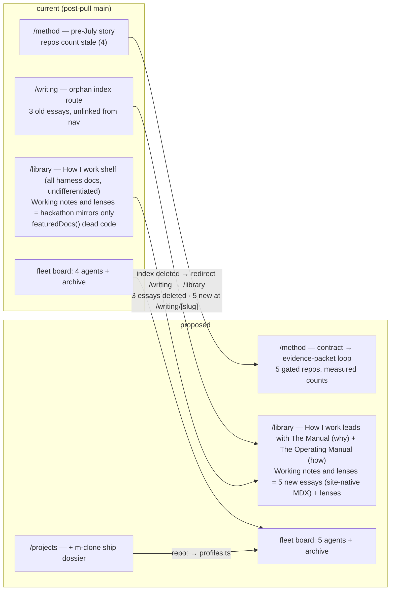

# Site revamp — the agentic development workflow, as it runs now (v3, reworked after main pull)

## Contract

**Outcome:** `me-2` reflects the current agentic-development doctrine: `/method` fully rewritten around the contract → spec → evidence-packet loop; the orphaned `/writing` index retired and its three essays replaced by five new workflow essays surfaced inside the library's "Working notes and lenses" section; the library's "How I work" section leads with the two manuals (retitled at source to distinguish why-vs-how, via the existing-but-unwired `featuredDocs()`); a full M-Clone project dossier wired into the fleet board; remaining stale counts (5th gated repo, jim 88→98) fixed with cited measurements.

**Non-goals:** No visual/design-system redesign (city chrome, ops room, editorial tokens, current 3-item nav untouched). No failure-receipt content on editorial pages (doctrine framed as engineering insight, not confession). No M-Clone library mirrors (deny wall stays). No hand-edit of `data/fleet-snapshot.json`. No merge to main (PR on `site/*` for George's review).

**Acceptance evidence:** `npm run check` green; `npx tsx scripts/sync-library.ts --check` shows M-Clone denied / nothing pending from it; `npm run lint` + `npm run build` green; dev-server screenshots of `/method`, `/projects/m-clone`, `/library` ("How I work" leading with the retitled manuals + essays inside Working notes and lenses), one essay page, `/` fleet board with m-clone; grep proves zero references to the three deleted essay slugs; `/writing` redirects to `/library`.

## Context

The manuals at `~/dev/agentic-harness/docs/` (updated through 2026-07-23) moved the workflow past what `/method` describes (still the pre-July "conduct, don't type" story). The owner pulled main mid-planning; current state after the pull: PR #11 already removed WRITING from the nav (3 items, `/method` aliased under LIBRARY with an "N°000 guided overview" card) and dropped the featured strip (`featuredDocs()` in `lib/library.ts:128` is now uncalled); the Sunday curator (07-19) already updated most metric counts. Owner decisions: full `/method` rewrite; achievement-framed; full M-Clone dossier; essays deleted and replaced ("I honestly don't even like them") with multiple new workflow essays living in the library's Working-notes section as site-native MDX; feature only the two manuals, retitled at source.

## Target architecture (Mermaid for the PR body — rendered widget shown in-chat)

## Where the work happens

- Repo: `/Users/geoandr/dev/me-2`, branch `site/agentic-workflow-revamp` cut from **main (= origin/main, e8261f8, clean after the owner's pull)**. Plus one **small companion commit in `~/dev/agentic-harness`** (manual retitles).
- Spec: this plan is committed as `docs/specs/2026-07-23-agentic-workflow-revamp.md` in me-2 (first `docs/` file; approving this plan is the explicit approval me-2's no-new-docs doctrine requires — strike at approval if unwanted).
- Prose sources: `MANUAL.md`, `OPERATING_MANUAL.md`, `AGENT_ANATOMY.md`, `CLAUDE_CODE_BIBLE.md`; M-Clone's `AGENTS.md`, `FULL_ARCHITECTURE.md`, `evals/erica-routing/REPORT.md`.

## Phase 1 — Branch, spec, manual retitles, library featuring

1. `git switch -c site/agentic-workflow-revamp` in `~/dev/me-2` (main already at origin tip); commit the spec.
2. In `~/dev/agentic-harness` (own commit, respecting its gate): retitle H1s —
   - `docs/MANUAL.md`: `# The Manual` → `# The Manual — why this workflow works`
   - `docs/OPERATING_MANUAL.md`: `# Operating Manual — the solo runbook (v4)` → `# The Operating Manual — how the day runs (solo runbook, v4)`
   The harness working tree has uncommitted deletions of ROADMAP.md/TOP_PERCENT_WORKFLOW.md (owner's in-progress change) — leave untouched; commit only the two title lines.
3. In me-2: `config/library.manifest.json` `featured[]` → exactly the two manuals (drop ideas 3.0 and TOP_PERCENT). Run `npm run sync:library` on the branch — this also pulls in the mirrors main lacks (manual.md, agent-anatomy.md, bible refresh) with the new titles, and orphan-sweeps mirrors whose sources the owner deleted upstream (only if those deletions are in the harness working tree at sync time — otherwise tomorrow's 07:00 sync handles it).
4. **Re-wire featuring**: in `app/(site)/library/page.tsx`, the "How I work" `ShelfSection` (currently a flat 3-col grid of all harness docs) leads with the two featured docs via the existing `featuredDocs()` (`lib/library.ts:128`) — a visually distinct pair (why / how) above the remaining guides. Reuse existing card markup patterns; keep the MethodCard placement.

## Phase 2 — New essays (site-native MDX; add before deleting old ones — PostToolUse content check hard-fails on dangling refs)

Five essays in `content/writing/` (frontmatter: title, summary, date, thesis, refs). Achievement-framed voice pieces, real numbers only:

1. **You appear exactly twice** — brief → three-line contract → spec file (diagram-altitude review) → self-verifying lane → adversarial critic → evidence packet ending in the next contract. (MANUAL ch.2+4, OPERATING_MANUAL §2)
2. **Evals are the product** — tests vs evals, eval-alongside, bugs-become-cases, grader-cost hierarchy, measurement drift as a first-class failure class (parity-fence the ruler). (MANUAL ch.3 + M-Clone receipts)
3. **Loop engineering** — engineering the loop vs prompting harder: context in by hook, verifiers the agent runs itself, stop conditions, two-iterations-then-fresh-eyes, fan-out for reads / single-lane for writes, self-paced background verification; the 06:17 nightly and Sunday proposer. (MANUAL ch.5)
4. **Harness engineering for AI agents** — "the model proposes, deterministic code disposes": hooks, gates, anti-cheat lines (Beck's tells, the Cursor 87→73% result), harness-changes-are-product-changes, the kill rule. (MANUAL ch.6+8)
5. **Agent anatomy** — the twelve design questions, runtime authority stays deterministic, risk tiers by blast radius, what green actually means, worktree-is-not-sandbox. (AGENT_ANATOMY.md)

## Phase 3 — Retire /writing index; essays into "Working notes and lenses"

1. Repoint refs in the four project dossiers (hard-fail sites, current line numbers): `content/projects/jim.mdx` (refs 13–16, reflection 17), `dj-agent.mdx` (13–16), `procurement-agent.mdx` (36–40), `grocery-buddy.mdx` (29–31) — each gets a sensible new `reflection:` pairing among the five essays; ref anchors point at real `##` headings.
2. `git rm content/writing/{four-agents-one-nervous-system,ship-the-how,the-gate-held}.mdx`; `npm run check`.
3. Delete `app/(site)/writing/page.tsx` (orphan index); keep `app/(site)/writing/[slug]/page.tsx` so essay URLs stay stable. Add permanent redirect `/writing` → `/library` in `next.config.ts` (work/lab pattern).
4. In the library page's "Working notes and lenses" section (the hackathons `ShelfSection`): add the site-native essays as cards alongside the lens mirrors — sourced from `nodesOf("writing")` (already imported by the page), kicker distinguishing "field note" from "lens", linking to `/writing/[slug]`. Update section note copy + shelf counts to include them honestly. No nav change (3-item bar stays).
5. Skip re-keying `app/(x)/landing11/wall.tsx` (fallback positions; experimental, noindex).

## Phase 4 — M-Clone dossier

1. **Mining pass first** (numbers with citations quoted in the commit message, per `lib/ops/profiles.ts` doctrine): eval-case counts from `evals/erica-routing/` + `evals/insights/`, XCTest suite size, gate steps, routing metrics verified against `REPORT.md`.
2. `content/projects/m-clone.mdx` — stage `ship`, modeled on `procurement-agent.mdx`. `repo: "/Users/geoandr/dev/M-Clone"`, fresh accent hex (not `#ff5a1f`/`#3fe07c`/`#f0b429`/`#62d9e8`/`#c77dff`/`#6fb4ff`), `refs`/`reflection` into the new essays. Public framing: on-device personal-finance copilot, fully local assistant (no remote LLM), no bank branding. Story: the app AND its eval product (routing corpus, sealed holdout, deterministic gates, per-row adjudication) — the flagship applied-AI-engineer exhibit.
3. `lib/inspect/m-clone.ts` (`InspectMap`, reference `lib/inspect/jim.ts`) keyed to the dossier's SystemDeepDive node ids; register in `lib/inspect/index.ts`. Missing map = check-content hard error, so ship together.
4. `lib/ops/profiles.ts` entry `"m-clone"`: mandate; `operate[]` tokens; `verify[]` = `gate.sh`, `evals.sh`, `gate-erica-routing`, `pytest`, `validate-erica-routing-corpus`; ≤4 cited metrics; honesty flags.
5. Confirmed safe in code: library deny wall holds (`sync-library.ts:127–156` skips denied sources pre-read; no `M-Clone/docs/adr` exists so no auto ADR collection; `check-library.mjs` errors on denied mirrors). Verify via `npx tsx scripts/sync-library.ts --check`.
6. Known, by design: the deployed AgentStrip/fleet card appears only after merge + the next 06:45 `me.ops-report` filing. Local live mode shows it immediately — screenshot that.

## Phase 5 — /method full rewrite

`content/method.mdx` — keep the components (Section, TerminalLog, Ladder, LaneBoard, ArchitectureDiagram, SystemDeepDive, Ref), replace the story. The curator's 07-19 sync already fixed most counts (22 skills, 5 hooks, 98 evals, 4 launchd); remaining stale: **gated repos 4 → 5** (frontmatter, fleet-gates node sub, night-shift digest lines must include M-Clone, prose). Section spine (frontmatter `sections[]` must match `<Section id>`s):

| n | id | title | content |
|---|----|-------|---------|
| 00 | night | While I slept | Outer loop: 06:17 gate digest across **5** repos + eval suites, 06:45 ops report, 07:00 library sync, Sunday curator + Sunday proposer. Real digest lines, honestly labeled. |
| 01 | contract | The contract | Three lines (Outcome / Non-goals / runnable Acceptance evidence) drafted by the agent, corrected at approval; the approved plan becomes a living spec file in the repo; multi-module specs lead with a Mermaid diagram reviewed at diagram altitude. |
| 02 | loop | You appear exactly twice | Task-loop diagram: brief → plan mode → spec → single-lane implement + self-verify (gate, evals, /verify) → adversarial critic → evidence packet → accept ≈ approve next contract. Fan-out for reads, single-lane for writes. |
| 03 | evidence | Evidence, not vibes | Evidence-packet anatomy (spec cited, checks with actual output, eval delta, critic verdict, NOT-verified list, next contract); anti-cheat gate lines; review tiers by consequence. |
| 04 | evals | Evals from reality | Eval-alongside; every bug becomes a case before its fix; grader hierarchy by cost; the ruler gets audited (parity fences, per-row reads). M-Clone eval-product numbers + link to the dossier. |
| 05 | loops | Loop engineering | Inner loop: context injected by hook, verifiers the agent runs, stop conditions, two-iterations→fresh eyes, self-paced background verification; model tiering. |
| 06 | flywheel | The self-improving system | Exhaust (digests, babysit log, handoffs) → Sunday proposer clusters friction → proposals on the cheapest-fix ladder (hook < gate line < instruction < skill < eval case) → human approves. Instruction files as reactive failure logs. |
| 07 | machine | The machine | SystemDeepDive updated: contract/CLAUDE.md, specs, skills, critic+researcher, hook rim, gates+anti-cheat, eval suites, night automation, proposer. |

Update `lib/inspect/method.ts` to the new node ids (keys must match or nodes lose click-inspect), refreshing excerpts whose counts changed. Fix the page-end `<Ref>` targets (method.mdx isn't scanned by check-content — silent-fail territory; one currently points at a to-be-deleted essay).

## Phase 6 — Machinery kept honest in the same PR

1. `.claude/skills/update-method/SKILL.md` — expectations rewritten to the new spine; stale `~/dev/docs/TOP_PERCENT_WORKFLOW.md` pointer → `~/dev/agentic-harness/docs/MANUAL.md` + `OPERATING_MANUAL.md`; fix the jim-only eval-count command.
2. `scripts/curate.sh` `harness_fingerprint()` — add M-Clone to the focus list; fingerprinted doc paths TOP_PERCENT → MANUAL.
3. `README.md` — reconcile the N°000 description ("17 skills, 4 fail-open hooks") with measured counts and the current nav/library structure.
4. Metric drift: `lib/ops/profiles.ts:143` jim offline eval cases `88 → 98` (re-measure via the update-method skill's prescribed command; cite in commit). Check `content/projects/jim.mdx` bench rows agree (curator may have fixed already).

## Phase 7 — Verify + evidence packet

1. `npm run check` · `npx tsx scripts/sync-library.ts --check` · `npm run lint` · `npm run build`.
2. Dev server (port 3777) screenshots: `/method` full scroll; `/projects/m-clone` (SystemDeepDive open + AgentStrip in live mode); `/library` (How-I-work leading with the two retitled manuals; essays inside Working notes and lenses); one essay page; `/` fleet board with m-clone; `/writing` redirecting.
3. Grep: zero references to the three deleted slugs in `content/`, `lib/`, `app/(site)/`.
4. Adversarial critic pass (fresh context, diff + this spec only), then the evidence packet: checks with output, screenshots, NOT-verified list (expected: deployed-snapshot lag for the m-clone card; Sunday curator run against the new update-method skill untestable until Sunday), proposed next contract.
5. PR from `site/agentic-workflow-revamp` with the Mermaid delta in the body; separate small commit/PR in agentic-harness for the retitles. **No self-merge** on me-2.

## Risks

- Content check fires via PostToolUse hook on every content edit — sequence adds-before-deletes; intermediate reds are harmless but noisy.
- `profiles.ts` metric doctrine requires citation-in-commit — the M-Clone mining pass is a real step.
- The Sunday curator has autonomous merge rights on content diffs; the update-method skill rewrite must land with the page rewrite or Sunday's run may fight it.
- The library page edit (featuring + essays section) touches app code — outside the curator's autonomous diff scope; correct for a human `site/*` PR, but reuse the existing card/section markup to keep the diff small and taste-consistent (run the repo's `taste-editor` agent over the copy per AGENTS.md).
- The 07:00 library-sync LaunchAgent publishes mirrors to origin/main daily through its own worktree — our branch's re-synced mirrors may conflict at merge time if sources change mid-review; if so, re-run `npm run sync:library` on the branch before merge.
- Essay prose volume is the schedule risk: five essays + the method rewrite are the bulk; mechanical phases are small.

## As-built delta (2026-07-24)

- **Critic findings (fresh-context adversarial pass on diff + this spec), all fixed in `524c23d`:**
  1. Bank-branding leak via real file paths in visible UI (host-shell name in the inspect map, assistant codename in the dossier TerminalLog and the mirrored runbook §0). Neutralized site-side; runbook line fixed at source and re-synced; profiles.ts classification tokens now codename-free substrings that still match the real commands.
  2. `projects/jim#system` anchors were soft-broken (jim's bench dossier has no `<Section id="system">`; the checker validates nodes, not fragments) — repointed to `projects/jim` at all four sites.
  3. Two live `/writing` links (projects index footer, essay back-link) rode the 308 with stale labels — repointed to `/library`.
- The Sunday-proposer launchd job is **not installed** (verified `~/Library/LaunchAgents`); the page credits the proposer as a skill and keeps the launchd metric at 4.
- Companion commits in `agentic-harness` (local `main`, ahead 2, **not pushed**): `33e0e89` manual retitles, + the runbook codename fix. Owner pushes.
- Known follow-ups (tracked): `app/(x)/landing11/wall.tsx` keeps two dead position-map keys for the deleted essays (noindex experiment, fallback positions — deliberate carve-out); the Sunday `/update-project` may drift-fire on the new m-clone dossier since M-Clone commits daily — its rewrite protections are the publish gates, but the first curator pass after merge deserves a look; the deployed fleet card/AgentStrip for m-clone appears only after the first post-merge 06:45 filing (by design).
