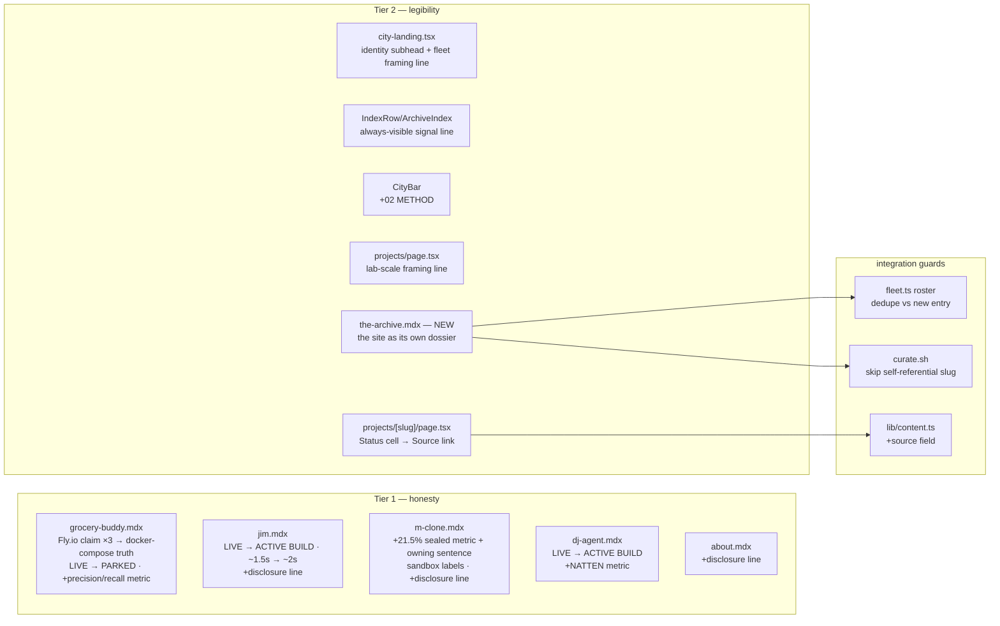

# Applied-AI legibility pass — honesty fixes + surfacing the buried evidence

**Outcome:** the site reads as an Applied AI engineer's evidence file within one screen and survives a skeptical hiring-manager audit — every production-flavored claim matches its source repo, the strongest measured facts (sealed-holdout honesty, 5:561 agentic ratio, precision/recall, NATTEN rewrite) are visible without hover or drill-down, and the site itself gets a dossier (`the-archive`) exposing its React/ops engineering.

**Non-goals:** no visual redesign of the city or the index interaction; no new project repos or repo-side work (pushing dj-agent/jim, NATTEN PR, jim dashboard are separate tasks); no merge to main; no dates invented for /about (blocked on George).

**Acceptance evidence:** `npm run check` + `npm run build` green · grep proves zero remaining "live on Fly.io" and no `status: "LIVE"` on entries the fleet snapshot shows parked/waiting · screenshots: hero with identity line, /projects index (desktop + mobile) showing always-visible domain+metric, m-clone metrics with the sealed number, the-archive dossier · taste-editor + fresh-context critic findings addressed or tracked.

## Surfaces touched

## Design notes

- **Status vocabulary** (amended after adversarial review): the live-dot means
  "operating right now" (per the /projects legend). NO entry carries `LIVE` after
  this pass — the-archive's launchd automations operate on schedule, but its
  measured fleet state is `waiting`, and a pulsing LIVE above an AgentStrip
  reading "a human decides next" is a self-contradiction. It carries `OPERATING`
  (plain stamp, no pulse); the pulse stays reserved for measured live operation.
  grocery-buddy → `PARKED` (fleet snapshot state), jim/dj-agent → `ACTIVE BUILD`.
- **Sealed number**: m-clone metrics swap "sealed holdout cases 81" for
  "21.5% — sealed holdout, fully-correct on device" (source:
  `M-Clone/docs/README.md:86`, runs/20260719-device-sitting: **34/158**, physical
  iPhone 17 Pro). Review caught the draft pairing 21.5% with "81 cases" — the
  sealed generalization bucket is 158; the prose now says 21.5% (34/158) and
  never binds it to the 81-case holdout-v3 pack. 86.5% relabeled "routing family
  accuracy, live corpus". Brief gets one owning sentence.
- **Fly.io**: verified flyctl never installed on this machine, no ~/.fly — claims
  rewritten to "built for Fly.io; operated locally on docker-compose + ngrok".
  (If George confirms a past deploy, revert in one commit.)
- **`source:` frontmatter field** (new, optional): public repo URL or plain-text
  note; renders as the dossier meta grid's fourth cell (replacing the Status cell,
  which duplicated the breadcrumb). m-clone: "private — walkthrough on request".
- **Index signal line**: IndexRow gains an always-visible `signal` (domain — first
  metric), fixing the mobile blank-out; the hover layer keeps thesis + stack.
  Bench entries get one frontmatter metric each so the signal carries a real fact
  (jim: 98 offline cases; dj: 11.3→2.07 GB attention rewrite).
- **the-archive.mdx**: date 2026-07-24, stage ship, accent #d8d3c8 (bone-silver;
  frees ember for its semantic meaning), repo → me-2. Content only claims what
  profiles.ts/method.mdx already source (3 site automations, 06:45 filing, 67
  mirrors, check+build+scope gate; the 9s→5,589s caffeinate incident as What
  Broke). Guards: `roster()` skips its synthetic archive entry when a content
  entry claims slug `the-archive`; `curate.sh` skips the slug (self-reference
  stays out of the autonomous loop).

## Tracked follow-ups (accepted gaps)

- /about dates + BofA detail — **blocked on George** (facts I can't invent).
- Push dj-agent (public repo a month stale) and jim (adversarial-eval commit
  local-only) before pointing recruiters at the links — owner action.
- jim repo README.md:421 still says "87 cases" (suite is 98) — repo-side fix.
- the-archive deep-dive/inspect map (`lib/inspect/the-archive.ts`) — next session.
- GitHub profile surface (pins, descriptions, profile README, M-Clone visibility
  decision) — owner action, external to this repo.
- Jim dashboard build + NATTEN upstream PR — separate tasks per the review.
- grocery-buddy's 0.86/0.81 precision·recall traces to the inspect map's mined
  snapshot query, not a committed artifact in the (public) repo — commit an
  eval artifact there so a reader can verify (labeled "last graded run" until
  then).
- `lib/ops/profiles.ts` the-archive metric "mirrored docs 67" is accurate today
  but rot-prone (library syncs daily, curator skips this slug) — derive or
  refresh manually.
- jim's timing now reads ~1.5s on both surfaces, matching the recorded
  `eval_runs/20260724T*.json` (1.43–1.44s); the jim repo's README still says
  "87 cases" — repo-side fix.
- CityBar wraps to two rows on mobile with the 4th nav item (pre-existing
  wrap behavior; the one-row doctrine holds on desktop) — acceptable, noted.
